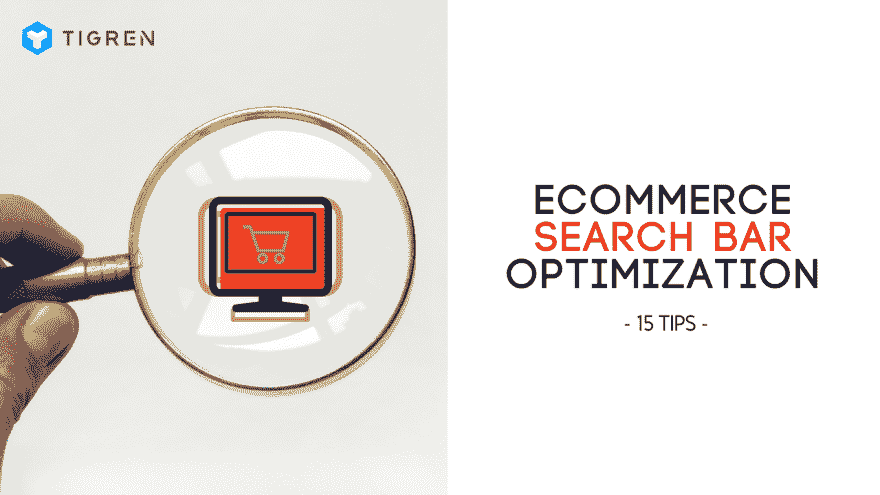

# 优化电子商务网站搜索栏的 15 种有效方法

> 原文：<https://dev.to/tigren5/15-effective-ways-to-optimize-search-bar-for-ecommerce-website-5nc>

[T2】](https://res.cloudinary.com/practicaldev/image/fetch/s--rES1rle8--/c_limit%2Cf_auto%2Cfl_progressive%2Cq_auto%2Cw_880/https://www.tigren.com/wp-content/uploads/2018/05/optimize-search-bar-for-ecommerce-website-tips.png)

在电子商务网站上，有一种有效的方法可以提高客户体验和转化率，那就是优化搜索栏的功能。总的来说，一个好的搜索栏将帮助商店访问者在网站上的大量产品中快速准确地找到他们需要的东西。虽然网站搜索是一个基本功能，但许多电子商务商店不知道如何让它有效地工作。在本帖中，我们将向你展示创建电子商务搜索栏时的一些常见错误，以及优化网站搜索功能的 15 个有价值的技巧。

## 1.自动完成功能是必须的

大多数电子商务网站现在都在搜索栏功能中加入了自动完成功能。包含此功能的主要目的是帮助客户进行搜索和购买。

它是如何工作的？

当买家在搜索栏中键入一些内容时，多亏了自动完成工具，它会根据键入的信息立即预测并显示一个建议列表。

*为什么对搜索者有利？*

*   他们可以更快地找到他们要找的东西。
*   点击推荐结果后，他们可以直接进入产品页面。
*   他们不需要记住拼写困难的整个搜索词。
*   即使他们不擅长英语，他们也可以轻松地创建一个查询。

这对电子商务店主有什么好处？

事实证明，自动完成功能在提高商店转化率方面发挥了重要作用。得到有用产品建议帮助的买家比其他人更愿意转化。

## 2.利用“没有搜索结果”

假设你是一个买家，你会喜欢去网上商店，搜索一些东西却一无所获的感觉吗？很明显，你会因为浪费时间而感到有点讨厌，对吗？

此外，如果网站只是返回一个几乎是空的页面，带有令人失望的文本“没有结果”，大多数顾客会立即离开网站，继续在其他类似的商店搜索。

事实是，当客户搜索你的电子商务网站上没有的东西时，没有办法满足他们。但是...你可以将他们的注意力转移到你店里其他有趣的当前产品上。我们的意思是，你为什么不向他们推荐一些与他们的搜索词接近的类似商品，甚至吸引他们注意你的畅销书。在很多情况下，顾客会被推荐的商品所吸引，而忘记他们进入商店的最初目的。

## **3。允许按同义词搜索**

在某些情况下，你的电子商务网站仍然显示“没有结果”页面，即使你在你的商店提供搜索项目。为什么？原因是，客户不会键入准确的单词作为您的产品和服务的名称，而是同义词。例如，买家在你的商店中搜索被命名为“移动电话”的“手机”。

*解决办法是什么？*

首先，您应该考虑开发一个自定义功能，该功能可以分析客户的搜索词，并建议具有相同含义的项目。其次，你应该给观众写一条短信，例如:“对不起，我们找不到任何关于“手机”的搜索结果，你是指“手机”吗？”然后展示你推荐的产品。

## **4。接受多语言搜索**

对于为来自世界各地的顾客提供服务的大型电子商务商店来说，只允许用英语搜索是一个禁忌。相比之下，通过提供多语言搜索，这些商店将能够满足他们在世界各地的大量客户。

## **5。在正确的地方显示正确的搜索栏**

这是电子商务网站上有效搜索栏最关键的事情之一。以下是您最需要关注的两件事:

*   ***让搜索栏在大多数页面上可见***

几乎所有的电子商务网站都提供各种各样的产品(平均 5000-10000 件)。由于这个原因，当顾客访问一个网站来寻找他们喜欢的商品时，他们通常首先寻找搜索栏。这意味着你需要尽可能地使你的搜索栏易于访问——从任何类别页面、主页，...在您的站点中。

*   ***页面上最完美的位置:顶端居中***

正如我们提到的，对于许多客户来说，搜索栏出现在他们访问电子商务商店的脑海中。因此，你的工作就是在你的网页上最醒目的位置显示搜索栏。不要让他们寻找你的搜索栏，哪怕只是几秒钟。

从许多调查来看，在电子商务网站上放置搜索栏最有效的位置是顶部中间。它应该像公司标志和主菜单一样引人注目。第二个建议的位置是页面的右侧。

记住你的搜索栏的位置将决定它在你的电子网站上的使用频率。

## 6.不要忘记搜索按钮

许多电子商务网站不重视搜索按钮；然而，它仍然是搜索栏的重要组成部分。您应该在上面包含一个特定的单词，如“搜索”、“查找”和“搜索”(强烈推荐)，或者一个放大镜符号(搜索的非语言符号)。

许多网站试图通过使用其他符号来使它们与众不同，例如:箭头，图标，双筒望远镜，...但是没必要。

此外，你应该将按钮添加到搜索栏，并允许搜索者按下“Enter”键开始搜索。

## 7.在意见箱上提供丰富的信息结果

*   ***包含产品评分和评论:*** 通过在自动完成框上显示产品的高评分和产品评论的数量，您将显著提高建议结果的点击率。
*   ***显示产品价格:*** 显示每件产品的价格可能有助于顾客立即发现哪件商品是(不是)他们想要的——在他们的预算之内。
*   ***显示添加到购物车按钮:*** 如果客户已经熟悉某个电子商务商店，他/她将主要使用搜索功能来查找他/她经常购买的商品，而不是新的商品。因此，在建议框中启用添加到购物车功能，让搜索者可以立即购买商品，这将是一个很好的主意。

## 8.显示搜索字段，而不仅仅是图标/链接

电子商务商店设计搜索栏最常见的错误之一是只显示一个搜索按钮。然后，搜索者必须点击那个按钮来扩展搜索域。

使用这种样式的主要目的是缩小搜索栏的区域，在标题中有更多的空间。有很多网站遵循简洁的风格，并采用这种解决方案。然而，从我们的角度来看，这是一个非常糟糕的电子商务网站的想法。

在一些更糟糕的情况下，店主只是在顶部菜单上设置一个链接，转到搜索页面，这导致购物者花费更多时间在你的网站上搜索，同时降低了他们的满意度。

## **9。创建优秀的搜索栏**

...**[阅读更多](https://www.tigren.com/ecommerce-search-bar/)**