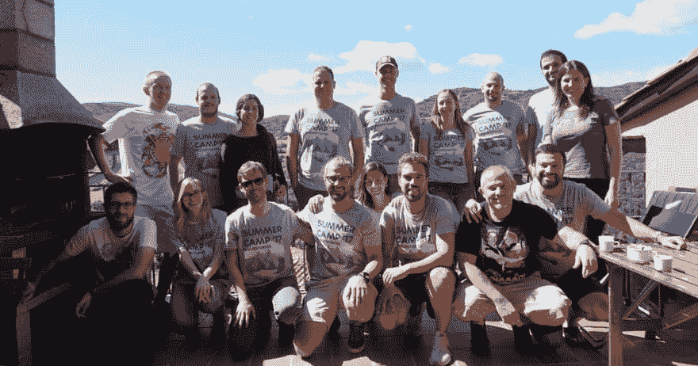
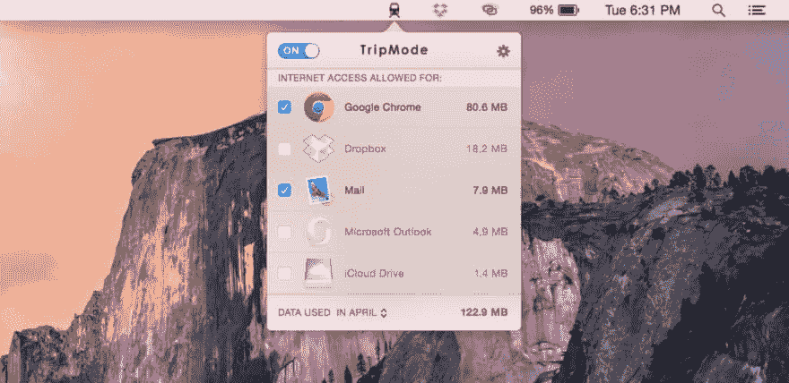

# 今年远程工作的 18 条建议

> 原文：<https://dev.to/bugfenderapp/18-tips-for-working-remotely-this-year--1f48>

*这篇文章最初发表在我们的[博客](https://bugfender.com/blog/18-tips-for-working-remotely-this-year/)上。*

[T2】](https://res.cloudinary.com/practicaldev/image/fetch/s--lRg7HRhQ--/c_limit%2Cf_auto%2Cfl_progressive%2Cq_auto%2Cw_880/https://bugfender.com/wp-content/uploads/2018/01/working-remotely.jpg)

如果你曾经从事过传统的朝九晚五的办公室工作，并且渴望更大的灵活性，你会体会到获得第一份完全远程工作的激动。不再受四面墙的束缚，你的新的远程生活承诺了世界所能提供的一切！旅行。整天穿着睡衣。酷酷的远程工作伙伴。无尽的灵活性。

选择自己的冒险。

在旅途中工作是一个非常浪漫的想法，但在旅行中工作的核心是一种紧张:让旅行令人惊叹的品质不一定有利于完成工作，反之亦然。

因此，找到**最佳远程工作技巧**和**积极管理你的期望**以在工作和旅行中取得成功是很重要的。你必须取得平衡，否则你会崩溃和燃烧。

*2017 年我们夏令营的团队。*

作为完全远程的开发人员和设计人员，我们一直在寻找优化远程工作的沟通、组织和生产力的方法。对我们每个人来说看起来都有点不同。

此外还有一些实用的东西:设置、工具、应用程序和公司的内部文档。如果你想让远程工作真正发挥作用，这些都是你必须解决的问题。然而，一旦你掌握了它，远程工作就会变得很棒。

无论你是住在欧洲的露营车里，还是在泰国的 T2 开一个月的店，Bugfender 团队都给了你一些如何旅行和完成工作的建议:

1.  花些时间关注你的总体期望。为了让远程工作变得现实，你必须做出一些决定:我将允许自己在多大程度上探索/做旅游性的事情？我每天需要工作多少小时？我的雇主对我有什么期望？提前回答这些问题。

2.  调查你在旅行中如何打电话、发短信和上网。如果你打算在某个国家停留两周以上，我们建议你购买一张当地的 SIM 卡放在手机里，这样你就可以在当地发短信和打电话了。(注意，您需要一部支持 GSM 的解锁手机。)这个有用的[预付费数据 SIM 卡 Wiki](http://prepaid-data-sim-card.wikia.com/wiki/Prepaid_SIM_with_data) 有你需要知道的关于移动互联网与 WIFI 的区别的所有信息，为移动调制解调器(和/或解锁的手机)寻找 SIM 卡，国家指南，等等。

3.  **mifi:本地 SIM 卡与国际数据**。要远程访问互联网，根据您的目的地和需求，您有几种不同的选择。在一些国家，购买带有预付费数据的本地 SIM 卡，并使用本地数据将您的计算机绑定到您的手机作为移动热点，会更便宜。(将你的手机用作热点的主要缺点是它会迅速耗尽你的电池，所以你需要做好准备。)对于想要更普遍、更国际化选择的频繁旅行者来说，你可以使用这个[维基](http://prepaid-data-sim-card.wikia.com/wiki/All_countries2)来比较诸如 [GlocalMe](https://www.glocalme.com) 或 [Skyroam Solis](https://www.skyroam.com/solis-global-wifi?gclid=EAIaIQobChMIwbLHi-qH2AIVSk1-Ch2y8QEKEAAYASAAEgIEGfD_BwE) 之类的选择。你可以租用带有国际数据的移动路由器，但维基不鼓励这样做，因为细则经常出现问题。获得本地 SIM 卡并通过手机运行热点很可能是最便宜的选择(取决于国家)。再次参考维基。

 
*在 Mac 上使用 TripMode。*

1.  **如果你使用数据连接互联网，投资 [TripMode](https://www.tripmode.ch/) 。**此应用程序允许您监控每个应用程序的互联网使用情况，因此您可以选择哪些应用程序可以访问数据并限制消费。浏览器的移动模式节省了大量数据，这将为您节省大量资金。

2.  **预订酒店或度假租赁时，寻找 wifi 和工作区域；始终有一个备用计划(见第 2-3 点)。**我们都可以认识到，总的来说，酒店 wifi 是典型的很差。考虑携带以太网电缆和适配器，以防在酒店或 Airbnb 中连接到以太网连接更快。

3.  生产力:认识到工作是没有商量余地的。换句话说，如果你承诺在旅途中工作，不要给自己实际工作的选择。《禅宗习惯》的作者利奥·巴巴乌塔[说](https://zenhabits.net/roadwork/):

> “当我们说‘我现在该不该做这件事？’时，困难就来了然后我们意识到我们有大量的其他选择，比如查看社交媒体、阅读新闻、向人们发送图片以及在线观看猫或机器人的照片。对我有用的是告诉自己没有选择。工作是我要做的事情，没有商量的余地，就像我要做父母的基本职责一样，毫无疑问。我曾感觉到让自己摆脱困境的诱惑，但后来我摆脱了这种诱惑，就这么做了。给自己一个选择会导致非常糟糕的结果。"

1.  拥有一个虚拟办公室可以帮助你感觉和你的团队有联系。也许这一点不言而喻，但你必须保持联系。你不能关掉无线电。计划使用你的团队用来交流的任何应用程序:Slack、Google Hangouts、HipChat、GroupMe 等。如果你讨厌群发信息，你必须克服这种厌恶，才能远程工作。

*Asana 项目管理。*

1.  确保团队成员意见一致。考虑使用像 Trello 或 Asana 这样的项目管理软件。如果你希望远程工作是可持续的，就要坦诚沟通。如果你开始感到与外界脱节，和你的经理/团队谈谈如何增加沟通。团队中的每个人都应该能够实时查看项目、共享信息和保持更新。

2.  确保你了解协议。远程开发人员特别需要知道对提交版本控制变更的期望，留下标记，跟踪时间，以及职责划分。我们使用 [Jenkins](https://bugfender.com/blog/what-is-jenkins-and-why-should-you-be-using-it/) 来保持我们远程团队的敏捷，这样我们就不会浪费时间试图从多次提交编译代码到版本控制。首先，我们谈论对我们的开发人员应该如何合作的期望。

3.  学会明智地管理你的时间。远程工作的金钱问题似乎是:“我如何保持专注，而不去看 youtube 视频/在脸书上跟踪我的前任/研究阴谋论/浪费宝贵的工作时间看猫迷因？”

每个人对不同的方法有不同的反应，但这里有一些想法

*   如果你目前还没有任何结构，试着用老方法[时间阻塞](http://inspiralized.com/time-blocking-a-busy-persons-guide-to-getting-it-done/)。奇怪的是，如果你把它和自我控制结合起来，这种满足感会提高你的效率。只需在你的日历上为每份工作划分出几个部分。不要让自己在做其他事情的时候漫不经心地上网。
*   [Toggl](https://toggl.com/time-blocking-app/) 有一个 app 可以让你分时间段，跟踪时间，量化你是如何度过时间的，这样你就可以知道你在哪里浪费了时间，提高效率。[收获](https://www.getharvest.com)也有帮助。
*   如果你想屏蔽你强制访问的某些网站或对某些网站的数据使用设置时间限制，可以考虑使用一个应用程序，如 [Focus Me](https://focusme.com/) 。

 
*栖息之所，为异地工作者的救星。*

1.  **弄个[栖息架](https://www.therooststand.com/)防止不良姿势。**当你旅行时，你可能无法获得最佳的办公空间。也许你会在一个小小的 Airbnb 工作室里，或者和你的团队一起坐在南非的餐桌旁。这款鸡舍脚架重量超轻，体积小巧。它的工作原理是将你的笔记本电脑提升到一个合适的高度，这样你就不会在工作时弯腰驼背。它对你的背有奇效。(这里有更多关于建立一个[人体工程学工作空间](https://zapier.com/blog/how-to-set-up-your-desk/)。)

2.  比起实际时间，更关注你的能量水平。当你旅行时，你会注意到由于时差、旅途疲劳和调整睡眠习惯，你的能量水平会发生变化。注意你一天中最有效率的时间，并利用它们为你带来好处。在家里，你可能在清晨效率最高，但是在路上，你可能会发现中午是你最好的工作时间。在最佳工作时间之外做一些旅游的事情。

3.  一个好的外置手机充电器是你随身携带的智能工具。没人喜欢在参观竞技场或吴哥窟时手机没电。为你的设备准备一块备用电池，以备不时之需。

4.  在旅途中坚持 1-2 个习惯来对抗压力。即使你在旅行，为自己设定一些仪式或结构可能会有所帮助。试着每天早上冥想 10 分钟。花时间手工制作咖啡。(你可以带着这个[轻松旅行，倒上一个阀门](https://www.amazon.com/dp/B00EOM5RN0/ref=sxbs_sxwds-stvp_1?pf_rd_m=ATVPDKIKX0DER&pf_rd_p=3341940462&pd_rd_wg=0jEfr&pf_rd_r=NPECE3PCAH20VWCTTY1Q&pf_rd_s=desktop-sx-bottom-slot&pf_rd_t=301&pd_rd_i=B00EOM5RN0&pd_rd_w=hZ4Ys&pf_rd_i=pour+over&pd_rd_r=de92b075-0693-4d59-8c7b-e448c96d9dea&ie=UTF8&qid=1513201535&sr=1)保持物品整洁。)另一些人在一天的特定时间进行跑步或做瑜伽，以此作为锻炼的仪式。不管是什么，选择一两个并执行它们，以避免精疲力尽并提高正念。

5.  **要创建一个多屏幕工作站，使用 [Air Display](http://avatron.com/applications/air-display/) 将一个额外的 iPad 或 Android 平板电脑变成第二个屏幕。**对于开发人员来说，在旅途中拥有这一选项是非常宝贵的。

6.  在世界各地使用开放网络时，为了安全起见，使用一个虚拟专用网。

7.  **自救买个[万能适配器](https://www.amazon.com/Adapter-Worldwide-Universal-Adaptor-Charging/dp/B01DJ140LQ/ref=sr_1_3?ie=UTF8&qid=1509632093&sr=8-3&keywords=universal+plug)** 。有趣的本地食物——而不是你的电子产品——最好是油炸的。

8.  记得尽情享受，探索你所到之处的风景，并继续完善你作为远程工作者的成长过程。

在 Bugfender，我们来自全球各地的员工一起工作。我们中的一些人有固定住所并在那里工作，但其他人住在货车里和/或经常旅行。

虽然我们到处都是，但我们优先考虑保持有序。这就是为什么我们决定制造市场上最好的远程记录器。

我们帮助远程团队从世界各地的用户设备上获取日志。整个产品旨在优化远程开发。通过集成我们的 SDK，我们将从您的用户那里收集日志，在我们的服务器中处理它们，并在一个用户友好的控制台中向您提供信息。您可以使用 Bugfender 来记录各种用户数据。您甚至可以在自己的设备上跟踪、重现并快速修复错误，这样用户会对您解决问题的速度印象深刻。[了解更多](https://bugfender.com)。

* * *

这篇文章由 Sarabeth Flowers Lewis 编辑，她是一名自由作家，也是 Lewis 商业写作的联合创始人，专门从事 SEO 和直接回应内容创作。她目前和她的姜黄色丈夫一起远程工作，为科技、非营利组织和房地产写作。点击这里查看更多她的作品。

*这篇文章最初发表在我们的[博客](https://bugfender.com/blog/18-tips-for-working-remotely-this-year/)上。*