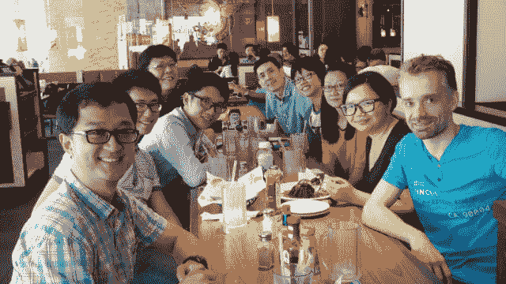
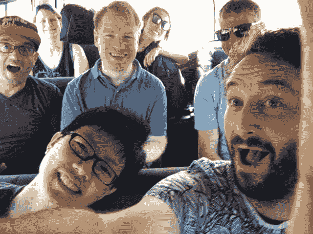
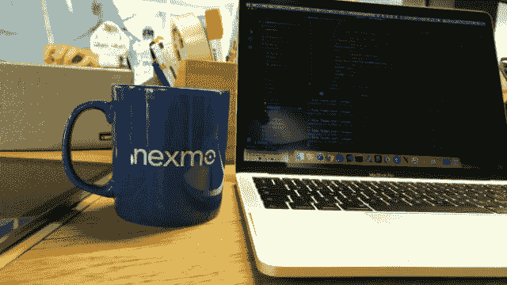

# 1827 天在网上工作

> 原文：<https://dev.to/huijing/1827-days-working-on-the-web-11c9>

今天是我第一次担任开发人员五周年纪念日。我之前写过 2 篇类似的检查点博文，[一篇在 2015 年](https://www.chenhuijing.com/blog/542-days-as-a-drupal-developer/)，一篇在[一篇在 2017 年](https://www.chenhuijing.com/blog/1239-days-as-a-web-developer/)，所以这些检查点博文似乎每 500-700 天出现一次。也许吧。

我从来不是那种写日记的人，所以这个博客是我能得到的最接近日记的东西。从我写最后一篇检查点文章到现在，很多事情都发生了变化。当时我和一个不可思议的团队以及一个了不起的老板一起工作，但是由于管理问题，公司现在已经倒闭了。

我们仍然保持联系，并相当定期地见面。我还在和前面提到的老板, [Markus Kirchberg](https://sg.linkedin.com/in/markuskirchberg) 合作一个名为 [Wismut Labs](https://www.wismutlabs.com) 的实体。

## 当生活给了你柠檬…

随着团队解散和公司关闭在新加坡的业务，合乎逻辑的选择是找到另一份工作。但当时，我有相当多的积蓄，并且真的想找到一些方法来保持团队的团结，所以我注册了 Wismut Labs Pte Ltd，并与 Markus 一起，我们试图做一些事情。

<figcaption>可惜，我们当时没有拍太多照片回去</figcaption>

凭借 Markus 在数据分析和管理方面久经考验的专业知识，以及我对在短期内构建 web UIs 的偏好，我们的定位是为寻求建立数据科学团队或启动数据相关项目的公司提供咨询。尽管我们设法会见了一些潜在的客户，但我们总是被大公司抛弃。没有人因为选择 IBM 而被解雇。🤷

我确实设法接了几个自由职业项目来度过难关，但到了年底，固定工资看起来相当诱人，所以我在我住的地方附近的一家本地支付初创公司找了一份全职工作。尽管我没有在那里呆太久，我还是设法完成了相当多的工作，包括[他们产品前端的一个完整的返工](https://dev.to/huijing/refactoring-an-inherited-codebase-pd7)。

## ……感谢每一个帮你做柠檬水的人🍋

与此同时，我被邀请参加我在新加坡以外的第一次演讲，演讲人是来自 [Webconf.asia](https://www.webconf.asia/) 的 [Charis Rhoda](https://imakewebsites.hk/) ，我也第一次在 CFP 接受了来自 [piterCSS](https://pitercss.com/) 的演讲，演讲主题相同(谢谢， [Vadim](https://twitter.com/pepelsbey) )。在那之前，我不太擅长公开演讲，我的意思是，主持一个聚会不同于站在会议台上，对吗？

但鉴于我在 2017 年大部分时间里的快乐就业状态，我有机会做了很多我可能无法用典型的全职工作处理的事情，比如参与[中文语言需求任务组](http://w3c.github.io/clreq/charter/)，写更多的文章，帮助举办像 [Mozilla 开发者亚洲路演](https://hacks.mozilla.org/2017/02/devroadshow/)这样的活动，以及在会议上旅行发言。

<figcaption>和这些美好的乡亲们一起上路</figcaption>

所有的旅行让我遇见和听到人们的声音，否则我永远不会亲自见到他们。我和来自俄语网络社区的开发人员交了朋友，和实际开发浏览器的开发人员以及规范编辑聊了聊。对于一个没有在这个行业待太久的人来说，听到来自技术领域各种角色的观点也是非常大开眼界的。

## 开始新的角色

我已经得到了这么多人的帮助，这让我想向前看。虽然我很感激我得到的这些机会，但我也希望我所在地区和社区的人们也能得到这些机会。

到今天为止，我在 [Nexmo](https://www.nexmo.com/) 的[开发者关系](https://www.nexmo.com/blog/2017/03/14/one-year-developer-relations-nexmo-dr/)团队中担任新角色已经一周了。就我个人而言，我甚至不知道什么是开发者关系，直到我在会议上遇到了担任这种角色的人。在发现它是什么之后，我从来没有想过它对我来说是可能的，因为 DevRel 在我的领域里并不是一件真正的事情。

<figcaption>你好来自 Nexmo</figcaption>

但是，通过一系列幸运的事件，我很高兴担任开发人员倡导者这一新角色。我可能在这方面很垃圾，但是如果我不尝试的话，我会给自己带来伤害。我要做的事情之一就是从东南亚的角度记录我对 DevRel 的了解。

不知道我会把这些贴在哪里，也许在这里，也许在一个单独的网站上，但请继续关注更新！💃