# 1B1 机器人

> 原文：<https://dev.to/ladvien/1b1-robot-45g>

[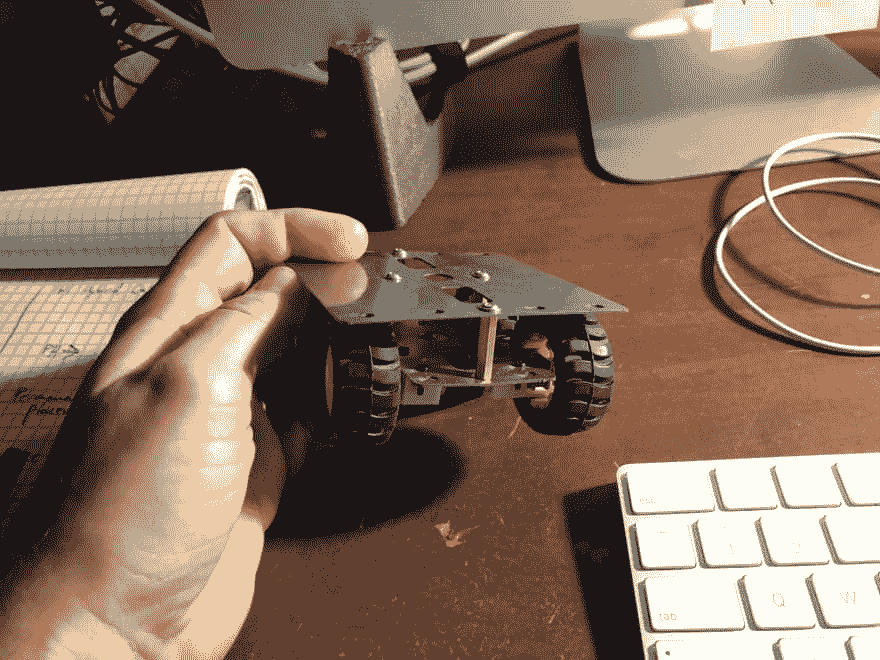T2】](https://res.cloudinary.com/practicaldev/image/fetch/s--tcVN7XCy--/c_limit%2Cf_auto%2Cfl_progressive%2Cq_auto%2Cw_880/https://ladvien.cimg/1b1_frame.jpg)

不久前，Hackaday 上有一个帖子，是关于一个用树莓皮和一些易贝汽车司机制作的四轮小机器人。

[树莓派零驱动微型遥控卡车](https://hackaday.com/2018/01/24/raspberry-pi-zero-drives-tiny-rc-truck/)

我真的很喜欢这个小底盘，订购了一个，很高兴地发现它已经安装了马达。(当我成为一名老黑客时，真正感激的是那些节省时间的小东西。)

在购买机箱时，我已经决定用我的一个 Raspberry Pi Zero W(rp0w)来控制这个机器人。我真的很喜欢 rp0w 上的 Arch Linux。它很轻，包装也很精致。再说一遍，这是节省时间的小技巧。我更喜欢这种组合，因为我发现了一种将 rp0w 设置为无标题的方法，这意味着我可以从 SD 卡进入小 Linux 板。

*   [树莓 Pi Zero W 上的无头拱门 Linux](https://ladvien.com/installing-arch-linux-raspberry-pi-zero-w/)

巧合的是，我从易贝购买了几个 DRV8830 模块。这是一个悲伤的故事——我很久以前就玩过 DRV8830 芯片了:

*   狗头人

因为 Sparkfun 在记录 IC 和创建与之配套的 Arduino 库方面做得很好。我沮丧地发现 Sparkfun 和 EOL'ed 董事会。

*   [迷你电动板](https://www.sparkfun.com/products/retired/11890)

可能是因为像我这样的笨蛋一直从易贝那里买。我有一些复杂的感觉，其中之一是内疚。

[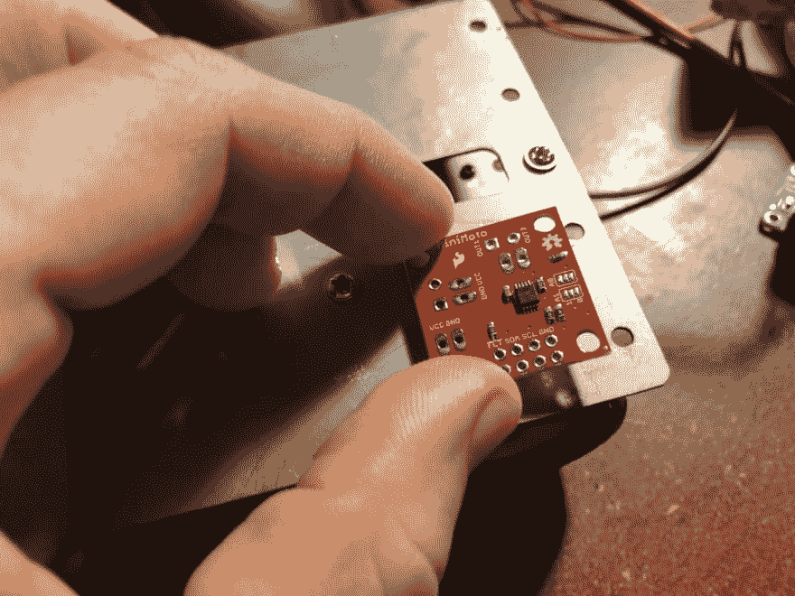](https://ladvien.cimg/1b1_holes_line_up.jpg) 
反正我很惊讶的发现 DRV8830s 上的安装孔竟然和机箱上的一套匹配。我决定尝试使用一个模块来驱动两个电机，因此只需要两个 DRV8830 模块来驱动整个机器人。

我有一些热贴放了好几年了——它作为粘合剂效果很好。此外，我希望使用机箱散热电机驱动器。

[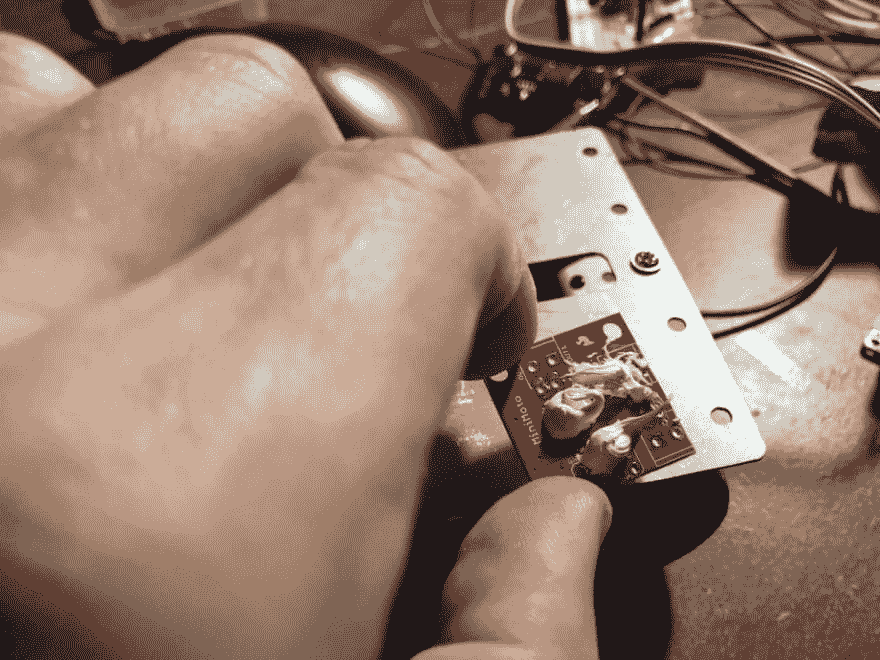](https://res.cloudinary.com/practicaldev/image/fetch/s--u3TnxYxT--/c_limit%2Cf_auto%2Cfl_progressive%2Cq_auto%2Cw_880/https://ladvien.cimg/1b1_thermal_paste.jpg)
[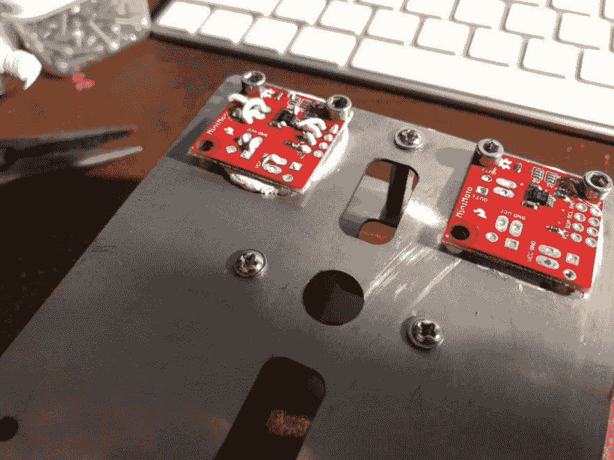](https://res.cloudinary.com/practicaldev/image/fetch/s--zXYXhleE--/c_limit%2Cf_auto%2Cfl_progressive%2Cq_auto%2Cw_880/https://ladvien.cimg/1b1_board_latched_down.jpg)
[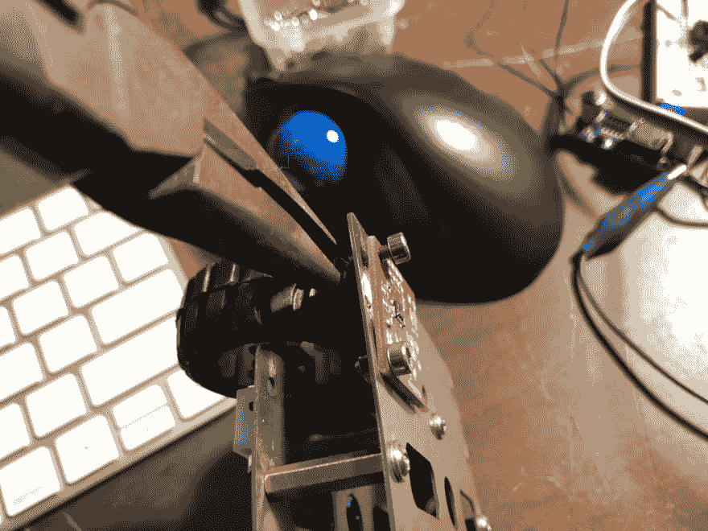](https://res.cloudinary.com/practicaldev/image/fetch/s--Nb2gV1I9--/c_limit%2Cf_auto%2Cfl_progressive%2Cq_auto%2Cw_880/https://ladvien.cimg/1b1_screw_it_down.jpg)
[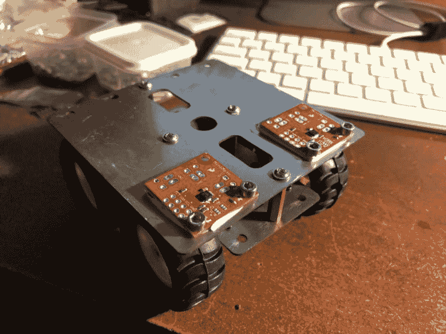](https://res.cloudinary.com/practicaldev/image/fetch/s--LwdFPYud--/c_limit%2Cf_auto%2Cfl_progressive%2Cq_auto%2Cw_880/https://ladvien.cimg/1b1_boards_latched_down2.jpg)

有点跑题了。在工作中，对我们团队有用的技能之一是能够使用 API。一段时间以来，我一直想学习 NodeJS，因为它似乎是可靠的后端业务应用程序的 goto 框架。StackOverflow 过去几年的开发人员调查显示，JavaScript 是一种非常好的语言。具体来说，能够在 NodeJS 框架内工作使得它非常有市场。

*   [StackOverflow 的 2018 年发展调查](https://insights.stackoverflow.com/survey/2018)

好的，由于这些原因，我决定使用 NodeJS 来构建这个机器人。我写了一篇关于设置 NodeJS、使用 i2c 总线以及将 DRV8830 Sparkfun 库移植到 NodeJS 的文章。

*   还没写(shesh，一直很忙。法官多吗？:P)

[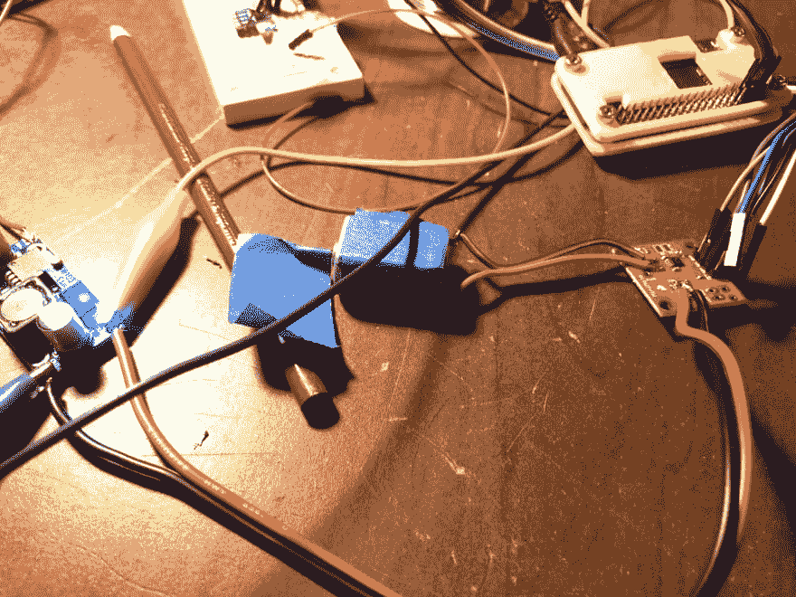](https://res.cloudinary.com/practicaldev/image/fetch/s--p-Bv650E--/c_limit%2Cf_auto%2Cfl_progressive%2Cq_auto%2Cw_880/https://ladvien.cimg/1b1_test_drv8830.jpg) 
使用 NodeJS 根本不用花时间就能让小马达旋转起来，这主要归功于迈克尔·霍德(Michael Hord)的 MiniMoto 库。(这里又有些愧疚。)

*   nodejs drv 8830 图书馆

我使用两个串联锂离子电池驱动电机，连接到一个输出约 5.0v 的降压转换器。电机旋转良好，输出约 200mA。然而，真正的测试将是按照 DRV8830 连接到两个齿轮电机。

```
'use strict';
var i2c = require('i2c-bus'), i2c1 = i2c.openSync(1);
var sleep = require('sleep');
var drv8830 = require('./drv8830');

const motorAddressOne = 0x61;
const motorAddressTwo = 0x67;

var motor1 = new drv8830(motorAddressOne, i2c1);
var motor2 = new drv8830(motorAddressTwo, i2c1);

motor1.drive(50);
motor2.drive(50)
sleep.msleep(3500);
motor1.drive(-50);
motor2.drive(50);
motor1.stop()
motor2.stop() 
```

Enter fullscreen mode Exit fullscreen mode

[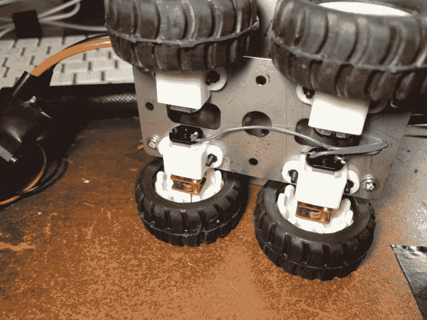T2】](https://res.cloudinary.com/practicaldev/image/fetch/s--NyQ3D8Tc--/c_limit%2Cf_auto%2Cfl_progressive%2Cq_auto%2Cw_880/https://ladvien.cimg/1b1_wiring_the_motors.jpg)

是时候给底盘马达接线并对系统进行测试了。使用的电线是一些易贝单芯铝线(便宜的东西)。布线非常简单。

不过，我确实用 perfboard 和 JST 连接器做了一个小小的 i2c 总线板。增加陶瓷和电解去耦电容以平滑和帮助峰值放电。

请注意 perfboard 底部堆积的大量散热片，这是黑客将 perfboard 与钢制机箱电隔离的解决方案。

[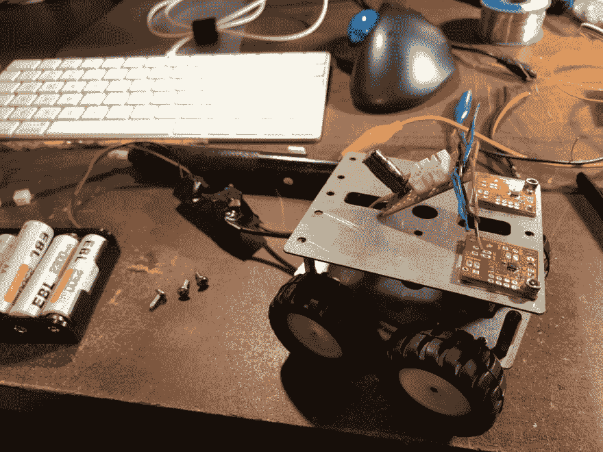](https://res.cloudinary.com/practicaldev/image/fetch/s--GTdwO6fC--/c_limit%2Cf_auto%2Cfl_progressive%2Cq_auto%2Cw_880/https://ladvien.cimg/1b1_making_a_interface.jpg)
[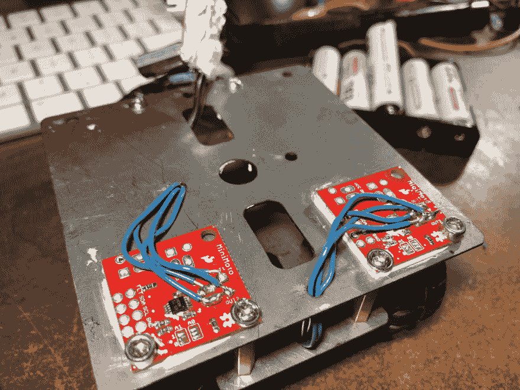](https://res.cloudinary.com/practicaldev/image/fetch/s--Fd5ohNv_--/c_limit%2Cf_auto%2Cfl_progressive%2Cq_auto%2Cw_880/https://ladvien.cimg/1b1_wiring_motors_2.jpg)
[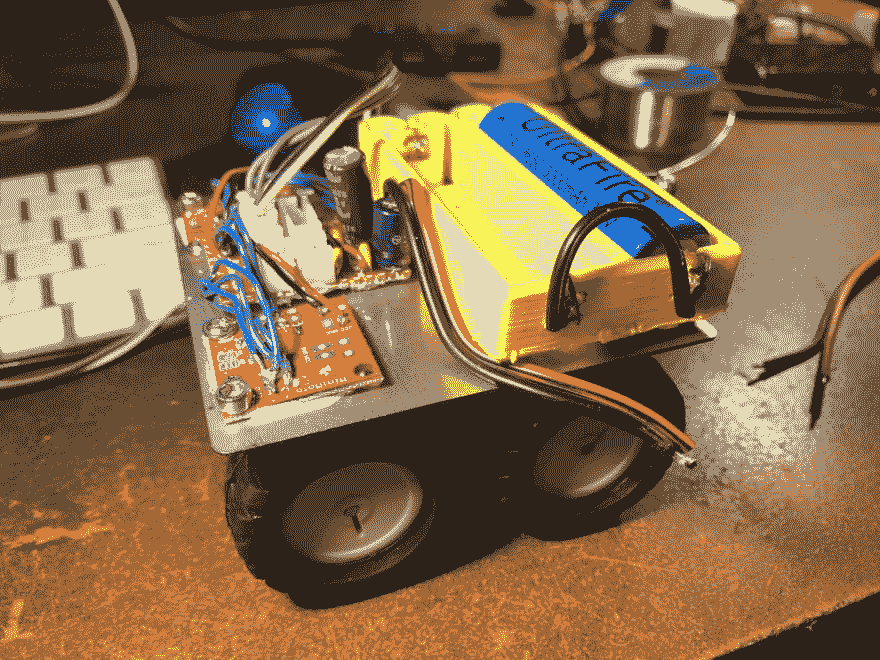](https://res.cloudinary.com/practicaldev/image/fetch/s--k8neaRN1--/c_limit%2Cf_auto%2Cfl_progressive%2Cq_auto%2Cw_880/https://ladvien.cimg/1b1_adding_power.jpg)

### 一一对应示意图

```
+--------------+                    +------------------+           +------------------+
|              |                    |                  |           |                  |
|              +--+LEAD1+----+OUT1+-+                  |VCC----+5V-+                  |
|              |                    |                  |           |                  |
| Motor 1      +--+LEAD2+----+OUT2+-+   DRV8830+A      +----GND----+  Buck Regulator  |
|              |                    |                  |           |                  |
|              |                    |                  |           |                  |
|              |                    |                  |           |                  |
+--------------+                    +-----+---+--------+           +--+--+------------+
                                          |   |                       |  |
                                      SDA1|   | SCL1               5V |  | GND
                                          |   |                       |  |
                                          |   |                       |  |
                                          |   |                       |  |
                                          |   |                       |  |
                                     +----+---+--------+              |  |
                                     |                 |              |  |
                                     |                 |              |  |
                        +----+VCC2+--+  ADUM1250ARZ    ++VCC1+--------+  |
                        |            |                 |                 |
                        |   ++GND2+--+                 ++GND1+-----------+
                        |   |        |                 |
                        |   |        +----+--+---------+
                        |   |             |  |
                        |   |         SDA1|  | SCL2
                        |   |             |  |
                        |   |             |  |
                        |   |             |  |
                  +-----+---+-------------+--+-------+

                            Raspberry Pi Zero W 
```

Enter fullscreen mode Exit fullscreen mode

[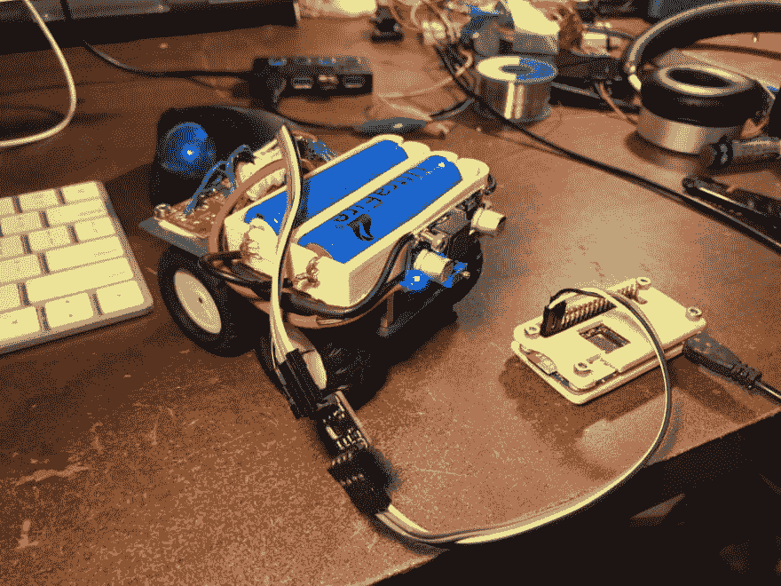T2】](https://res.cloudinary.com/practicaldev/image/fetch/s--HVh_1ylm--/c_limit%2Cf_auto%2Cfl_progressive%2Cq_auto%2Cw_880/https://ladvien.cimg/1b1_power_and_isolated.jpg)

ADUM1250ARZ 是一款双向电流隔离器，支持最高 1mb 的数字通信。这是我设计 PCB 的第一个芯片，也是我最喜欢的。本质上，ADUM1250 将 rp0w 从高噪声电机中分离出来，更重要的是，如果我在电机端搞砸了什么，也不会影响我的 rp0w。*adum 1250 对大多数人来说不是必须的，只有我*

*   [ADUM1250(鼠标)](https://www.mouser.com/_/?Keyword=ADUM1250ARZ&FS=True)
*   [Eagle 分线板](https://github.com/Ladvien/Ladviens-Eagle-Files/tree/master/ADUM1250ARZ%202-sided)
*   [数据表](http://www.analog.com/media/en/technical-documentation/data-sheets/ADUM1250_1251.pdf)
*   [*非常*老用 IC 工作](https://ladvien.com/arduino-to-rpi-optoisolated-i2c/)

[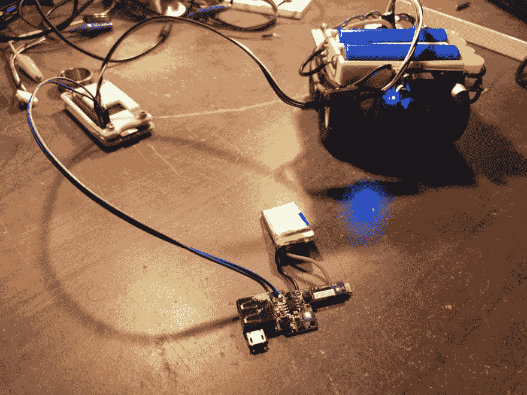T2】](https://res.cloudinary.com/practicaldev/image/fetch/s--CIxNiYas--/c_limit%2Cf_auto%2Cfl_progressive%2Cq_auto%2Cw_880/https://ladvien.cimg/1b1_no_strings.jpg)

我要弄清楚的最后一点是树莓派的力量。我试图使用一个锂离子电池和一个升压调节器来供电，但我买的调节器是 DOA。

然后我想起了从电池组中抢救出来的负载共享和升压转换器电路。充电电路是为锂电化学设计的，我唯一骗过的锂电是一个 350 毫安的。我把它连接起来，惊讶地发现整个东西都工作了，还有一个额外的好处是可以在不断开的情况下给 rp0w 电池充电。Booyah！

我为视频做的最后一点。我拉了`npm`包按键，写了这个小程序。

```
'use strict';
var i2c = require('i2c-bus'), i2c1 = i2c.openSync(1);
var sleep = require('sleep');
var drv8830 = require('./drv8830');
var keypress = require('keypress');

const motorAddressOne = 0x61;
const motorAddressTwo = 0x67;

var motor1 = new drv8830(motorAddressOne, i2c1);
var motor2 = new drv8830(motorAddressTwo, i2c1);

// var speed = 63;
var turnSpeed = 33;
var driverSideSpeed = 63;
var passangerSideSpeed = 63; 

// make `process.stdin` begin emitting "keypress" events 
keypress(process.stdin);

// listen for the "keypress" event 
process.stdin.on('keypress', function (ch, key) {  
  if (key && key.ctrl && key.name == 'c') {
    process.stdin.pause();
  }
  switch(key.name) {

    case 'w':
        motor1.drive(driverSideSpeed);
        motor2.drive(passangerSideSpeed);
        break;
    case 's':
        var motors = [motor1, motor2];
        setDriveWithAcceleration(motors, driverSideSpeed, 10);
        break;
    case 'd':
        motor1.drive(turnSpeed);
        motor2.drive(turnSpeed*-1);
        break;
    case 'a':
        motor1.drive(turnSpeed*-1);
        motor2.drive(turnSpeed);
        break;
    default:
        motor1.stop();
        motor2.stop();
  }

});
process.stdin.setRawMode(true);
process.stdin.resume();

var setDriveWithAcceleration = function(motors, desiredSpeed, accelTimeMilliSec) {
    for(var i = 0; i < desiredSpeed; i++){    
        motors[0].drive(i);
        motors[1].drive(i);
        sleep.msleep(accelTimeMilliSec);
    }
} 
```

Enter fullscreen mode Exit fullscreen mode

然后，我拍了下面这个视频，叫 donesies。

[https://www.youtube.com/embed/PmRkM8vABuI](https://www.youtube.com/embed/PmRkM8vABuI)