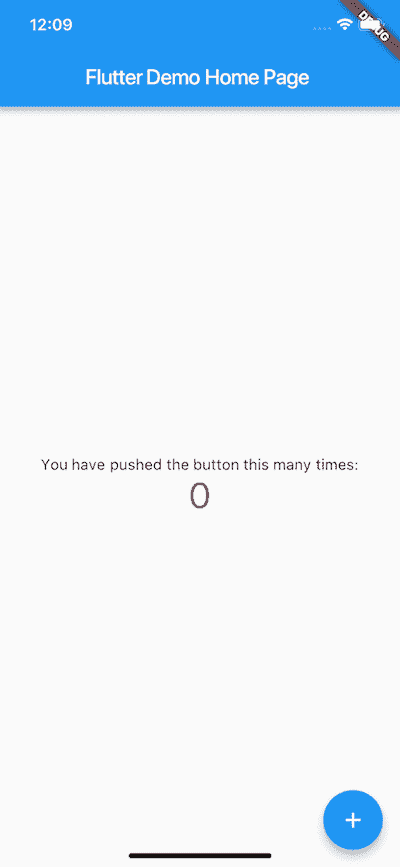

# #2 —开始行动

> 原文：<https://dev.to/nitya/2--getting-started-4n2p>

这是我为 2018 年 FlutterCamp 整理的一系列文章。更多信息请阅读 [*系列第一篇*](https://dev.to/devfestnyc/flutter-camp-2018-2c1k-temp-slug-4314172) *。*

在这一点上，我假设你刚刚参加了一个 FlutterCamp 活动(亲自)或者了解了 Flutter(在线)。那你接下来会去哪里？

### 2a。安装 Flutter SDK。

如果您还没有这样做，[按照这些说明](https://flutter.io/setup-macos/)将 [Flutter SDK](https://flutter.io/setup-macos/#get-sdk) 安装到您的开发平台上。我使用 MacOSX，发现这个过程相当简单。

### 2b。验证颤振 SDK 设置。

安装完成后，运行 flutter doctor 来验证您的开发环境是否准备就绪。如果没有，您应该看到修复任何缺少的依赖项的建议。如果你像我一样，已经安装了一个早期版本的 flutter(例如 alpha)，运行 flutter upgrade，你就可以设置好了。

**作为参考，这是我目前的颤振设置:**

```
$ flutter doctor
Doctor summary (to see all details, run flutter doctor -v):
[✓] Flutter (Channel beta, v0.4.4, on Mac OS X 10.13.4 17E199, locale en-US)
[✓] Android toolchain - develop for Android devices (Android SDK 28.0.0-rc1)
[✓] iOS toolchain - develop for iOS devices (Xcode 9.4.1)
[✓] Android Studio (version 3.1)
[✓] IntelliJ IDEA Ultimate Edition (version 2018.1.4)
[!] VS Code (version 1.24.1)
[✓] Connected devices (1 available) 
```

Enter fullscreen mode Exit fullscreen mode

*我目前有一个问题，flutter doctor 错误地报告 VSCode 丢失了一个 Dart 扩展(因此“！”但除此之外，您应该会看到类似的东西，是为您的开发平台定制的。*

### 2c。设置目标平台支持。

Flutter 可以用于开发 Android 和 iOS 设备的应用程序。至少具备这些环境中的一个——参见[iOS 设置说明](https://flutter.io/setup-macos/#ios-setup)和【Android 设置说明。

这包括确保安装所需的开发 SDK，还包括为这些环境设置虚拟目标，例如 iOS 模拟器和 Android 模拟器。

对我来说，由于我使用的是 MacOS，所以我选择了两种安装方式。为了快速原型化和测试，我选择使用 iOS 模拟器，使用 _ open-a Simulator _ 从命令行运行它。

为了测试这两种设备，我已经切换到 Android Studio IDE 并使用它来启动 Android 模拟器——然而，我目前正在探索 VS 代码。完成后，我将更新这一部分的见解。

### **2d。配置编辑器。**

[Flutter docs 页面](https://flutter.io/get-started/editor/#vscode)将 Android Studio 和 VS Code 标识为编辑的两个顶级标签。如果打开 Android Studio 选项卡，还可以找到使用 IntelliJ IDEA 编辑器的说明。这三种我都用过；IntelliJ IDEA 和 Android Studio 类似；毫不奇怪——它们都来自 JetBrains。

Android Studio 和 IntelliJ IDEA 的安装是例行公事。VS 代码的安装也很容易。然而，我目前正面临着一个与 flutter doctor 有关的问题，需要在上下文中解决。注意这个空间。

注意:您不需要安装所有这些编辑器。随便选一个。

从技术上来说，你可以只使用 Flutter CLI(自带 SDK)和任何文本编辑器(不需要 IDE)。然而，IDE 提供了简单文本编辑器所没有的可视化工具(例如，Flutter widget inspector)。速度和能力之间的权衡。选择你的车道。在任何时候切换车道都是相当容易的，所以你的决定不会冒太大的风险。

### 2e。你的第一个测试应用

Flutter 文档提供了对 [Android Studio](https://flutter.io/get-started/test-drive/#androidstudio) 、 [VS 代码](https://flutter.io/get-started/test-drive/#vscode)的说明，以及简单的[文本编辑器+ CLI](https://flutter.io/get-started/test-drive/#terminal) 。我已经多次使用了第一个和最后一个选项，都没有问题——所以如果你想走这条路，就直接跳进去吧。

我目前正在接触 VS 代码，所以我在这里的所有笔记/观察都会反映出那个编辑器的用法。

<figure>[](https://res.cloudinary.com/practicaldev/image/fetch/s--GxwJalMW--/c_limit%2Cf_auto%2Cfl_progressive%2Cq_auto%2Cw_880/https://cdn-images-1.medium.com/max/400/1%2AcNDZgHJxcpGdAG9jbpgKgw.png) 

<figcaption>样板文件【你好世界】app 上飘起</figcaption>

</figure>

**创建 App (VS 代码)**

视图-命令调板。
T5 型*旋舞。*

挑 ***扑:新项目动作***

**输入项目名称**。*小写，必要时用下划线分隔。*

选择目标文件夹；等待构建完成。你会在右下角得到一个“你的 Flutter 项目准备好了”的通知。

**运行应用。**查看是否选择了设备。*我已经运行了 iOS 模拟器。*

**按 F5 启动该设备中的应用程序**。*您应该会看到如下所示的屏幕。*

尝试热重装。

对代码的某些方面进行更改，如“primary watch:colors . blue”中的颜色值。然后保存更改以触发热重装。*你也可以点击编辑器顶部的绿色刷新按钮)* —演示 Dart/Flutter 的热状态重载。

此时，深呼吸，去喝点咖啡。现在，您可以开始探索其他教程、代码实验室和想法了。你的环境准备好了！

* * *