# 2018 年推荐的 20 款 macOS 实用应用

> 原文：<https://dev.to/onmyway133/20-recommended-utility-apps-for-macos-in-2018-363>

[T2】](https://res.cloudinary.com/practicaldev/image/fetch/s--dq4p5oLi--/c_limit%2Cf_auto%2Cfl_progressive%2Cq_auto%2Cw_880/https://cdn-images-1.medium.com/max/1600/0%2Aflb55B4738SEJlO_.jpg)

根据需要，我们在 mac 上有不同的应用程序。作为一个主要从事开发工作的人，以下是我不可或缺的应用程序。他们就像托尼·斯塔克的西装。因为我喜欢开源应用，所以它们在列表中有更高的优先级。

## 开源应用

### iTerm 2【https://www.iterm2.com/ T2】

> iTerm2 是 Terminal 的替代品，也是 iTerm 的继任者。它可以在 macOS 10.10 或更高版本的 MAC 上运行。iTerm2 将终端带入现代，具有你从未想过的你一直想要的功能。

[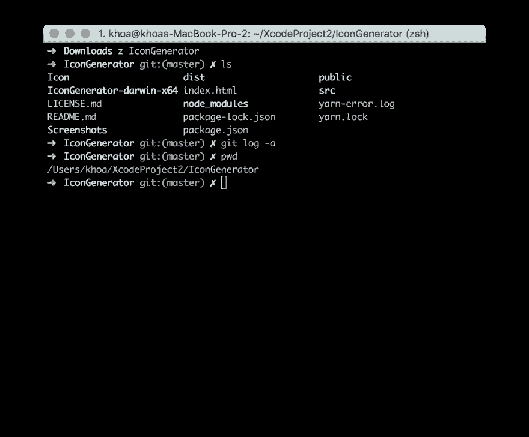T2】](https://res.cloudinary.com/practicaldev/image/fetch/s--ugGNxyEK--/c_limit%2Cf_auto%2Cfl_progressive%2Cq_auto%2Cw_880/https://cdn-images-1.medium.com/max/2728/1%2A-U-N-4151szNzxebapR45w.png)

iTerm2 与 tmux 有很好的集成，并支持[分割窗格](https://www.iterm2.com/documentation/2.1/documentation-one-page.html)

> Term2 允许您将一个选项卡分成许多矩形“窗格”，每个窗格都是一个不同的终端会话。快捷键 cmd-d 和 cmd-shift-d 分别垂直或水平分割现有会话。您可以使用 cmd-opt-arrow 或 cmd-[和 cmd-]在拆分的窗格之间导航。您可以使用 cmd-shift-enter 键“最大化”当前窗格，隐藏该选项卡中的所有其他窗格。再次按快捷键可恢复隐藏的窗格。

### 【oh-my-zsh】[【https://github . com/robberussel/oh-my-zsh】](https://github.com/robbyrussell/oh-my-zsh)

> 一个令人愉快的社区驱动的(有 1200 多个贡献者)框架，用于管理您的 zsh 配置。包括 200 多个可选插件(rails、git、OSX、hub、capistrano、brew、ant、php、python 等)，超过 140 个主题为您的早晨增添趣味，以及一个自动更新工具，使您可以轻松跟上社区的最新更新。

我使用 z shell 和 oh-my-zsh 插件。我还使用 [zsh-autocompletions](https://github.com/zsh-users/zsh-autosuggestions) 像 fish shell 一样自动完成，使用 [z](https://github.com/robbyrussell/oh-my-zsh/tree/master/plugins/z) 跟踪并快速导航到最常用的目录。

### 节目[https://github . com/eczarny/show](https://github.com/eczarny/spectacle)

> 眼镜让你不用鼠标就可以组织你的窗口。

[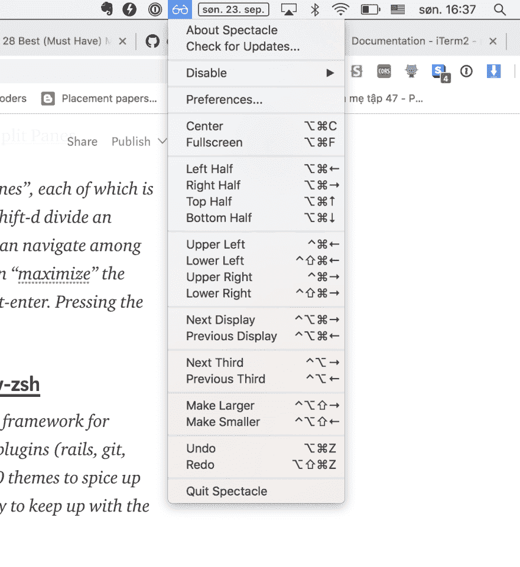T2】](https://res.cloudinary.com/practicaldev/image/fetch/s--id5CctDx--/c_limit%2Cf_auto%2Cfl_progressive%2Cq_auto%2Cw_880/https://cdn-images-1.medium.com/max/2426/1%2A0TFgBiAif9VBl6Xv4D6EtQ.png)

有了 spectable，我可以用 Cmd+Option+F 或 Cmd+Option+Left 轻松组织窗口

### 失眠【https://github.com/getinsomnia/insomnia】T2

> 失眠是一个跨平台的 *REST 客户端*，建立在[电子](http://electron.atom.io/)之上。

不管你喜不喜欢 electron.js 应用程序。这是测试 REST 请求的一个很好的工具

[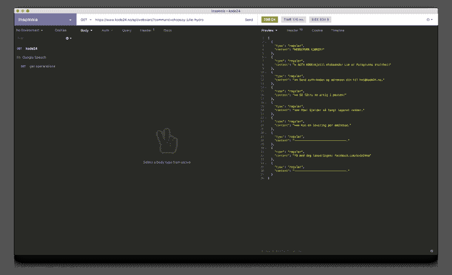T2】](https://res.cloudinary.com/practicaldev/image/fetch/s--BVnQb2Zk--/c_limit%2Cf_auto%2Cfl_progressive%2Cq_auto%2Cw_880/https://cdn-images-1.medium.com/max/7168/1%2ATo2QSXpMbFryyO50hwR_9w.png)

### Visual Studio 代码【https://github.com/Microsoft/vscode T2】

> [VS Code](https://code.visualstudio.com/) 是一种新型工具，它将代码编辑器的简单性与开发人员核心的编辑-构建-调试周期所需的东西结合在一起。代码提供了全面的编辑和调试支持、可扩展性模型以及与现有工具的轻量级集成。

这似乎是最受欢迎的前端开发，和许多其他事情。有一堆的扩展，使体验达到一个新的水平。

### 图标生成器【https://github.com/onmyway133/IconGenerator T2】

由我建造。在开发 iOS、Android 和 macOS 应用程序时，我需要一种快速的方法来生成不同大小的图标。您可以简单地将生成的资产拖到 Xcode 中，就这样。

[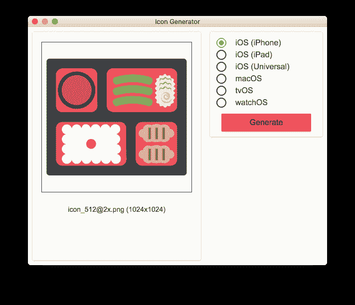T2】](https://res.cloudinary.com/practicaldev/image/fetch/s--jb6kFq_n--/c_limit%2Cf_auto%2Cfl_progressive%2Cq_auto%2Cw_880/https://cdn-images-1.medium.com/max/2000/0%2AJmfHsO-lmN1aWX6J.png)

### vmd【https://github.com/yoshuawuyts/vmd T2】T3】

> 在单独的窗口中预览降价文件。Markdown 的格式和 GitHub 上的完全一样。

[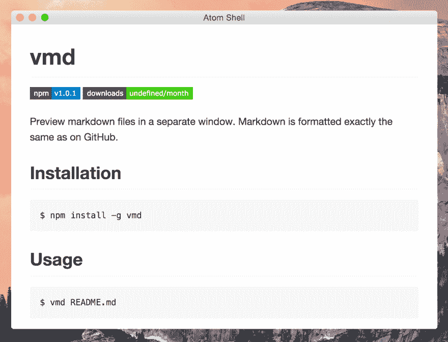T2】](https://res.cloudinary.com/practicaldev/image/fetch/s--bbq0UGrL--/c_limit%2Cf_auto%2Cfl_progressive%2Cq_auto%2Cw_880/https://cdn-images-1.medium.com/max/2880/0%2ALnE9wGaCRvd90FkQ.png)

### color picker[https://github . com/tonane/color picker](https://github.com/Toinane/colorpicker)

> 一个最小但完整的 colorpicker 桌面应用

我曾经使用 [Sip](https://sipapp.io/) 但是我经常遇到注意力不集中的问题。

[T2】](https://res.cloudinary.com/practicaldev/image/fetch/s--5RlNP2Vu--/c_limit%2Cf_auto%2Cfl_progressive%2Cq_auto%2Cw_880/https://cdn-images-1.medium.com/max/2000/0%2AnBZsnnHC5AJ_Ha0X)

### gif capture[https://github . com/on wyy 133/gif capture](https://github.com/onmyway133/GifCapture)

我把它建成了一个本地的 macOS 应用程序来捕捉屏幕并保存到 gif 文件。它的工作方式类似于 Licecap，但是是开源的。还有一个叫做 [kap](https://github.com/wulkano/kap) 的开源工具，非常灵活。

[T2】](https://res.cloudinary.com/practicaldev/image/fetch/s--_WtD7AhE--/c_limit%2Cf_auto%2Cfl_progressive%2Cq_auto%2Cw_880/https://cdn-images-1.medium.com/max/2000/0%2AUVNhL9otC1Of3h_I.png)

### itsycal[https://github . com/sfsam/itsycal](https://github.com/sfsam/Itsycal)

> Itsycal 是 Mac 菜单栏上的一个小日历。

[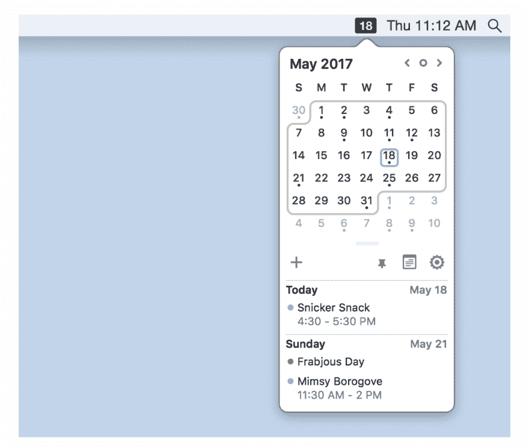T2】](https://res.cloudinary.com/practicaldev/image/fetch/s--0vtD8I1V--/c_limit%2Cf_auto%2Cfl_progressive%2Cq_auto%2Cw_880/https://cdn-images-1.medium.com/max/2152/1%2A3uo-HmuBIrOd5hrHlnHHyA.png)

该应用程序是最小的，工作非常好。它可以在 mac 中显示集成帐户的日历。

### 推送通知【https://github.com/onmyway133/PushNotifications T2】

我经常需要测试 iOS 和 Android 应用的推送通知。而且我想同时支持苹果推送通知服务的证书和 key p8 认证，所以我搭建了这个工具。

[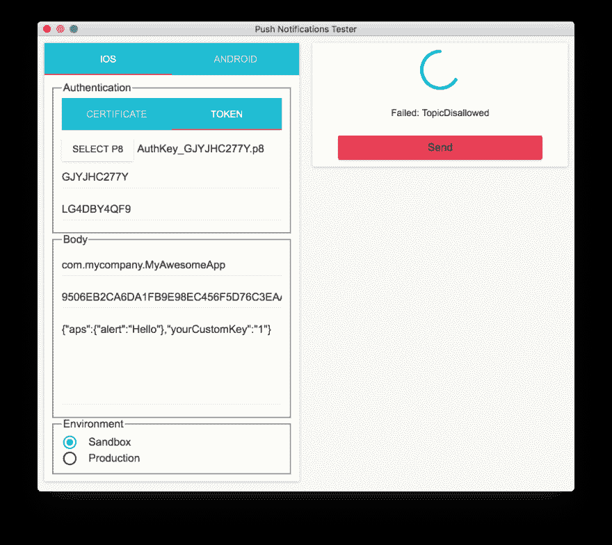T2】](https://res.cloudinary.com/practicaldev/image/fetch/s--PUjYmkI_--/c_limit%2Cf_auto%2Cfl_progressive%2Cq_auto%2Cw_880/https://cdn-images-1.medium.com/max/2000/0%2AzM9AWj2-C0-S4T29.png)

### 歌词【https://github.com/onmyway133/Lyrics】T2

> 菜单栏应用程序，显示正在播放的 Spotify 歌曲的歌词

当我在 Spotify 上听一些歌曲时，我也想看到歌词。歌词取自[https://genius.com/](https://genius.com/)，并显示在一个美妙的用户界面上。

[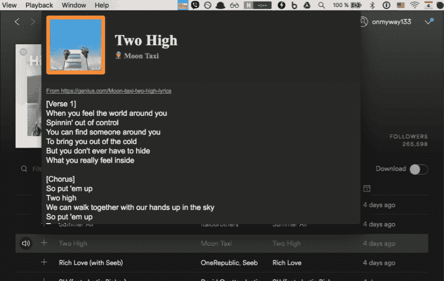T2】](https://res.cloudinary.com/practicaldev/image/fetch/s--21sDWGBK--/c_limit%2Cf_auto%2Cfl_progressive%2Cq_auto%2Cw_880/https://cdn-images-1.medium.com/max/2000/0%2AIBFKvyfkdi5FPWsF.png)

### https://github.com/manosim/gitify

> 桌面上的 GitHub 通知。

我用这个在 GitHub 上获取问题的实时通知和项目的拉取请求。希望很快能有对 Bitbucket 的支持。

[T2】](https://res.cloudinary.com/practicaldev/image/fetch/s--5HPNKJDg--/c_limit%2Cf_auto%2Cfl_progressive%2Cq_auto%2Cw_880/https://cdn-images-1.medium.com/max/4000/0%2AIsCx4-yROD3DnT4B.jpg)

### 芬德戈【https://github.com/onmyway133/FinderGo】T2

FinderGo 既是一款原生 macOS 应用，也是一款 Finder 扩展。它有一个工具栏按钮，可以在当前目录下的 Finder 中打开终端。您可以将其配置为打开终端、iTerm2 或 Hyper

[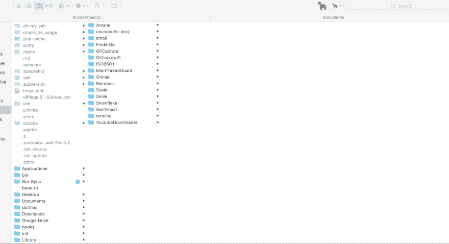T2】](https://res.cloudinary.com/practicaldev/image/fetch/s--X_91aabw--/c_limit%2Cf_auto%2Cfl_progressive%2Cq_66%2Cw_880/https://cdn-images-1.medium.com/max/4000/0%2A735x63KgINRN7ig8.gif)

### 原子一体黑暗主题

这是关于主题的。有一个非常受欢迎的 dracular 主题，但我发现它对眼睛来说太强烈了。我不用 Atom，但我喜欢它的 [one dark UI](https://atom.io/themes/one-dark-ui) 。我曾经为 xcode 维护我自己的主题，名为[黑暗面](https://github.com/onmyway133/DarkSide)，但是现在我为 Xcode 使用 [xcode-one-dark](https://github.com/bojan/xcode-one-dark) ，为 Visual Studio 代码使用 [Atom One 黑暗主题](https://marketplace.visualstudio.com/items?itemName=akamud.vscode-theme-onedark#qna)。

我在 Xcode，Visual Studio Code，Android Studio 也用 [Fira Code](https://github.com/tonsky/FiraCode) 字体，连字很漂亮。

### 镀铬扩展

我使用 Chrome 是因为它的速度和对扩展的出色支持。我做的扩展是 [github-chat](https://github.com/onmyway133/github-chat) 用于在 github 中聊天，以及 [github-extended](https://github.com/onmyway133/github-extended) 用于查看更多的固定库。

还有[精 github](https://github.com/sindresorhus/refined-github) 、 [github-repo-size](https://github.com/harshjv/github-repo-size) 和 [octotree](https://github.com/ovity/octotree) 对我来说都是不可或缺的。

### https://github.com/sindresorhus/caprine 卡普里

> Caprine 是一个非官方的、注重隐私的 Facebook Messenger 应用程序，具有许多有用的功能。

[T2】](https://res.cloudinary.com/practicaldev/image/fetch/s---ukEbxGf--/c_limit%2Cf_auto%2Cfl_progressive%2Cq_auto%2Cw_880/https://cdn-images-1.medium.com/max/3384/0%2A09sP4yi4CFJIxSUb.png)

## 关闭源码和商业应用

### 崇高的文字【https://www.sublimetext.com/】T2

> Sublime Text 是一个复杂的代码、标记和散文文本编辑器。你会喜欢光滑的用户界面，非凡的功能和惊人的性能。

Sublime Text 简直快，编辑体验非常好。我用过 Atom，但是它太慢了。

### 威震合并【https://www.sublimemerge.com/】T2

> *认识一个新的 Git 客户，来自 Sublime Text 的制作者*

崇高合并从未让我失望。源代码管理应用程序简单快捷。我过去使用过 SourceTree，但是它非常慢，而且对 Bitbucket 和 GitHub 的认证也有问题，而且对于 React 本地应用程序，它经常会暂停，因为这些应用程序提交了大量的节点模块。

[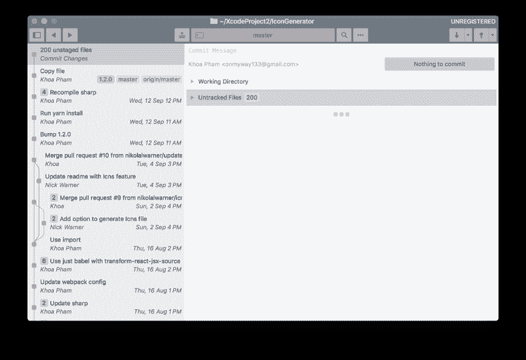T2】](https://res.cloudinary.com/practicaldev/image/fetch/s--7mFF39vT--/c_limit%2Cf_auto%2Cfl_progressive%2Cq_auto%2Cw_880/https://cdn-images-1.medium.com/max/4288/1%2AmpebCS0MyzWfaIolcMWstQ.png)

### 1 密码【https://1password.com/】T2

> 1Password 会为您记住它们。保存您的密码，只需一次点击即可登录网站。就这么简单。

如今，每个人都需要强大且唯一密码。这个工具是不可缺少的

### https://monosnap.com/welcome[单快照](https://monosnap.com/welcome)

> 做截图。在上面画画。拍摄视频并分享您的文件。它又快又简单又免费。

我还没有找到一个好的开源替代，这是很好的捕捉屏幕或屏幕的一部分。

[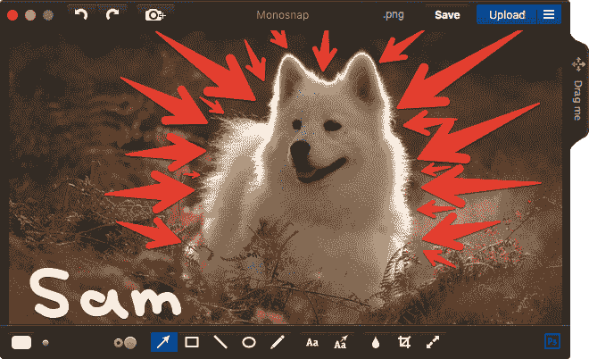T2】](https://res.cloudinary.com/practicaldev/image/fetch/s--73l7D6kH--/c_limit%2Cf_auto%2Cfl_progressive%2Cq_auto%2Cw_880/https://cdn-images-1.medium.com/max/2000/0%2AyQIOnlMbSNVhxcDX.png)

### https://www.videolan.org/index.nb.html[VLC](https://www.videolan.org/index.nb.html)

iTunes 或 Quick Time 对某些视频编解码器有问题。这个应用程序 VLC 可以播放各种类型的视频。

### Xcode【https://developer.apple.com/xcode/】T2

Xcode 是 iOS 开发者的首选编辑器。当前版本是 Xcode 10。Xcode 8 不支持插件。要走的路是 Xcode 扩展。

我开发了 [XcodeColorSense2](https://github.com/onmyway133/XcodeColorSense2) 来轻松识别十六进制颜色，开发了 [XcodeWay](https://github.com/onmyway133/XcodeWay) 来轻松地从 Xcode 导航到许多地方

[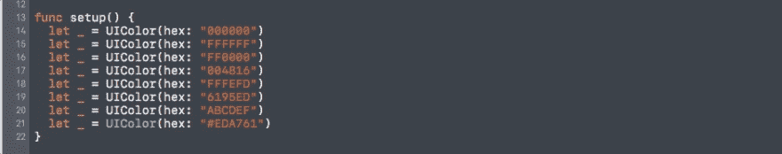T2】](https://res.cloudinary.com/practicaldev/image/fetch/s--D1X0MguU--/c_limit%2Cf_auto%2Cfl_progressive%2Cq_66%2Cw_880/https://cdn-images-1.medium.com/max/2000/0%2AiAvpNCUGjZR8YlbW.gif)

[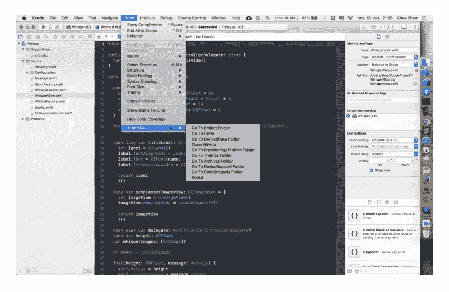T2】](https://res.cloudinary.com/practicaldev/image/fetch/s--8ujjcDXY--/c_limit%2Cf_auto%2Cfl_progressive%2Cq_auto%2Cw_880/https://cdn-images-1.medium.com/max/3016/1%2ATXOcxnsxfuxvY2MjPvzdZA.png)

### 草图【https://www.sketchapp.com/】T2

> Sketch 是一个设计工具包，旨在帮助你创作出最好的作品——从你最早的想法，到最终的艺术作品。

草图是当今最受欢迎的设计工具。有很多很酷的插件。我使用[草图动作](https://github.com/onmyway133/Sketch-Action)和[用户流](https://abynim.github.io/UserFlows/)

[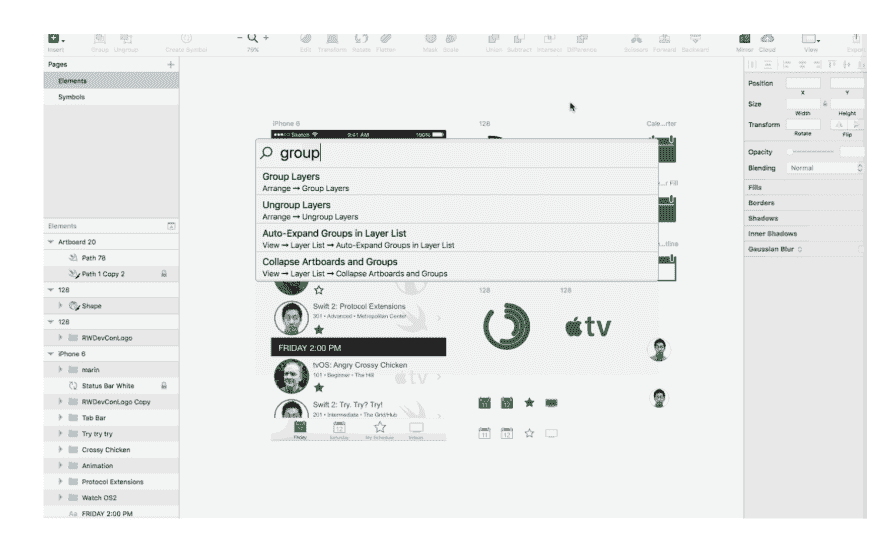T2】](https://res.cloudinary.com/practicaldev/image/fetch/s--rA1D_BeB--/c_limit%2Cf_auto%2Cfl_progressive%2Cq_auto%2Cw_880/https://cdn-images-1.medium.com/max/2992/1%2AXUNCJlgYzEsnMDEEF5k_iQ.png)

[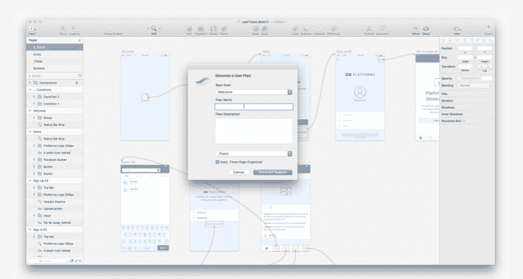T2】](https://res.cloudinary.com/practicaldev/image/fetch/s--5G-riXKa--/c_limit%2Cf_auto%2Cfl_progressive%2Cq_auto%2Cw_880/https://cdn-images-1.medium.com/max/3916/1%2A1l7tpX0r6xZdLyqcCdK7cQ.png)

## 何去何从

我希望你能找到一些新的工具来尝试。如果你知道其他很棒的工具，请随意发表评论。这里有更多的链接供您进一步探索

*   [电子应用](https://electronjs.org/apps)

*   [2018 年最佳 Mac 应用](https://www.digitaltrends.com/computing/best-mac-apps/)

*   [开发者最佳开源工具](https://dev.to/sarthology/best-open-source-tools-for-developers--300f)

*   [开源 mac-os-apps](https://github.com/serhii-londar/open-source-mac-os-apps)

原帖[https://hacker noon . com/20-recommended-utility-apps-for-MAC OS-in-2018-ea 494 B4 db 72 b](https://hackernoon.com/20-recommended-utility-apps-for-macos-in-2018-ea494b4db72b)