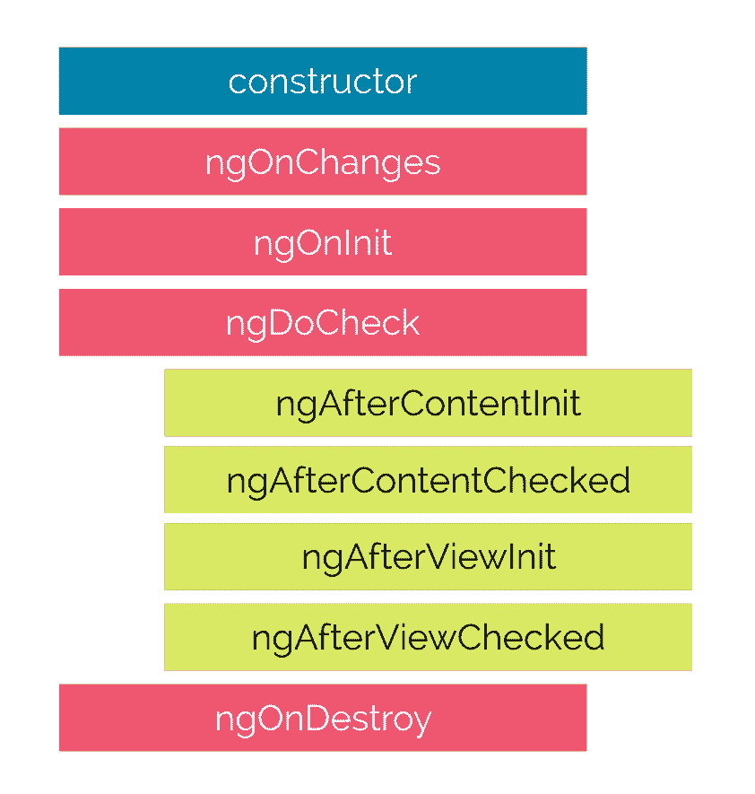

# 2018 年 22 个专家角度面试问答

> 原文：<https://dev.to/aershov24/22-expert-angular-interview-questions-and-answers-in-2018-1m1g>

[](https://res.cloudinary.com/practicaldev/image/fetch/s--U5VqodS1--/c_limit%2Cf_auto%2Cfl_progressive%2Cq_auto%2Cw_880/https://images.pexels.com/photos/70402/pexels-photo-70402.jpeg%3Fauto%3Dcompress%26cs%3Dtinysrgb%26dpr%3D2%26h%3D350) 
高级和专家级棱角面试问题终极清单。用它来雇用一个新的团队成员，测试自己，嘲笑你的领导开发或完全忽略。问题来源于[Khan 4019/angular-interview-questions](https://github.com/khan4019/angular-interview-questions)并在 [FullStack 上回答。咖啡馆](https://www.fullstack.cafe)。

> 最初发表于 [FullStack。永远不要再错过你的技术面试](https://www.fullstack.cafe)

### Q1:ng module 中的“声明”、“提供者”和“导入”有什么区别？

> 题目:**棱角分明**T2】难度:⭐⭐⭐

*   使其他模块的导出声明在当前模块中可用
*   `declarations`使当前模块中的指令(包括组件和管道)可用于当前模块中的其他指令。指令、组件或管道的选择器只有在声明或导入时才与 HTML 匹配。
*   使 DI 了解服务和价值。它们被添加到根范围，并被注入到依赖它们的其他服务或指令中。

`providers`的一个特例是懒惰加载的模块，它们拥有自己的子注入器。默认情况下，一个懒惰加载的模块的`providers`只提供给这个懒惰加载的模块(而不是像其他模块一样提供给整个应用程序)。

🔗**来源:**【medium.com】T2

### Q2:解释“构造者”和“ngOnInit”的区别

> 题目:**棱角分明**T2】难度:⭐⭐⭐

*   `Constructor`是类的默认方法，在类被实例化时执行，并确保类及其子类中字段的正确初始化。
*   `ngOnInit`是 Angular 调用的一个生命周期挂钩，表示 Angular 已完成创建组件。为了这样使用，我们必须导入 OnInit(实际上实现 OnInit 不是强制性的，但被认为是一种好的实践)。

大多数情况下，我们使用`ngOnInit`进行初始化/声明，避免在构造函数中工作。构造函数应该只用于初始化类成员，但不应该做实际的“工作”。

🔗**来源:**【stackoverflow.com】T2

### Q3:Angular 6 有什么新功能，为什么要升级到它？

> 题目:**棱角分明**T2】难度:⭐⭐⭐

*   Angular Elements 是一个项目，可以让你将 Angular 组件包装成 Web 组件，并嵌入到一个非 Angular 应用程序中。
*   新的渲染引擎:Ivy -提高速度，减少应用程序的大小。
*   **可摇树的提供者**——一种新的、推荐的注册提供者的方法，直接在@ Injectable()装饰器中，使用新的`providedIn`属性
*   RxJS 6 - Angular 6 现在在内部使用 RxJS 6，并且要求你也更新你的应用。rxjs 发布了一个名为 rxjs-compat 的库，它允许您将 RxJS 升级到 6.0 版，即使您或您正在使用的某个库仍在使用“旧”语法。
*   **ElementRef`<T>`**——在 Angular 5.0 或更早的版本中，所述 element ref 将其 nativeElement 属性类型化为 any。在 Angular 6.0 中，现在可以更严格地键入 ElementRef。
*   **动画** -对于 Angular 6.0 中的动画不再需要 polyfill web-animations-js，除非您正在使用 AnimationBuilder。
*   **i18n**——拥有“运行时 i18n”的可能性，而不必为每个地区构建一次应用程序。

🔗**来源:**【ninja-squad.com】T2

### Q4:什么是 AOT？

> 题目:**棱角分明**T2】难度:⭐⭐⭐

Angular 提前编译器在构建过程中预编译应用程序组件及其模板。基于几个原因，用 AOT 编译的应用程序运行得更快。

*   应用程序组件立即执行，无需客户端编译。
*   模板作为代码嵌入到组件中，因此客户端不会请求模板文件。
*   你不用下载 Angular 编译器，它本身就很大。
*   编译器丢弃未使用的角度指令，然后树抖动工具可以排除这些指令。

🔗**来源:**【stackoverflow.com】T2

### Q5:为什么会使用渲染器方法而不是使用原生元素方法？

> 题目:**棱角分明**T2】难度:⭐⭐⭐⭐

Angular 是一个平台，浏览器只是我们可以呈现应用程序的一个选项。当我们直接访问原生元素时，我们放弃了 Angular 的 DOM 抽象，错过了在非 DOM 环境中执行的机会，例如:

*   原生手机，
*   本机桌面，
*   网络工作者
*   服务器端渲染。

`Renderer2`类是 Angular 以服务的形式提供的一个抽象，它允许在不直接接触 DOM 的情况下操作应用程序的元素。这是推荐的方法，因为这样可以更容易地开发可以在没有 DOM 访问的环境中呈现的应用程序，比如在服务器、web worker 或本地移动设备上。

🔗**来源:** [alligator.io](https://alligator.io/angular/using-renderer2/)

### Q6:什么是带角的？

> 题目:**棱角分明**T2】难度:⭐⭐⭐⭐

`NgZone`是围绕`Zone.js`的包装器，它是一个围绕异步函数创建上下文的库，目的是使它们可跟踪。Angular 的变化检测严重依赖于区域。

🔗**来源:**【stackoverflow.com】T2

### Q7:为什么会在 Angular app 中使用懒加载模块？

> 题目:**棱角分明**T2】难度:⭐⭐⭐⭐

要延迟加载一个功能模块，我们需要使用路由配置中的`loadChildren`属性加载它，并且该功能模块不得导入应用模块。当应用程序越来越大时，延迟加载非常有用。在延迟加载中，功能模块将按需加载，因此应用程序启动会更快。

```
const routes: Routes = [
  {
    path: 'customers',
    loadChildren: 'app/customers/customers.module#CustomersModule'
  },
  {
    path: 'orders',
    loadChildren: 'app/orders/orders.module#OrdersModule'
  },
  {
    path: '',
    redirectTo: '',
    pathMatch: 'full'
  }
]; 
```

Enter fullscreen mode Exit fullscreen mode

🔗**来源:**【concretepage.com】T2

### Q8:组件和指令的生命周期挂钩是什么？

> 题目:**棱角分明**T2】难度:⭐⭐⭐⭐

Angular 中的一个组件有一个生命周期，它经历了从出生到死亡的许多不同阶段。我们可以挂钩到这些不同的阶段，以获得对我们的应用程序的一些非常细粒度的控制。

*   **构造函数**当 Angular 通过在类上调用 new 来创建一个组件或指令时，就会调用这个函数。
*   每当组件的某个输入属性发生变化时，就会调用。
*   给定组件初始化后调用。这个钩子只在第一次 ngOnChanges 后调用一次
*   ** ngDoCheck**在调用给定组件的更改检测器时调用。它允许我们为给定的组件实现我们自己的变化检测算法。
*   **ngOnDestroy** 该方法将在 Angular 销毁组件之前调用。使用这个钩子来取消订阅 observables 并分离事件处理程序，以避免内存泄漏。

这些钩子只为组件调用，而不是指令。

*   在 Angular 将任何内容投影到组件视图后调用 ngAfterContentInit (更多信息请参见前面关于内容投影的讲座)。
*   **ngAfterContentChecked** 每当 Angular 的变化检测机制检查到给定组件的内容时调用。
*   **ngafterview it**当组件的视图已经完全初始化时调用。
*   **ngAfterViewChecked** 每次给定组件的视图被角度变化检测机制检查时调用。

🔗**来源:** [codecraft.tv](https://codecraft.tv/courses/angular/components/lifecycle-hooks/)

### Q9:如何从准备好的 TemplateRef 中插入嵌入视图？

> 题目:**棱角分明**T2】难度:⭐⭐⭐⭐

您可以使用`createEmbeddedView`方法创建一个嵌入式视图，然后通过`TemplateRef` :
将该视图附加到 DOM

```
@Component({
    selector: 'app-root',
    template: `
        <ng-template #template let-name='fromContext'><div>{{name}}</ng-template>
    `
})
export class AppComponent implements AfterViewChecked {
    @ViewChild('template', { read: TemplateRef }) _template: TemplateRef<any>;
    constructor() { }

    ngAfterViewChecked() {
        this.vc.createEmbeddedView(this._template, {fromContext: 'John'});
    }
} 
```

Enter fullscreen mode Exit fullscreen mode

🔗**来源:**【stackoverflow.com】T2

### Q10:如何检测路线角度变化？

> 题目:**棱角分明**T2】难度:⭐⭐⭐⭐

在 Angular 中你可以`subscribe` (Rx 事件)到一个路由器实例。所以你可以这样做:

```
class MyClass {
    constructor(private router: Router) {
        router.subscribe((val) => /*whatever*/ )
    }
} 
```

Enter fullscreen mode Exit fullscreen mode

🔗**来源:**【medium.com】T2

### Q11:实时(JIT)编译器(一般)做什么？

> 题目:**棱角分明**T2】难度:⭐⭐⭐⭐

JIT 编译器在程序启动后运行**,将代码(通常是字节码或某种 VM 指令)动态地(或称之为实时地)编译成通常更快的形式，通常是主机 CPU 的本机指令集。JIT 可以访问动态运行时信息，而标准编译器不能，并且可以进行更好的优化，比如经常使用的内联函数。**

这与传统的编译器不同，传统的编译器在程序第一次运行之前将所有代码编译成机器语言。

🔗**来源:**【stackoverflow.com】T2

### Q12:如何创建使用 scss 的应用程序？Angular 6 有什么变化？

> 题目:**棱角分明**T2】难度:⭐⭐⭐⭐

这是 CLI v1.x 中的样式配置在中的样子。angular-cli.json 文件。

```
"defaults": {
  "styleExt": "scss",
  "component": {}
} 
```

Enter fullscreen mode Exit fullscreen mode

但是，如果您查看版本 6 中 angular.json 文件的配置模式，您将再也找不到这个配置。要使用 SCSS，只需将 scss 文件(默认值为“src/styles.scss”)导入到 angular.json 文件中的项目级别，如下所示。

```
{
  ...
  projects: {
    [your_project_name]: {
      ...
      architect: {
        build: {
          ...
          options: {
            styles:{
              "src/styles.scss"
            }
          }
        }
      }
    }
  }
} 
```

Enter fullscreen mode Exit fullscreen mode

🔗**来源:**【medium.com】T2

### Q13:ngUpgrage 是什么？

> 题目:**棱角分明**T2】难度:⭐⭐⭐⭐

Angular 团队开发了一个库，我们可以在应用中使用它来混合和匹配 AngularJS 和 Angular 组件，并连接 AngularJS 和 Angular dependency 注入系统。

🔗**来源:** [blog.nrwl.io](https://blog.nrwl.io/ngupgrade-in-depth-436a52298a00)

### Q14:什么是反应式编程，与 Angular 有什么关系？

> 题目:**棱角分明**T2】难度:⭐⭐⭐⭐

反应式编程是用异步数据流编程。RxJs 代表 Javascript 的反应式扩展，它是 Javascript 的 Observables 的实现。Observable 就像一个流(在许多语言中),允许传递零个或多个事件，每个事件都调用回调函数。Angular 目前以两种不同的方式使用 RxJs 可观测量:

*   作为内部实现机制，来实现它的一些核心逻辑像`EventEmitter`
*   作为其公共 API 的一部分，即在`Forms`和`HTTP module`中

为了用 Angular 构建最复杂的应用程序，您不需要了解反应式编程或 RxJS。然而，它可以使某些类型的应用程序更容易设计。

🔗**来源:**【github.com/WebPredict】T2

### Q15:列举 Angular 的一些安全最佳实践

> 题目:**棱角分明**T2】难度:⭐⭐⭐⭐

1.  为了系统地阻止 XSS 错误，Angular 默认将所有值都视为不可信的(卫生)
2.  角度模板与可执行代码相同:模板中的 HTML、属性和绑定表达式(但不是绑定的值)被认为是安全的。要防止这些漏洞，请使用离线模板编译器，也称为模板注入。
3.  避免直接与 DOM 交互，尽可能使用角度模板。
4.  将模板代码注入 Angular 应用程序与将可执行代码注入应用程序是一样的。因此，验证服务器端代码上的所有数据，并适当地进行转义，以防止服务器上的 XSS 漏洞。
5.  Angular HttpClient 提供了内置的支持来防止客户端的 XSRF 攻击。
6.  按照惯例，服务器可以通过使用众所周知的字符串`")]}',\n"`为所有 JSON 响应添加前缀，使它们不可执行，从而防止 XSSI 攻击。Angular 的`HttpClient`库识别这种约定，并在进一步解析之前自动从所有响应中去除字符串`")]}',\n"`。

🔗**资料来源:** [订购-jworks.github.io](https://ordina-jworks.github.io/angular/2018/03/30/angular-security-best-practices.html)

### Q16:我能把 jQuery 和 Angular 一起使用吗？

> 题目:**棱角分明**T2】难度:⭐⭐⭐⭐

首先使用 npm 安装 jQuery，如下所示

```
npm install jquery — save 
```

Enter fullscreen mode Exit fullscreen mode

其次，转到 Angular CLI 项目文件夹根目录下的`./angular-cli.json`文件，找到`scripts: [] property`，并包含 jQuery 的路径，如下所示

```
“scripts”: [ “../node_modules/jquery/dist/jquery.min.js” ] 
```

Enter fullscreen mode Exit fullscreen mode

现在，要在应用程序中的任何地方使用 jQuery，您所要做的就是将它导入到`app.component.ts`文件中，如下所示。

```
import * as $ from ‘jquery’; 
```

Enter fullscreen mode Exit fullscreen mode

考虑:

```
import { Component, OnInit  } from '@angular/core';
import * as $ from 'jquery';
@Component({
  selector: 'app-root',
  templateUrl: './app.component.html',
  styleUrls: ['./app.component.css']
})
export class AppComponent implements OnInit {
  title = 'Look jQuery Animation working in action!';

  public ngOnInit()
  {
    $(document).ready(function(){
        $("button").click(function(){
            var div = $("div");  
            div.animate({left: '100px'}, "slow");
            div.animate({fontSize: '5em'}, "slow");
        });
    });
  }
} 
```

Enter fullscreen mode Exit fullscreen mode

🔗**来源:**【medium.com】T2

### Q17:Angular js " $ watch "的角度当量是多少？

> 题目:**棱角分明**T2】难度:⭐⭐⭐⭐⭐

解决方案是来自 ES6 的`set`语法。`set`语法将一个对象属性绑定到一个函数，当试图设置该属性时，该函数将被调用。

```
import { Component, Input } from '@angular/core';
@Component({
  selector: 'example-component',
})
export class ExampleComponent {
  public internalVal = null;
  constructor() {}

  @Input('externalVal')
  set updateInternalVal(externalVal) {
    this.internalVal = externalVal;
  }
} 
```

Enter fullscreen mode Exit fullscreen mode

🔗**来源:**【medium.com】T2

### Q18:准时制(JiT) vs 提前制(AoT)编译。解释区别。

> 题目:**棱角分明**T2】难度:⭐⭐⭐⭐⭐

JIT -及时编译 TypeScript 以执行它:

*   在浏览器中编译。
*   每个文件单独编译。
*   无需在更改代码后和重新加载浏览器页面前进行构建。
*   适合本地发展。

**AOT**——在构建阶段编译类型脚本:

*   由机器自己编译，通过命令行(更快)。
*   所有代码一起编译，在脚本中内嵌 HTML/CSS。
*   不需要部署编译器(角度大小的一半)。
*   更安全，原始来源没有透露。
*   适用于生产版本。

🔗**来源:**【stackoverflow.com】T2

### Q19:你知道 angularJS 和 angular 是怎么并排跑的吗？

> 题目:**棱角分明**T2】难度:⭐⭐⭐⭐⭐

为了并行运行这两个框架并使组件具有互操作性，Angular 项目附带了一个模块 **ngUpgrade** 。该模块基本上充当一个适配器门面，所以我们并不真的觉得有两个框架并排运行。

要做到这一点，有四样东西需要协同工作:

*   依赖注入——将 Angular 服务公开到 Angular 1.x 组件中，反之亦然。
*   组件嵌套-角度 1 指令可用于角度 2.x 组件，角度 2.x 组件可使用角度 1 指令
*   内容投影/转换-角度 1 分量转换包括角度 2.x 分量和角度 2.x 分量投影角度 1 指令
*   变化检测-角度 1 范围摘要和角度> = 2.x 中的变化检测器是交错的

下面是典型的升级过程:

*   包括角度和升级模块
*   选择要升级的组件，并更改其控制器和模板 Angular 2.x 语法(现在是 Angular 2.x 组件)
*   降级 Angular 2.x 组件，使其在 Angular 1.x 应用程序中运行
*   选择要升级的服务，这通常需要很少的更改(特别是如果我们在 ES2015 上)
*   重复步骤 2 和 3(和 4)
*   用 Angular 2.x 引导程序替换 Angular 1 引导程序

🔗**来源:** [blog.thoughtram.io](https://blog.thoughtram.io/angular/2015/10/24/upgrading-apps-to-angular-2-using-ngupgrade.html)

### Q20:您能提供一些使用 ngZone 的具体例子吗？

> 题目:**棱角分明**T2】难度:⭐⭐⭐⭐⭐

当你想使用`NgZone`的时候会有很多情况，我可以举出两个:

1.  当你想让一些东西在 Angular 的变化检测之外运行时。假设我们希望在用户滚动时进行一些计算，并且不希望您运行更改检测，在这种情况下，您可以使用 NgZone:

```
constructor(private zone:NgZone){
   this.zone.runOutsideOfAngular(()=>{
      window.onscroll = ()=>{
       // do some heavy calculation : 
      }
    })
  } 
```

Enter fullscreen mode Exit fullscreen mode

1.  与上面完全相反，你有一个函数不知何故在 Angular 的区域之外，你希望它在里面，就像当第三方库为你做一些事情，你希望它被绑定到你的角度周期。

```
this.zone.run(()=>{
    $.get('someUrl').then(()=>{
        this.myViewVariable = "updated";
    })
}); 
```

Enter fullscreen mode Exit fullscreen mode

🔗**来源:**【stackoverflow.com】T2

### Q21:angular 为什么用 url 段？

> 题目:**棱角分明**T2】难度:⭐⭐⭐⭐⭐

一个 **UrlSegment** 是两个斜杠之间的 URL 的一部分。它包含一条路径和与该段相关的*矩阵参数*。

矩阵参数依赖于路径段，而查询参数依赖于 URL。它们有不同的语义。

考虑:

```
localhost:3000/heroes;id=15;foo=foo/bar/baz
// instead of localhost:3000/heroes/bar/baz?id=15&foo=foo 
```

Enter fullscreen mode Exit fullscreen mode

参数*绑定到英雄*不绑定到 URL。当你访问 route.url 时，你会看到这个

```
this.route.url.subscribe((url: UrlSegment[]) => {
  let heroes = url[0];
  let heroesMatrix = heroes.parameters();
  // heroes should contain id=15, foo=foo
  let bar = url[1].path; // 15
  let baz = url[2].path; //foo
}) 
```

Enter fullscreen mode Exit fullscreen mode

对于矩阵参数，您也可以订阅参数，而不是将它们从 url 中剥离出来。

```
this.paramSubscription = this.activeRoute.params.subscribe(params => {
  const bar = params['bar'];
  const baz = params['baz'];
}); 
```

Enter fullscreen mode Exit fullscreen mode

有了 Angular app，真正关心这些参数的只有我们这些开发者。用户不在乎。它不是一个我们应该坚持众所周知的语义的 REST API。对于我们的 Angular 应用程序，只要我们开发人员知道如何使用参数(无论是矩阵还是查询)，我们使用哪一个都不重要。

🔗**来源:**【https://stackoverflow.com】T2

### Q22:什么时候使用查询参数和矩阵参数？

> 题目:**棱角分明**T2】难度:⭐⭐⭐⭐⭐

*   查询参数:[http://example.com/apples?order=random&颜色=蓝色](http://example.com/apples?order=random&color=blue)
*   矩阵参数:[http://example.com/apples;order=random;color=blue](http://example.com/apples;order=random;color=blue)

* * *

矩阵参数和查询参数之间的差异不仅仅是约定。

主要区别是:

*   带有查询参数的 URL 不会让它们的响应被中介/代理缓存(目前)
*   矩阵参数可以出现在路径中的任何位置
*   计算相对 uri 是不同的
*   查询参数通常被滥用来添加新的动词，而不是使用资源上的现有方法
*   矩阵参数不是资源，它们是帮助参考难以在层次结构中表示的信息空间中的资源的方面

🔗**来源:**【stackoverflow.com】T2

> 谢谢🙌阅读，祝你面试好运！
> *查看更多 FullStack 面试问题&答案上👉 [www.fullstack.cafe](https://www.fullstack.cafe)*