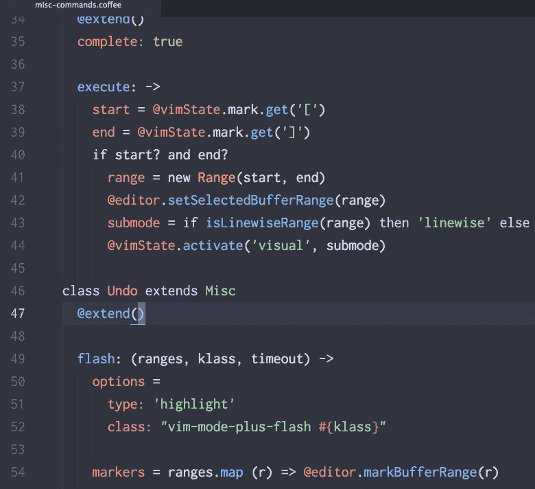
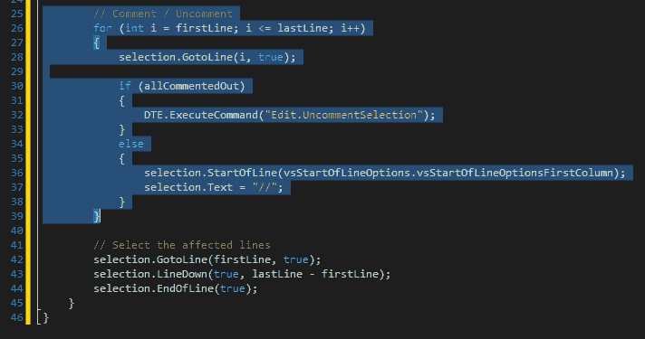
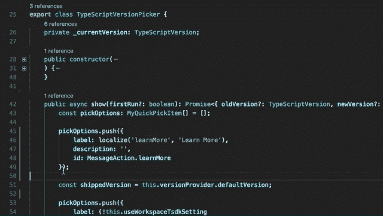
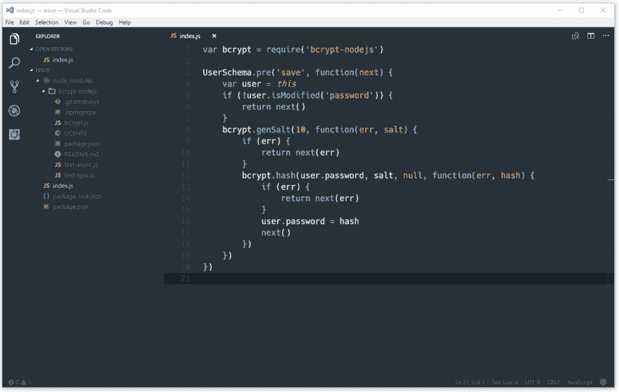
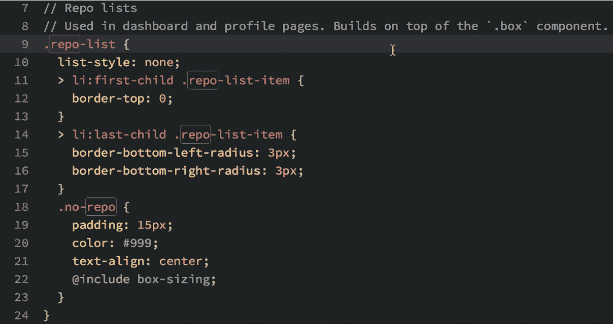
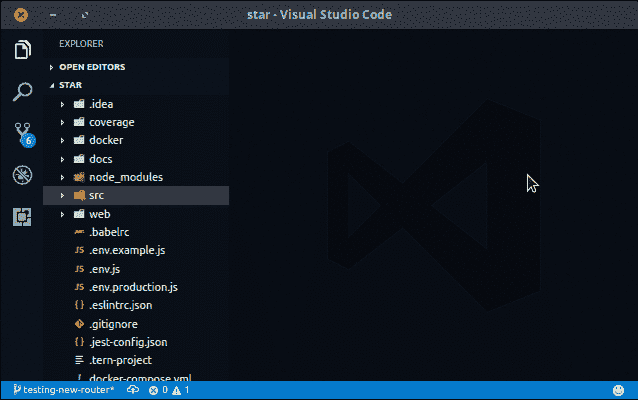

# 每个开发人员都应该知道的 39 个简单的键盘快捷键

> 原文：<https://dev.to/chris_bertrand/27-no-frills-keyboard-shortcuts-every-developer-should-follow-4jd>

[编辑]过去是 27 条，现在是 39 条——由于所有的好评论，我修改了列表，增加了一些建议，感谢所有做出贡献的人。

快捷方式是开发人员可以添加到他们的全部技能中的最有成效的东西，将在他们的整个职业生涯中帮助他们。学习如何使用你的系统和工具将会提高你的工作效率，并且让浏览你所有的窗口和应用变得轻而易举。鼠标是一个很好的工具，但是如果你能更快、更有效地使用它，而你的手又不离开键盘，那么你应该这么做！

这里有一个我最常用的快捷方式的列表，你可能已经知道或使用了其中的一些，希望这里有一个你不知道！

> `Let's get moving to Shortcuts people!`

## **光标移动**

`ARROWS` -逐字符移动

`CTRL` + `ARROWS` -逐字移动

`HOME` -转至该行的第一个字符

`END` -转到该行的最后一个字符

`CTRL + HOME` -转到文件的开头

`CTRL + END` -转到文件的结尾

`SHIFT + Cursor Movement` -如上移动，但选择文本。

## **通用 Windows 快捷键**

这些是特定于 Windows 的通用快捷方式，这些是你每天都会用到的东西，所以要习惯它们，并且尽可能地使用它们。

* * *

`Ctrl + C` - **C** opy - `CTRL + INS`

`Ctrl + V` -粘贴- `SHIFT + DEL`

`Ctrl + S` -保存- `SHIFT + INS`

[T2】](https://res.cloudinary.com/practicaldev/image/fetch/s--k4m9QdT5--/c_limit%2Cf_auto%2Cfl_progressive%2Cq_66%2Cw_880/https://media1.tenor.cimg/ac226cfe289a96e242f146a304bf95ba/tenor.gif%3Fitemid%3D5315333)

* * *

`Ctrl + Z` - Undo

`Ctrl + Y`准备好了吗

[T2】](https://res.cloudinary.com/practicaldev/image/fetch/s--b4_vDCnz--/c_limit%2Cf_auto%2Cfl_progressive%2Cq_66%2Cw_880/https://raw.githubusercontent.com/t9md/t9md/19e4086ce7f16bd802fd8ec609b422a45a05f8db/img/vim-mode-plus/flash-undo-redo.gif)

* * *

`Ctrl + F` -在窗口/应用程序中查找

* * *

最小化所有窗口，转到桌面。

`Windows + Up Arrow` -最大化当前窗口/应用

`Windows + Left/ Right Arrow` -将当前窗口/应用移动到下一个屏幕的左侧/右侧。

[T2】](https://res.cloudinary.com/practicaldev/image/fetch/s--xj1tXTUY--/c_limit%2Cf_auto%2Cfl_progressive%2Cq_66%2Cw_880/https://i.imgur.com/4dSv0jH.gif)

* * *

`Alt +Tab` -窗口标签移动

`Shift + Alt + Tab` -反转窗口标签移动

[T2】](https://res.cloudinary.com/practicaldev/image/fetch/s--pdgvX-kA--/c_limit%2Cf_auto%2Cfl_progressive%2Cq_66%2Cw_880/https://media0.giphy.com/media/3o6Ei2yv8fqpR3nJG8/giphy-preview.gif)

* * *

`Ctrl + Tab` -应用标签移动

`Shift + Ctrl + Tab` -反向应用标签移动

正如你所看到的，在上面两个例子中，shift 键，`SHIFTS`tab 键的方向！这样想的话真的很直观！

[T2】](https://res.cloudinary.com/practicaldev/image/fetch/s--AIvUCqqe--/c_limit%2Cf_auto%2Cfl_progressive%2Cq_66%2Cw_880/https://cloud.addictivetips.com/wp-content/uploads/2016/04/tab-cycle.gif)

* * *

`Ctrl + Arrow` -将光标移至下一个特殊字符或空格。

`Ctrl + Shift + Arrow` -移动光标到下一个特殊字符或空格，`and highlight.`

[T2】](https://res.cloudinary.com/practicaldev/image/fetch/s--UT-Me8Fr--/c_limit%2Cf_auto%2Cfl_progressive%2Cq_66%2Cw_880/http://www.typingspeedtests.nimg/typing-speed-tests-practice.gif)

* * *

## **IDE 快捷键(VSCode)**

下面是一个包含在 VSCode 中的快捷方式列表——大多数 IDE 都有配置快捷方式的选项，所以如果你使用其他的东西，试着设置一下吧！

[T2】](https://res.cloudinary.com/practicaldev/image/fetch/s--AXPRI90N--/c_limit%2Cf_auto%2Cfl_progressive%2Cq_auto%2Cw_880/https://i1.wp.com/www.marcobeltempo.com/wp-content/uploads/2017/09/visual_studio_code_banner_resized.png%3Fresize%3D1025%252C266)

`Alt + Left Arrow` -返回-上一个光标位置，这可能在不同的文件中。

`Alt + Right Arrow` -前进-最后光标位置`other way!` 你是不是走得太远了？别担心，撤销你的撤销！

* * *

`Ctrl + Shift + F` -在所有文件中查找

`Really useful if GoTo Definition is not working, or you're looking for a String!`

* * *

`Ctrl + K + C` - **C** 注释

`Ctrl + K + U` - **Un** comment

`Ctrl + /` -注释切换

[T2】](https://res.cloudinary.com/practicaldev/image/fetch/s--19M4Y9-m--/c_limit%2Cf_auto%2Cfl_progressive%2Cq_66%2Cw_880/http://joakimysland.com/wp-content/uploads/2015/05/vs_toggle_commenting.gif)

* * *

`Alt + Shift + Up Arrow` -复制上面的行

`Alt + Shift + Down Arrow` -下面重复一行

* * *

`Ctrl + Shift + R` -重构

[T2】](https://res.cloudinary.com/practicaldev/image/fetch/s--OmYsAkto--/c_limit%2Cf_auto%2Cfl_progressive%2Cq_66%2Cw_880/https://code.visualstudio.com/assets/docs/editor/refactoring/ts-extract-local.gif)

* * *

`F12` -转到定义

这将节省你很多时间，如果你的代码库是一个庞大的庞然大物，那么这将非常方便。

[T2】](https://res.cloudinary.com/practicaldev/image/fetch/s--h7QVUVxg--/c_limit%2Cf_auto%2Cfl_progressive%2Cq_66%2Cw_880/https://user-images.githubusercontent.com/20873402/27774345-75d635c8-5f45-11e7-9ea1-b17a3c8da345.gif)

* * *

`F2` -重命名

这将会重命名你使用的任何变量的所有实例，这不会替换文本字符串或注释，**只是变量声明。**

`Ctrl + D` -多光标，选择下一个事件

`Ctrl + Shift + L` -多光标，选择文件中的全部

[T2】](https://camo.githubusercontent.com/fc051d3b31b546d0ccdcb66e3bab78f084225b8e/68747470733a2f2f662e636c6f75642e6769746875622e636f6d2f6173736574732f3239363433322f313835303239312f38613230343664632d373663632d313165332d396237392d3530653062323938663265642e676966)

`Ctrl + P` -快速查找-文件等

[T2】](https://res.cloudinary.com/practicaldev/image/fetch/s--LodHYhAZ--/c_limit%2Cf_auto%2Cfl_progressive%2Cq_66%2Cw_880/https://cdn-images-1.medium.com/max/1600/1%2ArmalZkfRK8jeC5s7yf6spQ.gif)

* * *

## **浏览器快捷方式。**

`Ctrl + Shift + t` -在浏览器中打开先前关闭的标签页！

* * *

**我们都努力成为键盘忍者！**

[T2】](https://res.cloudinary.com/practicaldev/image/fetch/s--ng3Gn35x--/c_limit%2Cf_auto%2Cfl_progressive%2Cq_auto%2Cw_880/http://www.seejenwrite.com/blog/wp-content/uploads/2015/03/ninja-04-desk.jpg)

你有其他我们应该使用的键盘快捷键吗？