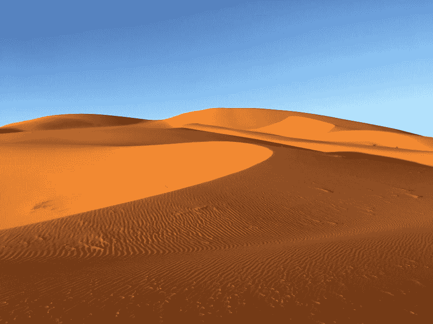

# 改善旅行体验的 3 个秘密

> 原文：<https://dev.to/preciselyalyss/3-secrets-to-improve-your-travel-experience-ih4>

在二十多年的旅行中，我打包了数百次行李，飞行了数十万英里。在所有这些无 WiFi 的航班中，我有时间反复思考我的旅行策略(如果你能把随意计划称为策略的话)。

如果你正在寻找方法来改善你的飞机旅行体验，我已经把我最喜欢的建议强加给不知情的朋友和同事，比如如何更好地利用你的行李箱，避免电子电缆的老鼠窝，以及如何在长途飞行后看起来精神焕发(和有水分)。

## 收拾得好像你要再做一次一样

打包是旅行中不可避免的麻烦。无论你是在起飞前两小时打包行李，还是在起飞前两天带着清单打包，你都可以在自己的旅行装备中增加一些东西来改善自己的体验。

### 包装立方体练习

我经历过的最好的包装改进与包本身没有什么关系。如果你没有从这篇文章中得到任何东西，那就给自己买一些包装立方体吧。我的第一次购买是为了 Wirecutter 的顶级推荐，鹰溪 Pack-It cube set。在我的另一半征用了这些之后，我升级到了 Eagle Creek 的 Pack-It Specter 压缩立方体套装。我的大部分服装最后都放在全尺寸的立方体里。我发现半立方体非常适合内衣、袜子和胸罩。我很少发现四分之一立方有用，所以我把它放在外面或者用来放化妆品。

一旦你在酒店开始拆包，包装立方体真的会大放异彩。找到你想要的衬衫不再需要打开半个行李箱。重新打包是一件轻而易举的事，因为你要把方块放回你的行李箱中，而不是重新折叠并找出你最初想出的俄罗斯方块解决方案。

包装立方体也不仅仅是为了你的行李箱。我在随身行李里放了一个，还有备用的换洗衣服和一件连帽衫。如果你的包丢了或者飞机很冷，那么你就有了一天所需的一切。

### “请收起所有大型电子设备……”

你的随身行李中有多少电子设备？可能是一个交换机(外加游戏)，一个 kindle，一台笔记本电脑，还有蓝牙耳机。如果你的经历和我一样，在登机前的最后一个小时，你会开着 kindle 搜索 wifi，或者通过阅读手机上的 reddit 来娱乐自己。现在你面临着 3 个多小时的飞机旅行，没有无线网络，没有坏的或即将报废的设备，是时候解开你背包底部的大量电缆了。

忘记吧。那个。从给自己买一个线缆管理器开始。从你的手提行李里拿进拿出来要容易得多。当你这样做的时候，买一个备用电池。飞机上的大多数 USB 端口输出 0.5 安培，但许多手机使用某种形式的快速充电，需要 2 安培或更多。另外，[你不知道那个 USB 一直在哪里](https://lifehacker.com/make-your-own-usb-condom-for-added-security-when-char-1751213671)。

## 如果你正在读这篇文章，喝点水吧

[T2】](https://res.cloudinary.com/practicaldev/image/fetch/s--ezLLikca--/c_limit%2Cf_auto%2Cfl_progressive%2Cq_auto%2Cw_880/https://thepracticaldev.s3.amazonaws.com/i/b37qf2k7kozgactyqwhy.jpg)

不管是一小时的短途飞行还是 18 小时的跨太平洋飞行，飞机都会让每个人脱水。有了气候控制，飞机上的相对湿度可以低至 4%。波音 787 和空客 A350 可以达到 10-15%(或更多)。通过用碳纤维替换一些金属部件，它们可以支持更大的湿度，而不会因腐蚀而缩短飞机的寿命。尽管如此，10-15%的相对湿度仍然比撒哈拉沙漠要干燥。

### 减少&重用

走进美国的任何一个机场，你肯定会看到一瓶 20 盎司的水，售价为 2.5 美元或更高。如果你经过芝加哥的奥黑尔，它更接近 3.40 美元。别担心，你不会为此付钱的。花 9-15 美元，可以得到一个[可折叠水瓶](https://www.amazon.com/Platypus-DuoLock-SoftBottle-Collapsible-Bottle/dp/B078JVYKKH/)。带着它通过安检，把它装进你的包里，或者夹在一根带子上。

越来越多的机场有瓶装站。登机前顺便去一趟，在飞机上尽量避免咖啡因/酒精饮料。对于长途旅行，你可能需要第二个水瓶，或者你可以和乘务员交朋友。

### 经皮失水或“为什么你需要平面护肤程序。”

还记得飞机上微不足道的湿度吗？你的皮肤讨厌它。经皮失水(TEWL)是指水分从真皮穿过表皮，从皮肤表面蒸发。低湿度条件增加了我们的皮肤通过 TEWL 失去水分的速度。基本上，你下了飞机，看起来就像你感觉到的时差一样。

解决这一问题的最佳方法是结合使用湿润剂(水合剂)和封闭剂(防潮剂)。我不会深究护肤科学的本质，但这里有一些建议，你可以在下次飞行时随身携带:

水合器

*   [普通的天然保湿因子+透明质酸](https://theordinary.com/product/rdn-natural-moisturizing-factors-ha-30ml)，5.80 美元+运费

防潮密封

*   凡士林
*   乳木果油

结合

*   [书房蜂蜜蜂蜡霜](https://www.etudehouse.com/int/en/index.php/skincare/cream/etude-house-honey-cera-cream.html)，24 美元+运费
*   [Cerave 愈合软膏，含透明质酸和神经酰胺](https://www.amazon.com/CeraVe-Ointment-Hyaluronic-Ceramides-Protecting/dp/B016F3MESG?th=1)，8.50 美元+运费

## 旅行更快乐！

徒步穿越机场，通过安检，进入一个新的城市是令人兴奋和疲惫的。一些有意识的包含可以提高体验的质量。对于你的下一个假期，家庭团聚，或商务旅行，尝试我的建议，然后坐下来享受。