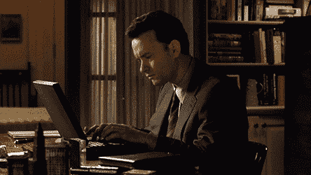
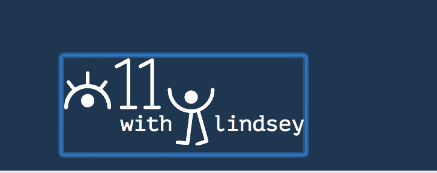
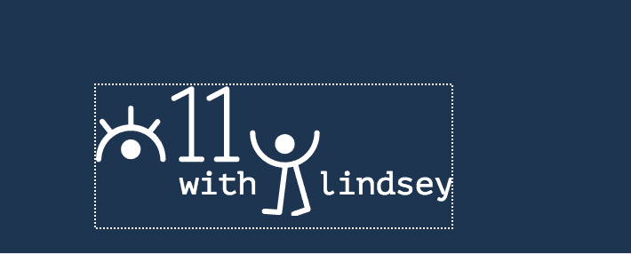
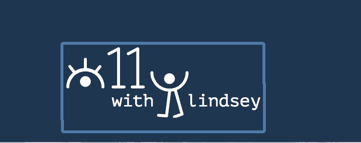
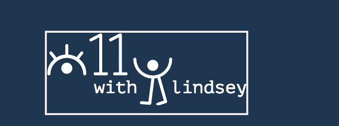

# 提高键盘可访问性的 3 个简单技巧

> 原文：<https://dev.to/lkopacz/3-simple-tips-to-improve-keyboard-accessibility-5hc8>

我想写一篇关于我最喜欢的可访问性主题之一的博文——键盘可访问性！我甚至没有尝试就测试了这么多，因为作为一名开发人员，我经常使用键盘。我用它在应用程序中导航，在网页中导航，在浏览器上滚动浏览我的数百万个标签页(还有谁对此感到内疚呢，哈哈)。

[T2】](https://i.giphy.com/media/LPn77YyDIqfhm/giphy.gif)

## 什么是键盘辅助功能

键盘可访问性确保您在任何给定时间都不会 100%依赖鼠标。这意味着您可以使用键盘浏览网页。你试过吗？我现在非常习惯使用键盘来导航，因为我讨厌使用鼠标，但当我听到技术人员和非技术人员都震惊地看着我时，我总是感到震惊，因为他们没有想到你实际上可以使用键盘来导航页面。

除了我喜欢使用键盘，为什么这对于可访问性很重要？有些人患有运动性震颤，这使得肌肉控制困难。有些人几乎不能使用他们的手。盲人经常结合他们的屏幕阅读器使用键盘。即使是那些不得不使用更先进的辅助技术的人，他们中的大多数也只是模仿普通键盘的功能。因此，这意味着让我们的网站和应用程序可以通过键盘访问，可以解决各种各样的可访问性问题！而且如果你想的够早，不要太乱来，这通常是一个很好玩的过程！

## 技巧 1:停止使用 divs，使用语义 HTML

我见过很多人创建设计精美的交互式应用程序。我点击一个别致的汉堡图标，菜单漂亮地出现，屏幕上方有一个微妙的动画。我转到博客页面，开始使用选择列表过滤主题。选择列表有一个干净优雅的 a 下拉菜单。然后我试着用我的`tab`键…

怎么回事？我的焦点指示器正好经过汉堡包图标。这是否意味着我不能打开菜单？有没有我不知道的另一种打开菜单的方法？我去那个奇特的选择列表找一个主题，但是我甚至不能打开它。想象一下，如果你真的依赖你的键盘，你会有什么感觉？写这篇文章的时候，我正在大发雷霆，因为当人们没有注意到这一点时，这让我很生气。谢谢你听我的演讲。

为什么这些项目在我们的键盘上不起作用？让我们来看看这个菜单 HTML。

```
<div class="hamburger-menu">
  <span class="line"></span>
  <span class="line"></span>
  <span class="line"></span>
</div>
<nav>
  <ul>
    <li><a href="#">Item 1</a></li>
    <li><a href="#">Item 2</a></li>
    <li><a href="#">Item 3</a></li>
  </ul>
</nav> 
```

为什么这不是实现可访问性的最佳方式呢？因为一种叫 tabindex 的东西。tabindex 最简单的定义是定义项目是否是可聚焦的，而不会变得过于复杂。可聚焦是什么意思？这意味着你可以用键盘访问它！

Tabindexes 采用整数值。然而，为了简单起见，也为了介绍最佳实践，我们将把它缩小到两个最常用的值:`0`和`-1`。开门见山，`0` =可聚焦，`-1` =不可聚焦。

默认情况下，在所有浏览器中，链接、按钮和表单元素都是可聚焦的。这意味着他们的 tabindex 是 0。div 的默认 tabindex 是什么？你能根据我无法集中注意力来猜测一下吗？

PSA:当你试图在不调整 tabindex 的情况下制作一个`<div>`类似于按钮的东西时，键盘将无法访问它。默认情况下，它也不会在屏幕阅读器上很好地显示，即使你给它一个`tabindex="0"`。你最好使用 HTML 的定义方式，把汉堡菜单做成一个`<button>`元素。大多数人不喜欢这样做，因为按钮的默认浏览器样式。但是你猜怎么着？你可以用 CSS 解决这个问题！双赢！另一个好处是，由于按钮的默认行为和事件监听器，你不必像按钮那样去破解一个 div 来准确地执行**动作**。

这就是我如何重新格式化上面的 HTML(见下面与`.visually-hidden` :
相关的 CSS)

```
<button class="hamburger-menu">
  <span class="line"></span>
  <span class="line"></span>
  <span class="line"></span>
  <span class="visually-hidden">Menu</span>
</button>
<nav>
  <ul>
    <li><a href="#">Item 1</a></li>
    <li><a href="#">Item 2</a></li>
    <li><a href="#">Item 3</a></li>
  </ul>
</nav> 
```

## 提示 2:始终提供一个跳过主导航的选项

因为我在这里完全是关于同理心的，所以让我们从人类的角度来谈谈这意味着什么。想象一下你因为某种原因无法使用鼠标。你第一次来到一个网站，想浏览一下导航，看看你想去哪里。你用键盘找到这个页面。

想象一下，当您只想浏览内容时，到达页面却不得不再次浏览整个导航。这对于我的菜单来说可能没什么大不了的，它只有 3 个链接。但是让我们现实一点，网上到处都是超级菜单！如果这些巨大的菜单甚至是可访问的(哈哈哈只是让你知道，他们中的许多人是不可访问的)，这听起来就像一个痛苦的屁股。

解决这个问题的方法非常简单。HTML 中`<body>`标签下的第一个元素应该是一个“跳转到主要内容”的链接`href`值应该是一个匹配主包装器 id 的书签值。以下是我在目前的博客中的做法:

```
<a class="focusable visually-hidden" href="#main-content">Skip to main content</a>
...
<nav class="menu-main">
  <ul class="menu">
    <li class="menu-item"><a href="/about">About</a></li>
    <li class="menu-item"><a href="/blog">Blog</a></li>
    <li class="menu-item"><a href="/contact">Contact</a></li>
  </ul>
</nav>
...
<main id="main-content">
...
</main> 
```

正如您在这里看到的，href 值是`#main-content`，它与`<main>`元素的 id 相匹配。这使得如果有人点击这个链接，他们会直接进入主要内容区域，而不是在整个导航中使用 tab 键。这也有助于那些已经熟悉这个网站的人，或者那些从其他来源点击链接到你的网站的人。

我在我的网站上做的一些事情是只显示链接，如果你已经关注它。这样，它只会在你第一次按 tab 键时出现。这是我关联了`.focusable`和`.visually-hidden`的 CSS:

```
.visually-hidden {
  position: absolute;
  left: -10000px;
  top: auto;
  width: 1px;
  height: 1px;
  overflow: hidden;
}

.focusable.visually-hidden:focus {
  position: relative;
  left: 0;
  width: auto;
  height: auto;
  overflow: auto;
} 
```

在你的网站上实现这个应该很简单。你甚至可以将我的链接的 HTML 和类复制粘贴到你的 CSS 中。

## 提示 3:不要移除焦点指示器

什么是聚焦指示器？默认情况下，它们通常是 tabindex 为 0 的元素周围的浏览器特定轮廓。在谷歌浏览器中，默认焦点是这样的:

[T2】](https://res.cloudinary.com/practicaldev/image/fetch/s--TKt7x_20--/c_limit%2Cf_auto%2Cfl_progressive%2Cq_auto%2Cw_880/https://www.a11ywithlindsey.com/static/Logo-Chrome-00a19e31fdbb30438d017b9e932a04a3-eb6f9.png)

在 Firefox 中，默认焦点是这样的:

[T2】](https://res.cloudinary.com/practicaldev/image/fetch/s--mzKmIQ-6--/c_limit%2Cf_auto%2Cfl_progressive%2Cq_auto%2Cw_880/https://www.a11ywithlindsey.com/static/Logo-Firefox-bb6a4780e03260ef04991d1b6ef886c4-edb60.png)

在 Safari 中，默认焦点如下所示:

[T2】](https://res.cloudinary.com/practicaldev/image/fetch/s--DmiyKpoa--/c_limit%2Cf_auto%2Cfl_progressive%2Cq_auto%2Cw_880/https://www.a11ywithlindsey.com/static/Logo-Safari-72bbc2dfd7b2ed70ab8fa1b1bedec52a-93174.png)

不要因为你的设计师认为焦点指示器难看就把它去掉，你可以设计高对比度的指示器，让它在你的网站上更有品牌效应。我是这样做的:

[T2】](https://res.cloudinary.com/practicaldev/image/fetch/s--vvhqW-xU--/c_limit%2Cf_auto%2Cfl_progressive%2Cq_auto%2Cw_880/https://www.a11ywithlindsey.com/static/Logo-updated-focus-3e8209db453a58d6aeec972d061de83e-d6865.png)

无论你做什么，请不要在你的 CSS 中写`outline: none;`。谢谢你来听我的 TED 演讲。

我希望这些提示能帮助您开始使用键盘辅助功能。如果您有任何问题，请随时通过 [Twitter](https://twitter.com/littlekope0903) 联系我。如果你想听更多我的意见和我对可访问性的看法，如果你[订阅我的双周刊简讯](http://eepurl.com/dy1USP)，我会很高兴。