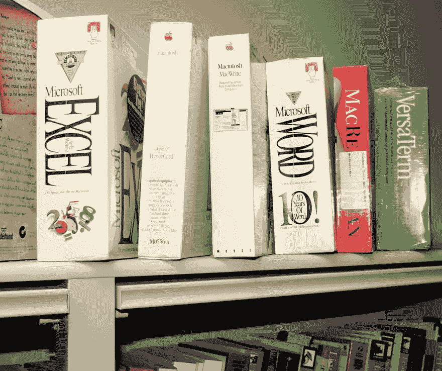
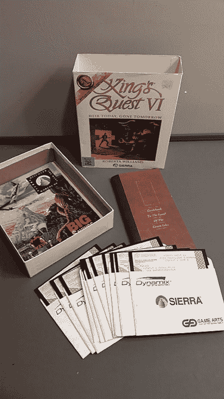
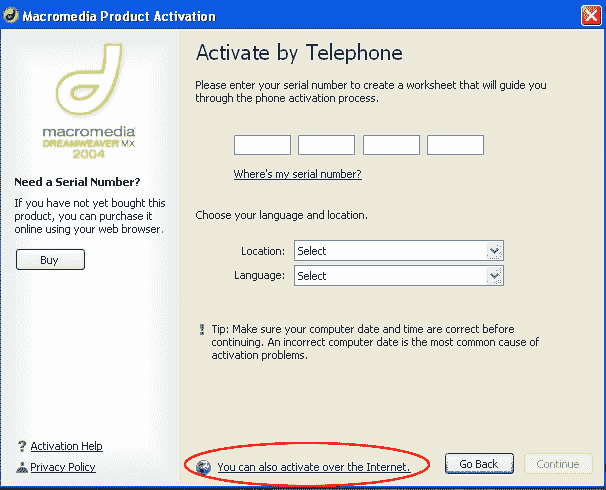
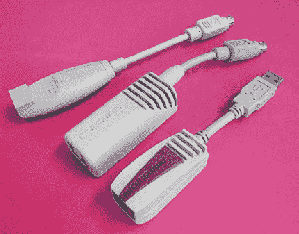
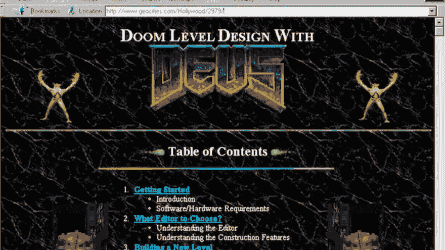
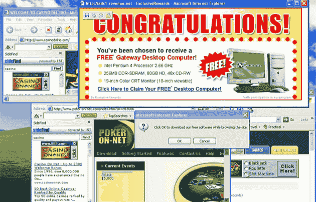

# 开发人员认为理所当然的 4 件事，过去确实很难

> 原文：<https://dev.to/remotesynth/4-things-developers-take-for-granted-that-used-to-be-really-hard-2fd3>

作为软件开发人员，我们喜欢抱怨。在开发办公室呆上几个小时，你肯定会听到糟糕的文档、糟糕的错误处理，以及前一个开发人员是多么的糟糕。

尽管这些都是真实的问题，但偶尔退一步想想我们已经走了多远还是有好处的。因为，尽管我们今天处理的问题看起来很难，但从时间的角度来看，这些烦恼都很奇怪。

这篇文章是一篇充满怀旧情绪的指南，介绍了过去 20 年软件开发中一些您已经忘记或从未经历过的进步。本次旅程的作者是布莱恩·里纳尔迪(Brian Rinaldi)，他已经老到足以记得 IE6 被认为很棒的时候(因为它取代了网景 4.5.2)，以及 TJ·万托尔(TJ VanToll)，他的职业生涯开始帮助其他人向 Geocities 网站添加背景音乐。你会得到很好的照顾。

> **注意:** **不客气(鼓励！)在评论中贡献你自己的故事，尤其是如果你比你的作者更有经验的话。**

## 事情#1:实际获得软件

在我们那个时代，如果你想要软件，你必须钻进汽车，开到商店，从货架上买下来。

 
*我们曾经兴奋地购买这种东西*
*来源:*[*cogdogblog*](https://www.flickr.com/photos/cogdog/116957071/)*【CC0】，via Wikimedia Commons*

如果你真的像布莱恩一样老了，你会记得软件出现在软盘上的日子。你必须按正确的顺序装入每个磁盘来安装软件。

 
*任务进行到一半就把这个东西给装上了*
*来源:[http://retro thrifter . com/product/kings-quest-6-VI-adventure-retro-game-IBM-5-25-floppy-disk-big-box-1992/#&GID = 1&PID = 1](http://retrothrifter.com/product/kings-quest-6-vi-adventure-retro-game-ibm-5-25-floppy-disk-big-box-1992/#&gid=1&pid=1)*

或者也许你足够幸运，只记得那个软件是什么时候出现在 CD 上，或者，但愿不会，DVD 上。

软件也很贵！2002 年 Dreamweaver Ultradev 的完整盒装版售价为 599 美元。2004 年的 Flash MX 也是[，599 美元](https://www.cnet.com/products/macromedia-flash-mx-2004/prices/)。

软件的高成本和共享物理磁盘的便利性意味着反盗版措施往往难以承受。

 
*我这里都不知道从何说起*
*来源:*[https://helpx . adobe . com/x-product kb/policy-pricing/macromedia-legacy-activation-error . html](https://helpx.adobe.com/x-productkb/policy-pricing/macromedia-legacy-activation-error.html)

好像通过电话激活还不够，QuarkXPress 这样的软件实际上需要你在电脑上安装一个物理硬件加密狗才能运行。是的，年轻人，你没看错！

 
*加分如果你知道排名前两位的加密狗需要哪个端口*
*来源:[https://www . planet quark . com/2017/06/14/is-a-subscription-basic-a-dongle/# . w4 bijznkh-U](https://www.planetquark.com/2017/06/14/is-a-subscription-basically-a-dongle/#.W4BiJZNKh-U)*

现在很难找到你在网上找不到的软件。

所以，当然，今天你经常被永久的软件订阅所困扰，但是我们仍然有很长的路要走。

## 事情二:网站托管

当年虚拟主机最大的问题是它贵得吓人。仅仅是基本的虚拟主机服务就可能让你每月花费 30-50 美元。想要一个数据库？嗯，一个 SQL Server 或者 MySQL 数据库可能价格会翻倍。想要 SSL？那是另一个月费，另外你需要买一个证书。哦，你想安装那个证书？要做到这一点，你需要一个密码学博士学位。

*Brian 在 2003 年阅读 Apache 关于安装 SSL 证书的文档的实际片段*

像 Geocities 和 Angelfire 这样的网站在当时非常成功，因为它们提供免费的虚拟主机，这在当时是闻所未闻的，并且允许开发者与世界分享他们的标签、布局和令人惊叹的设计。 

 
*想象一下在 IE 5 中自动播放厄运音乐的感觉有多好。*
*来源:互联网档案馆:[https://web . Archive . org/web/*/http://www . geocities . com:80/Hollywood/2979/](https://web.archive.org/web/*/http://www.geocities.com:80/Hollywood/2979/)*

当然，天下没有免费的午餐。Geocities 的自动注入广告、冗长的网址和猖獗的弹出窗口(记住这些)确保了任何开发专业网站的人都需要把钱投入到更昂贵的解决方案中。

 
*没错小朋友们，以前的网站打开整个窗口都要像动物一样手动关闭*
*来源:[https://www . engadget . com/2014/08/14/the-creator-of-the-pop-up-ad-says-sorry/](https://www.engadget.com/2014/08/14/the-creator-of-the-pop-up-ad-says-sorry/)*

如今基本的免费虚拟主机是一个既定的。有了 GitHub Pages，你可以在几分钟内建立一个网站，像 T2 Netlify 这样的服务甚至提供免费的 SSL 证书，你不必自己安装。说到 GitHub，我们构建软件的方式还有一个巨大的变化，我们必须讨论一下。

## 事情三:版本控制

如果你在 90 年代末或 2000 年代初编写软件，你有 100%的机会讲述你使用过的一些可怕的专有版本控制软件的故事。或者，可能像我们许多人一样，您甚至没有使用版本控制。

例如，如果你像 TJ 一样，你记得使用一个外部硬盘作为“版本控制”，并向你选择的神祈祷硬盘永远不会被需要。另一方面，Brian 回忆起以前几个角色的“官方”版本控制，包括用“.”重命名文件。文件名中有旧的或旧的。它可能看起来像是 Gwen Lofman 的演示中的例子:

 
*是的，我们都做过。*

不用说，这些方法并不理想。事实是，直到最近，合法的版本控制可能是免费的，但并不容易(如 CVS，SVN)，或者既不是免费的，也不容易(Visual SourceSafe)。

学习使用这些工具通常需要相当大的努力。糟糕的合并冲突处理可能会使您的代码看起来像这样:

 
*这里有些不太对劲*
*来源:[https://redfin . engineering/visualize-merge-history-with-git-log-graph-first-parent-and-no-merges-c 6 a9 b5 ff 109 c](https://redfin.engineering/visualize-merge-history-with-git-log-graph-first-parent-and-no-merges-c6a9b5ff109c)*

见鬼，即使在 Git 的早期，它也有一个陡峭的学习曲线。

GitHub 的出现(以及其他解决方案，例如 [BitBucket](https://bitbucket.org/) 和 [GitLab](https://about.gitlab.com/) )确实改变了一切。他们承担了建立版本控制库的大量初始工作，并使之变得简单易行。

## 事情四:开源

在今天这个时代，很难记得就在 10-20 年前，开发人员使用的大多数代码都是闭源的。这不仅限于操作系统、应用服务器、数据库或桌面应用程序。想要一个留言板吗？拿出你的钱包。想要一个简单的 CMS？准备付钱吧。想要一个简单的富文本编辑器吗？那会让你付出代价。

这影响的不仅仅是软件的成本。比如，碰到一个问题？也许有一个地方你可以在线报告这个错误。也许你只是祈祷明年的版本会修复这个 bug。

 
*来源:[https://devrant.com/rants/1314645/bring-the-funny](https://devrant.com/rants/1314645/bring-the-funny)*

另一件今天很难想象的事情是，许多人对开源持彻底的怀疑态度。比如说…

> 事实上，自由/开源软件经常是半成品免费软件的配方，这些免费软件取代了好的软件，因为它们是免费的，但是它们继续通过充满需要“支持”(即你的时间或金钱)来修复的错误来占用每个人的时间。
> 
> 马克·塔弗博士，开源的问题

微软经常站在最前沿的公司激烈地反对开源。今天的微软是开源软件最大的贡献者之一，甚至拥有 GitHub。事实上，开源在开发人员的工作流程中无处不在，以至于开发人员往往倾向于认为自由开源许可是理所当然的(是的，[这是个坏主意](https://www.remotesynthesis.com/blog/developers-and-licenses))。是的，我认为这意味着开源取得了胜利。

## 包装完毕

无论是开源、版本控制、虚拟主机，还是我们实际获取软件的方式，在过去的 20 年里，很多东西都变得更好了。在这篇文章中，我们看到了你的作者所欣赏的一些变化，但是当然我们只是触及了技术世界进步的表面。

如果你想给这个列表贡献你自己的东西，请在评论中告诉我们🙂