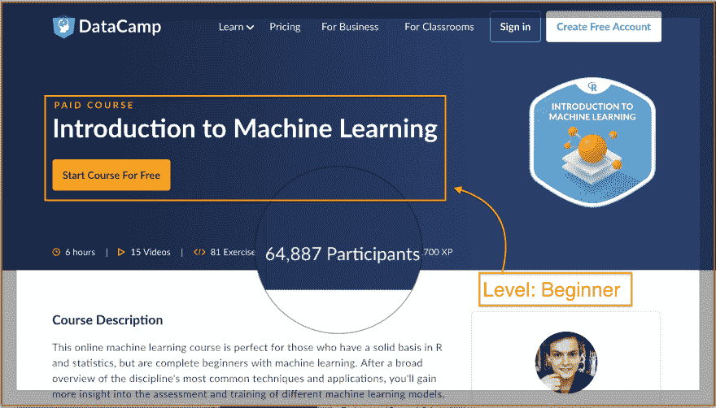

# 来自世界级教育家/讲师的 5 门最佳机器学习课程。

> 原文：<https://dev.to/sinxloud/5-best-machine-learning-courses-and-tutorials--5b1c>

对机器学习工程师和研究科学家的需求正在激增。我与我的同事和课程提供者一起付出了巨大的努力，来编写这本[最佳机器学习课程](https://sinxloud.com/machine-learning-tutorial-courses-specialization-beginner/) ( ⬅最初发表在这里)和专业化的汇编，一个有上进心的人可以将它作为在机器学习领域获得回报和利润丰厚的职业生涯的**跳板**。

如果你是一个初学者，我已经让你在这篇关于 2019 年使用 Python 进行 [机器学习的**初学者指南的文章中得到涵盖。**](https://sinxloud.com/best-machine-learning-python-course-beginner-learn/)

***首先，我想强调数学对于机器学习来说非常重要，所以如果你需要掌握基础知识或高级概念，我会在这篇关于[机器学习数学的文章中为你提供帮助](https://sinxloud.com/mathematics-machine-learning-data-science-courses/)。***

## **5+最好的机器学习课程和教程。**

### 1。[机器学习工程职业轨迹](https://www.springboard.com/workshops/ai-machine-learning-career-track/?utm_source=devto&utm_medium=article&utm_campaign=aic) —工作保障

这个强化的机器学习工程职业轨道——第一个有**工作保证**的轨道——将让你能够过渡到一个机器学习工程师的角色。广泛的课程由在 Airbnb 和英特尔等公司工作过的机器学习专家策划。

在课程结束时，您将设计一个机器学习系统，构建一个原型，并部署一个可以通过 API 或 web 服务访问的应用程序。

#### [你会学到什么？](https://sinxloud.com/machine-learning-tutorial-courses-specialization-beginner/#-ai-machine-learning-career-track-job-guarantee)

[T2】](https://res.cloudinary.com/practicaldev/image/fetch/s--nJqOkY-F--/c_limit%2Cf_auto%2Cfl_progressive%2Cq_auto%2Cw_880/https://thepracticaldev.s3.amazonaws.com/i/uh150vgocqoq4joljym5.png)

##### 适合你吗？

这个**AI/机器学习职业轨迹**是为有软件工程背景的人设计的。这是一个自我指导的**导师引导的**，以职业为中心的训练营，并有工作保证。如果你在毕业后的 6 个月内没有找到一份**的工作，你将收到学费退款**。****

 **转到[课程](https://www.springboard.com/workshops/ai-machine-learning-career-track/?utm_source=devto&utm_medium=article&utm_campaign=aic)

* * *

### 2。[斯坦福大学提供的机器学习](https://sinxloud.com/fly/machine-learning-by-andrew-ng-stanford-coursera/)——强烈推荐

这是互联网上关于机器学习的最好和强烈推荐的课程之一。由人工智能先驱 Coursera 联合创始人吴恩达创建，落地 AI，斯坦福大学兼职教授。

在本课程中，您将了解最有效的机器学习技术，并获得实践它们并让它们为自己服务的机会。

#### [你会学到什么？](https://sinxloud.com/machine-learning-tutorial-courses-specialization-beginner/#-machine-learning-offered-by-stanford-highly-recommended)

***用户评分:81708 个评分中 5 个评分中的 4.9 个***

[T2】](https://res.cloudinary.com/practicaldev/image/fetch/s--3gCiaiqF--/c_limit%2Cf_auto%2Cfl_progressive%2Cq_auto%2Cw_880/https://thepracticaldev.s3.amazonaws.com/i/i90lnppu5p2bon20cvuh.png)

##### 适合你吗？

对于初学者来说，本课程是理解教计算机在没有明确编程的情况下使用数据学习概念的核心思想的最佳场所。本课程深入介绍机器学习，帮助您理解统计建模，并讨论应用机器学习的最佳实践。

转到[课程](https://sinxloud.com/fly/machine-learning-by-andrew-ng-stanford-coursera/)

* * *

### 3。[用 R 介绍机器学习](https://www.datacamp.com/courses/introduction-to-machine-learning-with-r/?tap_a=5644-dce66f&tap_s=384177-0102f2) - (DataCamp)

DataCamp 的这门课程将帮助您学习机器学习的真正基础，并尝试相关技术。由拥有人工智能硕士学位的 DataCamp 讲师 Vincent Vankrunkelsven 和拥有基础数学学位和扎实的经典统计背景的博士生 Gilles Inghelbrecht 创建。

本课程将帮助您在不同机器学习模型的训练中获得牢固的理解，并学习三个最基本的机器学习任务:分类、回归和聚类。

#### [你会学到什么？](https://sinxloud.com/machine-learning-tutorial-courses-specialization-beginner/#-introduction-to-machine-learning-with-r-highly-recommended)

[T2】](https://res.cloudinary.com/practicaldev/image/fetch/s--6KyrdBOE--/c_limit%2Cf_auto%2Cfl_progressive%2Cq_auto%2Cw_880/https://thepracticaldev.s3.amazonaws.com/i/k3nfmwtbodmslcco0xm5.png)

##### 适合你吗？

DataCamp 是一个时间灵活的在线数据科学学习平台，提供数据科学、机器学习人工智能等方面的教程和课程。本课程面向任何在统计学和 R 编程方面有扎实基础的人。本课程结束时，你将对所有主要原则有一个基本的了解。

转到[课程](https://www.datacamp.com/courses/introduction-to-machine-learning-with-r/?tap_a=5644-dce66f&tap_s=384177-0102f2)

* * *

### 4。[用 Python 理解机器学习](https://sinxloud.com/fly/understanding-machine-learning-with-python-by-jerry-kurata-pluralsight/) - (Pluralsight)

这门关于使用 Python 进行机器学习的课程将使你了解使用数据预测未来事件的概念。本课程由 Jerry Kurata 创建，他是技术专家，也是 Pluralsight 和 Coursera 上机器学习和深度学习课程的畅销书作者。

在本课程中，您将学习构建预测模型，并使用 Python 通过 scikit-learn 执行监督学习。

#### [你会学到什么？](https://sinxloud.com/machine-learning-tutorial-courses-specialization-beginner/#-understanding-machine-learning-with-python)

用户评分:在 382 个评分中得到 4.9 分

[T2】](https://res.cloudinary.com/practicaldev/image/fetch/s--B2pslLhn--/c_limit%2Cf_auto%2Cfl_progressive%2Cq_auto%2Cw_880/https://thepracticaldev.s3.amazonaws.com/i/b5qvzeiqddo9npk40c8z.png)

##### 适合你吗？

如果你是机器学习新手，并且有一些 Python 编程经验，那么这篇机器学习教程非常适合你。本课程将在 sckit-learn 中磨练您的机器学习技能，sc kit-learn 是每个机器学习工程师和数据科学家都使用的最强大的 ML 库。

转到[课程](https://sinxloud.com/fly/understanding-machine-learning-with-python-by-jerry-kurata-pluralsight/)

* * *

### 5。[机器学习 A-Z:数据科学中的动手 Python&R](https://sinxloud.com/fly/machine-learning-a-z-hands-on-python-r-in-data-science-udemy/)-(Udemy)

这是互联网上评价最高的课程之一，由[基里尔·叶列缅科](https://au.linkedin.com/in/keremenko)、[哈德琳·德·庞特维斯](https://www.linkedin.com/in/hadelin-de-ponteves-1425ba5b)和[超级数据科学团队](https://www.superdatascience.com/)通过 Udemy 授课。

这个**“机器学习 A-Z”**，提供了一个很好的机器学习介绍，并教授难以理解的算法，以及如何掌握 scikit-learn 和其他几个包。

#### [你会学到什么？](https://sinxloud.com/machine-learning-tutorial-courses-specialization-beginner/#-machine-learning-a-z-hands-on-python-r-in-data-science)

[T2】](https://res.cloudinary.com/practicaldev/image/fetch/s--KIHYPqDX--/c_limit%2Cf_auto%2Cfl_progressive%2Cq_auto%2Cw_880/https://storage.googleapis.com/molten/lava/2018/10/357d8ef9-machine-learning-a-z-hands-on-python-r-in-data-science.jpg)

##### 适合你吗？

如果你是一个初学者，只有关于数据科学的 Python 基础知识(T1)或 T2 R 编程知识(T3)以及一些高中水平的数学知识，那么这门课程是激发你深入机器学习动机的绝佳场所。

转到[课程](https://sinxloud.com/fly/machine-learning-a-z-hands-on-python-r-in-data-science-udemy/)

* * *

### 9+ [来自世界级教育家/讲师的最佳机器学习课程](https://sinxloud.com/machine-learning-tutorial-courses-specialization-beginner/)。

除了本帖列出的课程，你可以查看一下这份根据学生点评、课程大纲、难度等级等整理出来的中级和[高级机器学习课程](https://sinxloud.com/machine-learning-tutorial-courses-specialization-beginner/)的汇编。

如果你负担不起一门课程的费用，可以在[免费机器课程](https://kanger.dev/learn-machine-learning-courses-tutorial-free/)上查看这篇文章。

#### 【前往 sinxLoud】

* * *

***此外，Google Cloud 正在提供两个关于使用 TensorFlow 进行[机器学习的专业，但如果你只想学习 TensorFlow，我会在这篇关于](https://sinxloud.com/google-cloud-certification-courses-specialization-training-classes/#-machine-learning-with-tensorflow-on-google-cloud-platform)[最佳 TensorFlow 课程](https://sinxloud.com/best-tensorflow-courses-beginners-experts/)的文章中为你介绍。***

这就是我们对最好的机器学习课程和教程的看法，我们希望这些能让你在机器学习领域走上快车道。

如果你喜欢这篇文章，请与你的朋友或同事分享。

我还有这份[数据科学简讯](https://landing.mailerlite.com/webforms/landing/g9o7c8)，你可能会感兴趣。我每个季度都会发一两次小邮件，介绍我发现的一些有用的资源。

别担心，我和你一样讨厌垃圾邮件。随意订阅。

###### *快乐学习！！！***