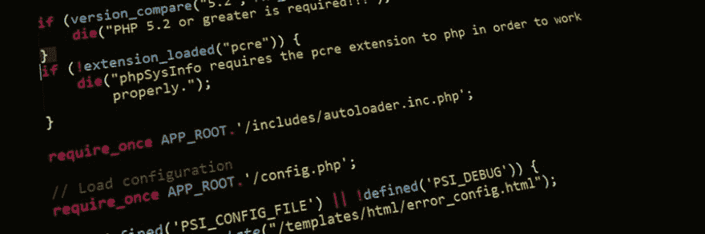

# 5 个 PHP 工具，让你的生活更愉快。

> 原文：<https://dev.to/david_j_eddy/5-php-tools-to-make-your-life-more-enjoyable-1jl1>

[T2】](https://res.cloudinary.com/practicaldev/image/fetch/s--g46-ql7L--/c_limit%2Cf_auto%2Cfl_progressive%2Cq_auto%2Cw_880/https://blog.rkl.img/b/f/f/7/2/bff72e71d58665e11e48ad802dbeddaf1d7663d9-pexels-photo-276452.jpeg)

[工具](https://en.wikipedia.org/wiki/Tool)；它们可以让你的生活变得惊人地富有成效，或者令人沮丧。在过去的十年里，我有幸使用了各种各样的工具。从 [CLI 输出解析](http://symfony.com/doc/2.0/components/console/introduction.html)到完全在 [SaaS IDE](https://aws.amazon.com/cloud9/) 上与第三方服务集成到自动代码风格修正器。有的比别人优秀，有的比别人成熟。在这里，我想与你分享我的 5 个工具。当开始一个项目时，这些工具使我的生活，就个人而言，在 PHP 的道路上愉快的行驶。

[T2】](https://res.cloudinary.com/practicaldev/image/fetch/s--IA1ws4PQ--/c_limit%2Cf_auto%2Cfl_progressive%2Cq_auto%2Cw_880/https://upload.wikimedia.org/wikipedia/en/5/5e/Xdebug-logo.png)

*   [xDebug](https://xdebug.org/)——如果你没有使用[调试器](https://en.wikipedia.org/wiki/Debugger)，请，请，请试一试。如果不是 [xDebug](https://xdebug.org/) (在我看来这是 PHP 最好的面包)那么就是其他众多面包中的一个。浪费时间。破发点是要走的路，要求步进，变量观察。这些事情节省你的时间和挫折。调试器节省了我很多时间，无论付出什么代价来感谢吴镇男·雷森斯都是值得的。毫无疑问，xDebug 是 PHP 开发的最佳工具之一。我怎么宣传都不够。

[T2】](https://res.cloudinary.com/practicaldev/image/fetch/s--RtB-3y7v--/c_limit%2Cf_auto%2Cfl_progressive%2Cq_auto%2Cw_880/https://pbs.twimg.com/profile_images/674918306000711680/3rPeiTKt_400x400.png)

*   对于开发来说，一个好的 IDE 是必不可少的。虽然我们可以花几个小时来讨论编辑器和 IDE 之间的区别； [PHPStorm](https://www.jetbrains.com/phpstorm/) 是一款专业的 IDE。工具集成、类型提示、生产力增强。都在那了。除了一个非常活跃的社区供应商和社区，插件库中几乎没有你需要而找不到的东西。

*   [xhprof](https://github.com/phacility/xhprof) & [火焰图](http://www.brendangregg.com/flamegraphs.html) -需要找到你的程序哪里慢了？[仿形](https://en.wikipedia.org/wiki/Profiling_(computer_programming))。需要跟踪请求的执行吗？[仿形](https://en.wikipedia.org/wiki/Profiling_(computer_programming))。需要弄清楚是谁调用了什么函数/方法？[仿形](https://en.wikipedia.org/wiki/Profiling_(computer_programming))。官方支持可能已经死亡，但叉的数量仍然非常活跃。再加上[火焰图](http://www.brendangregg.com/flamegraphs.html)脚本，输出不仅漂亮而且非常有用。

[T2】](https://res.cloudinary.com/practicaldev/image/fetch/s--J4x1Kq1p--/c_limit%2Cf_auto%2Cfl_progressive%2Cq_auto%2Cw_880/https://cdn-images-1.medium.com/max/1600/1%2ARPgZ7cp4H77ldoLasm7ueA.png)

*   PHPUnit -唯一的，绝大多数其他基于 PHP 的测试套件的基础； [PHPUnit](https://phpunit.de/) 。如果你做测试(你应该做)，那么 [PHPUnit](https://phpunit.de/) 就是你的工具。

*   代码质量工具([PHPCS](https://github.com/squizlabs/PHP_CodeSniffer)/[PHPCPD](https://github.com/sebastianbergmann/phpcpd)/[PHPMD](https://phpmd.org/))——当我试图在专业水平上编程时，错误发生了。这里有多余的空间，那里有糟糕的设计方法。像这样的工具可以帮助你产生最好的代码逻辑。我经常通过一个 [GiT 预提交钩子](https://git-scm.com/book/en/v2/Customizing-Git-Git-Hooks)来触发这些类型的工具。虽然不是必需的，也不是真正必需的，但它有助于提高逻辑输出的质量。

我坚信，并且完全由衷地相信，在开发过程中利用好的工具集可以让你作为软件工程师的日常工作变得愉快。

*   从我的博客上传的十字。