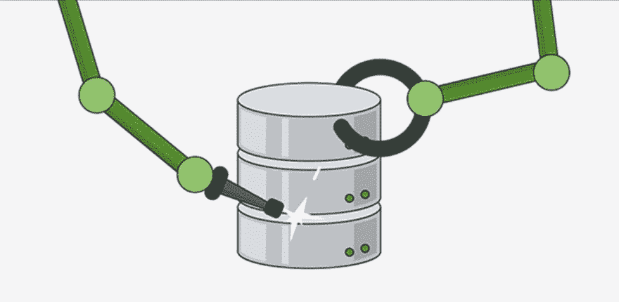

# 对 MongoDB 模式建模的 5 个快速规则

> 原文：<https://dev.to/mrm8488/5-quick-rules-on-modeling-your-mongodbs-schemas-5f0k>

[T2】](https://res.cloudinary.com/practicaldev/image/fetch/s--aO5uzVak--/c_limit%2Cf_auto%2Cfl_progressive%2Cq_auto%2Cw_880/https://thepracticaldev.s3.amazonaws.com/i/u7b9mvtin7rmhy4ohbut.JPG)

NoSQL 数据库是一项相对较新的技术，因此关于何时以及如何使用它们有很多问题。

我读过很多文章，说的是“如果你的数据有关系，不要用 NoSQL”。不是这样的！这就像是我一遍又一遍念的假口头禅。在大多数情况下，我们必须对任何类型的关系数据进行建模，而 NoSQL 数据库已经准备好处理这些数据。关键是我们如何对数据建模。

我并不是说如果你有*强相关的*数据，NoSQL 数据库是最好的选择，但是**在我们的数据中有关系并不是丢弃它们的充分理由。**

我们将专注于 MongoDB。一个关于最流行的 NoSQL 数据库(面向文档)。在我看来，它的成功部分归功于它与流行的 JavaScript 后端框架的轻松集成。此外，MongoDB 是流行的均值和 MERN 堆栈中的 M。

下面，我将给出设计 MongoDB 模式时需要考虑的 5 个快速但强大的规则(您也可以将它们用于类似的数据库):

1.  一般来说，除非你有理由不这样做，否则尽量嵌入。

2.  **如果你要嵌入的对象可能以隔离的方式被访问**(在文档上下文之外访问它是有意义的)**你有一个不嵌入的理由**。

3.  如果嵌入了对象的数组可能会无限制地增长，你就有了另一个不嵌入的理由。一般来说，我们嵌入的文档/对象不应该超过几百个，也不应该超过几千个 ObjectIDs。

4.  **反规格化**将一个文档中的一个或几个字段从多面放到一面的数组中(一对多关系)**可以为我们节省一些额外的查询**(应用级连接)。在我看来，反规范化是充分利用这类数据库的关键之一。但是，只有当反规格化的字段很少更新时，反规格化才有意义。否则，查找和更新所有实例很可能会超过我们从反规范化中获得的节省。因此，在反规格化之前，考虑字段的读/写比。

5.  **不要害怕应用级连接**。有了正确的索引，它们几乎不比服务器级连接贵。
    (更新:最新的 MongoDB 版本包含了 *$lookup* 操作符，它允许我们进行服务器级的连接，具体来说就是左外连接)。

记住:**通过 fit 以及尽可能好的应用程序的数据访问模式来设计你的模式**。我们希望构建我们的数据，以匹配我们的应用程序查询和更新数据的方式。

如果您想了解如何在 MongoDB 中建模一对多和多对多关系的详细信息，请查看我的帖子: [MongoDB 模式设计模式(I)](https://dev.to/mrm8488/mongodb-schema-design-patterns-i-4gdp)

[参考文献](https://www.mongodb.com/blog/post/6-rules-of-thumb-for-mongodb-schema-design-part-3)