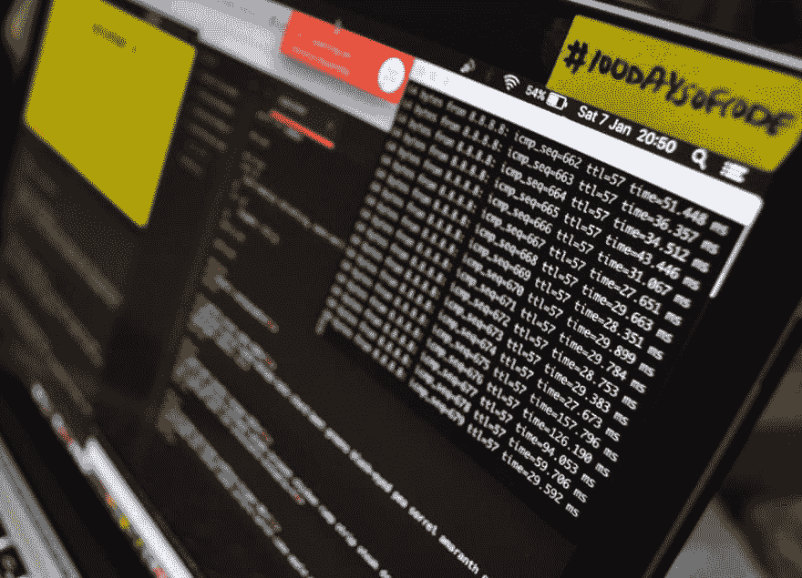

# 开始#100DaysOfCode 挑战的 5 个理由

> 原文：<https://dev.to/karinaislam/5-reasons-to-start-the-100daysofcode-challenge-300>

我在 92 天前开始了我的[# 100 day of code](http://100daysofcode.com/)挑战(仍在继续)。我每天(甚至周末和假期)至少花一个小时编码，并且[用#100DaysOfCode 标签发推特](https://twitter.com/KarinaIslam2)我每天的进展。

在此之前，我学习代码的进度很慢。发现自己跳过天，对自己说“忙了一天，现在累了”“明天再做”“我现在在旅行”“今天是周末/假期”。这就是为什么在读了一篇关于它的文章后，我接受了挑战。现在我要告诉你为什么你也应该开始这个挑战。

[T2】](https://res.cloudinary.com/practicaldev/image/fetch/s--BtFmMese--/c_limit%2Cf_auto%2Cfl_progressive%2Cq_auto%2Cw_880/https://thepracticaldev.s3.amazonaws.com/i/l0c0wxzhblog13jgbl4p.jpg)

**1。推动自己更上一层楼**

谁不想看到自己更上一层楼？如果今天的快节奏生活没有给你时间进行持续的学习，你必须为自己采取主动。一旦你开始每天编码，它会让你走在学习的道路上，你会不断成长。帮助你成为更好的自己。当我致力于这个挑战时，每天编码的完成也提升了我的自尊。

**2。获得系统的生活方式**

加入这个挑战后，编码将成为你日常生活方式的一部分(就像刷牙、吃午饭一样)。这种一致性将帮助你成为更好的开发者。实现你的每日编码目标并在推特上谈论它甚至可能比你和朋友的周末计划更令人兴奋(这发生在我身上！！).这也给了你一个停止拖延并开始每天编码的好理由。

**3。建立强有力的形象**

在这个挑战中，你将能够完成很多项目，学习新事物，并成为任何特定主题的大师。这些东西会让你的形象更强，对雇主更有吸引力。此外，你的 GitHub 个人资料也会看起来极具吸引力。

亚历山大·卡拉威(100 天代码的创造者)在他的博客中提到了一些 100 天代码的成功故事

*“我完成了 100 天的代码。此外，完成后，我的头衔变了，我现在做一半编码和一半测试，而不是全面测试。每个月都有更多的测试任务会在团队中展开，我也会承担更多的编码任务。我正在考虑重新开始 100 天的代码。”—罗伯特·约根森*

“我曾经完成了 100 天的代码。打算九月份再开始。我还没有找工作，但它帮助我更好地完成了工作，并让我参与了开源项目。”—艾米·卡尼

**4。实行问责制**

当你公开你的目标时，你更有可能坚持你的承诺。因为人们想以一种与他们的承诺意图一致的方式行动。也会迫使你朝着自己想要的方向前进。呆在那里。这种个人责任感会产生长期的承诺效应，并确保你不会放弃。

当你公开你的目标时，你会收到一系列的回应，你可以用这些回应来激发你对成功的渴望[【ref】](http://journals.sagepub.com/doi/abs/10.1111/j.1467-9280.2009.02336.x)

**5。和志同道合的人联系**

去 twitter 上搜索#100DaysOfCode，你会看到很多人加入这个挑战，并以一种伟大的精神继续下去。你可以从他们那里获得灵感，也可以通过你的活动给他们一个目标。他们会在你无聊的一天给你动力，帮助你坚持你的承诺

在这 100 天里，我建了几个[项目](http://www.karinaislam.com/myProjects.html)，玩得很开心，也交了很多朋友。并且还打算开始新一轮的。所以，接受这个挑战，开始你人生的新旅程吧。

了解更多关于#100DaysOfCode 的信息