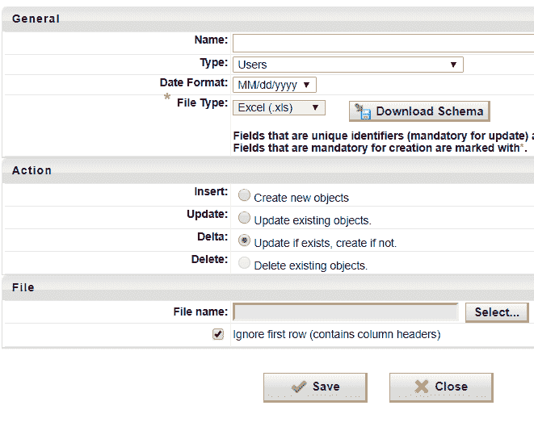
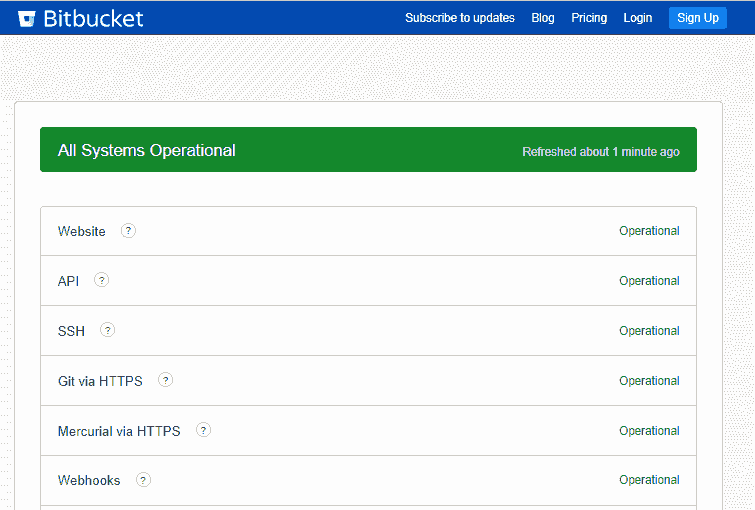

# 5 业务应用程序所需的功能

> 原文：<https://dev.to/mteheran/5-required-functionalities-in-business-applications-3eda>

我作为一名软件开发人员已经工作了将近 10 年，其中至少有 8 年我从事大型应用程序的维护项目。现在我知道需要哪些功能来让客户一直满意。如果你正在考虑为商业客户开发一个大的软件产品，请注意下面的列表。

1.  翻译:
    在本主题中，您可能会想到全球化或更改应用程序原始语言的能力，但这是关于客户可以将单词或消息更改或翻译成任何语言的模块或功能。这一点很重要，因为有些公司用不同的名称来称呼相同的职位、领域或流程；例如，交付经理、项目经理或客户经理通常是同样的职位，承担着同样的责任，您可以通过翻译使您的软件适应客户。

2.  导入或批量更新:
     
    试想想这种情况。您已经完成了在您的应用程序中创建新员工的完美表单，验证了所有字段并具有高性能，但是客户需要创建 5000 名新员工。这意味着在应用程序上创建所有公司。在这种情况下，最好上传一个包含所有记录的 excel 文件，只使用一个过程就可以轻松地插入所有记录。

3.  日志文件和日志:
    这听起来很明显，但是许多人在规划架构时错过了这个功能，然后很难适应应用程序。基本上，应用程序中的每个错误、方法失败或警告都必须被捕获并保存，因为这是在生产环境中分析和获取错误信息的唯一方法。
    此外，日志是另一项重要功能，您可以保存应用程序中的所有交易，包括用户、日期、操作和受影响的记录。例如，当客户想要在公司内部进行审计时，这是必要的。

4.  高级搜索:
    面对数百万条记录和不同类别的元素，如果没有专门设计的工具，似乎很难找到合适的元素。总是试图在所有网格中包含一个易于使用的搜索，以及一个在应用程序中包含足够过滤器的高级搜索。

5.  检查状态和配置:

[T2】](https://res.cloudinary.com/practicaldev/image/fetch/s--wZMwBuSb--/c_limit%2Cf_auto%2Cfl_progressive%2Cq_auto%2Cw_880/https://cdn-images-1.medium.com/max/1250/1%2A70AsGndUpfKM6kCWT-VKLw.png)

“应用程序再次关闭，我们找不到问题所在”。嗯，当您部署包含巨大变化的新版本或为新客户设置新环境时，这是很常见的。基本上，您可以通过构建一个功能来避免这个问题，在这个功能中，管理员用户可以很容易地看到当前的应用程序状态并检查配置。例如，有时某个文件由于某种原因而丢失，或者某些文件需要特定文件夹中的特殊权限，因此您可以在“检查状态”功能中添加所有这些验证。