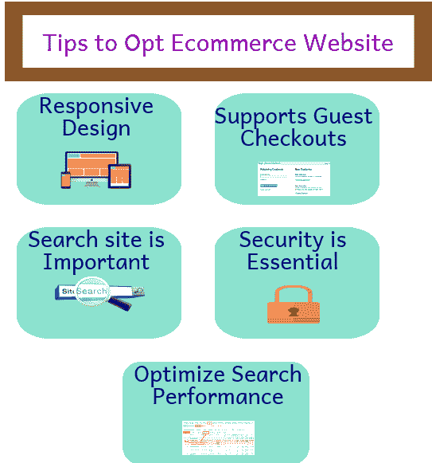
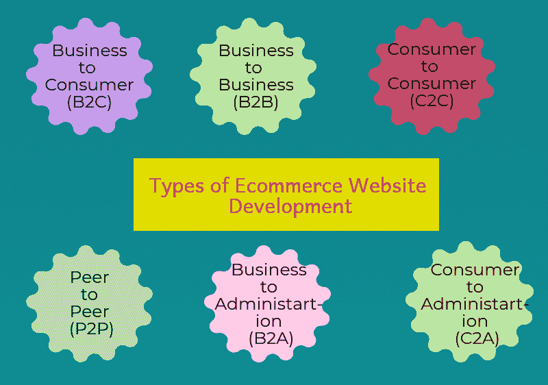

# 选择电子商务网站开发要考虑的 5 件事

> 原文：<https://dev.to/tekshapersinc/5-things-to-consider-opting-e-commerce-website-development-1ce6>

任何网站的开发都是一个大规模的复杂过程，但在当今竞争激烈的市场中，电子商务网站有其独特的挑战。电子商务是企业借助互联网买卖商品和服务的过程。电子商务网站开发涉及到电子资金转账、供应链管理、网络营销、库存管理等多项技术。

但是，除了可用性考虑之外，开发者在开发过程中还需要确定[电子商务开发服务](http://www.tekshapers.com/ecommerce-web-development)的许多其他方面

**响应式设计**
使用移动设备访问网站的情况持续快速增长。因此，实施响应式设计，使网站对每一个设备都是可访问的和用户友好的，这对于电子商务门户的成功非常重要。

 **支持客人结账拥有电子商务网站的公司通常需要用户创建一个账户来进行购物。这使得后续的沟通，鼓励未来的销售，以及跟踪客户的人口统计信息，分析销售。** 

 **

**• Site search is important**
Statistics show that 30% of the visitors to e-commerce sites use search to find the products that they are looking for. Therefore, it is essential to make sure that the search functionality is available and easy to use.

 **安全至关重要所有电子商务网站都应支持 SSL，以加密需要保持安全的信息。因此，任何符合 PCI 规范的的任何[电子商务网站都必须具备安全性。](http://www.tekshapers.com/blog/Ecommerce-Need-of-Todays-Business-World)**

 ****优化搜索性能如果你的网站运行缓慢，那么你很可能会失去你的客户。为了避免由于缓慢的加载时间而失去客户，你需要确保你的网站被优化到尽可能快地运行。**

 **## 电子商务网站开发有哪些类型？

当我们谈论电子商务时，首先想到的是它是发生在供应商和客户之间的在线商业或销售交易。虽然这一概念的想法是正确的，但将电子商务分为六种主要类型涉及到更多的具体因素，例如

 **企业对消费者(B2C)是最常见的第一种电子商务。在这种类型的网上销售是提供给个人客户。它的工作原理是零售商和营销人员使用各种营销工具中的清晰数据向互联网用户销售他们的产品。**

 ****企业对企业(B2B)这是最大的电子商务模式，基于涉及数万亿美元的收入。在这种类型中，买方和卖方都是商业实体。它描述了批发商和制造商之间的商业交易。**

 ****【C2C】**
这种类型的电子商务涉及消费者在第三方的帮助下通过电子方式进行交易。这些网站只是中介，只是为了匹配消费者。他们没有义务检查他们网站上出售的产品的质量。

**·点对点(P2P)**
这是一种通信模型，其中每一方都具有相同的能力，并且任何一方都可以发起通信会话。这是一种技术帮助他们的客户向他们需要的任何人共享计算机资源和计算机文件的类型。

**·企业对政府(B2A)**
它包括公司和公共行政部门之间进行的所有在线交易。由于政府在电子政务方面的投资，这种模式一直在不断发展。

**【消费者到行政部门(C2A)**
这种模式包括个人与公共行政部门之间进行的所有电子交易。这些主要存在于教育、财政、社会保障、税收等领域。这些都与服务的效率和易用性紧密相关。**********