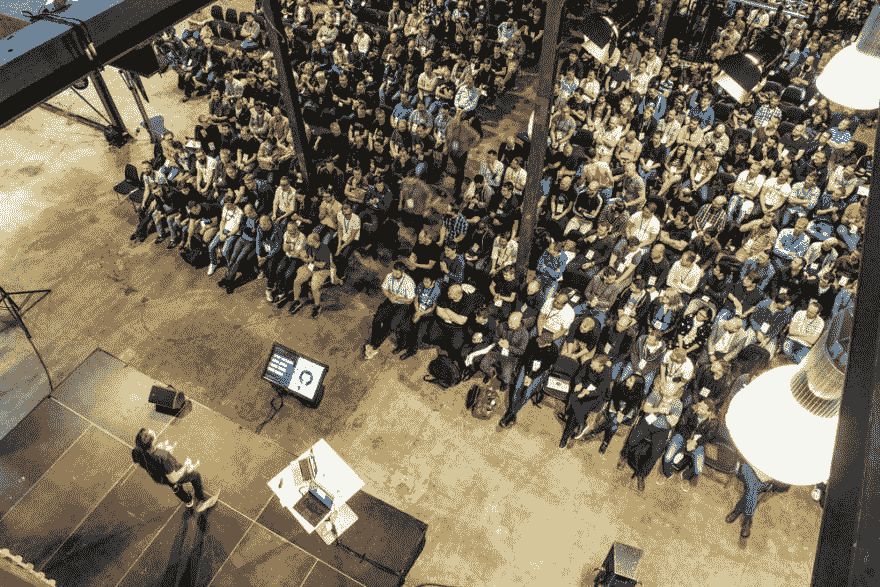
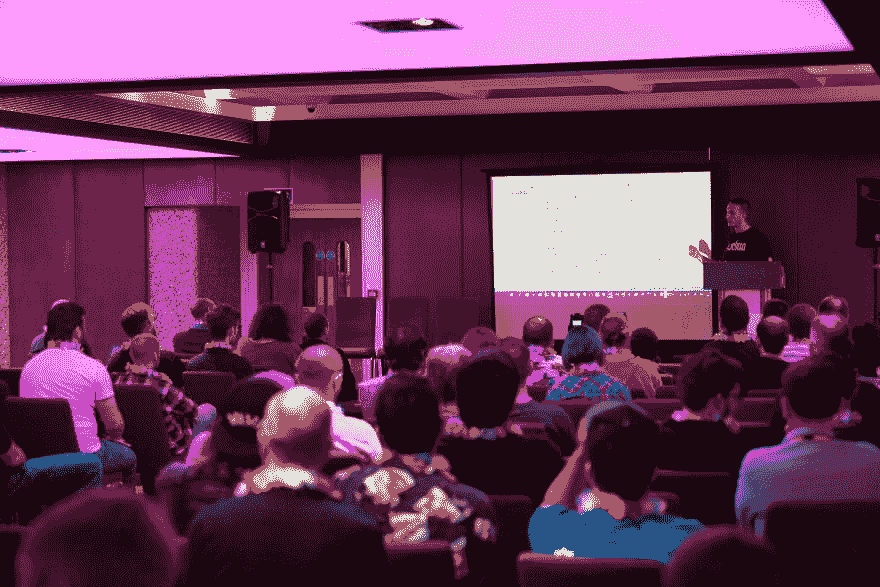
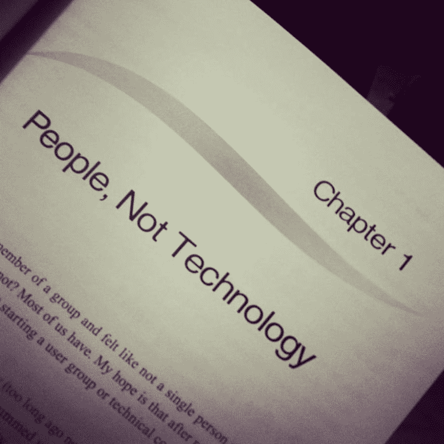

# 说服你的伴侣让你去参加 IT 会议的 5 件事

> 原文：<https://dev.to/zajkowskimarcin/5-things-to-say-to-convince-your-partner-to-let-you-go-to-an-it-conference-3d06>

**免责声明**:我爱我的妻子，她是我最大的支持者。没有她，我就不会有今天，我所做的一切都不会存在。

我是(通常；)对她完全透明，下面描述的所有观点都是对我们在交往中所面临的问题的有趣看法，或者仍然是我们开玩笑和争论的话题。

随时从我们的错误和保护中学习！

**和 pstt...我真的建议你去 [Umbraco Codegarden](https://codegarden18.com/) 或[UK Fest](https://umbracofestival.co.uk/)/[PL Festivals](https://umbracofestival.pl/)因为它们是我有机会参加的最好的社区活动。**

[T2】](https://res.cloudinary.com/practicaldev/image/fetch/s--zfcmUsW6--/c_limit%2Cf_auto%2Cfl_progressive%2Cq_auto%2Cw_880/https://thepracticaldev.s3.amazonaws.com/i/4m4ds7v6c4fqoaf5t5gi.jpg)

* * *

让我们都同意——这是我们所有人的共同问题/障碍(当然，谁有伴侣)。你很想去参加你最喜欢的 IT 活动，但是你的家庭日历(别撒谎，是*{ # # # put _ a _ name _ of _ your _ partner _ or _ random _ child # # # }*的错...)就是不允许。如果是在你的家乡或附近的聚会或 2 或 3 个小时的活动，那就容易多了。当活动在另一个国家，甚至是时区或地球的另一边时，就变得更难了！组合是指需要几天以上的时间！例如，当你有一个小婴儿作为“附加物”时，就叫做 Supercombo...这就是全部乐趣的开始:>权力的游戏，优先权和谁的权利是最正确的:)

我会告诉你一些我过去用来说服我妻子“让我走”(然后回去:)的关键论点。开始吧！

* * *

## 1。知识为王！

我们都想变得更聪明，对吗？如果我们的合作伙伴在与志趣相投的人进行了 *{###x###}* 天的研讨会或会谈和讨论后，从我们这里听到更多关于一些极客的东西，这不是很棒吗？会的。即使我们的合作伙伴讨厌听到 0 和 1、算法、新奇的 javascript 框架等等。-我们眼中的激情是他们钦佩的东西(我想...).知道得更多也可以增加我们的自信心和幸福感。它会影响我们生活的方方面面。快乐开发=快乐伙伴:)

**Pro(bro)提示** : *把它作为主要论点——如果我们想变得更好，赚更多的$$$，我们需要进化和学习。世界上没有比参加{ # # # put _ your _ branch _ or _ niche _ name _ here # # # }活动更好的机会了。如果我们不能去那里，我们将会落后去过那里的人群一百万年，然后等等等等...*

## 2。这完全是价值的问题

正如一位智者曾经说过的:*‘不要努力成为一个成功的人，而要努力成为一个有价值的人’*。你知道是谁吗？阿尔伯特·爱因斯坦。那么这一定是事实；)而价值又藏在哪里呢？答案很简单:在人们的脑子里(和口袋里)。如果我们想要成功，我们需要给予他人价值，同时也要向他人学习，并从他们的价值观和行为中得到启发。

[T2】](https://res.cloudinary.com/practicaldev/image/fetch/s--yhwDRgMn--/c_limit%2Cf_auto%2Cfl_progressive%2Cq_auto%2Cw_880/https://thepracticaldev.s3.amazonaws.com/i/cecbs2ygvk5xcjnluoxh.jpg)

**Pro(bro)tip** : *假装你很擅长某事(我知道你很棒！).分享更多关于你最近失败的细节，并在你的伴侣面前指责你缺乏相关知识；)*

## 3。这不仅仅是关于代码...

嘘...你的伴侣还在看你正在读的东西吗？:)

```
if (sheOrHeIsStillLooking) {

/*
 *    Those conferences are happening in various places on the map. Different 
 *    cultures, traditions, people. It's a great opportunity to discover them all 
 *    and bring something back as a GIFT(s) / souvenirs + we all love buying tax 
 *    free stuff in airports. Pick / let your partner name some most wanted sweets 
 *    or liquors and just buy them. Your baby loves soft toys? You'll find a ton 
 *    of them (and shiit.. how expensive they could be!) at the airport, but be 
 *    clever (I know you are!) and buy them before passing the security checks, 
 *    ideally during your stay in a local store. Save money. Their joy will be the 
 *    same :) 
 *
 *    **Pro(bro)tip**: My wife, for example, loves Baileys Irish Cream. So, every 
 *    time I see a limited edition bottle - I buy it. And just once I bought it in 
 *    our store in Poland ;) No-one noticed... shhh. It's a lot easier with toys 
 *    for my little one, but I can only imagine how it'll become hard in the next 
 *    few years as she won't be so easy to fool. Damn.
 */

} else {

/*
 *    PAAAAAAAAARTTYYYYY TIME! It's obvious you won't be sitting for 24h in front 
 *    of your computers (I assume it's not a fancy hackathon this time, they might 
 *    be treated differently). From my experience, the social side of these events     
 *    is sometimes more important than things learned during the sessions or 
 *    workshops. You can always get hold of slides or watch a video recording of a 
 *    talk, but you can't (usually) go back to the lobby or a bar where you've all 
 *    headed after the official part of the event. Try not to be the type of 
 *    person who goes straight to the hotel and avoid other people. I've learned a 
 *    ton of useful stuff from just having a beer or coke with people who are more 
 *    clever than me! I’ve broken through my introvert barriers, in the beginning 
 *    I was shy as fuck (especially when I wasn't confident of my language skills 
 *    to be 'enough' to just talk with the people). It wasn't easy, believe me. 
 *    But I made it and it made me. I've met great people and opened up some paths 
 *    which would still closed if I was the type of guy who lean against the wall 
 *    or stared at his smartphone screen all the time. Use it. Use it wisely. It 
 *    might be the only opportunity to shake hands with your favorite speaker, 
 *    your coding idol or person who you wanted to always meet in the real life.
 *
 *    **Pro(bro)tip**: Don't drink your wife's Baileys a.k.a. remember about the 
 *    gifts mentioned earlier :) Also, have a plan! For my first big conference I 
 *    created a list of people who I wanted to just shake hands with or just say 
 *    hi, who I want to complement and thank them for their work which helped me, 
 *    and those with who I wanted to exchange contact details with -  as I might 
 *    need them in the future. I was just "checking" them out on paper during the 
 *    event and I almost got 100%!
 */

} 
```

Enter fullscreen mode Exit fullscreen mode

[T2】](https://res.cloudinary.com/practicaldev/image/fetch/s--qXIXozRt--/c_limit%2Cf_auto%2Cfl_progressive%2Cq_auto%2Cw_880/https://thepracticaldev.s3.amazonaws.com/i/2zfrepkqcxh6s62w9sh2.jpg)

## 4。群山在召唤，我必须离开

好吧，现在我假设你的搭档没有在你身后看，所以我们可以停止说谎；)有时候我们就是必须去，所以我们需要对此有说服力。没有人能取代我们，我们的老板希望我们去，詹姆斯，约翰和杰弗里都去-我不能不同。挑选你最喜欢的台词。这些年来，你应该学会什么最适合你。它在这个列表中是如此之低，因为它通常不工作...当你最喜欢的同事因为他/她的伴侣而待在家里时，情况可能会更糟；)#因循守旧

**Pro(bro)tip** : *不要过度使用，尤其是当你扮演一个必须多次去某个地方的受害者时。任何一个理智的人，谁会和一个经常强迫员工离开家庭的公司保持关系呢？你可能会被迫寻找新的合同/雇主/职业，并感受到来自战斗另一方的压力(更危险；)).*

## 5。它是由一家公司赞助的

最后，但不是最不重要的！让我们谈谈钱。我喜欢这个论点。尤其是当你是自己的老板，并且在这种类型的讨论中把这一点作为一个有效的观点的时候。我总是说它是由公司的钱赞助的——即使我是作为自由职业者或者当我经营我以前的生意时也是如此！；)你知道吗..成功了！如果钱是一把钥匙(我知道有时候是...)更容易接受不是自己的钱(家庭预算等)。)去了就丢了烧了。即使他们会在一天结束时；)如果它真的是由你的公司赞助的——向他们致敬，向他们因你的知识水平而增加的投资致敬！

[T2】](https://res.cloudinary.com/practicaldev/image/fetch/s--gIhWA8U7--/c_limit%2Cf_auto%2Cfl_progressive%2Cq_auto%2Cw_880/https://thepracticaldev.s3.amazonaws.com/i/oyohintrannrjvwpg3s0.jpg)

**Pro(bro)提示** : *投资自己。不要害怕浪费钱去参加上述的活动。它可能不会被浪费。当然——所有都在合理的范围内，并且牢记你的可能性和目标。将你的账户分成多个账户，为你的自我提升、市场营销和促销留出预算。*

* * *

这是锦上添花。另一个需要一些技巧的话题是如何在这样的活动中表现和交流...也许有一天我也会解决这个问题。现在-感谢阅读。尽情享受吧，我会在最近的活动中见到你；))