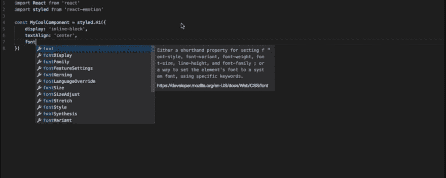

# 你在 CSS-in-JS 中可以做的 5 件你不知道的事情

> 原文：<https://dev.to/bnevilleoneill/5-things-you-can-do-in-css-in-js-that-you-didn-t-know-about-24n4>

[T2】](https://res.cloudinary.com/practicaldev/image/fetch/s--QdWKSLjj--/c_limit%2Cf_auto%2Cfl_progressive%2Cq_auto%2Cw_880/https://cdn-images-1.medium.com/max/1024/1%2AGtHPLcQKLCdD_VuY7vvtTw.png)

除了传统的 CSS，您还可以选择内联样式和 CSS-in-JS 来样式化 React 应用程序。

对于内联样式，您将一个 JavaScript 对象传递给样式属性:

```
const myStyle = {
  fontSize: 24,
  lineHeight: '1.3em',
  fontWeight: 'bold',
};

<span style={myStyle}>Hello World!</p> 
```

但是，并不是所有的 CSS 功能都受支持。

另一方面，CSS-in-JS 是一种使用 JavaScript 来设计组件样式的技术。当这个 JavaScript 被解析时，CSS 被生成(通常作为一个`<style>`元素)并附加到 DOM 中。

该功能由第三方库实现。举个例子，这是之前用[阿芙罗狄蒂](https://github.com/Khan/aphrodite) :
实现的例子

```
import { StyleSheet, css } from 'aphrodite';
const styles = StyleSheet.create({
    myStyle: {
        fontSize: 24,
        lineHeight: '1.3em',
        fontWeight: 'bold',
    }
});

<span className={css(styles.myStyle)}>Hello World!</p> 
```

我可以推荐的其他库有:

*   [情感](https://emotion.sh)
*   [JSS](http://cssinjs.org)
*   镭
*   [样式化组件](https://www.styled-components.com)

我并不完全支持 CSS-in-JS，但是我不得不说，其中一些库增加了对某些特定情况下有用的特性的支持。

在这篇文章中，我将谈论你在 CSS-in-JS 中可以用上面的库做的五件事，我打赌你不知道。

[T2】](https://logrocket.com/signup/)

### 1。您可以参考其他样式的组件

像 [styled-components](https://www.styled-components.com/) 和 [emotion](https://emotion.sh/) 这样的库允许你使用[标记的模板文字](https://medium.freecodecamp.org/es6-tagged-template-literals-48a70ef3ed4d)从 styles:
创建 React 组件

```
import styled from 'styled-components';
// Create a component that renders a <p> element with blue text
const BlueText = styled.p`
  color: blue;
`;

<BlueText>My blue text</BlueText> 
```

但是它们也允许你瞄准其他样式的组件(就像你使用 CSS 选择器一样):

```
const ImportantText = styled.div`
   font-weight: bold;
`;

const Text = styled.div`
  color: gray; ${ImportantText} {
    font-style: italic;
  }
`;

render(
  <div>
    <Text>
      Text in gray
      <ImportantText>Important text in gray, bold and italic</ImportantText>
    </Text>
    <ImportantText>Important text bold</ImportantText>
  </div>
); 
```

这在组合伪类时很有用，例如，在悬停时改变组件的颜色:

```
const Text = styled.div`
  color: gray;

  &:hover ${ImportantText} {
    color: red;
  }
`; 
```

### 2。您可以使用 JSS(或其他库)扩展某些库的功能

假设您已经使用 Aphrodite 来设计您的应用程序，现在您需要支持主题。

问题是阿芙罗狄蒂不支持以一种简单的方式进行主题化。至少不像[情感](https://emotion.sh/docs/theming)那么容易。

然而，有两个项目将 JSS 的核心与阿芙罗狄蒂和风格组件联系起来，[阿芙罗狄蒂-jss](https://github.com/cssinjs/aphrodite-jss) 和[风格-jss](https://github.com/cssinjs/styled-jss) 。

这样，你可以保留 Aphrodite(或 styled-components)的优秀部分，使用 JSS 的所有特性和[插件](http://cssinjs.org/plugins)，从[规则缓存](http://cssinjs.org/jss-cache)到[规则隔离](http://cssinjs.org/jss-isolate)，对于主题， [theming](https://github.com/cssinjs/theming) 包，它提供了以下高阶组件:

*   ThemeProvider，它通过上下文将主题对象向下传递到 react 树。
*   允许您接收一个主题对象及其作为属性的更新。

例如:

```
const blackTheme = {
  color: 'black',
};

const App = () => (
  <ThemeProvider theme={blackTheme}>
    <MyComponent />
  </ThemeProvider>
); 
```

在阿芙罗狄蒂和主题的特殊情况下，作为另一个例子，您还可以使用 [react-with-styles](https://github.com/airbnb/react-with-styles) ，它与[阿芙罗狄蒂](https://github.com/airbnb/react-with-styles-interface-aphrodite)和 [JSS](https://github.com/oliviertassinari/react-with-styles-interface-jss) 等接口，以在定义样式时访问主题信息。

### 3。用关键帧链接多个动画

与内联样式不同，CSS-in-JS 允许您使用关键帧来定义动画。例如，这是如何处理样式化组件的:

```
const heightAnimation = keyframes`
  0% { height: 0;  }
  100% { height: 200; }
`;

const myComponent = styled.div`
  display: inline-block;
  width: 200;
  position: relative;
  animation-name: ${heightAnimation};
  animation-duration: 1.5s;
  animation-timing-function: ease;
`; 
```

但是没有多少人知道，可以通过在 animation 属性中使用多个关键帧对象来链接多个动画。

下面是上面结合两个动画的例子:

```
const heightAnimation = keyframes`
  0% { height: 0; }
  100% { height: 200; }
`;

const rotateAnimation = keyframes`
  0% { transform: rotate(0deg); }
  100% { transform: rotate(360deg); }
`;

const myComponent = styled.div`
  display: inline-block;
  width: 200;
  position: relative;
  animation: ${props => css` ${heightAnimation} 1.5s ease infinite, ${rotateAnimation} 1.5s linear infinite
  `} `; 
```

Radium 是另一个支持多个[动画](https://github.com/FormidableLabs/radium/tree/master/docs/api#keyframes)的库，通过传递一组关键帧对象作为 animationName 属性的值:

```
const heightAnimation = Radium.keyframes(
  {
    0% { height: 0; }
    100% { height: 200; }
  },
  'myHeightAnimation',
);

const rotateAnimation = Radium.keyframes(
  {
    0% { transform: rotate(0deg); }
    100% { transform: rotate(360deg); }
  },
  'myRotateAnimation',
);

const styles = {
  myStyle: {
    animationName: [heightAnimation, rotateAnimation],
    animationDuration: '1.5s, 1s',
    animationIterationCount: 'infinite, infinite',
    animationTimingFunction: 'ease, linear',
    display: inline-block;
    width: 200;
    position: relative;
  },
}; 
```

### 4。声明全局样式

CSS 中的一切都是全局的，使用 CSS-in-JS 的目的之一就是消除全局样式定义。

但是，全局样式可能有一些有效的用法，例如，当您希望将相同的字体样式应用于页面中的每个元素时。

当然，你可以一直使用传统的 CSS，通过 Webpack 导入或者在 index.html 文件中声明。

但是如果你真的想把 JavaScript 用于你的所有风格，一些库实际上允许你通过帮助组件或扩展/插件来定义全局风格。

在 Radium 中，您可以使用 [Style](https://github.com/FormidableLabs/radium/tree/master/docs/api#style-component) 组件来呈现带有全局样式的样式元素。

例如:

```
<Style
  rules={{
    body: {
      fontFamily: 'Arial, Helvetica, sans-serif'
    }
  }}
/> 
```

将返回:

```
<style>
body {
  font-family: 'Arial, Helvetica, sans-serif';
}
</style> 
```

JSS 用一个[插件](http://cssinjs.org/jss-global)写全球风格:

```
const styles = {
  '@global': {
    body: {
      fontFamily: 'Arial, Helvetica, sans-serif'
    }
  }
} 
```

而在阿芙罗狄蒂中，你可以用一个[第三方扩展](https://github.com/xymostech/aphrodite-globals)来做到这一点:

```
import {injectGlobalStyles} from "aphrodite-globals";

injectGlobalStyles({
    "body": {
          fontFamily: 'Arial, Helvetica, sans-serif',
    }
}); 
```

或者 [aphrodite-jss](https://github.com/cssinjs/aphrodite-jss) 使用全球 jss 插件。

### 5。在单元测试中使用样式测试组件

有些库包含用于测试带有样式的组件的实用程序。

Aphrodite 提供了未记录的(至少在编写本文时)对象，[stylesheetestutils](https://github.com/Khan/aphrodite/blob/62ee2f0a39f10be75322dc0f77d1346e9731ffbf/src/exports.js#L98)，它只适用于非生产环境(`process.env.NODE\_ENV !== 'production'`)，有三种方法:

*   suppressStyleInjection，它防止样式被注入到 DOM 中，当您想要在没有 DOM 的情况下测试 Aphrodite 组件的输出时，它非常有用。
*   clearbufferdresumestyleinjection，它的作用与 suppressStyleInjection 相反，应该与之配对。
*   getBufferedStyles，它返回一个尚未刷新的缓冲样式字符串。

这里有一个如何使用它们的例子:

```
import { StyleSheetTestUtils, css } from 'aphrodite';
//...

beforeEach(() => {
  StyleSheetTestUtils.suppressStyleInjection();
});

afterEach(() => {
  StyleSheetTestUtils.clearBufferAndResumeStyleInjection();
});

test('my test', () => {
  const sheet = StyleSheet.create({
    background: {
      backgroundColor: 'blue'
    },
  });
  css(sheet.background);
  // buffer will contain something like [ ".background_k554e1{background-color:blue !important;}" ]
  const buffer = StyleSheetTestUtils.getBufferedStyles();
  // ...
}); 
```

镭是另一个例子。它有一个 [TestMode](https://github.com/FormidableLabs/radium/tree/master/docs/api#testmode) 对象，用于在使用 clearState、enable 和 disable 方法进行测试期间控制内部状态和行为。

[这里](https://github.com/FormidableLabs/radium/blob/da33b8f13cadda9b421c0a6c567fca7361c4e924/src/%20__tests__%20/media-query-test.js)，可以找到一个如何使用的例子。

### 结论

CSS-in-JS 是一种用 JavaScript 设计应用程序的技术，您可以用实现它的库做一些有趣的事情。

在这篇文章中，我向你展示了你可能不知道可以用这些库做的五件事。当然，并不是所有的库都是一样的，有些东西只适用于特定的库。

在这个[页面](https://css-in-js-playground.com)上，你可以找到一个测试和比较许多 CSS-in-JS 库的平台。

另一方面，也有其他库将 CSS、JavaScript 和类型的概念发展得更进一步。

其中一个库是 [stylable](https://github.com/wix/stylable) ，这是一个基于组件的库，带有一个预处理器，可以将 stylable 的 CSS 转换成最小的跨浏览器的普通 CSS。

[这里有一个关于这个库和 CSS-in-JS 的精彩演示](https://css-tricks.com/css-in-js-ftw-wtf/)。完全推荐。

* * *

## Plug: [LogRocket](https://logrocket.com/signup/) ，一款适用于网络应用的 DVR

[](https://res.cloudinary.com/practicaldev/image/fetch/s--6FG5kvEL--/c_limit%2Cf_auto%2Cfl_progressive%2Cq_auto%2Cw_880/https://i2.wp.com/blog.logrocket.com/wp-content/uploads/2017/03/1d0cd-1s_rmyo6nbrasp-xtvbaxfg.png%3Fresize%3D1200%252C677%26ssl%3D1)

[log rocket](https://logrocket.com/signup/)是一个前端日志工具，让你重放问题，就像它们发生在你自己的浏览器中一样。LogRocket 不需要猜测错误发生的原因，也不需要向用户询问截图和日志转储，而是让您重放会话以快速了解哪里出错了。它可以与任何应用程序完美配合，不管是什么框架，并且有插件可以记录来自 Redux、Vuex 和@ngrx/store 的额外上下文。

除了记录 Redux 动作和状态，LogRocket 还记录控制台日志、JavaScript 错误、stacktraces、带有头+体的网络请求/响应、浏览器元数据、自定义日志。它还使用 DOM 来记录页面上的 HTML 和 CSS，甚至为最复杂的单页面应用程序重新创建像素级完美视频。

[免费试用](https://logrocket.com/signup/)。

* * *

帖子[你可以在 CSS-in-JS 中做的 5 件你不知道的事情](https://blog.logrocket.com/5-things-you-can-do-in-css-in-js-that-you-didnt-know-about-c422fb67ceb6/)首先出现在[的 LogRocket 博客](https://blog.logrocket.com)上。