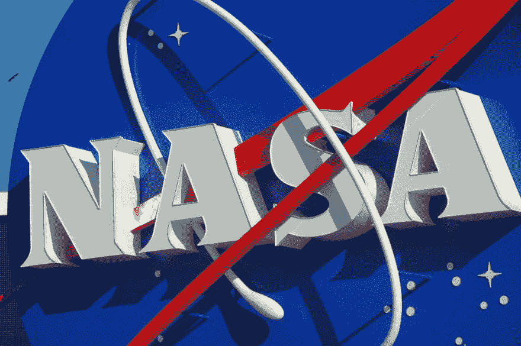

# 你应该知道的 5 个有用的 API

> 原文：<https://dev.to/jackhiston/5-useful-apis-you-should-know-about-583f>

[T2】](https://res.cloudinary.com/practicaldev/image/fetch/s--meD72mLo--/c_limit%2Cf_auto%2Cfl_progressive%2Cq_auto%2Cw_880/https://thepracticaldev.s3.amazonaws.com/i/uq9r00t221lssl4s54dg.jpg)

当谈到大规模的软件开发时，总有一些 API 支持您的应用程序。食谱应用程序、图像识别软件、词汇分析系统、移动应用程序等等，都需要允许它们与周围世界进行交互的 API。API 提供的数据，以及通过互联网等媒介的无处不在的访问，使得它们对于启动您的应用程序来说是无价的。

在这篇文章中，我将探索五个我觉得有趣的软件 API，但最重要的是它们在各种软件应用程序中都很有用。我试图选择用例不同的 API 来理解 API 提供的多样性。我将展示提供领域数据样本、对一组输入执行计算的 API，甚至是执行图像识别以提供情境元数据的 API。

# Intellexer API

自然语言处理是当今许多软件应用程序使用的关键特性之一。自从互联网出现以来，软件可用的信息量一直呈爆炸式增长。分析这些信息是困难的，理解信息的关键组件和语义本身就是一个软件项目。

Intellexer API 允许我们进行分析、总结和拼写检查。当处理文本信息时，它可能是一种有价值的资产。构建自己的自然语言处理器很难。拥有一个预构建的 API 将为您节省几个月的工时。

# 谷歌联系人 API

社交网络已经接管了世界。像脸书和推特这样的网站已经成为许多社交媒体上瘾者的主食。他们尝试并定制其平台的一个关键方面是与第三方数据的集成，以增加其覆盖范围。

其中的一个关键方面是建议将您自己的联系人添加到平台中。像 [Google Contacts API](https://developers.google.com/google-apps/contacts/v3/) 这样的联系 API，以及一般的联系 API，比如 [Lusha](https://www.lusha.co/api) 的联系 API，都有一个定义好的方式来与敏感数据交互。

您可以使用这些数据来扩充数据，从而简化用户体验、保持信息最新，并为您的应用程序创建更加个性化的感觉。Lusha 可以让您丰富您的联系数据，为您提供更多在销售等领域有用的上下文信息。Lusha 消除了你通过互联网收集商业数据的需要。

# 面对++吧

有一些 API 不仅用于信息检索，还用于处理可以提供更多元数据的数据。图像识别软件是软件行业的热门话题。微笑识别等技术和著名的 SnapChat 移动应用程序利用了实时分析捕获图像的能力。

[Face++ API](https://www.faceplusplus.com/) 提供了这种现成的技术。Face++可以让你分析人脸图像，让你进行面部相似度、3D 面部动画等操作，甚至可以识别年龄和种族。

# 食品 API

烹饪行业是巨大的。由于每个人都有准备食物的必要，烹饪应用程序像风暴一样起飞也就不足为奇了。然而，要使一个关于烹饪的应用程序有用，需要有各种各样的食物和食谱可供选择。

[Spoonacular Food API](https://spoonacular.com/food-api) 允许你搜索食物、食谱和配料。你需要创建一个关于厨房烹饪的应用程序。

# 美国宇航局 API

正如我们已经讨论过的，有一些 API 提供了输入处理、元数据、图像操作，甚至还有一个目录可供使用。也有已经开发的主要用于信息传播的 APIsNASA API 就是这样一个 API。

NASA API 允许你下载各种主题的图像和数据。来自航空航天、地球科学和美国国家航空航天局进行的实验的数据结果。有了这些数据，您可以开发应用程序，这些应用程序可以进一步开发数据挖掘等功能，或者在数据融合中使用这些数据，以便在您自己的科学应用程序中提供更高的准确性。

# 结论

这篇文章的目标是让你的头脑开放，接受许多可能的 API，这些 API 可以方便你的应用程序。当涉及到开发软件时，你应该尽可能少的实现代码。

尝试并使用已经过全面测试的第三方 API，这些 API 拥有数千个专门的工时。这将确保您更快地完成特性，而不需要初始阶段来让您的应用程序提供价值。你能想到一个能帮助你开发软件应用程序的 API 吗？