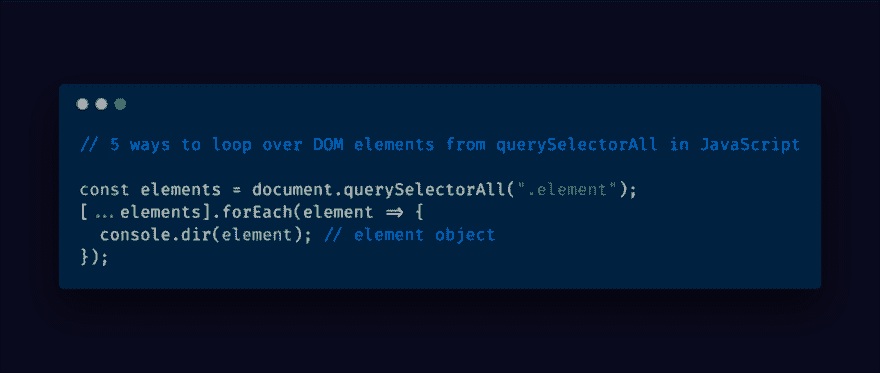

# 在 JavaScript 中从 querySelectorAll 循环 DOM 元素的 5 种方法

> 原文：<https://dev.to/mrfrontend/5-ways-to-loop-over-dom-elements-from-queryselectorall-in-javascript-7d>

[T2】](https://res.cloudinary.com/practicaldev/image/fetch/s--ccYJFWQH--/c_limit%2Cf_auto%2Cfl_progressive%2Cq_auto%2Cw_880/https://cdn-images-1.medium.com/max/1024/1%2AS6dmsmlRJyMKeV_LvPBP1A.png)

有很多方法可以循环一个由 querySelectorAll 方法返回的 NodeList 对象(DOM 元素列表)!在这篇文章中，我想分享 5 种方法。

让我们从定义一段 HTML 和一个搜索多个元素的常量变量开始。

**HTML**

```
\<div class="container" id="myContainer"\> \<div class="fake-image"\> \<h2\>Fake image\</h2\> \</div\> \<div class="fake-image"\> \<h2\>Fake image\</h2\> \</div\> \<div class="fake-image"\> \<h2\>Fake image\</h2\> \</div\> \<div class="fake-image"\> \<h2\>Fake image\</h2\> \</div\> \</div\> 
```

Enter fullscreen mode Exit fullscreen mode

**JavaScript**

```
const fakeImages = document.querySelectorAll(".fake-image"); 
```

Enter fullscreen mode Exit fullscreen mode

因此，现在我们准备找出我们可以使用哪 5 种方法来循环这个由 querySelectorAll 方法返回的很酷的 NodeList 对象。

如果一个方法给出了一个回调选项，那么我将使用“箭头函数”来实现。

### 1。For 循环

循环遍历所有内容的最著名的函数是老掉牙的 For-loop。这可能不是最漂亮的代码，但绝对是高性能的。

因此，如果你需要支持 IE11 或更低版本的浏览器，并且你没有使用像 [Babel](https://babeljs.io/) 这样的编译器，那么这是你最好的武器。

**支持:**每个浏览器！

```
const fakeImages = document.querySelectorAll(".fake-image"); for (var i = 0; i \< fakeImages.length; i++) { console.log('fakeImage: ', fakeImages[i]); } 
```

Enter fullscreen mode Exit fullscreen mode

### 2。为..关于

我会给[打电话..循环是普通 For 循环的扩展。这是因为这个函数可以循环遍历 iterable 对象(包括 String、Array、类似数组的参数、NodeList 对象、TypedArray、Map 和 Set)。](https://developer.mozilla.org/en-US/docs/Web/JavaScript/Reference/Statements/for...of)

如果你需要支持旧的浏览器，那么你肯定需要一个像 Babel 这样的编译器。但是如果你只需要支持现代浏览器..会是我的首选武器！

**支持:**所有现代浏览器！IE11 或更低版本不支持。

```
const fakeImages = document.querySelectorAll(".fake-image"); for (const fakeImage of fakeImages) { console.log('fakeImage: ', fakeImage); } 
```

Enter fullscreen mode Exit fullscreen mode

### 3。为..条目、关键字、值

在前面的方法中，我们只是使用节点列表在 For 中循环..循环的。但是 NodeList 也有更多的方法可以在这个循环中使用。

[条目()](https://developer.mozilla.org/en-US/docs/Web/API/NodeList/entries)、[键()](https://developer.mozilla.org/en-US/docs/Web/API/NodeList/keys)和[值()](https://developer.mozilla.org/en-US/docs/Web/API/NodeList/values)方法返回一个[迭代器](https://developer.mozilla.org/en-US/docs/Web/JavaScript/Reference/Iteration_protocols)。迭代器是 ES2015 规范中新的可迭代协议。

在 JavaScript 中，一些类型的数据(数组或映射)有内置的循环功能。

对象没有内置的循环功能。通过迭代器协议，我们可以遍历不默认支持迭代器的数据类型。

### 条目

这个循环中的每一项都是一个数组，首先是键，然后是元素。这看起来可能有点滑稽，但却是意料之中的行为。

```
const fakeImages = document.querySelectorAll(".fake-image"); for (const fakeImage of fakeImages.entries()) { console.log('fakeImage: ', fakeImage); }; 
```

Enter fullscreen mode Exit fullscreen mode

### 值

其中 entries 方法给出了一个键和值的数组。这个循环中的每一项都是一个元素，换句话说就是方法名告诉我们的值。

```
const fakeImages = document.querySelectorAll(".fake-image"); for (const fakeImage of fakeImages.values()) { console.log('fakeImage: ', fakeImage); }; 
```

Enter fullscreen mode Exit fullscreen mode

### 键

就像 values 方法为我们提供 NodeList 中每一项的值一样，keys 方法为我们提供 NodeList 对象中的键。

```
const fakeImages = document.querySelectorAll(".fake-image"); for (const fakeImage of fakeImages.keys()) { console.log('fakeImage: ', fakeImage); }; 
```

Enter fullscreen mode Exit fullscreen mode

### 4。为每一个

这里有一个我不知道的很酷的方法😁。就像数组方法 forEach 一样， [NodeList 对象也有自己的 forEach](https://developer.mozilla.org/en-US/docs/Web/API/NodeList/forEach) 方法。

最重要的一点是，它只在现代浏览器中受支持。为了支持老版本的浏览器，你肯定需要一个编译器。

**支持:**所有现代浏览器！IE11 或更低版本不支持。

```
const fakeImages = document.querySelectorAll(".fake-image"); fakeImages.forEach(fakeImage =\> { console.log('fakeImage: ', fakeImage); }); 
```

Enter fullscreen mode Exit fullscreen mode

### 5。(ES2015)使用 forEach 扩展语法

在 ES2015 中，我们为阵列提供了[扩展语法](https://developer.mozilla.org/en-US/docs/Web/JavaScript/Reference/Operators/Spread_syntax)。有了这个语法，你可以做很多很酷的事情！其中之一是，将 NodeList 对象转换为数组，并对其使用 Array forEach 方法。

为了在旧的浏览器中得到支持，你肯定需要一个编译器，因为这种支持并没有在所有的现代浏览器中完全实现。

**支持:** [几乎所有现代浏览器](https://developer.mozilla.org/en-US/docs/Web/JavaScript/Reference/Operators/Spread_syntax#Browser_compatibility)！IE11 或更低版本不支持。

```
const fakeImages = document.querySelectorAll(".fake-image"); [...fakeImages].forEach(fakeImage =\> { console.dir(fakeImage); }); 
```

Enter fullscreen mode Exit fullscreen mode

### 感谢

如果您从 querySelectorAll 学到了一些东西或者有其他方法来循环遍历 NodeList 对象，请在 twitter 上告诉我😉: [@rsschouwenaar](https://twitter.com/rsschouwenaar)

*原载于*[*https://raymonschuwenaar . nl/5-ways-loop-over-DOM-elements-query select orall-JavaScript/*](https://raymonschouwenaar.nl/5-ways-loop-over-dom-elements-queryselectorall-javascript/)