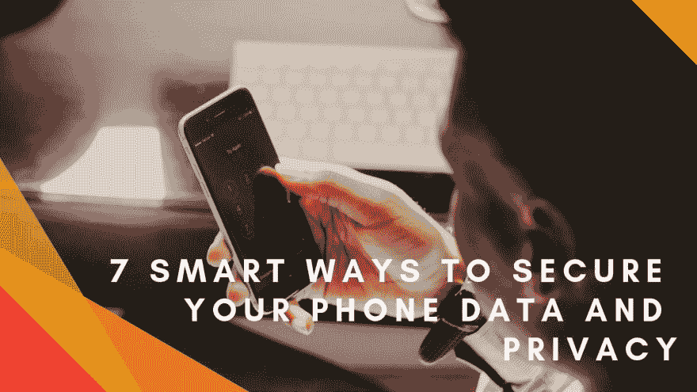

# 7 种保护手机数据和隐私的聪明方法

> 原文：<https://dev.to/violetdsmith/7-smart-ways-to-secure-your-phone-data-and-privacy-5g4f>

[T2】](https://res.cloudinary.com/practicaldev/image/fetch/s--2jONAylg--/c_limit%2Cf_auto%2Cfl_progressive%2Cq_auto%2Cw_880/https://thepracticaldev.s3.amazonaws.com/i/0b1yleunmwhnftu3pvdi.png)

生活在一个高度数字化的世界，你的智能手机可能是你离不开的东西之一。这是一个强大的工具，让你随手可得大量信息。

然而，随之而来的是安全和隐私风险。不管你喜不喜欢，你都会受到一些远远超出你控制的事情的影响，比如影响你私人信息的数据泄露。好消息是，你可以采取几个步骤来保护你的手机，维护它的隐私。

# 使用安全密码

所有智能手机通常都允许你用个人识别码、密码、模式或指纹等生物特征登录来锁定它，以确认是你。只要您关闭并保护好您的设备，即使设备丢失或被盗，其他人也无法访问您的设备和信息。此外，如果你的手机有指纹扫描功能，指纹扫描也很方便。

# 密码保险柜

每次为你的电子邮件地址、社交媒体账户和电子贺卡网站设置一个单独的密码会让人精疲力尽。你最终会回收你不想要的密码。骗子可以很容易地黑掉你的一个账户，并在你使用这些密码的网站上暴露每个账户。密码管理器可以帮助保护它们，只需通过指纹扫描或主密码就可以释放它们。这样，您可以存储唯一的随机组合。

# 硬件级加密

硬件级加密支持 iOS。此外，它不断更新，增加了更多的功能。自从 5.0 版本的棉花糖出现以来，Android 还会默认加密你手机的存储空间。不管怎样，它们的功能是加密你的数据，并且只能通过你的手机硬件解锁。然而，这些通常没有你的锁码那么强。因此，设置强密码仍然是保护您的设备的最佳方式之一。

# 极限位置设置

你的智能手机有办法知道你的当前位置。这有时是至关重要的，尤其是在紧急情况下，因为调度员可以迅速确定你的位置。不幸的是，你手机里的应用程序也会将你的位置传递给不可信的来源。作为预防措施，尝试关闭所有应用程序的位置设置，除非你有足够好的理由使用它们。

# 使用双因素认证

另一种保护手机的方法是使用谷歌的双因素认证。直接登录你的谷歌账户，然后进入设置页面，你会在菜单上看到“使用两步验证”。只需按照提示操作，您还会被要求输入电话号码。然后，验证码通过文本发送给你。在您的网络浏览器的数据输入框中输入此代码，您的两步验证将会启动。

为了更简单，你可以选择使用谷歌提示。这样做是通过点击手机上的“是”提示来授权 Google apps。

# 不要轻信

一旦收到可疑短信，尤其是来自陌生人的短信，不要拨打陌生电话号码和内嵌的网页链接。骗子和垃圾邮件发送者都会抓住一切机会，而作为智能手机用户，你就是他们的目标。很有可能，他们会发邮件，发短信，甚至打电话给你，假装成完全不同的人。这很危险，因为他们可能会将你锁定在设备之外。有些人甚至会在你解锁手机之前向你勒索钱财。

# 安装一个 VPN

虚拟专用网络，也称为 VPN，在不太安全的网络上创建安全且加密的连接。它的功能是在你每次访问网站时保护你的隐私和安全，而且 [VPN 可以用来绕过中国](https://www.vpndada.com)等国家的互联网审查。但最重要的是，它加密你的数据传输。

尽可能的避免有免费的 VPN。如果你想要高质量的服务，每月拨出几块钱来使用高质量的 VPN。像 [VPNdada](https://www.vpndada.com) 这样的服务可以安全可靠地保护和传输进出智能手机的所有连接和数据。