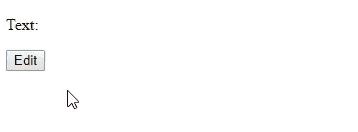
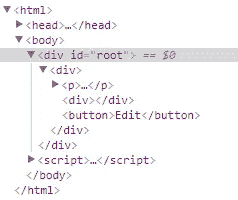
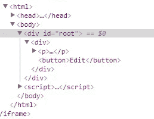

# 8 React 条件渲染方法

> 原文：<https://dev.to/bnevilleoneill/8-react-conditional-rendering-methods-311>

[T2】](https://res.cloudinary.com/practicaldev/image/fetch/s--V-_qG637--/c_limit%2Cf_auto%2Cfl_progressive%2Cq_auto%2Cw_880/https://cdn-images-1.medium.com/max/1024/1%2AiePG8qczEBX1ICAMR5U-JQ.png)

JSX 是一个强大的 JavaScript 扩展，允许我们定义 UI 组件。但是它不直接支持循环或者条件表达式(虽然之前已经讨论过增加[条件表达式)。](https://github.com/reactjs/react-future/issues/35)

如果你想遍历一个列表来呈现多个组件或者实现一些条件逻辑，你必须使用纯 Javascript。对于循环，您也没有太多的选择。大多数时候，地图会满足你的需求。

但是条件表达式呢？

那是另一个故事。

### 你有选项

在 React 中使用条件表达式的方式不止一种。而且，与编程中的大多数事情一样，根据您试图解决的问题，有些比其他的更适合。

本教程涵盖了最流行的条件渲染方法:

*   If/Else
*   防止使用空值呈现
*   元素变量
*   三元运算符
*   短路运算符(&&)
*   立即调用的函数表达式(IIFE)
*   子组件
*   高阶组件(hoc)

作为所有这些方法如何工作的示例，将实现一个具有查看/编辑功能的组件:

[T2】](https://res.cloudinary.com/practicaldev/image/fetch/s--pWI7Bih6--/c_limit%2Cf_auto%2Cfl_progressive%2Cq_auto%2Cw_880/https://cdn-images-1.medium.com/max/358/0%2AvS8AU_xnc4VHcHrK.)

你可以试着在 [JSFiddle](https://jsfiddle.net/) 中分叉所有的例子。

让我们从使用 if/else 块的最简单的实现开始，并从那里开始构建。

### 如果/否则

让我们创建一个具有以下状态的组件:

```
class App extends React.Component {
  constructor(props) {
    super(props);
    this.state = {text: '', inputText: '', mode:'view'};
  }
} 
```

Enter fullscreen mode Exit fullscreen mode

您将为保存的文本使用一个属性，为正在编辑的文本使用另一个属性。第三个属性将指示您是处于编辑模式还是查看模式。

接下来，添加一些处理输入文本以及保存和编辑事件的方法:

```
class App extends React.Component {
  constructor(props) {
    super(props);
    this.state = {text: '', inputText: '', mode:'view'};

    this.handleChange = this.handleChange.bind(this);
    this.handleSave = this.handleSave.bind(this);
    this.handleEdit = this.handleEdit.bind(this);
  }

  handleChange(e) {
    this.setState({ inputText: e.target.value });
  }

  handleSave() {
    this.setState({text: this.state.inputText, mode: 'view'});
  }

  handleEdit() {
    this.setState({mode: 'edit'});
  }
} 
```

Enter fullscreen mode Exit fullscreen mode

现在，对于 render 方法，检查 mode state 属性，以呈现编辑按钮或文本输入和保存按钮，以及保存的文本:

```
class App extends React.Component {
  // …
  render () {
    if(this.state.mode === 'view') {
      return (
        <div>
          <p>Text: {this.state.text}</p>
          <button onClick={this.handleEdit}>
            Edit
          </button>
        </div>
      );
    } else {
      return (
        <div>
          <p>Text: {this.state.text}</p>
            <input
              onChange={this.handleChange}
              value={this.state.inputText}
            />
          <button onClick={this.handleSave}>
            Save
          </button>
        </div>
      );
    }
} 
```

Enter fullscreen mode Exit fullscreen mode

下面是完整的尝试:
[https://jsfiddle.net/eh3rrera/L7bmevdo//embedded//dark](https://jsfiddle.net/eh3rrera/L7bmevdo//embedded//dark)
一个 if/else 块是解决问题最简单的方法，但是我相信您知道这不是一个好的实现。

它非常适合简单的用例，每个程序员都知道它是如何工作的。但是有很多重复，渲染方法看起来很拥挤。

所以我们简化一下，把所有的条件逻辑提取到两个渲染方法，一个渲染输入框，另一个渲染按钮:

```
class App extends React.Component {
  // …

  renderInputField() {
    if(this.state.mode === 'view') {
      return <div></div>;
    } else {
      return (
          <p>
            <input
              onChange={this.handleChange}
              value={this.state.inputText}
            />
          </p>
      );
    }
  }

  renderButton() {
    if(this.state.mode === 'view') {
      return (
          <button onClick={this.handleEdit}>
            Edit
          </button>
      );
    } else {
      return (
          <button onClick={this.handleSave}>
            Save
          </button>
      );
    }
  }

  render () {
    return (
      <div>
        <p>Text: {this.state.text}</p>
        {this.renderInputField()}
        {this.renderButton()}
      </div>
    );
  }
} 
```

Enter fullscreen mode Exit fullscreen mode

下面是完整的试验:
[https://jsfiddle.net/eh3rrera/q0w1aamt//embedded//dark](https://jsfiddle.net/eh3rrera/q0w1aamt//embedded//dark)
注意，当应用程序处于视图模式时，方法 renderInputField 返回一个空的 div 元素。

然而，这不是必须的。

### 防止用 null 渲染

如果你想**隐藏**一个组件，你可以让它的 render 方法返回 null，没有必要把一个空的(不同的)元素作为占位符来呈现。

当返回 null 时要记住的一件重要事情是，即使组件没有出现，它的生命周期方法仍然被触发。

举个例子，下面的提琴实现了一个有两个组件的计数器:

[https://jsfiddle.net/eh3rrera/tp69try8//embedded//dark](https://jsfiddle.net/eh3rrera/tp69try8//embedded//dark)

数字组件只呈现偶数值的计数器，否则返回 null。但是，当您查看控制台时，您会看到 componentDidUpdate 总是被调用，而不管 render 返回的值是什么。

回到我们的例子，将 renderInputField 方法修改成这样:

```
renderInputField() {
    if(this.state.mode === 'view') {
      return null;
    } else {
      return (
          <p>
            <input
              onChange={this.handleChange}
              value={this.state.inputText}
            />
          </p>
      );
    }
  } 
```

Enter fullscreen mode Exit fullscreen mode

下面是完整的小提琴:

[https://jsfiddle.net/eh3rrera/b87v3z9r//embedded//dark](https://jsfiddle.net/eh3rrera/b87v3z9r//embedded//dark)

返回 null 而不是空元素的一个好处是，您可以稍微提高应用程序的性能，因为 React 不必卸载组件来替换它。

例如，当尝试用[拨弄](https://jsfiddle.net/eh3rrera/q0w1aamt/)呈现空的 div 元素时，如果打开 Inspector 选项卡，您会看到根下的 div 元素总是在更新:

[T2】](https://res.cloudinary.com/practicaldev/image/fetch/s--dGGrGJst--/c_limit%2Cf_auto%2Cfl_progressive%2Cq_auto%2Cw_880/https://cdn-images-1.medium.com/max/238/0%2A1f--Ics8DXB3UFp_.)

与返回 null 来隐藏组件的情况不同，当单击 Edit 按钮时，div 元素不会更新:

[T2】](https://res.cloudinary.com/practicaldev/image/fetch/s--NPn-iL6g--/c_limit%2Cf_auto%2Cfl_progressive%2Cq_auto%2Cw_880/https://cdn-images-1.medium.com/max/258/0%2A7SzdmNMiVje-msFz.)

[在这里](https://reactjs.org/docs/reconciliation.html)，您可以了解更多关于 React 如何更新 DOM 元素以及“diffing”算法如何工作的信息。

也许在这个简单的例子中，性能的提高是微不足道的，但是当处理大型组件时，可能会有所不同。

稍后我将更多地讨论条件渲染的性能含义。现在，让我们继续改进这个例子。

### 元素变量

我不喜欢的一点是在方法中有不止一个 return 语句。

所以我将使用一个变量来存储 JSX 元素，并且只在条件为真时初始化它:

```
renderInputField() {
    let input;

    if(this.state.mode !== 'view') {
      input = 
        <p>
          <input
            onChange={this.handleChange}
            value={this.state.inputText} />
        </p>;
    }

      return input;
  }

  renderButton() {
    let button;

    if(this.state.mode === 'view') {
      button =
          <button onClick={this.handleEdit}>
            Edit
          </button>;
    } else {
      button =
          <button onClick={this.handleSave}>
            Save
          </button>;
    }

    return button;
  } 
```

Enter fullscreen mode Exit fullscreen mode

这与从这些方法返回 null 的结果相同。

下面是尝试一下的小提琴:

[https://jsfiddle.net/eh3rrera/n7u3g5f0//embedded//dark](https://jsfiddle.net/eh3rrera/n7u3g5f0//embedded//dark)

主呈现方法以这种方式更具可读性，但是也许没有必要使用 if/else 块(或者类似 switch 语句的东西)和辅助呈现方法。

让我们尝试一个更简单的方法。

### 三元运算符

我们可以使用[三元条件运算符](https://en.wikipedia.org/wiki/%3F:) :
，而不是使用 if/else 块

```
condition ? expr_if_true : expr_if_false 
```

Enter fullscreen mode Exit fullscreen mode

运算符用花括号括起来，表达式可以包含 JSX，也可以用括号括起来以提高可读性。

并且它可以应用于组件的不同部分。让我们将它应用到示例中，这样您就可以看到它的实际效果。

我将移除 renderInputField 和 renderButton，在 render 方法中，我将添加一个变量来了解组件是处于查看模式还是编辑模式:

```
render () {
  const view = this.state.mode === 'view';

  return (
      <div>
      </div>
  );
} 
```

Enter fullscreen mode Exit fullscreen mode

现在，如果设置了`view`模式，您可以使用三元运算符返回`null`，否则返回输入字段:

```
 // ...

  return (
      <div>
        <p>Text: {this.state.text}</p>

        {
          view
          ? null
          : (
            <p>
              <input
                onChange={this.handleChange}
                value={this.state.inputText} />
            </p>
          )
        }

      </div>
  ); 
```

Enter fullscreen mode Exit fullscreen mode

使用三元运算符，您可以声明一个组件，通过相应地更改其处理程序和标签来呈现保存或编辑按钮:

```
 // ...

  return (
      <div>
        <p>Text: {this.state.text}</p>

        {
          ...
        }

        <button
          onClick={
            view 
              ? this.handleEdit 
              : this.handleSave
          } >
              {view ? 'Edit' : 'Save'}
        </button>

      </div>
  ); 
```

Enter fullscreen mode Exit fullscreen mode

如前所述，这个操作符可以应用于组件的不同部分。

下面是尝试一下的小提琴:

[https://jsfiddle.net/eh3rrera/y6yff8rv/](https://jsfiddle.net/eh3rrera/y6yff8rv/)

### 短路算子

三元运算符有一个可以简化的特例。

当您想要呈现某些内容或不呈现任何内容时，您只能使用&&运算符。

与&运算符不同，&&不会计算右边的表达式，如果仅仅通过计算左边的表达式就可以决定最终结果的话。

例如，如果第一个表达式的计算结果为 false (false && …)，则没有必要计算下一个表达式，因为结果总是 false。

在 React 中，您可以使用如下表达式:

```
return (
    <div>
        { showHeader && <Header /> }
    </div>
); 
```

Enter fullscreen mode Exit fullscreen mode

如果 showHeader 评估为 true，表达式将返回

<header>组件。

如果 showHeader 的计算结果为 false，则

<header>组件将被忽略，并返回一个空 div。

这样，下面的表达式:

```
{
  view
  ? null
  : (
    <p>
      <input
        onChange={this.handleChange}
        value={this.state.inputText} />
    </p>
  )
} 
```

Enter fullscreen mode Exit fullscreen mode

可以变成:

```
!view && (
  <p>
    <input
      onChange={this.handleChange}
      value={this.state.inputText} />
  </p>
) 
```

Enter fullscreen mode Exit fullscreen mode

下面是完整的提琴:
[https://jsfiddle.net/eh3rrera/g47fkytj//embedded//dark](https://jsfiddle.net/eh3rrera/g47fkytj//embedded//dark)
比较好看吧？

然而，三元运算符并不总是更好看。

考虑一组复杂的嵌套条件:

```
return (
  <div>
    { condition1
      ? <Component1 />
      : ( condition2
        ? <Component2 />
        : ( condition3
          ? <Component3 />
          : <Component 4 />
        )
      )
    }
  </div>
); 
```

Enter fullscreen mode Exit fullscreen mode

这很快就会变得一团糟。

出于这个原因，有时您可能希望使用其他技术，比如立即调用的函数。

### 立即调用函数表达式(IIFE)

顾名思义，IIFEs 是定义后立即执行的函数，没有必要显式调用它们。

一般来说，这就是你如何定义和执行(稍后)一个函数:

```
function myFunction() {

// ...

}

myFunction(); 
```

Enter fullscreen mode Exit fullscreen mode

但是，如果您想在函数定义后立即执行它，您必须将整个声明放在括号中(以将其转换为表达式)，并通过再添加两个括号(传递函数可能接受的任何参数)来执行它。

任一种方式

```
( function myFunction(/* arguments */) {
    // ...
}(/* arguments */) ); 
```

Enter fullscreen mode Exit fullscreen mode

或者这样:

```
( function myFunction(/* arguments */) {
    // ...
} ) (/* arguments */); 
```

Enter fullscreen mode Exit fullscreen mode

因为这个函数不会在其他地方被调用，所以你可以去掉这个名字:

```
( function (/* arguments */) {
    // ...
} ) (/* arguments */); 
```

Enter fullscreen mode Exit fullscreen mode

或者你也可以使用箭头功能:

```
( (/* arguments */) => {
    // ...
} ) (/* arguments */); 
```

Enter fullscreen mode Exit fullscreen mode

在 React 中，你用花括号把一个生命括起来，把所有你想要的逻辑放进去(if/else，switch，三元操作符等等)，然后返回你想要呈现的任何东西。

例如，下面是用 IIFE 呈现保存/编辑按钮的逻辑:

```
{
  (() => {
    const handler = view 
                ? this.handleEdit 
                : this.handleSave;
    const label = view ? 'Edit' : 'Save';

    return (
      <button onClick={handler}>
        {label}
      </button>
    );
  })()
} 
```

Enter fullscreen mode Exit fullscreen mode

完整的小提琴曲如下:
[https://jsfiddle.net/eh3rrera/x6cnasfp//embedded//dark](https://jsfiddle.net/eh3rrera/x6cnasfp//embedded//dark)

### 子组件

有时，一个 IFFE 可能看起来像一个黑客的解决方案。

毕竟，我们正在使用 React，其中推荐的方法是将应用程序的逻辑拆分成尽可能多的组件，并使用函数式编程而不是命令式编程。

因此，将条件呈现逻辑移动到一个子组件中是一个不错的选择，这个子组件根据其属性呈现不同的东西。

但在这里，我将做一些不同的事情，向您展示如何从命令式解决方案过渡到更具声明性和功能性的解决方案。

我将从创建一个 SaveComponent 开始:

```
const SaveComponent = (props) => {
  return (
    <div>
      <p>
        <input
          onChange={props.handleChange}
          value={props.text}
        />
      </p>
      <button onClick={props.handleSave}>
        Save
      </button>
    </div>
  );
}; 
```

Enter fullscreen mode Exit fullscreen mode

作为属性，它接收工作所需的一切。同样，还有一个 EditComponent:

```
const EditComponent = (props) => {
  return (
    <button onClick={props.handleEdit}>
      Edit
    </button>
  );
}; 
```

Enter fullscreen mode Exit fullscreen mode

现在渲染方法可以是这样的:

```
render () {
    const view = this.state.mode === 'view';

    return (
      <div>
        <p>Text: {this.state.text}</p>

        {
          view
            ? <EditComponent handleEdit={this.handleEdit}  />
            : (
              <SaveComponent 
               handleChange={this.handleChange}
               handleSave={this.handleSave}
               text={this.state.inputText}
             />
            )
        } 
      </div>
    );
} 
```

Enter fullscreen mode Exit fullscreen mode

完整的小提琴曲如下:
[https://jsfiddle.net/eh3rrera/hh99fzbd//embedded//dark](https://jsfiddle.net/eh3rrera/hh99fzbd//embedded//dark)

### If 成分

有像 [JSX 控制语句](https://github.com/AlexGilleran/jsx-control-statements)这样的库，它们扩展了 JSX 来添加条件语句，比如:

```
<If condition={ true }>

<span>Hi!</span>

</If> 
```

Enter fullscreen mode Exit fullscreen mode

这些库提供了更高级的组件，但是如果我们需要像简单的 if/else 这样的东西，我们可以做一些像 [Michael J. Ryan](https://github.com/tracker1) 在本期[的](https://github.com/facebook/jsx/issues/65)[评论](https://github.com/facebook/jsx/issues/65#issuecomment-255484351)中展示的事情 :

```
const If = (props) => {
  const condition = props.condition || false;
  const positive = props.then || null;
  const negative = props.else || null;

  return condition ? positive : negative;
};

// …

render () {
    const view = this.state.mode === 'view';
    const editComponent = <EditComponent handleEdit={this.handleEdit}  />;
    const saveComponent = <SaveComponent 
               handleChange={this.handleChange}
               handleSave={this.handleSave}
               text={this.state.inputText}
             />;

    return (
      <div>
        <p>Text: {this.state.text}</p>
        <If
          condition={ view }
          then={ editComponent }
          else={ saveComponent }
        />
      </div>
    );
} 
```

Enter fullscreen mode Exit fullscreen mode

完整的小提琴曲如下:
[https://jsfiddle.net/eh3rrera/chL3onza//embedded//dark](https://jsfiddle.net/eh3rrera/chL3onza//embedded//dark)

### 高阶分量

一个[高阶组件](https://reactjs.org/docs/higher-order-components.html) (HOC)是一个函数，它接受一个现有的组件，并返回一个具有一些附加功能的新组件:

```
const EnhancedComponent = higherOrderComponent(component); 
```

Enter fullscreen mode Exit fullscreen mode

应用于条件渲染时，一个 HOC 可以返回一个不同于基于某个条件传递的组件:

```
function higherOrderComponent(Component) {
  return function EnhancedComponent(props) {
    if (condition) {
      return <AnotherComponent { ...props } />;
    }

    return <Component { ...props } />;
  };
} 
```

Enter fullscreen mode Exit fullscreen mode

有一篇[关于 HOCs](https://www.robinwieruch.de/gentle-introduction-higher-order-components/) 的优秀文章，作者是[罗宾·维鲁奇](https://www.robinwieruch.de/about/)，深入探讨了高阶组件的条件渲染。

在本文中，我将借用 either 组件的概念。

在函数式编程中，这两种类型通常用作包装器来返回两个不同的值。

因此，让我们首先定义一个带有两个参数的函数，另一个函数将返回一个布尔值(条件求值的结果)，如果该值为 true，将返回组件:

```
function withEither(conditionalRenderingFn, EitherComponent) {

} 
```

Enter fullscreen mode Exit fullscreen mode

按照惯例，特设机构的名称以单词 with 开头。

该函数将返回另一个函数，该函数将原始组件返回一个新组件:

```
function withEither(conditionalRenderingFn, EitherComponent) {
    return function buildNewComponent(Component) {

    }
} 
```

Enter fullscreen mode Exit fullscreen mode

由这个内部函数返回的组件(函数)将是您将在应用程序中使用的组件(函数)，因此它将接受一个具有所有工作所需属性的对象:

```
function withEither(conditionalRenderingFn, EitherComponent) {
    return function buildNewComponent(Component) {
        return function FinalComponent(props) {

        }
    }
} 
```

Enter fullscreen mode Exit fullscreen mode

内部函数可以访问外部函数的参数，所以现在，根据函数 conditionalRenderingFn 返回的值，您可以返回组件或原始组件:

```
function withEither(conditionalRenderingFn, EitherComponent) {
    return function buildNewComponent(Component) {
        return function FinalComponent(props) {
            return conditionalRenderingFn(props)
                ? <EitherComponent { ...props } />
                 : <Component { ...props } />;
        }
    }
} 
```

Enter fullscreen mode Exit fullscreen mode

或者，使用箭头功能:

```
const withEither = (conditionalRenderingFn, EitherComponent) => (Component) => (props) =>
  conditionalRenderingFn(props)
    ? <EitherComponent { ...props } />
    : <Component { ...props } />; 
```

Enter fullscreen mode Exit fullscreen mode

这样，使用先前定义的 SaveComponent 和 EditComponent，您可以创建一个 withEditConditionalRendering 特设，并以此创建一个 EditSaveWithConditionalRendering 组件:

```
const isViewConditionFn = (props) => props.mode === 'view';

const withEditContionalRendering = withEither(isViewConditionFn, EditComponent);
const EditSaveWithConditionalRendering = withEditContionalRendering(SaveComponent); 
```

Enter fullscreen mode Exit fullscreen mode

您可以在 render 方法中使用它，传递所有需要的属性:

```
render () {    
    return (
      <div>
        <p>Text: {this.state.text}</p>
        <EditSaveWithConditionalRendering 
               mode={this.state.mode}
               handleEdit={this.handleEdit}
               handleChange={this.handleChange}
               handleSave={this.handleSave}
               text={this.state.inputText}
             />
      </div>
    );
} 
```

Enter fullscreen mode Exit fullscreen mode

完整的小提琴曲如下:
[https://jsfiddle.net/eh3rrera/n22moyaf//embedded//dark](https://jsfiddle.net/eh3rrera/n22moyaf//embedded//dark)

### 性能考虑

条件渲染可能很棘手。正如我之前向您展示的，每个选项的性能都可能不同。

然而，大多数时候，这些差异并不重要。但是当他们这样做时，你需要很好地理解 React 如何与虚拟 DOM 一起工作，以及一些优化性能的技巧。

这里有一篇关于在 React 中[优化条件渲染的好文章，我完全推荐你读一读。](https://medium.com/@cowi4030/optimizing-conditional-rendering-in-react-3fee6b197a20)

基本思想是，由于条件渲染而改变组件的位置会导致回流，这将卸载/装载应用程序的组件。

基于文章中的例子，我创建了两把小提琴。

第一个使用 if/else 块来显示/隐藏副标题组件:
[https://jsfiddle.net/eh3rrera/jr9fpv5a//embedded//dark](https://jsfiddle.net/eh3rrera/jr9fpv5a//embedded//dark)
；第二个使用短路操作符(& &)来做同样的事情:
[https://jsfiddle.net/eh3rrera/0wracyhf//embedded//dark](https://jsfiddle.net/eh3rrera/0wracyhf//embedded//dark)
打开检查器，点击几次按钮。

您将看到每个实现对内容组件的不同处理。

### 结论

正如编程中的许多事情一样，在 React 中有许多方法可以实现条件呈现。

我要说的是，除了第一种方法(if/else 有许多返回)，您可以自由选择您想要的任何方法。

您可以根据以下几点来决定哪一个最适合您的情况:

*   你的编程风格
*   条件逻辑有多复杂
*   您对 JavaScript、JSX 和高级 React 概念(如 HOCs)有多熟悉

在同等条件下，总是倾向于简单性和可读性。

* * *

### Plug: LogRocket，一款用于网络应用的 DVR

[T2】](http://logrocket.com)

LogRocket 是一个前端日志工具，可以让你回放问题，就像它们发生在你自己的浏览器中一样。LogRocket 不需要猜测错误发生的原因，也不需要向用户询问截图和日志转储，而是让您重放会话以快速了解哪里出错了。它可以与任何应用程序完美配合，不管是什么框架，并且有插件可以记录来自 Redux、Vuex 和@ngrx/store 的额外上下文。

除了记录 Redux 操作和状态，LogRocket 还记录控制台日志、JavaScript 错误、堆栈跟踪、带有头+正文的网络请求/响应、浏览器元数据和自定义日志。它还使用 DOM 来记录页面上的 HTML 和 CSS，甚至为最复杂的单页面应用程序重新创建像素级完美视频。

免费试用。

* * *

帖子 [8 React 条件渲染方法](https://blog.logrocket.com/conditional-rendering-in-react-c6b0e5af381e/)最先出现在[博客](https://blog.logrocket.com)上。

</header>

</header>