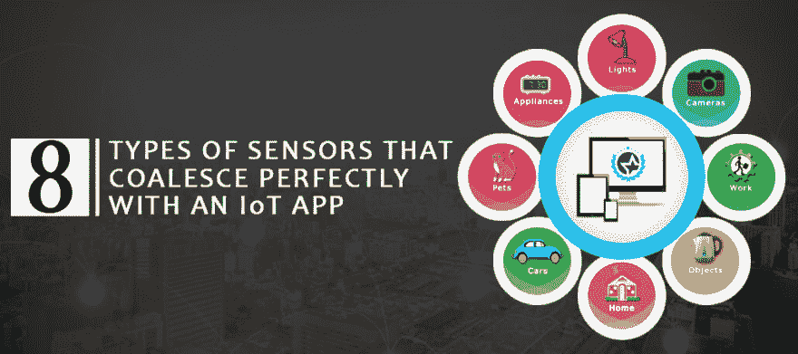

# 与物联网应用完美结合的 8 种传感器

> 原文：<https://dev.to/itfirms/8-types-of-sensors-that-coalesce-perfectly-with-an-iot-app-4kco>

 
区分人类和正常生物的一个因素是什么？或者是什么因素促使人类让机器变得更聪明？嗯，正是他们好奇的思维让他们用现有的技术去想象、实验和创新，并开发新的技术。正如玫瑰永远不会没有刺一样，物联网网络也不能没有传感器部队。看看各种传感器是如何在物联网世界中混在一起的:[https://www . it firms . co/8-types-of-sensors-that-coalesce-with-an-IoT-app/](https://www.itfirms.co/8-types-of-sensors-that-coalesce-perfectly-with-an-iot-app/)