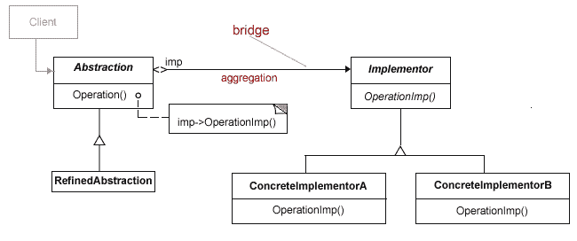

# 8 个终极全栈面试问题和答案

> 原文：<https://dev.to/fullstackcafe/8-ultimate-full-stack-interview-questions-dj5>

[](https://res.cloudinary.com/practicaldev/image/fetch/s--HHup0-0z--/c_limit%2Cf_auto%2Cfl_progressive%2Cq_auto%2Cw_880/https://images.pexels.com/photos/373934/pexels-photo-373934.jpeg%3Fauto%3Dcompress%26cs%3Dtinysrgb%26dpr%3D2%26h%3D350) 
全栈式 Web 开发人员是指能够同时从事应用程序前端和后端工作的人。前端通常是指用户将看到或与之交互的应用程序部分，后端是处理逻辑、数据库交互、用户身份验证、服务器配置等的应用程序部分。

> 🔴最初发表于 [FullStack。咖啡馆-杀死你的技术&编码面试](https://www.fullstack.cafe/?utm_source=dev&utm_medium=blog)

### Q1:什么是控制反转？

> 主题:**设计模式**
> 难度:⭐⭐

*控制反转*是一个宽泛的术语，但对于软件开发人员来说，它通常被描述为一种用于分离系统中组件和层的模式。

例如，假设您的应用程序有一个文本编辑器组件，您希望提供拼写检查。你的标准代码应该是这样的:

```
public class TextEditor {

    private SpellChecker checker;

    public TextEditor() {
        this.checker = new SpellChecker();
    }
} 
```

Enter fullscreen mode Exit fullscreen mode

我们在这里所做的在文本编辑器和拼写检查器之间创建了一个依赖关系。在 IoC 场景中，我们应该这样做:

```
public class TextEditor {

    private IocSpellChecker checker;

    public TextEditor(IocSpellChecker checker) {
        this.checker = checker;
    }
} 
```

Enter fullscreen mode Exit fullscreen mode

通过将实例化拼写检查器的责任从 TextEditor 类移交给调用者，您拥有了反向控制。

```
SpellChecker sc = new SpellChecker; // dependency
TextEditor textEditor = new TextEditor(sc); 
```

Enter fullscreen mode Exit fullscreen mode

🔗**来源:**【stackoverflow.com】T2

### Q2:持续整合的成功因素是什么？

> 题目:**devo PS**T2】难度:⭐⭐

*   维护代码库
*   自动化构建
*   进行构建自检
*   每个人每天都致力于基线
*   应该构建每个提交(基线)
*   保持快速构建
*   在生产环境的克隆中进行测试
*   让获取最新交付物变得容易
*   每个人都可以看到最新构建的结果
*   自动化部署

🔗**来源:**【edureka.co】T2

### Q3:什么是桥型？

> 主题:**设计模式**
> 难度:⭐⭐⭐

当我们需要将一个抽象从它的实现中分离出来，以便两者可以独立变化时，就会用到桥接模式。这种类型的设计模式属于*结构*模式，因为这种模式通过在实现类和抽象类之间提供一个桥梁结构来分离它们。

当类和它所做的经常变化时，桥接模式是有用的。类本身可以被认为是抽象，而类所能做的是实现。桥接模式也可以被认为是两层抽象。

[T2】](https://res.cloudinary.com/practicaldev/image/fetch/s--EB-FuHLv--/c_limit%2Cf_auto%2Cfl_progressive%2Cq_auto%2Cw_880/http://www.bogotobogo.com/DesignPatterimg/bridge/bridgediagram.png)

这种模式包含一个接口，它作为一座桥梁，使具体类的功能独立于接口实现者类。这两种类型的类都可以在结构上改变，而不会相互影响。

桥接模式实现的例子是:

```
 ----Shape---
                  /            \
         Rectangle              Circle
        /         \            /      \
BlueRectangle  RedRectangle BlueCircle RedCircle 
```

Enter fullscreen mode Exit fullscreen mode

重构为:

```
 ----Shape---                        Color
         /            \                       /   \
Rectangle(Color)   Circle(Color)           Blue   Red 
```

Enter fullscreen mode Exit fullscreen mode

或者在一般情况下:

```
 A
     /     \
    Aa      Ab
   / \     /  \
 Aa1 Aa2  Ab1 Ab2 
```

Enter fullscreen mode Exit fullscreen mode

重构为:

```
 A         N
  /     \     / \
Aa(N) Ab(N)  1   2 
```

Enter fullscreen mode Exit fullscreen mode

🔗**来源:**【tutorialspoint.com】T2

### Q4:解释 Docker 的一个用例

> 题目:**devo PS**T2】难度:⭐⭐⭐

*   Docker 是一种在本地机器或云中运行虚拟机的低开销方式。尽管它们不是严格意义上的独立机器，也不需要引导操作系统，但它们给了你许多好处。
*   Docker 可以封装遗留应用程序，允许您将它们部署到服务器上，否则使用旧版本的包和软件可能不容易安装。
*   Docker 可用于构建测试盒，在您的部署过程中促进持续的集成测试。
*   Docker 可以用来在云中提供设备，使用 swarm 你也可以编排集群。

🔗**来源:** [发展到](https://dev.to/hullsean/6-devops-interview-questions--3e7c)

### Q5:解释 REST 和 GraphQL 的主要区别

> 题目:**graph QL**T2】难度:⭐⭐⭐

REST 和 GraphQL 之间最主要也是最重要的区别是 *GraphQL 不处理专用资源，而是一切都被视为一个图，因此是相互关联的，可以根据应用程序的确切需求进行查询*。

🔗**来源:**【medium.com/codingthesmartway-com-blog】T2

### Q6:什么是事件循环？

> 题目:**node . js**T2】难度:⭐⭐⭐

Node.js 是一个单线程应用程序，但是它通过事件和回调的概念支持并发性。由于 Node js 的每个 API 都是异步的，并且是单线程的，所以它使用异步函数调用来保持并发性。节点使用观察者模式。节点线程保持一个事件循环，每当任务完成时，它触发相应的事件，通知事件监听器函数执行。

🔗**来源:**【tutorialspoint.com】T2

### Q7:能否用通俗易懂的英语解释一下“git reset”是做什么的？

> 题目:**git**T2】难度:⭐⭐⭐⭐

一般来说，`git reset`的功能是获取当前分支，并将其重新设置为指向其他地方，并可能带来索引和工作树。

```
- A - B - C (HEAD, master)
# after git reset B (--mixed by default)
- A - B (HEAD, master)      # - C is still here (working tree didn't change state), but there's no branch pointing to it anymore 
```

Enter fullscreen mode Exit fullscreen mode

请记住，在 git 中，您有:

*   头指针，它告诉你你正在做什么提交
*   工作树，代表系统中文件的状态
*   暂存区(也称为索引)，它“暂存”更改，以便以后可以一起提交

所以考虑一下:

*   `git reset --soft`移动头部，但不接触临时区域或工作树。
*   `git reset --mixed`移动磁头并更新暂存区，但不更新工作树。
*   `git reset --merge`移动磁头，重置暂存区，并尝试将工作树中的所有更改移动到新的工作树中。
*   移动头部，把你的集结地和工作树调整到新的头部，扔掉所有东西。

使用案例:

*   当你想转移到另一个提交并在不“失去位置”的情况下修补东西时，使用`--soft`。你很少需要这个。
*   当您想要查看在另一次提交时的情况，但又不想丢失任何已有的更改时，可以使用`--mixed`(这是默认设置)。
*   当你想移动到一个新的地点，但是将你已经有的改变合并到工作树中时，使用`--merge`。
*   使用`--hard`清除所有内容，并在新提交时重新开始。

🔗**来源:**【stackoverflow.com】T2

### Q8:解释 JavaScript 中的原型继承？

> 题目: **JavaScript**
> 难度:⭐⭐⭐⭐

在实现传统继承的语言中，如 Java、C#或 C++，你首先要创建一个类——你的对象的蓝图——然后你可以从这个类创建新的对象，或者你可以扩展这个类，定义一个新的类来扩充原来的类。

在 JavaScript 中，你首先创建一个对象(没有类的概念)，然后你可以扩充你自己的对象或者从它创建新的对象。

Javascript 中每个对象都有一个*原型*。JavaScript 的继承系统是原型的，不是基于类的。当一个消息到达一个对象时，JavaScript 将首先尝试在该对象中找到一个属性，如果找不到，那么消息将被发送到该对象的原型，以此类推。这种行为称为*原型链*或*原型继承*。

*构造函数*是 JavaScript 中构造原型链最常用的方式。当我们使用`new`时，JavaScript 以`this`关键字的形式注入一个对新对象的隐式引用。它还在函数的末尾隐式返回这个引用。

```
function Foo() {
  this.kind = ‘foo’
}

var foo = new Foo(); 
foo.kind //=> ‘foo’ 
```

Enter fullscreen mode Exit fullscreen mode

🔗**资料来源:** [体育。github.io](http://sporto.github.io/blog/2013/02/22/a-plain-english-guide-to-javascript-prototypes/)

> 谢谢🙌阅读，祝你面试好运！
> *查看更多 FullStack 面试问题&答案上👉 [www.fullstack.cafe](https://www.fullstack.cafe)*