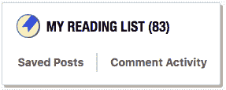
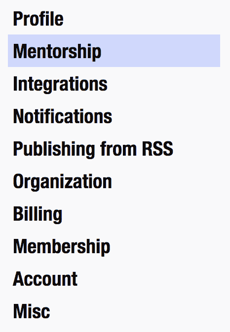

# 开发人员入门指南

> 原文：<https://dev.to/aspittel/a-beginners-guide-to-devto-n4a>

上周是我在 Dev.to 上的一周年纪念日(我也有了 10，000 名粉丝🎉)，所以想写个感谢帖。也就是说，作为一名教师，我认为最好的方法是创建一个开发指南，介绍如何以及为什么应该参与社区！

## 什么是开发到

根据[关于页面](https://dev.to/about)，Dev.to 是:

> 程序员在这里分享想法，互相帮助成长。这是一个分享和发现伟大想法、进行辩论和交朋友的在线社区。任何人都可以分享文章、问题、讨论等。只要他们有权分享他们的话。欢迎从你自己的博客交叉发帖。

我也很欣赏[会议的类比](https://youtu.be/ptJAlOSewW8?t=187)，因为 dev.to 比许多其他开发者网站更尊重地鼓励想法分享和讨论。

这是一个讨论开发者话题和创建博客文章的好地方！

## 我为什么爱 Dev.to

我使用 Dev.to 作为我的主要博客平台有很多原因，甚至在尝试了一些其他平台之后，我想分享一下为什么:

### 人民

首先，它有一个很棒的讨论话题的社区——评论通常非常有建设性，你可以从中学到很多！我在这里遇到了很多很酷的人！

### 行为准则

Dev.to 社区最大的优势之一是[强有力的行为准则](https://dev.to/code-of-conduct)得到了很好的执行。像 HackerNews 和 Reddit 这样的网站很快就会变成“有毒网站”,这使得在那里发帖变得很困难。这里更有建设性的社区和适度的评论让我发帖更舒服！

### 读者群

更小的社区、首页算法和巨大的 [@ThePracticalDev Twitter](https://twitter.com/thepracticaldev) 账户使得你的博客文章更容易获得读者。当我开始写技术文章的时候，我在媒体上写，几乎没有读者。在转移到 Dev.to 后，我的帖子立即获得了更多的浏览量，这真的激励了我写作！

### 广告

广告现在是一个非常有趣的道德问题——从可疑的未公开的影响者营销到使用个人数据进行广告定位。我非常欣赏 Dev.to 透明且可选择退出的[赞助](https://dev.to/sponsors)和[会员](https://dev.to/membership)模式。

### 开源

Dev.to 是开源的，允许更多的社区参与和透明度。例如，您可以在代码中看到首页算法。

### 平易近人的领导

本、[杰斯](https://dev.to/jess)和[彼得](https://dev.to/peter)都是该网站的活跃成员，他们都是社区的超级响应成员。我认为这真的很酷，并导致一个真正透明和不断改善的网站。

### #SheCoded

每年的国际妇女节，Dev.to hosts [#SheCoded](https://dev.to/jess/everyone-please-join-us-for-shecoded-2018--56l2) ，来自女性和非二进制科技界人士的故事占据了这一天的主页！

## 关键特性

### 帖子

帖子是 dev.to 的基本功能，它们可以采用传统格式，就像普通的博客帖子一样，但是它们也可以用于讨论线程、ama，或者用于托管其他媒体格式的内容，比如视频或播客。你可以切换到`help`标签来查看更多关于 Dev.to markdown 以及如何将其他媒体嵌入到你的帖子中，比如 CodePens 或 YouTube 视频。你也可以阅读更多关于 frontmatter 的内容，它包含了关于你的文章的元数据，比如标签、封面图片和一个规范的 url(如果你是交叉发布的话)。

[T2】](https://res.cloudinary.com/practicaldev/image/fetch/s--V4J3nn6l--/c_limit%2Cf_auto%2Cfl_progressive%2Cq_auto%2Cw_880/https://thepracticaldev.s3.amazonaws.com/i/3mbvr01hcqt6mm7s23jw.png)

### 首页提要

主页显示与您相关的热门、最近的帖子。标签和您关注的人发布的帖子也会突出显示！还有一些小部件显示带有特定标签的帖子。您还可以切换到查看周、月、年、无限期的热门帖子，或者只查看最新的帖子！

### 注释

这些是对帖子的回复，可以进行线索化，以便进行对话。他们采用 Markdown 格式，你可以使用相同的液体模板，你可以在正常的职位！

### 标签

根据你感兴趣的内容，你可以关注不同的标签。然后，带有这些标签的故事将出现在您的时间线上。你也可以点击一个标签，查看属于它的所有文章！

### 反应

你可以对任何❤️组合的帖子做出回应，🦄，和书签。你给出的反应越多，它就越能提升文章在首页的位置。

[T2】](https://res.cloudinary.com/practicaldev/image/fetch/s--6AIIgBex--/c_limit%2Cf_auto%2Cfl_progressive%2Cq_auto%2Cw_880/https://thepracticaldev.s3.amazonaws.com/i/52iy1olv2glfcva3yeo9.png)

书签还有一个额外的功能，就是把它添加到阅读列表中，在那里你可以保存你想以后阅读的文章！

[T2】](https://res.cloudinary.com/practicaldev/image/fetch/s--r5BZgqZs--/c_limit%2Cf_auto%2Cfl_progressive%2Cq_auto%2Cw_880/https://thepracticaldev.s3.amazonaws.com/i/eiw7pi07h4bbcb4f9njk.png)

### 会谈

该社区还定期举办不同主题的讲座。你可以查看[这个](https://dev.to/events)日历，看看接下来会发生什么。

### Merch

你也可以得到非常酷的带有 Dev 标志的东西。敬请关注，[看起来](https://twitter.com/bendhalpern/status/1055122044189319172)很快会有更酷的东西出现！

### RSS 源

如果你喜欢文章自动导入，而不是复制粘贴，你可以通过设置页面来设置。

Dev.to 鼓励交叉发布，这对于拥有自己的博客或者也想发布到 Medium 的人来说非常好。

[T2】](https://res.cloudinary.com/practicaldev/image/fetch/s--V4J3nn6l--/c_limit%2Cf_auto%2Cfl_progressive%2Cq_auto%2Cw_880/https://thepracticaldev.s3.amazonaws.com/i/3mbvr01hcqt6mm7s23jw.png)

### 表现

Dev.to 速度超快，这很棒:它带来了很好的用户体验，也让网站更容易访问。

 [## 让 dev.to 快得不可思议

### 本哈尔彭 2 月 2 日 175 分钟阅读

#webperf #meta](/ben/making-devto-insanely-fast)

### 离线页面

Dev.to 也是一个渐进式的 web 应用程序，这意味着它有一个页面，即使你离线也能显示出来！你甚至可以在上面画画！

### 前 7 名(和反应)

每周，7 个最受欢迎的帖子会出现在一封电子邮件中，还有[一个帖子](https://dev.to/devteam/the-7-most-popular-dev-posts-from-the-past-week-1kh8)。这是一个很好的方法来阅读一些其他人在过去一周喜欢的帖子！此外，还有一个每周贴，上面有本周[的五大评论](https://dev.to/devteam/top-5-dev-comments-from-the-past-week-1jkl)！

丹和[马利克](https://dev.to/milkstarz)也开始了讨论这些热门帖子的播客，这是一个必须要听的——他们非常积极，对他们有很大的影响！

 [## 开发人员回顾#4:本周前 7 项，已讨论

### 丹尼尔·戈兰特 10 月 17 日 181 分钟阅读

#discuss #audio #bestofdev #popular](/dangolant/devto-review-4-top-7-of-the-week-discussed-5ddb)

### 重复出现的线程

还有一些其他线程会定期出现。每周都有一个关于开源项目寻找贡献者的帖子:

 [## 谁在寻找开源贡献者？(10 月 22 日版)

### 本哈尔彭 10 月 22 日 181 分钟阅读

#discuss #opensource #hacktoberfest](/ben/whos-looking-for-open-source-contributors-october-22nd-edition-44jb)

有一个关于谁在招聘的月度帖子:

 [## 谁在招人？(截至 2018 年 10 月)

### 开发人员至员工 10 月 16 日 181 分钟读取

#whoishiring #discuss](/thepracticaldev/who-is-hiring-as-of-october-2018-1324)

新用户自我介绍的定期欢迎主题:

 [## 欢迎线程- v19

### 开发人员至员工 10 月 22 日 181 分钟读取

#welcome](/thepracticaldev/welcome-thread---v19-549m)

此外，Dev.to codebase 上还有每周一期的问题，您可以帮助解决:

 [## 值得注意的发展问题

### 安迪赵(他/他)10 月 24 日 181 分钟阅读

#meta #hacktoberfest](/devteam/notable-devto-issues-up-for-grabs-4h64)

### 简介

每个用户都有一个个人资料，他们可以用它来告诉社区更多关于他们自己的信息(说到这里，我真的应该更新我的了！).你也可以改变你是否在找工作！您还可以链接到您的其他 code 社交媒体帐户，并以一些 GitHub repos 为特色。

### 关注用户

当你关注一个用户时，他们的帖子会出现在你的首页。此外，您还会收到关于他们新帖子的通知。

### 连接

连接聊天室是一项新功能。你可以直接给你关注的人发信息，也可以给关注你的人发信息！你可以通过点击导航条上的飞机图标到达那里。

### iOS 应用

这是另一个更新的特性——有一个针对 dev.to 的 iOS 应用程序!由于它也是一个渐进式的 web 应用程序，所以您也可以在 Android 上将它保存为手机上的应用程序！

### 师友

导师配对计划是一个测试功能，允许成员相互指导！我没有带宽参加，但是你可以在你的设置里的`Mentorship`下报名。

[T2】](https://res.cloudinary.com/practicaldev/image/fetch/s--qKOuwuso--/c_limit%2Cf_auto%2Cfl_progressive%2Cq_auto%2Cw_880/https://thepracticaldev.s3.amazonaws.com/i/k6gry9vp7w44ng4fac08.png)

## 帖子开始

我想在 Dev.to 上分享一些我最喜欢的帖子，以激励你写作，并给你一些好东西来读！

### 建议

 [## 我是一个平庸的开发者

### 尼基塔·索博列夫 3 月 13 日 186 分钟阅读

#learning #career #beginners #productivity](/sobolevn/i-am-a-mediocre-developer--30hn)
 [## 前端 web 开发不是你想的那样。

### 穆纳穆罕默德 11 月 22 日 174 分钟阅读

#tech #webdev #javascript #advice](/munamohamed94/front-end-web-development-is-not-what-you-think-it-is-1ib)
 [## 你应该问的面试问题

### 金·阿内特·2 月 9 日 184 分钟阅读

#career](/kaydacode/interview-questions-you-should-ask--3dkc)

### 意见件

 [## 请停止使用本地存储

### Randall de gges 1 月 30 日 1811 分钟阅读

#programming #security #javascript](/rdegges/please-stop-using-local-storage-1i04)

## 文章不再可用

### 讨论

 [## 我从远程工作中学到的 10 件事

### 林赛·科帕奇 10 月 13 日 185 分钟阅读

#remote #discuss #mentalhealth #career](/lkopacz/10-things-ive-learned-from-working-remotely-240h)

## 文章不再可用

### 教程

 [## 我希望拥有的 Shell 简介

### max Anton ucci Jul 16 ' 18 11min read

#shell #productivity #beginners #explainlikeimfive](/maxwell_dev/the-shell-introduction-i-wish-i-had-551k)
 [## 使用 React 上下文 API -入门

### 斯科特斯宾塞 10 月 14 日 1814 分钟阅读

#react #context #api #gettingstarted](/spences10/using-the-react-context-api---gettingstarted-nje)

### AMAs

 [## 反应初学者问题线程⚛

### 丹·阿布拉莫夫 12 月 24 日 171 分钟阅读

#react #javascript #beginners #webdev](/dan_abramov/react-beginner-question-thread--1i5e)
 [## 我是桑迪·梅斯，问我什么都行！[已完成]

### 桑迪梅斯 1 月 24 日 181 分钟阅读

#ama](/sandimetz/im-sandi-metz-ask-me-anything-4ff9)

## 开始过帐

现在你对社区有了更多的了解，开始发帖吧！这里有一堆关于开始写博客的帖子。或者你可以从评论或询问别人的帖子开始！

## 谢谢你！❤️

在过去的一年里，我只想对这个社区表示深深的感谢！通过使用这个平台学习如何写博客真是太棒了，我也从中成长了很多。你们都很支持我，我从这里的人们身上学到了很多。此外，为开发人员创建了这样一个令人敬畏的平台而大声欢呼——迫不及待地想看到它的成长！