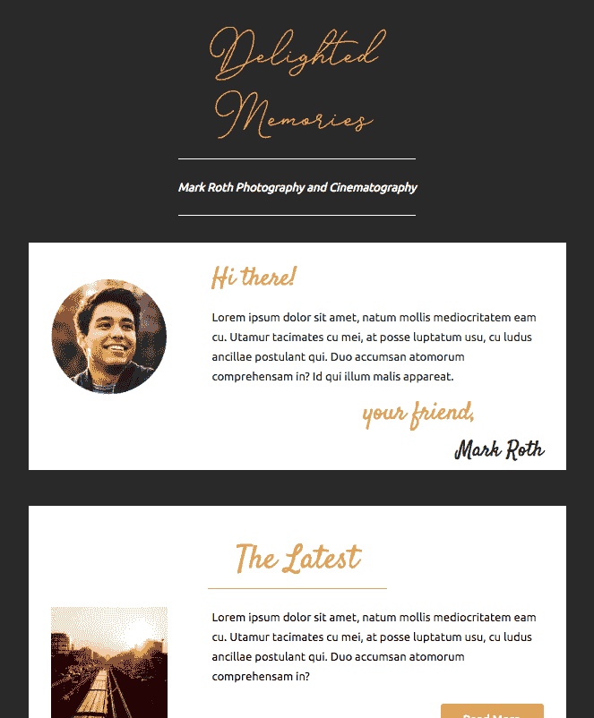
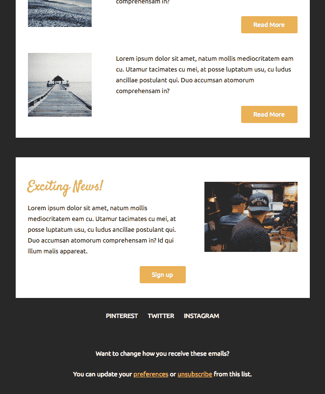

# 更好的电子邮件编码方式

> 原文：<https://dev.to/modayilme/a-better-way-to-code-newsletters-20no>

所以我在大学的时候有一份短命的时事通讯。这是一份流行文化/新闻时事通讯。

《不知情的告密者》是一份针对我大学朋友的时事通讯，指责我对身边的新闻一无所知。我发现这真的很讽刺，因为我总是提到流行文化或新闻中的东西，但没有人意识到这一点。不，我不知道像沙特阿拉伯这样的国家正在发生什么，但我知道世界上正在发生什么，因为我每天都要花很多时间在互联网和社交媒体上。事实上，我之所以写这篇时事通讯，是因为我觉得我的大学朋友们是不知情的人(我大学的大部分时间都是因为我们位于俄亥俄州的一个小镇上)。

这让我学会了如何“编码一封 HTML 邮件”,并意识到编码一封 HTML 邮件的最佳途径是不编码。我在学习如何编写 HTML 邮件时遇到的问题与下面的问题有些相似。

## 关于 HTML 邮件

HTML 邮件很讨厌。我从来没有手动写过，也永远不会写。你能怪我吗？你见过 HTML 邮件兼容代码吗？到处都是。

HTML 邮件客户端有[不同的渲染引擎](https://www.smashingmagazine.com/2017/01/introduction-building-sending-html-email-for-web-developers/#client-rendering-engines)，一些客户端默认不同的风格。前一句中的链接表示 Gmail 使用 Arial 字体系列设置表格数据的示例。

另一个问题是，由于只有少数电子邮件客户端能够使用[媒体查询](https://litmus.com/help/email-clients/media-query-support/)，电子邮件设计可能会感到有些受限。如果你支持 Outlook，你可能不得不用 div 来替换表格，用 HTML 宽度来代替 CSS 宽度，以及其他数以百万计的问题。如果你已经学习了最新的 web 标准，那你就没有必要重新学习 10 年前的 HTML 标准。

如果你想为自己开发一个头疼的东西，看看下面这篇粉碎杂志的文章:

[砸弹匣](https://www.smashingmagazine.com/2017/01/introduction-building-sending-html-email-for-web-developers/#client-rendering-engines)

## 你好 MJML

[MJML](https://www.mjml.io)

MJML。IO 是 HTML 电子邮件的预处理程序。不，它没有采用现代 HTML 并将其转换为旧的 HTML-电子邮件友好代码，但它有一个简单的语言，使用列和行转换为 HTML-电子邮件友好代码。所以不要再去寻找如何写一个合适的 HTML 表格来定位一个链接或者你的布局，相反，遵循简单的模板框架，让它来完成工作。

是的，你必须学习 MJML 的语法，但它比过时的 HTML 电子邮件更容易理解。

### 先做第一件事。

> 让我们弄清楚一件事。学习一种工具需要时间。

您可以学习如何在没有工具的情况下完成实际的 dang 任务，但是使用工具完成这些任务的成本是多少呢？嗯，在这种情况下，学习如何手动做这该死的事情，会花很多时间。尤其是当我想知道如何正确地为所有电子邮件客户端/渲染引擎做这件事的时候。

另一方面，我仍然需要学习如何正确地使用工具来达到预期的结果。但是工具相对于手工任务的成本效益分析对我有利。学习如何使用 MJML，而不是普通的过时的 HTML 格式的电子邮件，需要的时间会少得多。

但是对自己唱反调，我非常信任一个能正常工作的工具。当我发现一个 bug 时会发生什么？好吧，那我就完了。可能不完全是这样，但是我只是想在你们的头脑中灌输“给予和接受”的思想，这种思想应该与前端工具一起出现。

> 这是所有的乐趣和游戏，直到你拧在建设过程中。

## 代码

下面是特定于 MJML 的语法。它可能看起来有点乱，但是我向你保证，它看起来比支持多个电子邮件客户端所需的输出 HTML 要干净得多。

```
<mjml>
  <mj-head>

    <mj-attributes>
      <mj-text align="center" color="#ffffff" />
    </mj-attributes>

    <mj-font name="Satisfy" href="https://fonts.googleapis.com/css?family=Satisfy" />
    <mj-title>Delighted Memories Newsletter</mj-title>

  </mj-head>

  <mj-body>
    <mj-container background-color="#292929">
      <mj-include path="./header.mjml" />

      <mj-section background-color="#ffffff">
        <mj-column width="30%" vertical-align="top">
          <mj-image width="200" padding-top="20px" padding-bottom="20px" src="https://s3-us-west-2.amazonaws.com/s.cdpn.io/549579/avatar-mark-roth.png"></mj-image>
        </mj-column>

        <mj-column width="70%" vertical-align="top">
          <mj-text align="left" font-size="28px" color="#E5B25D" font-family="Satisfy">Hi there!</mj-text>
          <mj-text align="left" color="#292929" padding-top="10px" padding-bottom="10px">
            Lorem ipsum dolor sit amet, natum mollis mediocritatem eam cu. Utamur tacimates cu mei, at posse luptatum usu, cu ludus ancillae postulant qui. Duo accumsan atomorum comprehensam in? Id qui illum malis appareat.
          </mj-text>
          <mj-text color="#E5B25D" font-family="Satisfy" align="right" padding-right="100px" font-size="28px">your friend,</mj-text>
          <mj-text color="#292929" font-family="Satisfy" align="right" font-size="24px">Mark Roth</mj-text>
        </mj-column>

        <mj-column width="100%" background-color="#292929">
          <mj-spacer height="40px"></mj-spacer>
        </mj-column>
      </mj-section>

      <mj-section background-color="#ffffff">
        <mj-column width="100%">
          <mj-text font-family="Satisfy" color="#E5B25D" font-size="36px">The Latest</mj-text>
          <mj-divider border-width="1px" border-color="#E5B25D" width="200px" />
        </mj-column>
        <mj-column width="30%">
          <mj-image src="https://picsum.photos/200/200?random" />
        </mj-column>
        <mj-column width="70%">
          <mj-text align="left" color="#000000">
            Lorem ipsum dolor sit amet, natum mollis mediocritatem eam cu. Utamur tacimates cu mei, at posse luptatum usu, cu ludus ancillae postulant qui. Duo accumsan atomorum comprehensam in?
          </mj-text>
          <mj-button href="http://google.com" align="right" background-color="#E5B25D">Read More</mj-button>
        </mj-column>

        <mj-column width="100%">
          <mj-spacer></mj-spacer>
        </mj-column>

        <mj-column width="30%">
          <mj-image src="https://picsum.photos/200/200" />
        </mj-column>
        <mj-column width="70%">
          <mj-text align="left" color="#000000">
            Lorem ipsum dolor sit amet, natum mollis mediocritatem eam cu. Utamur tacimates cu mei, at posse luptatum usu, cu ludus ancillae postulant qui. Duo accumsan atomorum comprehensam in?
          </mj-text>
          <mj-button href="http://google.com" align="right" background-color="#E5B25D">Read More</mj-button>
        </mj-column>

        <mj-column width="100%">
          <mj-spacer></mj-spacer>
        </mj-column>

        <mj-column width="30%">
          <mj-image src="https://picsum.photos/g/200/200?random" />
        </mj-column>
        <mj-column width="70%">
          <mj-text align="left" color="#000000">
            Lorem ipsum dolor sit amet, natum mollis mediocritatem eam cu. Utamur tacimates cu mei, at posse luptatum usu, cu ludus ancillae postulant qui. Duo accumsan atomorum comprehensam in?
          </mj-text>
          <mj-button href="http://google.com" align="right" background-color="#E5B25D">Read More</mj-button>
        </mj-column>

        <mj-column width="100%">
          <mj-spacer></mj-spacer>
        </mj-column>

        <mj-column width="100%" background-color="#292929">
          <mj-spacer height="40px"></mj-spacer>
        </mj-column>
      </mj-section>

      <mj-section background-color="#ffffff">
        <mj-column width="60%" vertical-align="top">
          <mj-text align="left" color="#E5B25D" font-family="Satisfy" font-size="28px">
            Exciting News!
          </mj-text>
          <mj-text align="left" color="#000000">
            Lorem ipsum dolor sit amet, natum mollis mediocritatem eam cu. Utamur tacimates cu mei, at posse luptatum usu, cu ludus ancillae postulant qui. Duo accumsan atomorum comprehensam in? Id qui illum malis appareat.
          </mj-text>
        </mj-column>

        <mj-column width="40%" vertical-align="top">
          <mj-image width="300px" src="https://images.unsplash.com/photo-1466151781656-41b0002fd529?auto=format&fit=crop&w=1566&q=80&ixid=dW5zcGxhc2guY29tOzs7Ozs%3D"></mj-image>
        </mj-column>

        <mj-column width="100%">
          <mj-button href="http://google.com" align="center" background-color="#E5B25D">Sign up</mj-button>
        </mj-column>
      </mj-section>

      <mj-navbar>
        <mj-column width="80%">
          <mj-inline-links base-url="">
            <mj-link href="https://www.pinterest.com/benmodayil/" color="#ffffff">Pinterest</mj-link>
            <mj-link href="http://www.twitter.com/modayilme" color="#ffffff">Twitter</mj-link>
            <mj-link href="http://www.instagram.com/modayilme" color="#ffffff">Instagram</mj-link>
          </mj-inline-links>
        </mj-column>
      </mj-navbar>

      <mj-include path="./footer.mjml" />

    </mj-container>
  </mj-body>

</mjml> 
```

[T2】](https://res.cloudinary.com/practicaldev/image/fetch/s--cxD6ptPg--/c_limit%2Cf_auto%2Cfl_progressive%2Cq_auto%2Cw_880/https://modayil.club/wp-content/uploads/2018/07/codepen.io_modayilme_live_RxPBdb-2.png)

[T2】](https://res.cloudinary.com/practicaldev/image/fetch/s--MB_hDJ9h--/c_limit%2Cf_auto%2Cfl_progressive%2Cq_auto%2Cw_880/https://modayil.club/wp-content/uploads/2018/07/codepen.io_modayilme_live_RxPBdb-1-1.png)

MJML 电子邮件的语法可能感觉有点奇怪，但术语足够通用，您不必多想，可以用更简单的术语来思考:

*   圆柱
*   容器
*   文本
*   按钮
*   nav-bar

这篇文章不是这个工具的教程。学习它的最好方法是阅读 MJML 文档，并使用 T2 现有的模板。

感谢阅读👋。