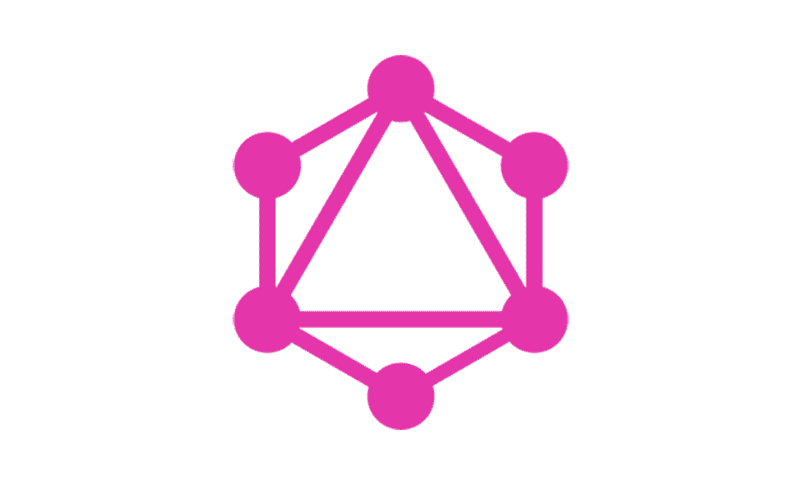

# 企业中 GraphQL 的一个案例

> 原文：<https://dev.to/hasurahq/a-case-for-graphql-in-enterprise-1nlh>

[T2】](https://res.cloudinary.com/practicaldev/image/fetch/s--LlJNV2PC--/c_limit%2Cf_auto%2Cfl_progressive%2Cq_auto%2Cw_880/https://blog.hasura.io/conteimg/downloaded_images/a-case-for-graphql-in-enterprise-84b4d13c72b3/1-5lwuNFUXOyTa1eqK3QJvrw.png)

GraphQL 最初由脸书于 2015 年发布，现已发展成为一项久经考验的技术，有望解决企业 IT 领域的关键挑战，特别是在加速 API/app 开发周期方面。GraphQL 用户名单不断增加，包括 Github、Twitter 和 Intuit 等公司。

简而言之，以下是 GraphQL 对企业内 API 生命周期管理的贡献:

*   GraphQL 支持动态查询，并且是类型安全的。这减少了需要开发的 API 的数量，并允许对消费者请求的数据进行编译时检查。
*   它被设计成能够无缝地连接多个数据源，减少复杂的跨功能 API 开发迭代的数量。
*   它得到了一个活跃社区的支持，该社区不断改进工具并简化 GraphQL 的采用。

你可以从我们这里找到更多关于 GraphQL 如何帮助企业的信息。

如果你为一个正在考虑使用 GraphQL 的组织工作，我们很乐意[与你交谈](https://hasura.io/help)！