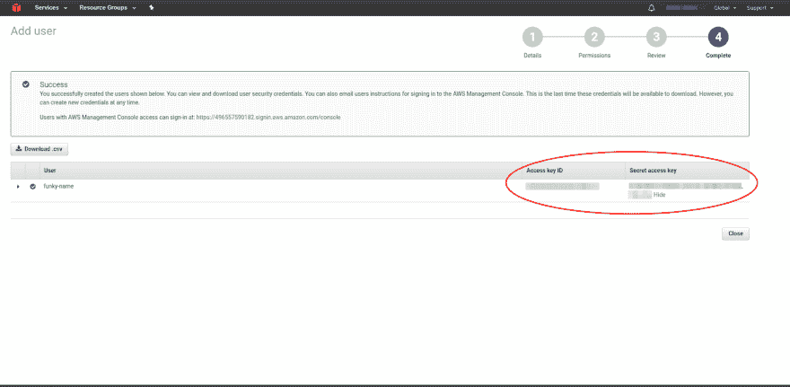

# Express 和 MongoDB 的无服务器 API 速成班

> 原文：<https://dev.to/adnanrahic/a-crash-course-on-serverless-apis-with-express-and-mongodb-193k>

无服务器已经成为各种用例的神奇工具。数据处理器、聊天机器人、API，凡是你能想到的，现在都是使用无服务器架构开发的。

今天，我将带您创建一个运行在 AWS Lambda 上的生产就绪的 Express API，它带有一个持久的 MongoDB 数据存储。是的，这是一个东西，你可以在 AWS Lambda 上构建 Express 应用程序。太神奇了，我知道！是的，你可以毫不犹豫地使用 MongoDB！

仔细想想，这很简单。使用 AWS Lambda 与使用小型 Node.js 运行时非常相似。它只是抽象出除了代码以外的所有东西。

让我们跳进来。

### TL；速度三角形定位法(dead reckoning)

你可以严重伤害我的感情，跳到你感兴趣的部分，或者继续读下去。

*   [项目设置](#accosaweam-1)
*   [在 MongoDB Atlas 上创建数据库](#accosaweam-2)
*   [安装依赖关系](#accosaweam-3)
*   [编写代码](#accosaweam-4)
*   [测试](#accosaweam-5)
*   [部署](#accosaweam-6)
*   [负载测试](#accosaweam-7)
*   [监控](#accosaweam-8)
*   [结束](#accosaweam-9)

### 项目设置

设置本身将是最基本的。但是，它仍然拥有您继续为未来的生产应用程序添加功能所需的一切。这里有一个最终布局的图表，这样你可以得到一个概述。

[T2】](https://res.cloudinary.com/practicaldev/image/fetch/s--_5KlNjLs--/c_limit%2Cf_auto%2Cfl_progressive%2Cq_auto%2Cw_880/https://raw.githubusercontent.com/adnanrahic/cdn/master/a-crash-course-on-serverless-apis-with-express-and-mongodb/project-setup.png)

正如你所看到的，这是一个相当简单的带有 CRUD 逻辑的 API，但是它完成了任务。说得够多了，让我们开始这个项目吧。

#### 1。安装无服务器框架

首先你需要安装和配置[无服务器框架](https://serverless.com/)。这是一个简单的 CLI 工具，使开发和部署变得非常容易。

```
$ npm i -g serverless 
```

Enter fullscreen mode Exit fullscreen mode

现在，您已经在计算机上全局安装了无服务器框架。现在，您可以在终端的任何位置使用无服务器命令。

***注意:**如果你使用的是 Linux，你可能需要以 sudo 的身份运行这个命令。*

#### 2。在 AWS 控制台中创建 IAM 用户

打开 AWS 控制台，点击左上角的服务下拉菜单。你会看到大量的服务出现。继续在搜索框中输入 IAM，然后点击它。

[T2】](https://res.cloudinary.com/practicaldev/image/fetch/s--FI96rka7--/c_limit%2Cf_auto%2Cfl_progressive%2Cq_auto%2Cw_880/https://cdn-images-1.medium.com/max/880/1%2A1BKK9Uf_iZg5aQMggHkFAw.png)

您将被重定向到您的帐户的 IAM 主页。继续添加新用户。

[T2】](https://res.cloudinary.com/practicaldev/image/fetch/s--2Tj0yjBP--/c_limit%2Cf_auto%2Cfl_progressive%2Cq_auto%2Cw_880/https://cdn-images-1.medium.com/max/880/1%2A2W0uhicsEKt274A-UFQsNQ.png)

给你的 IAM 用户起一个名字，并选中**编程访问**复选框。继续下一步。

[T2】](https://res.cloudinary.com/practicaldev/image/fetch/s--gqrDCsAr--/c_limit%2Cf_auto%2Cfl_progressive%2Cq_auto%2Cw_880/https://cdn-images-1.medium.com/max/880/1%2AHpGc2GUbMlpxngt_ovSQXA.png)

现在，您可以向用户添加一组权限。因为我们将让 Serverless 在我们的 AWS 帐户上创建和删除各种资产，所以继续检查 AdministratorAccess。

[T2】](https://res.cloudinary.com/practicaldev/image/fetch/s--baSEzJXC--/c_limit%2Cf_auto%2Cfl_progressive%2Cq_auto%2Cw_880/https://cdn-images-1.medium.com/max/880/1%2AiVJjs6_pqyNz-s8KFrZWvg.png)

继续下一步，您将看到用户已创建。现在，也只有现在，你才能访问用户**访问密钥 ID** 和秘密**访问密钥**。请务必记下它们或下载。csv 文件。保管好它们，不要给任何人看。尽管这只是一个演示，我还是把它们像素化了，以确保你理解保护它们安全的重要性。

[T2】](https://res.cloudinary.com/practicaldev/image/fetch/s--hNPJZW_G--/c_limit%2Cf_auto%2Cfl_progressive%2Cq_auto%2Cw_880/https://cdn-images-1.medium.com/max/880/1%2Aq4aHTY0FCsHIlAdZP9qPcA.png)

完成后，我们最终可以将密钥输入到无服务器配置中。

#### 3。在无服务器配置中输入 IAM 密钥

厉害！保存密钥后，您可以设置无服务器来访问您的 AWS 帐户。切换回您的终端，在一行中输入所有这些:

```
$ serverless config credentials --provider aws --key xxxxxxxxxxxxxx --secret xxxxxxxxxxxxxx 
```

Enter fullscreen mode Exit fullscreen mode

按回车键。现在，当您运行任何终端命令时，您的无服务器安装知道要连接到哪个帐户。让我们来看看它是如何工作的。

#### 4。创建服务

创建一个新目录来存放您的无服务器应用程序服务。在那里启动一个终端。现在您已经准备好创建一个新的服务了。

你问的服务是什么？把它当成一个项目。但也不尽然。在这里定义 AWS Lambda 函数、触发它们的事件以及它们需要的任何 AWS 基础设施资源，所有这些都在一个名为 **serverless.yml** 的文件中。

回到你的终端类型:

```
$ serverless create --template aws-nodejs --path sls-express-mongodb 
```

Enter fullscreen mode Exit fullscreen mode

create 命令将创建一个新的**服务**。修卡！但有趣的部分来了。我们需要为函数选择一个运行时。这被称为**模板**。传入`aws-nodejs`会将运行时设置为 Node.js .这正是我们想要的。路径将为服务创建一个文件夹。在本例中，将其命名为 **sls-express-mongodb** 。

#### 5。使用代码编辑器浏览服务目录

用你最喜欢的代码编辑器打开 **sls-express-mongodb** 文件夹。这里应该有三个文件，但是现在我们只关注**的 serverless.yml** 。它包含此服务的所有配置设置。您可以在这里指定常规配置设置和每个功能的设置。你的 **serverless.yml** 将充满样板代码和注释。请随意删除它，并粘贴这个。

```
# serverless.yml

service: sls-express-mongodb

custom:
  secrets: ${file(secrets.json)}

provider:
  name: aws
  runtime: nodejs8.10
  stage: ${self:custom.secrets.NODE_ENV}
  region: eu-central-1
  environment: 
    NODE_ENV: ${self:custom.secrets.NODE_ENV}
    DB: ${self:custom.secrets.DB}

functions:
  app:
    handler: server.run
    events:
      - http:
          path: /
          method: ANY
          cors: true
      - http:
          path: /{proxy+}
          method: ANY
          cors: true

plugins:
  - serverless-offline 
```

Enter fullscreen mode Exit fullscreen mode

属性列出了服务中的所有函数。我们只需要一个函数，因为我们的整个 Express 应用程序将被打包到这个函数中。**处理程序**引用它是哪个函数。我们最终的应用程序将有一个带有`run`功能的`server.js`文件。很简单。

现在来看看这些事件。他们是代理人。这意味着到达任何 HTTP 端点的每个请求都将被代理到内部的快速路由器。相当酷。

我们在顶部还有一个`custom`部分。这是将环境变量安全加载到我们的应用程序中的一种方式。稍后通过使用`${self:custom.secrets.<environment_var>}`来引用它们，实际值保存在一个名为`secrets.json`的简单文件中。

最后，我们还有用于离线测试的`serverless-offline`插件。

### 在 MongoDB Atlas 上创建数据库

准备好接受更多配置了吗？是啊，没人喜欢这部分。但是和我一起。跳到 [MongoDB 图集，报名](https://www.mongodb.com/cloud/atlas)。

这是免费的，不需要信用卡。这将是我们玩耍时需要的沙箱。设置好帐户后，打开您的帐户页面并添加一个新组织。

[T2】](https://res.cloudinary.com/practicaldev/image/fetch/s--HFc9jDI1--/c_limit%2Cf_auto%2Cfl_progressive%2Cq_auto%2Cw_880/https://cdn-images-1.medium.com/max/880/1%2AhM21Qo6sum_Bcj98giFYzQ.png)

选一个你喜欢的名字，任何一个都可以。点击“下一步”,继续创建组织。

[T2】](https://res.cloudinary.com/practicaldev/image/fetch/s--Mpz6oqNS--/c_limit%2Cf_auto%2Cfl_progressive%2Cq_auto%2Cw_880/https://cdn-images-1.medium.com/max/880/1%2A-JBOmTjNK0iSLb3VZEKwsw.png)

很好。这将带您进入组织页面。按下新项目按钮。

[T2】](https://res.cloudinary.com/practicaldev/image/fetch/s--32FfSwEb--/c_limit%2Cf_auto%2Cfl_progressive%2Cq_auto%2Cw_880/https://cdn-images-1.medium.com/max/880/1%2AsOxiyVzJjVFF_cV5V7oO6w.png)

这将打开一个页面来命名您的项目。只要输入你喜欢的名字，然后点击下一步。

[T2】](https://res.cloudinary.com/practicaldev/image/fetch/s--d4dFvcT6--/c_limit%2Cf_auto%2Cfl_progressive%2Cq_auto%2Cw_880/https://cdn-images-1.medium.com/max/880/1%2ASSSzcsD2g9z0JhFtAaWnBQ.png)

MongoDB 关心权限和安全性，所以 Atlas 将向您展示另一个管理权限页面。我们现在可以跳过这一步，创建项目。

[T2】](https://res.cloudinary.com/practicaldev/image/fetch/s--LM2eRDCx--/c_limit%2Cf_auto%2Cfl_progressive%2Cq_auto%2Cw_880/https://cdn-images-1.medium.com/max/880/1%2AyCM_HJiy-Qw42CxxF-LBpg.png)

唷，我们找到了。最后，我们可以创建实际的集群！按下巨大的绿色**“建立新集群”**按钮。这将打开一个巨大的集群创建窗口。您可以保留所有的默认值，只需确保选择 **M0** 实例大小，并禁用备份。如您所见，该集群的价格将是**免费**。相当不错。就是这样，点击**“创建集群”**。

[T2】](https://res.cloudinary.com/practicaldev/image/fetch/s--x_wX1nWl--/c_limit%2Cf_auto%2Cfl_progressive%2Cq_auto%2Cw_880/https://raw.githubusercontent.com/adnanrahic/cdn/master/a-crash-course-on-serverless-apis-with-express-and-mongodb/create-db-7.png)

之后，为集群添加一个管理员用户，并给他一个非常强的密码。

[T2】](https://res.cloudinary.com/practicaldev/image/fetch/s--1CJMVBd0--/c_limit%2Cf_auto%2Cfl_progressive%2Cq_auto%2Cw_880/https://raw.githubusercontent.com/adnanrahic/cdn/master/a-crash-course-on-serverless-apis-with-express-and-mongodb/create-db-9.png)

现在，您只需要允许从任何地方进行访问。转到 IP 白名单。

[T2】](https://res.cloudinary.com/practicaldev/image/fetch/s--R3mNnTOn--/c_limit%2Cf_auto%2Cfl_progressive%2Cq_auto%2Cw_880/https://raw.githubusercontent.com/adnanrahic/cdn/master/a-crash-course-on-serverless-apis-with-express-and-mongodb/create-db-8.png)

部署您的集群需要几分钟时间。在此过程中，让我们开始安装一些依赖项。

### 安装依赖项

这必须是任何项目中我最喜欢的部分...说从来没有人。但是，嘿，我们需要确保这一步做得正确，这样我们才能一帆风顺。

```
$ npm init -y
$ npm i --save express mongoose body-parser helmet serverless-http
$ npm i --save-dev serverless-offline 
```

Enter fullscreen mode Exit fullscreen mode

首先，我们正在安装生产依赖项，您肯定知道 Express、Mongoose 和 BodyParser。头盔是一个小的中间件，用适当的 HTTP 头来保护你的端点。然而，真正的力量在于无服务器的 HTTP 模块。它将在 Express 应用程序中创建代理，并将其打包到一个 lambda 函数中。

最后，我们需要无服务器离线本地测试我们的应用程序。我们现在终于写一些代码怎么样？

### 编写代码

是时候了！让我们直接开始吧。

#### 1。创建 server.js

首先，我们需要将我们的`handler.js`文件重命名为`server.js`。这里我们将只放入用`serverless-http`模块运行 lambda 函数的逻辑。

```
// server.js
const sls = require('serverless-http')
const app = require('./lib/app')
module.exports.run = sls(app) 
```

Enter fullscreen mode Exit fullscreen mode

如你所见，我们需要`serverless-http`，并导出一个名为`run`的函数。这将保存我们的应用程序作为参数传递的`serverless-http`实例的值。这就是我们将 Express 应用程序打包成 lambda 函数所需的一切！惊人的简单。

#### 2。添加秘密

接下来创建`secrets.json`文件来保存环境变量。

```
//  secrets.json  {  "NODE_ENV":  "dev",  "DB":  "mongodb://<user>:<password>@<clustername>.mongodb.net:27017,<clustername>.mongodb.net:27017,<clustername>.mongodb.net:27017/<database>?ssl=true&replicaSet=Cluster0-shard-0&authSource=admin&retryWrites=true"  } 
```

Enter fullscreen mode Exit fullscreen mode

要获取 Atlas 集群的连接字符串，请导航到集群仪表板并按下灰色的**连接按钮**。按照说明操作，确保 URL 看起来有点像上面的字符串。

#### 3。创建快速应用程序

现在我们可以开始编写实际的 Express 应用程序了。

在根目录下创建一个名为`lib`的新文件夹。在这里，您首先要创建一个`app.js`文件和`db.js`文件。

```
// ./lib/db.js
const mongoose = require('mongoose')
mongoose.connect(process.env.DB) 
```

Enter fullscreen mode Exit fullscreen mode

安装了`mongoose`大大简化了与数据库的连接。这就是我们所需要的。

***注**:在`secrets.json`中设置了`process.env.DB`，在`serverless.yml`中引用。*

一旦你添加了`db.js`切换到`app.js`文件。粘贴下面的代码片段。

```
// ./lib/app.js
const express = require('express')
const app = express()
const bodyParser = require('body-parser')
app.use(bodyParser.json())
app.use(bodyParser.urlencoded({ extended: true }))
const helmet = require('helmet')
app.use(helmet())

require('./db')
const routes = require('./routes')
app.use('/api', routes)

module.exports = app 
```

Enter fullscreen mode Exit fullscreen mode

如果你曾经用 Express 写过任何代码，你会觉得很熟悉。我们需要所有的模块，使用中间件，需要我们刚刚在上面创建的数据库连接，并将路由绑定到`/api`路径。但是我们还没有任何路线。好吧，那我们走吧！

#### 4。添加路线

在`lib`文件夹中，创建一个名为`routes`的新文件夹。它将是应用程序中所有路线的基础。在`routes`文件夹中创建一个`index.js`文件，并将这个片段粘贴进去。

```
// ./lib/routes/index.js
const express = require('express')
const router = express.Router()
const notes = require('./notes/notes.controller')
router.use('/notes', notes)
// Add more routes here if you want!
module.exports = router 
```

Enter fullscreen mode Exit fullscreen mode

现在，我们可以在这个文件中添加任何额外的路径，而不需要修改任何其他内容。那就简单多了。

#### 5。编写 CRUD 逻辑

我们已经到了有趣的部分。正如你在上面的`index.js`文件中看到的，我们想要一个`notes.controller.js`文件，在那里我们应该定义 CRUD 操作。好吧，让我们创造它！

然而，不要急于求成，我们首先需要一个 Notes API 模型。在`routes`文件夹中创建一个`notes`文件夹，并在其中创建另外两个名为`note.js`和`notes.controller.js`的文件。`note.js`将有我们的模型定义作为注释。像这样。

```
// ./lib/routes/notes/note.js
const mongoose = require('mongoose')
const NoteSchema = new mongoose.Schema({

  title: String,
  // this is a bug in the markdown - should not have the quotes ""
  description: String

})
module.exports = mongoose.model('Note', NoteSchema) 
```

Enter fullscreen mode Exit fullscreen mode

对于这个例子，只有标题和描述就足够了。继续，我们准备添加 CRUD。打开`notes.controller.js`并粘贴。

```
// ./lib/routes/notes/notes.controller.js
const express = require('express')
const notesController = express.Router()
const Note = require('./note')

notesController
  .post('/', async (req, res, next) => {
    const note = await Note.create(req.body)
    res.status(200).send(note)
  })

notesController
  .put('/:id', async (req, res, next) => {
    const note = await Note.findByIdAndUpdate(req.params.id, { $set: req.body }, { $upsert: true, new: true })
    res.status(200).send(note)
  })

notesController
  .get('/', async (req, res, next) => {
    const notes = await Note.find()
    res.status(200).send(notes)
  })

notesController
  .get('/:id', async (req, res, next) => {
    const note = await Note.findById(req.params.id)
    res.status(200).send(note)
  })

notesController
  .delete('/:id', async (req, res, next) => {
    const note = await Note.deleteOne({ _id: req.params.id })
    res.status(200).send(note)
  })

module.exports = notesController 
```

Enter fullscreen mode Exit fullscreen mode

确保不要忘记在文件的顶部需要注释模型。除此之外，一切都相当简单。我们使用通常的 Mongoose 模型方法来创建 CRUD 操作，当然，`async/await`的语法非常可爱。您还应该考虑在`await`操作符周围添加 try-catch 块。但是这个简单的例子就足够了。

关于代码就这些了。准备进行一些测试！

### 测试

我更习惯在部署我的应用程序之前进行本地测试。这就是为什么我将快速向您介绍如何使用`serverless-offline`完成的原因。因为您已经安装了它并将其添加到了`serverless.yml`中的`plugins`部分，所以您需要做的就是运行一个命令来启动本地机器上的 API Gateway 和 AWS Lambda 的本地仿真。

```
$ sls offline start --skipCacheInvalidation 
```

Enter fullscreen mode Exit fullscreen mode

***注意**:在你的项目根目录下运行`sls`，你应该会看到一个命令列表。如果配置正确的话，`sls offline`和`sls offline start`应该是可用的。*

为了让您更容易使用这个命令，您可以随意将它作为 npm 脚本添加到`package.json`中。

```
//  package.json  {  "name":  "a-crash-course-on-serverless-apis-with-express-and-mongodb",  "version":  "1.0.0",  "description":  "",  "main":  "app.js",  "scripts":  {  "offline":  "sls offline start --skipCacheInvalidation"  //  right  here!  },  "keywords":  [],  "author":  "Adnan Rahić",  "license":  "ISC",  "dependencies":  {  "body-parser":  "^1.18.3",  "express":  "^4.16.3",  "helmet":  "^3.12.1",  "mongoose":  "^5.1.7",  "serverless-http":  "^1.5.5"  },  "devDependencies":  {  "serverless-offline":  "^3.20.2"  }  } 
```

Enter fullscreen mode Exit fullscreen mode

添加后，您可以运行命令`npm run offline`来代替。更短也更容易记忆。跳回你的终端，继续运行它。

```
$ npm run offline 
```

Enter fullscreen mode Exit fullscreen mode

您将看到终端告诉您本地服务器已经在端口 3000 上启动。让我们来测试一下！

为了测试我的端点，我通常使用失眠症或 Postman，但是您可以随意使用您喜欢的任何工具。首先，通过点击 POST 端点来添加注释。

[T2】](https://res.cloudinary.com/practicaldev/image/fetch/s--z17TMKdY--/c_limit%2Cf_auto%2Cfl_progressive%2Cq_auto%2Cw_880/https://raw.githubusercontent.com/adnanrahic/cdn/master/a-crash-course-on-serverless-apis-with-express-and-mongodb/insomnia-post.png)

厉害！它正如预期的那样工作。继续尝试下一个 GET 请求。

[T2】](https://res.cloudinary.com/practicaldev/image/fetch/s--qQdi2Njj--/c_limit%2Cf_auto%2Cfl_progressive%2Cq_auto%2Cw_880/https://raw.githubusercontent.com/adnanrahic/cdn/master/a-crash-course-on-serverless-apis-with-express-and-mongodb/insomnia-get.png)

它像梦一样工作。现在，继续尝试所有其他端点。确保它们都正常工作，然后，让我们准备好将它部署到 AWS。

### 部署

如果我告诉你部署这个 API 只需要运行一个命令，你会相信吗？的确如此。

```
$ sls deploy 
```

Enter fullscreen mode Exit fullscreen mode

回到终端，运行上面的命令并保持耐心。您将看到终端中出现了几个端点。这些是你的 API 的端点。

同样，正如我在上面向您展示的，再次测试这些部署的端点，确保它们能够工作。

从这里开始，您可能会注意到您只将 API 部署到了`dev`阶段。那不会切断它。我们需要更改`NODE_ENV`并部署到生产环境中。打开`secrets.json`文件，将第二行改为:

```
"NODE_ENV":  "production", 
```

Enter fullscreen mode Exit fullscreen mode

这将传播并将 Express API 的环境设置为`production`并将`stage`设置为生产环境。在部署生产 API 之前，让我们删除`node_modules`文件夹，重新安装所有带有`--production`标志的模块。

```
$ rm -rf ./node_modules && npm i --production 
```

Enter fullscreen mode Exit fullscreen mode

这将确保只安装在`package.json`中的`dependencies`列表中指定的依赖项，排除来自`devDependencies`列表的依赖项。

在部署之前，您只需注释掉`serverless.yml`中的插件部分。

```
# serverless.yml

service: sls-express-mongodb

custom:
  secrets: ${file(secrets.json)}

provider:
  name: aws
  runtime: nodejs8.10
  stage: ${self:custom.secrets.NODE_ENV}
  region: eu-central-1
  environment: 
    NODE_ENV: ${self:custom.secrets.NODE_ENV}
    DB: ${self:custom.secrets.DB}

functions:
  app:
    handler: server.run
    events:
      - http:
          path: /
          method: ANY
          cors: true
      - http:
          path: /{proxy+}
          method: ANY
          cors: true

# comment this out
# plugins:
#   - serverless-offline 
```

Enter fullscreen mode Exit fullscreen mode

继续使用与上面相同的命令进行部署。

```
$ sls deploy 
```

Enter fullscreen mode Exit fullscreen mode

### 负载测试

如果我们不做任何负载测试，这就不是一个设置生产 API 的合适教程。我倾向于使用一个小的 npm 模块来做负载测试。它叫做 [loadtest](https://www.npmjs.com/package/loadtest) ，可以用一个简单的命令安装。

```
$ npm i -g loadtest 
```

Enter fullscreen mode Exit fullscreen mode

***注意** : Linux 用户需要在命令前加上前缀`sudo`。*

让我们慢慢开始。我们想要运行的命令是在 10 个并发用户的情况下用 GET 请求点击`/api/notes`路径 100 次。

```
$ loadtest -n 100 -c 10 https://<id>.execute-api.eu-central-1.amazonaws.com/production/api/notes 
```

Enter fullscreen mode Exit fullscreen mode

大约用了 5 秒钟来满足所有这些请求，而且进行得非常完美。您可以放心，无论您最终拥有何种规模的 API，它都会自动扩展到您需要的规模，并毫无问题地为您的用户服务。下面是这个负载测试的日志概述。

[T2】](https://res.cloudinary.com/practicaldev/image/fetch/s--7Zb5iYvM--/c_limit%2Cf_auto%2Cfl_progressive%2Cq_66%2Cw_880/https://raw.githubusercontent.com/adnanrahic/cdn/master/a-crash-course-on-serverless-apis-with-express-and-mongodb/dashbird-sls-express-mongo-2.gif)

这个监控工具叫做 [Dashbird](https://dashbird.io/) 。让我们来设置它，这样您也可以对您的 API 有一个正确的概述。

### 监视

对应用程序中发生的事情缺乏全面了解和足够的洞察力是无服务器架构的真正问题。有几个产品可以真正帮助减轻这种情况。其中一些是 [Dashbird](https://dashbird.io/features/) 、 [Datadog](https://www.datadoghq.com/) 、 [Serverless](https://serverless.com/) 、 [IOPipe](https://www.iopipe.com/) 等等。

您已经对上面的无服务器框架有了一个快速的了解。让我们也开始设置 Dashbird。您可以进入[官方文档并浏览快速入门](https://dashbird.io/docs/get-started/quick-start/)或按照下面的步骤操作。

#### 1。签约雇用

我觉得这很符合逻辑。在这里创建一个账户[。不需要信用卡，创建一个帐户，你就可以开始了。](https://dashbird.io/register/)

注册后，您将被重定向到入职页面，在这里您需要添加一个 **IAM 角色 ARN** 。幸运的是，Dashbird 开发人员为我们创建了一个 CloudFormation 堆栈，使得创建 IAM 角色变得非常简单。

#### 2。为 Dashbird 创建一个新的 **AWS IAM 角色**

注册后，您将被重定向到入职页面。

[T2】](https://res.cloudinary.com/practicaldev/image/fetch/s--IHwjzH20--/c_limit%2Cf_auto%2Cfl_progressive%2Cq_auto%2Cw_880/https://raw.githubusercontent.com/adnanrahic/cdn/master/a-crash-course-on-serverless-apis-with-express-and-mongodb/onboarding.png)

点击`create a new CloudFormation stack`链接，按照步骤进行操作。

[T2】](https://res.cloudinary.com/practicaldev/image/fetch/s--ibHgN_4e--/c_limit%2Cf_auto%2Cfl_progressive%2Cq_auto%2Cw_880/https://raw.githubusercontent.com/adnanrahic/cdn/master/a-crash-course-on-serverless-apis-with-express-and-mongodb/select-template.png)

你需要做的一切只是继续按下 next，直到你到达一个名为**的复选框，我承认 AWS CloudFormation 可能会创建 IAM 资源框**。检查它并创建堆栈。

[T2】](https://res.cloudinary.com/practicaldev/image/fetch/s--EqsV-ty4--/c_limit%2Cf_auto%2Cfl_progressive%2Cq_auto%2Cw_880/https://raw.githubusercontent.com/adnanrahic/cdn/master/a-crash-course-on-serverless-apis-with-express-and-mongodb/checkbox.png)

一旦创建了 CloudFormation 堆栈，您将在控制台中看到它。在这里，您只需复制**dashbirddintegrationrole**的 ARN。

[T2】](https://res.cloudinary.com/practicaldev/image/fetch/s--O742qcVy--/c_limit%2Cf_auto%2Cfl_progressive%2Cq_auto%2Cw_880/https://raw.githubusercontent.com/adnanrahic/cdn/master/a-crash-course-on-serverless-apis-with-express-and-mongodb/cloudformation.png)

嗯，那很简单。

#### 3。用创建的角色设置 Dashbird

你所需要做的就是**粘贴你上面复制的角色 ARN** ，你就可以开始了。Dashbird 将检查它是否有权访问您的 AWS 帐户。如果一切设置正确，您将被重定向到应用程序。原木将在一分钟内开始堆积。

确保检查您的功能，并检查您执行的测试是否在图表上可见。就这样，您已经构建了一个生产就绪的 API，可以轻松地部署和监控您的应用程序。给自己一个大大的鼓励！

### 包扎

这是一次冒险的旅程！您已经创建了一个生产就绪的无服务器 API。使用无服务器架构可能会令人害怕。主要是你没用过的服务，比如 Lambda 和 API Gateway。

我上面展示的方法是我通常的做法。使用 Node.js 和您已经习惯的框架、模块和中间件已经使向无服务器的过渡变得更加容易。

幸运的是，我们有像[无服务器框架](https://serverless.com/)这样的开发工具和像 [Dashbird](https://dashbird.io/) 这样的观察工具，这让开发者变得非常容易。

如果您错过了上面的任何步骤，[这里是包含所有代码的库](https://github.com/adnanrahic/a-crash-course-on-serverless-apis-with-express-and-mongodb)。

## [adnanrahic](https://github.com/adnanrahic)/[a-crash-course-on-servers-APIs-with-express-and-MongoDB](https://github.com/adnanrahic/a-crash-course-on-serverless-apis-with-express-and-mongodb)

<article class="markdown-body entry-content container-lg" itemprop="text">

# Express 和 Mongodb 的无服务器 API 速成班

关于如何创建无服务器 API 并将其部署到 AWS Lambda 的快速简单教程。持久性数据存储在 Atlas 集群上的 MongoDB 中。点击查看整个教程[。](https://dev.to/adnanrahic/a-crash-course-on-serverless-apis-with-express-and-mongodb-193k)

</article>

[View on GitHub](https://github.com/adnanrahic/a-crash-course-on-serverless-apis-with-express-and-mongodb)

如果你想阅读我以前的一些无服务器思考，请前往[我的简介](https://dev.to/adnanrahic)或[加入我的时事通讯！](https://upscri.be/b6f3d5/)

或者，马上看看我的几篇文章:

*   [使用无服务器和 MongoDB 解决不可见的扩展问题](https://dev.to/adnanrahic/solving-invisible-scaling-issues-with-serverless-and-mongodb-4m55)
*   [如何使用无服务器将 Node.js 应用程序部署到 AWS Lambda](https://dev.to/adnanrahic/how-to-deploy-a-nodejs-application-to-aws-lambda-using-serverless-2nc7)
*   [AWS Lambda 和 Node.js 入门](https://dev.to/adnanrahic/getting-started-with-aws-lambda-and-nodejs-1kcf)
*   [用 JSON web 令牌保护无服务器 API 的速成班](https://dev.to/adnanrahic/a-crash-course-on-securing-serverless-apis-with-json-web-tokens-22fa)
*   [将 Node.js REST API 迁移到无服务器](https://dev.to/adnanrahic/migrating-your-nodejs-rest-api-to-serverless-3gej)
*   [用 Node.js 和 MongoDB 构建无服务器 REST API](https://dev.to/adnanrahic/building-a-serverless-rest-api-with-nodejs-and-mongodb-43db)
*   [node . js 无服务器速成班](https://dev.to/adnanrahic/a-crash-course-on-serverless-with-nodejs-5jp)

希望你们喜欢读这篇文章，就像我喜欢写这篇文章一样。如果你喜欢，拍一下那个小心脏，这样 dev.to 上的更多人会看到这个教程。下次见，保持好奇，玩得开心。

* * *

[T2】](https://bit.ly/adnan-zeet)

免责声明: [Zeet](https://bit.ly/adnan-zeet) 将在下个月赞助这篇博客。前几天我试过了。这就像无服务器，但运行整个后端。你可以自动托管和扩展应用。相当整洁。

* * *