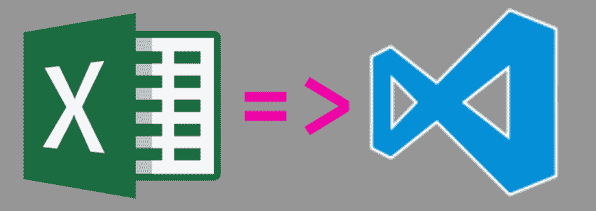

# 一个开发者的故事:帕特里克·鲍威尔

> 原文：<https://dev.to/prp1277/a-developer-story-patrick-powell-31gn>

[T2】](https://res.cloudinary.com/practicaldev/image/fetch/s--3w8kuRwc--/c_limit%2Cf_auto%2Cfl_progressive%2Cq_auto%2Cw_880/https://thepracticaldev.s3.amazonaws.com/i/gi9nt80qlxw1e2pn7mut.png)

> 我已经试着写了大约 1，387，923，465 次类似的帖子，但现在是我真正点击*发送*的时候了

# 我从 2017 年 8 月开始一直在*【打码】*

我在这里使用引号是因为直到最近我才真正考虑把 VBA 写成编码。

当我接受了一家食品服务批发商的采购分析师职位时，我的旅程开始了。在转到另一家银行的共同基金会计师之前，我曾在金融服务行业担任共同基金公司呼叫中心的 CSR。在这家银行工作时，我们广泛使用 Excel 宏。我并不真的关心他们如何工作，只要他们*做*工作。我的重点是提高我的核心 Excel 技能，我做得很好。

### 开始我的旅程

这家餐饮服务公司雇佣我的原因是为了改善他们的报告流程，并记录我的分析。基本上，我在 Excel 中生活是有报酬的，我选择使用 OneNote 进行文档记录。我花了前几周的时间来适应这个新行业，观察流程并手动创建每日和每周报告。

没过多久，我就厌倦了手动创建这些报告，所以我在亚马逊上买了一本[书](https://www.amazon.com/Excel-2013-Power-Programming-VBA/dp/1118490398),并按照推荐开始学习 VBA——启动宏记录器，做一些事情，检查结果代码。

### 下兔子洞

我越是使用这种技巧，就越是发现自己在 Excel 论坛上试图找到我遇到的问题的答案。随着时间的推移，我建立了非常有用的 Excel 资源库、论坛和教程，并将其保存在我的 OneNote 笔记本中以便于访问(说真的，OneNote 中的搜索功能非常棒)。

随着我对 VBA 和 Excel 的深入研究，我了解了幂查询，并将其添加到我的武器库中。这转变为寻找 Power BI 并创建仪表板来衡量管理层认为感兴趣的任何事情。我已经成了部门的 Excel 专家，基本上接触过所有进出部门的电子表格。

### 引人注目

几周之内，我已经自动化了几份每日报告，每天为同事节省 30 - 45 分钟。最值得注意的是，我编写了一个包含几个模块的宏来操作一个. csv 文件，并创建了几个数据透视表来衡量我们的性能。在这个文件被分配给我之前，我的部门还没有深入利用它。

没过多久，我们就一直是公司表现最好的部门之一。这促使我每周与我们地区的员工进行讨论，并分享我的宏和文档...这也是我一开始就开始记录事情的原因。由于这是每个部门使用的每周报告，这个宏节省了几个小时的时间，并在部门之间建立了一致性。

该公司正在向新系统过渡，这是 20 年来的第一次(至少我是这么听说的)。为了分享新系统的最佳实践，我们成立了一个每周任务小组，我站在了讨论的最前沿。最终，我被要求前往另一个部门，对他们进行我的流程培训，并向他们介绍 Power BI。在四个月内，我的“编码”改变了部门的报告流程，五年多来我们第一次实现了年度盈利。

### 一连串不幸的事件

这种转变不是没有代价的。因为我不得不从头开始学习所有这些技术，所以我醒着的大部分时间都在使用 Excel 或研究 Excel。有两次，这些熬夜导致我睡过了闹钟，上班迟到。公司有一个三振出局的政策，而我碰巧在去培训其他部门的第二天就出局了。

#### 那个星期五，我被叫进经理的办公室，当我看到人力资源经理和他在一起时，我知道这次会议将如何结束。

# 善后事宜

具有讽刺意味的是，我在被解雇 3 天后发现了 GitHub，并发现了这个回购协议，这对我开发上述报告有很大帮助。我开始浏览网站，并决定建立一个网站来展示我的技能。我克隆了一个 Jekyll-starter repo，并开始用自己的信息替换默认信息。

### 吉婷失意

在纠结于哲基尔的细微差别之后，我被告知去看看另一个有 VBA 背景的用户写的《T2》和《盖茨比》。总的来说，我发现文档比 Jekyll 的好得多，我喜欢在能够用 Markdown 写文章的同时学习 ReactJS 和 GraphQL 的想法。

这并不是说盖茨比的一切都按计划进行。目前，我正在重组我网站的 CSS，因为我意识到内联编写 CSS 通常是不被允许的。幸运的是，Netlify 允许我将部署锁定在一个看起来不错的构建上。

# 向前移动

我有几个项目，当我开始做的时候，才发现我所想象的远远超出了我的技能水平。然而，我昨天部署了第一个版本的金融网站，它基本上是 RobinHood.com 或 IEXtrading.com 的翻版。就金融网站而言，我可能是在重新发明轮子，但第一次看到我的页面用实时数据更新的感觉令人难以置信。

### 这样有什么意义呢？

正如我在第一句中所说的，这是我被解雇后尝试写的东西。我的信心被击碎了，这让我很难在任何社交媒体上发布任何东西。我想这篇文章更多的是关于恢复我的信心和分享我的故事，而不是给我建议或张贴教程，但就我而言，这是朝着正确方向迈出的一步。

如果你已经做到了这一步，感谢你的阅读，并在不久的将来关注那些建议/教程帖子😉