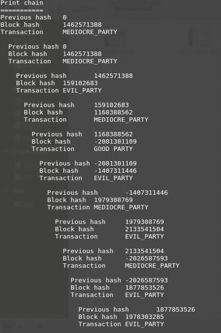

# C (II)中的一个伪区块链实现

> 原文：<https://dev.to/devmarchan/a-dummy-blockchain-implementation-in-c-ii-36eh>

*[一个假人区块链实现在 C (I)](https://dev.to/devmarchan/a-dummy-blockchain-implementation-in-c-i-3m97)*

## 1。政党

所有的成分都准备好了，现在是时候编写主函数了。正如我已经说过的，这将是一个投票系统。为此，我创建了下一个 enum，包含选举系统中所有可用的政党:

```
typedef enum party_code_t {
GOOD_PARTY, MEDIOCRE_PARTY, EVIL_PARTY, MAX_PARTIES
} party_code; 
```

以及随机获得投票的函数:

```
static party_code get_vote()
{
    int r = rand();
    return r%MAX_PARTIES;
} 
```

## 2。第一块:创世纪

```
NODE *head;
    DATA genesis_element;
    init(&head);

    transaction genesis_transactions = get_vote()};
    block_t genesis_block = {0, string_hash(genesis_transactions), genesis_transactions};
    genesis_element.info = genesis_block;
    head = add(head, genesis_element); 
```

为了创建新元素，需要三个步骤:

```
1\. To create the transaction. We create a transaction getting the name of the party.
2\. To create the block with its three fields: previous hash, current hash and a transaction.
3\. To create the node element of the list (the block) and to insert it to the list. 
```

人们通常把区块链中的第一块称为“创世纪”。由于没有前一个块，我们将前一个块的哈希设置为零。

## 3。添加投票

```
 int previous_hash = genesis_element.info.previous_block_hash;
    for(i=0;i<nvotes;i++) {

        DATA *el
        block_t *b;
        transaction t = {get_vote()};

        b->block_hash = string_hash(t);
        b->transactions = t;
        el->info = *b;
        previous_hash = b->block_hash;
        head = add(head, *el);
    } 
```

一旦插入了第一个元素，就可以创建一个循环来创建任意多的块。它遵循上面的三个步骤。

仅此而已。编译和执行之后，我们可以在终端中读取输出。每个投票(或块)都显示在前一个投票的下方，它由前一个投票的哈希、当前哈希和被投票方的名称组成。它的当前散列是由先前提交的所有投票形成的。

你可以在这里看到最终的[代码](https://github.com/jmarchanloro/1-blockchain)。核心是帖子里展示的片段，但是增加了更多的辅助代码，主要是打印链表。

[T2】](https://res.cloudinary.com/practicaldev/image/fetch/s--PgEIVNth--/c_limit%2Cf_auto%2Cfl_progressive%2Cq_auto%2Cw_880/https://i2.wp.com/myram.xyz/wp-content/uploads/2018/09/output.jpg%3Fw%3D454%26ssl%3D1)

[迈拉姆的原始帖子](https://myram.xyz/c-blockchain-implementation-2/)

**免责声明*:为了得到根本，这篇文章充满了简化和抽象。虽然区块链的一个关键点是，数据库不是存储在任何一个单独的位置，而是共享的，事务传播到节点的 P2P 网络，这里排除了所有的网络部分。*