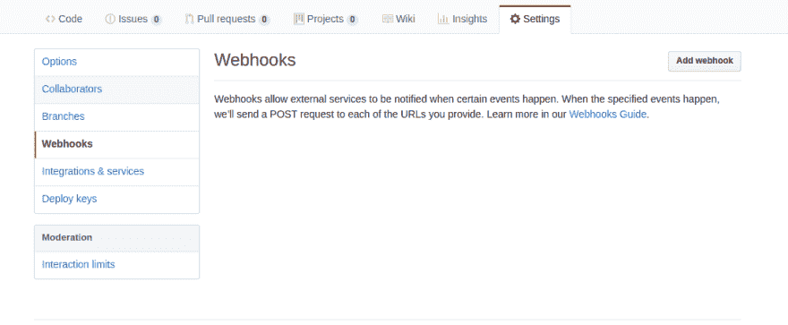
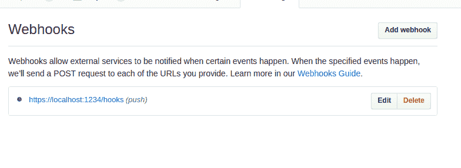

# Github Webhooks 的温和解释

> 原文：<https://dev.to/papaponmx/a-gentle-explanation-of-github-webhooks-----d3e>

# [T1】简介](#intro)

如你所知，我最近一直在研究木偶师。尝试将我认为重要、重复和无聊的事情自动化，或者可以实施[帕累托原则](https://en.wikipedia.org/wiki/Pareto_principle)的地方。这是一个中间的职位，我们将建立在该项目的下一部分。

在选择这篇文章的主题时，选择更大的目标并不容易，然而，我感觉就像在建立一个产品的边缘:是开源的，为你提供很多价值，让我们所有人兴奋，并且是盈利的。所有这四个，按照特定的顺序。

想的话可以发微博给我 [@papaponmx](https://twitter.com/papaponmx) ，DMs 开放。

## 什么是 webhooks，为什么它们很重要

在这个上下文中，*钩子是您可以订阅*的事件，以便触发一些动作。有可能你已经用了一段时间而不知道。在 git 和 Github 的上下文中，有许多您可能想了解的事件。

它们之所以重要，是因为它们允许我们仅在相关时执行某些操作，以下是一些示例:

*   当一个拉请求被创建时，运行所有的测试，让我知道它们是否正常。
*   当一个新的发布标签被创建时，对所有的新特性进行总结，并将其添加到`CHANGELOG.md`中。
*   当出现新问题时，通过 Slack 向团队发送消息。
*   任何时候发布，运行性能测试，寻找关键差异，让我知道结果。这是我们在下一篇文章中要做的。

这里有一个[链接](https://developer.github.com/webhooks/)，有更多你可以订阅的活动。

## 它是如何工作的

当某个事件发生时，Github 会给你发送一个 *HTTP POST* 让你知道事件发生了，*一个有效载荷*给我们提供相关信息。例如:如果你订阅了`pull_request`，它们的有效载荷会告诉我们是谁发起的，目标和起始分支等等。

如您所知，有效负载取决于事件，在`pull_request`有效负载中，我们有关于回购的信息:

```
{
//...
"repo": {
  "id": 135493233,
  "node_id": "MDEwOlJlcG9zaXRvcnkxMzU0OTMyMzM=",
  "name": "Hello-World",
  "full_name": "Codertocat/Hello-World",
  "owner": {
    "login": "Codertocat",
    "id": 21031067,
    "node_id": "MDQ6VXNlcjIxMDMxMDY3",
    "avatar_url": "https://avatars1.githubusercontent.com/u/21031067?v=4",
    "gravatar_id": "",
    "url": "https://api.github.com/users/Codertocat",
    "html_url": "https://github.com/Codertocat",
    "followers_url": "https://api.github.com/users/Codertocat/followers",
    "following_url": "https://api.github.com/users/Codertocat/following{/other_user}",
    "gists_url": "https://api.github.com/users/Codertocat/gists{/gist_id}",
    "starred_url": "https://api.github.com/users/Codertocat/starred{/owner}{/repo}",
    "subscriptions_url": "https://api.github.com/users/Codertocat/subscriptions",
    "organizations_url": "https://api.github.com/users/Codertocat/orgs",
    "repos_url": "https://api.github.com/users/Codertocat/repos",
    "events_url": "https://api.github.com/users/Codertocat/events{/privacy}",
    "received_events_url": "https://api.github.com/users/Codertocat/received_events",
    "type": "User",
    "site_admin": false
  },
} 
```

Enter fullscreen mode Exit fullscreen mode

如果你想查看`pull_request`、[的完整 JSON，这里有](https://developer.github.com/v3/activity/events/types/#pullrequestevent)的链接。

## 我们如何开始

很高兴你问了。现在我们有了基本的一般概念，我们需要两样东西:

1.  注册我们的 webhook。
2.  向我们的 webhook 公开一个端点。

### 注册我们的 webhook

在您的存储库上，您需要转到设置，单击 Webhooks 选项卡，您应该会看到这样的屏幕:

[T2】](https://res.cloudinary.com/practicaldev/image/fetch/s--cYA_mZB8--/c_limit%2Cf_auto%2Cfl_progressive%2Cq_auto%2Cw_880/https://thepracticaldev.s3.amazonaws.com/i/5c7s1nz05epuram7h0pg.png)

一旦你点击添加网页挂钩按钮，你将被要求提供以下数据:

*   **有效负载 URL** :这是我们将接收帖子的端点，类似于`http://localhost:4567/payload`。但是我们稍后会对此进行配置。
*   **内容类型**:来自前端背景，`application/json`更有意义。
*   **秘密**:这是一个字符串。它的目的是为我们提供一种方法来确保 POST 请求来自 Github。
*   **事件**:你想听的事件。

这是一个 webhook 添加的样子:
[](https://res.cloudinary.com/practicaldev/image/fetch/s--D6GilYUQ--/c_limit%2Cf_auto%2Cfl_progressive%2Cq_auto%2Cw_880/https://thepracticaldev.s3.amazonaws.com/i/sgtjikdm3e015cglndt9.png)

干杯伙计们。

### 进一步资源:

链接到我的木偶系列:

*   [第一部分](https://dev.to/papaponmx/front-end-development-automation-with-puppeteer-part-1-2k9n)
*   [第二部分](https://dev.to/papaponmx/front-end-automation-with-puppeteer-part-2-2pmb)
*   [第三部分](https://dev.to/papaponmx/front-end-development-automation-with-puppeteer-part-3-3pl6)

[Github webhooks 文档](https://developer.github.com/webhooks/)
我的推特资料， [@papaponmx](https://twitter.com/papaponmx) 。

干杯伙计们。