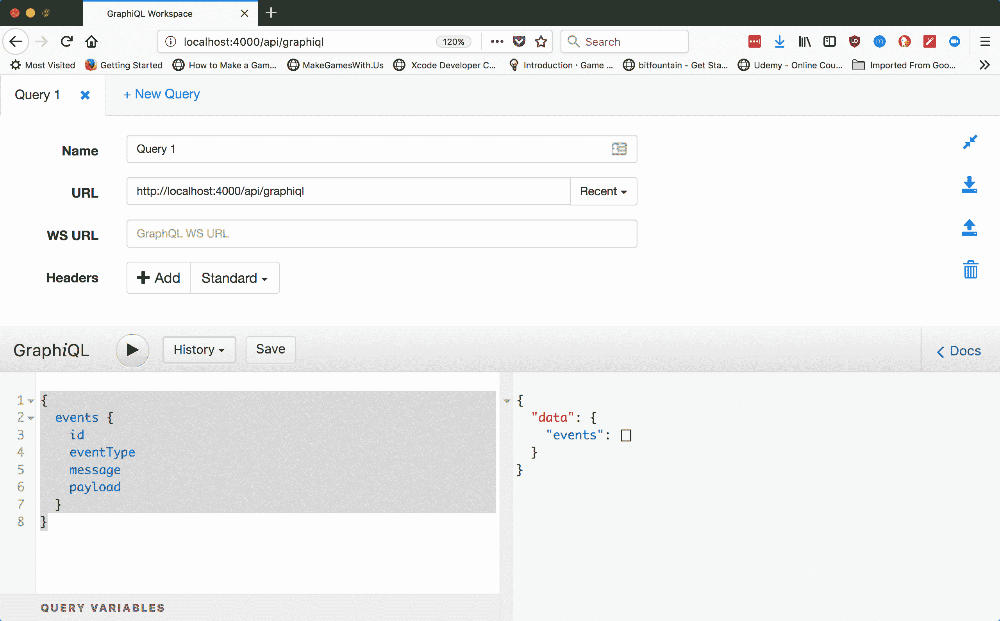

# GraphQL 与 Elixir 和 Phoenix 的温和介绍

> 原文：<https://dev.to/timber/a-gentle-introduction-to-graphql-with-elixir-and-phoenix-736>

## 获得一个工作的 GraphQL 应用程序！

#### 最新版本

*   酏剂:1.6.5 版
*   十六进制:v0.17.7
*   凤凰城:1.3.2 版
*   Ecto: v2.2.10 (phoenix_ecto 版本为 v3.2)
*   苦艾酒:1.4 版
*   苦艾酒插头:1.4 版

本教程建立在 Mac OS X 10.11.6 系统上。

#### 假设

1.  您了解最基本的 Elixir 语法和概念
2.  您已经有了一个现成的开发数据库
3.  您已经安装了所有必备软件。先决条件是:
    *   具有适当开发用户名/密码的 PostgreSQL([安装指南](https://wiki.postgresql.org/wiki/Detailed_installation_guides))
    *   药剂([安装指南](https://elixir-lang.org/install.html))
    *   凤凰([安装指南](https://hexdocs.pm/phoenix/installation.html#content))
    *   代码编辑器或 IDE(我将使用 [Visual Studio 代码](https://code.visualstudio.com/Download)

### 关于本指南

*这是你的朋友@ [Timber](https://timber.io/) 买给你的一个帖子。如果你有兴趣为我们写作，请在推特上联系[。](https://twitter.com/timberdotio)*

在本指南中，您将看到许多有用的东西，无论是描述、代码还是 shell 命令！任何时候你看到这样的代码:

```
$ do the thing 
```

Enter fullscreen mode Exit fullscreen mode

这些块表示正在运行的 shell 命令(具体来说，就是前面带有`$`的任何命令)。任何附加行都将从命令运行中输出。有时`...`会被用来表示为了简洁而删除的长文本块。

IEx (Elixir 的交互式 REPL)已经将命令表示成这样:

```
iex(1)> "do the thing" 
```

Enter fullscreen mode Exit fullscreen mode

并且任何附加的行将从该操作中输出。不要担心 parantheses 里面的数字。这些只是表明您的 IEx shell 当前的命令号，它们可能不匹配。

代码将用代码块来表示，就像这样:

```
name = "brandon"
name
|> String.upcase()
|> String.reverse() 
```

Enter fullscreen mode Exit fullscreen mode

从本教程中获得最大收益的最佳方式是跟随我们一起构建相同的项目(或类似的项目)。代码将在 Github 上提供，每一步都有检查点标签，允许你根据每个检查点的成品仔细检查代码！

## 继续应用

我们将从实际讨论这个项目旨在解决什么问题开始。在你开始考虑用什么来构建之前，先考虑你在构建什么总是好的；它防止了一些先有鸡还是先有蛋的情况，在这种情况下，你有一个正在使用的很棒的技术，而你试图用它构建的项目是完全不兼容的。

我们正在构建的项目将是一个存储/检索事件日志的应用程序。您可以使用它来跟踪您发出的请求，或者在日志中跟踪审计事件，或者...嗯，任何需要存储任意事件、类型、消息和有效载荷的东西。在我们开始谈论更多的设计之前，我们将从实际创建我们的项目并设置好一切开始。

接下来，我们的技术选择:Elixir 和 Phoenix 绝对是构建极高性能、低维护系统的绝佳选择，GraphQL 以各种方式获取大量数据集的能力使 Elixir 成为一个特别好的共生选择！

我们的项目将被称为“绿色精灵”的简称“Greenfy”(是的，一个愚蠢的苦艾酒参考)，但听起来更像创业。

### 创建新项目

事情是这样的:

```
 $ mix phx.new greenfy

    Fetch and install dependencies? [Yn] y
    ...
    We are all set! Go into your application by running:

    $ cd greenfy

    Then configure your database in config/dev.exs and run:

    $ mix ecto.create

    Start your Phoenix app with:

    $ mix phx.server

    You can also run your app inside IEx (Interactive Elixir) as:

    $ iex -S mix phx.server 
```

Enter fullscreen mode Exit fullscreen mode

运行我们的测试，验证绿色。

### 设置我们的应用程序

接下来，我们要遵循 Phoenix 在创建新项目时给我们的指示，所以我们需要做以下事情:

```
$ cd greenfy
$ mix ecto.create
The database for Greenfy.Repo has been created 
```

Enter fullscreen mode Exit fullscreen mode

您应该已经用一个可以根据需要创建和修改数据库的用户帐户设置了您的数据库，所以当您运行`mix ecto.create`命令时，Ecto 将帮助我们创建开发数据库，以便我们以后运行迁移！

### 加入苦艾酒

我们知道我们将构建一个 GraphQL 项目，所以我们将在过程的早期添加苦艾酒。我们需要为`absinthe`和`absinthe_plug`添加两个库(我们需要`absinthe_plug`，因为我们使用 Phoenix 来构建我们的应用程序)。

打开`mix.exs`并将以下行添加到`defp deps do`功能块:

```
 {:absinthe, "~> 1.4"},
    {:absinthe_plug, "~> 1.4"} 
```

Enter fullscreen mode Exit fullscreen mode

确保在元组列表的最后一行末尾添加一个逗号，否则会出现语法错误！在顶部，在用于`application`函数的块中，您将希望通过向 extra_applications 列表中添加一个 atom 来添加对苦艾酒插件的支持。最终的函数体应该是这样的:

```
 def application do
    [
      mod: {Greenfy.Application, []},
      extra_applications: [:logger, :runtime_tools, :absinthe_plug]
    ]
  end 
```

Enter fullscreen mode Exit fullscreen mode

然后运行:

```
 $ mix do deps.get, compile
    ...
    Generated greenfy app 
```

Enter fullscreen mode Exit fullscreen mode

你可能想知道为什么我们同时添加了`absinthe`和`absinthe_plug`。其原因是，首先，`absinthe`依赖处理了*我们需要处理的大多数*场景，以实现 GraphQL 和 Elixir 之间的平滑集成，

### 创建我们的第一个 GraphQL 查询

所以，在进入本教程时，您可能已经对 GraphQL 是什么、它做什么以及它为开发人员和最终用户提供了什么有所了解。在我的职业生涯中，我反复遇到的一个陷阱是，随着时间的推移，大多数 REST APIs 变得不那么 RESTful 了。您需要在应用程序中构建越来越多的异常，一些端点变得过于臃肿，很难修改或删除...

嗯，很多事情发生了。尤其是当您的移动或客户端应用程序依赖于您的数据时！您可能从桌面客户端获取的内容可能会与您从移动客户端获取的内容截然不同，尤其是在连接速度较慢的情况下。

GraphQL 识别两件事:

1.  数据的形状将会改变
2.  每个客户端的数据形状需要不同

基于此，GraphQL 实现了更多的以客户端为中心的从系统中获取数据的方法。客户机将告诉服务器它需要什么数据，更重要的是，它需要如何对这些数据进行整形！这使您可以更快地迭代，构建更好的过滤器和功能，并轻松地在您的系统中添加对更多数据的支持，而不必构建/版本化您还需要随着时间的推移来支持的全新端点。

另一个很棒的特性是 GraphQL 支持查询模式信息，这意味着您的用户可以做更多的工作来弄清楚数据的形状以及他们可以用它做什么，这对客户机和服务器都非常有帮助！

无论如何，GraphQL 并不完美。这非常复杂，您可能会遇到许多有着丰富 REST 经验的人，他们不理解 GraphQL 查询的特定部分为什么会这样工作。您需要培训您的用户能够有效地使用这个新的 API，但是最终的结果是允许客户得到他们想要的任何东西，无论他们想要什么！

有了过去用户，让我们继续讨论实际的实现。

#### 设计我们数据的形状

我们的应用程序是一个简单的事件日志记录平台，所以我们只有一个非常简单的表结构(作为开始)。

```
events
___
id
event_type
message
payload
inserted_at
updated_at 
```

Enter fullscreen mode Exit fullscreen mode

`id`、`inserted_at`和`updated_at`都将作为默认列包含在我们创建的任何 Ecto 表中，所以我们不需要担心如何定义它们。

对于`event_type`、`payload`和`message`列，我们将使用它们来跟踪每个事件是什么类型的(不出所料),消息将存储有效负载的压缩版本。另外，我们有另一个名为`payload`的列，其职责是在必要时存储完整的有效载荷。这使得`message`栏更小，更容易搜索。

#### 让我们的数据库表在 Ecto 中运行

让我们从使用 Phoenix 的内置生成器构建这个表开始:

```
$ mix phx.gen.context Log Events events event_type:string message:string payload:text 
```

Enter fullscreen mode Exit fullscreen mode

*   正在创建 lib/greenfy/log/events.ex
*   正在创建 priv/repo/migrations/2018 06 14191428 _ create _ events . exs
*   正在创建 lib/greenfy/log/log.ex
*   注入 lib/greenfy/log/log.ex
*   正在创建 test/greenfy/log/log_test.exs
*   注入 test/greenfy/log/log_test.exs

记得通过运行迁移来更新您的存储库:

```
 $ mix ecto.migrate 
```

Enter fullscreen mode Exit fullscreen mode

接下来，让我们运行迁移命令:

```
$ mix ecto.migrate
[info] == Running Greenfy.Repo.Migrations.CreateEvents.change/0 forward
[info] create table events
[info] == Migrated in 0.0s 
```

Enter fullscreen mode Exit fullscreen mode

这实际上足以让我们开始构建应用程序的 GraphQL 部分了！

#### 构建对 GraphQL 中第一个查询的支持

让我们来看看我们的`Log.Events`模式的示例查询可能是什么样子的:

```
{
    events {
        id
        event_type
        message
        payload
        inserted_at
        updated_at
    }
} 
```

Enter fullscreen mode Exit fullscreen mode

为此，我们需要定义 GraphQL 的类型和模式，以理解如何将数据库中的数据以及 Elixir 数据结构中的数据转换为 GraphQL 数据结构。我们将从定义类型开始。在`lib/greenfy_web/schema`下创建一个名为`data_types.ex`的新文件(您需要创建`schema`目录)，我们将开始定义我们的第一个对象类型:

```
defmodule Greenfy.Schema.DataTypes do
  use Absinthe.Schema.Notation

  object :event do
    field :id, :id
    field :event_type, :string
    field :message, :string
    field :payload, :string
  end
end 
```

Enter fullscreen mode Exit fullscreen mode

您可能会注意到`:inserted_at`和`:updated_at`还没有包含在我们的数据类型符号中！原因是这些不容易用苦艾酒的标准内置类型来表示，所以我们需要稍后定义一些奇特的`scalar`类型！(别担心，我们稍后会详细描述这一切！)

#### 侧栏:GraphQL 定义

当谈到 GraphQL 时，我们在这里相当自由地使用了许多术语，但没有做很多解释它们实际上是什么，所以让我们快速地讨论一下我们到目前为止已经讨论过的一些术语(以及我们稍后将讨论的那些)。

首先，我们有**种类型**。类型就像它们听起来的那样:我们将为 GraphQL 应用程序定义的各种数据类型的定义。上面的对象定义就是一个很好的例子:一个**事件**是一个 GraphQL **对象**类型，到目前为止在它上面定义了四个**字段**(我们接下来将讨论字段)。

一个**字段**本质上是一点可查询的信息。像我们之前定义的数据类型一样，一个对象将不同字段的集合存储在一起。每个字段至少应该定义其名称(或键)和类型。

接下来，我们将使用**模式**。如果说**类型**定义了在我们的 GraphQL API 中哪些数据是可查询的以及这些数据的形状，那么**模式**则定义了我们如何从 GraphQL API 中获取这些数据。

稍后，您将看到一个叫做**解析器**的东西。如果**模式**告诉客户端如何从我们的应用程序中查询数据，那么**解析器**告诉服务器如何对该查询做出反应，以及如何解释这些 GraphQL 查询。

最后，这将是我们很久以后才会用到的东西，但你会在那一点之前听到它被提及:**突变**！突变是我们的 GraphQL 应用程序中的数据被修改的方式！代替 REST API 中的`POST`、`PUT`和`PATCH`端点，您只需定义**突变**即可。

#### 回到我们的实现

接下来，我们需要创建我们的`Schema`。创建`lib/greenfy_web/schema.ex`并赋予它以下内容:

```
defmodule Greenfy.Schema do
  use Absinthe.Schema

  import_types Greenfy.Schema.DataTypes

  query do
    @desc "Get a list of events"
    field :events, list_of(:event) do
      resolve fn _parent, _args, _resolution ->
        {:ok, Greenfy.Log.list_events()}
      end
    end
  end
end 
```

Enter fullscreen mode Exit fullscreen mode

我们使用提供的`Absinthe.Schema`宏来构建我们的模式体。接下来，我们定义我们的查询体，它以一个`@desc`语句开始，该语句设置了一个名为`desc`(毫不奇怪)的模块变量，该变量描述了这个查询的一般用法。可以把它看作是客户的一点文档。

接下来，在我们的查询中，我们有一个字段。同样，我们的字段是可查询的数据，所以我们说我们的“查询”中有一个名为`events`的键。我们还告诉苦艾酒，我们应该期望`events`返回一个事件列表，所以我们使用函数`list_of(:event)`(注意`event`的单数形式，这里是一个原子)。这告诉苦艾酒，当有人查询`events`时，我们应该获取我们之前在数据类型文件中定义的数据类型`Event`的列表。

最后，我们有一个**解析器**，它告诉苦艾酒，当一个客户端查询一个事件列表时，这个函数的返回语句是什么数据应该被传递回客户端(当然，经过一些转换)。一个`resolve`语句接受三个参数；`parent`、`args`(我们的查询的参数，所以我们可能会寻找或过滤)，以及`resolution`，它告诉我们当我们获取所有数据时该做什么，以及最后该如何处理这些数据！稍后我们将通过将解析器转移到它们自己的代码中来构建它，但是现在我们将坚持使用一个简单的实现。

#### 开始测试前的最后一步

不过，在我们深入之前，让我们修改一下路由器，这样我们就可以开始测试我们的应用程序并进行适当的重构。打开`lib/greenfy_web/router.ex`，删除下面的块:

```
 scope "/" do
    pipe_through :browser # Use the default browser stack

    get "/", PageController, :index
  end 
```

Enter fullscreen mode Exit fullscreen mode

取消对`/api` scope 部分的注释，并从 scope 块中删除对应用程序模块“Greenfy”的提及。然后，我们将添加 GraphiQL 路由，为我们提供一个测试应用程序的平台。范围语句应该类似于这样:

```
 scope "/api" do
    pipe_through :api

    forward "/graphiql", Absinthe.Plug.GraphiQL, schema: Greenfy.Schema
  end 
```

Enter fullscreen mode Exit fullscreen mode

### 最后，测试一下

在您的终端中，通过运行:
启动您的服务器

```
$ iex mix -S phx.server 
```

Enter fullscreen mode Exit fullscreen mode

然后打开浏览器窗口并指向`http://localhost:4000/api/graphiql`。您应该会看到如下所示的窗口:

[T2】](//images.ctfassets.net/h6vh38q7qvzk/7GvswSUCVaogsIi0AYoKmw/1a97c4f992c3823f323804881b03bf8b/elixir-graphql-1__1_.png)

您可以在这个截图中看到，我们已经运行了初始查询，选择了主键 eventType(注意与`event_type`的区别)；GraphQL 期望 JavaScript 风格的 Camel-case，而 Elixir 默认期望 snake_case 风格。苦艾酒为我们处理这种转换！)我们还没有选择`inserted_at`和`updated_at`列；我们稍后还有时间去做！

### 出发前

只是想在你读完之前抓住你，让你知道我们是一家基于云的日志公司，希望通过无缝地增加上下文来简化调试。我们已经有了一个[很棒的产品](https://timber.io/)，你可以免费试用！

[T2】](//images.ctfassets.net/h6vh38q7qvzk/5BUP5dDcrKae4yyaoy8ocE/ba33ae45edec6325109f05a44407a2e2/footer.png)

### 总结

所以现在我们有了一个基本的 GraphQL API，并支持非常有限的操作来获取数据！我们对 GraphQL、所使用的术语以及它们是如何结合在一起的有了更多的了解，那么我们将从这里走向何方呢？

简单:我们将使这个应用程序更加健壮！首先，除非我们也能把数据放入其中，否则我们无法验证这是否非常有效。此外，测试已经很难了，那么我们究竟要如何测试一个完全可塑的东西呢？

敬请期待！我们还有很多要谈的，还有很多要理解的，希望我们最终能成为在 Elixir 中实现 GraphQL APIs 的专家。

跟着一起走？你可以在 [Github](https://github.com/richeyb/greenfy-example) 查看你的教程报告。Tag/Release v0.1.0 是本教程这一阶段的完整版本。