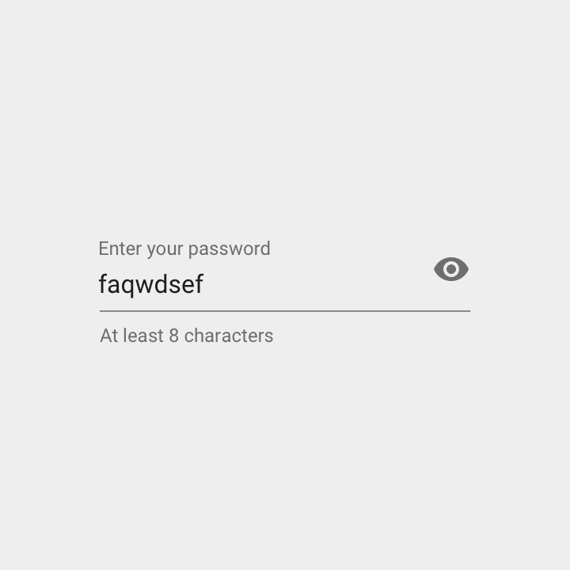
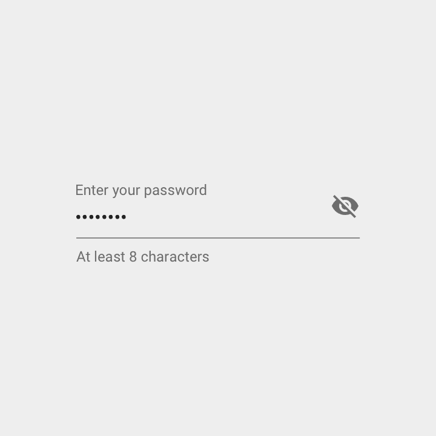

# 对谷歌的材料设计及其相关网站的一点批评

> 原文：<https://dev.to/lobo_tuerto/a-little-critique-of-googles-material-design-and-its-associated-websites-2kk5>

* * *

你可以在 [lobotuerto 的笔记中查看这篇文章的最新更新版本——对谷歌的材料设计及其相关网站的一点批评。](https://lobotuerto.com/blog/a-little-critique-of-google-material-design-and-its-associated-websites/)

* * *

关于该规范(顺便说一下，我认为它是一个很棒的设计规范)及其附带的网站，我有一些意见要说:

*   [material.io/guidelines](https://material.io/guidelines/)
*   [material.io/icons](https://material.io/icons/)

# 切换功能指南

我认为关于切换，你应该选择一种方式让用户理解你的观点。

保持一致，不要发出混淆的信号。

在我看来，以下几个例子显示了不协调的行为:

## 展开面板

对于[扩展面板](https://material.io/guidelines/components/expansion-panels.html)——或者列表，图标(`arrow_drop_up` / `arrow_drop_down`)并不代表面板的状态，而是用户的意图——如果我按下它会发生什么？

[T2】](https://res.cloudinary.com/practicaldev/image/fetch/s--9bWEOxdd--/c_limit%2Cf_auto%2Cfl_progressive%2Cq_auto%2Cw_880/https://lobotuerto.com/blog/a-little-critique-of-google-material-design-and-its-associated-websites/components-expansion-panels.png)

由指南举例:

*   当**关闭时，**你应该显示一个向下的箭头，告诉用户如果他们按下它，它就会展开。
*   当**打开时，**你应该显示一个向上的箭头，通知用户按下它将关闭展开的面板。

这里，视觉提示(**箭头**)代表**意图**，而不是状态。

## 密码密文

在[密码编辑](https://material.io/guidelines/components/text-fields.html#text-fields-input-types)上，情况正好相反:

[T2】](https://res.cloudinary.com/practicaldev/image/fetch/s--OUeFWWZp--/c_limit%2Cf_auto%2Cfl_progressive%2Cq_auto%2Cw_880/https://lobotuerto.com/blog/a-little-critique-of-google-material-design-and-its-associated-websites/password1.png)

[T2】](https://res.cloudinary.com/practicaldev/image/fetch/s--4686zuGo--/c_limit%2Cf_auto%2Cfl_progressive%2Cq_auto%2Cw_880/https://lobotuerto.com/blog/a-little-critique-of-google-material-design-and-its-associated-websites/password2.png)

由指南举例:

*   当眼睛**睁开**时，显示密码。这只是展示了当时的情况。
*   当眼睛**闭上**时，密码是“隐藏的”。同样，这是显示组件的状态，而不是意图。

这里，视觉提示(**眼睛**)代表**状态**，而不是意图。

## 切换按钮

另一方面，开关是很好的切换控件，因为它们所做的是向它们关联的任何标签显示**状态**和**意图**。

因此，在这里，它真的取决于开发商找到一个伟大的 UX 伟大的标签。

示例:

```
<o--> Crushing it! (this is off, meaning we are not crushing it)
<--o> Crushing it! (this is on, meaning we are crushing it now) 
```

(原谅我的 ASCII 艺术…)

开关利用了规范，并在打开时清楚地向用户发出信号，这非常有帮助。

## 意图 vs 状态

设计语言或规范在整体上应该是一致的。

上面观察到的一些问题:

*   图标应该显示**状态**还是**意图**？
*   像这样的东西应该清楚地记录在规范中吗？

对于第二个问题，我认为答案应该是**是的**。

对于第一种，**材质设计**应该是这样或者那样，不能两者兼而有之，也不能一概而论。

### 我的决心

在我看来，考虑到规范的精神，应该用图标来表达意图。

采用这种方式的另一个不太主观的原因是，显示**意图**允许
使用一个变化的图标来链接一系列动作——你是否应该这样做是有争议的，关键是你可以——因为你总是让用户知道如果他们点击它，接下来会发生什么。

你不能用图标显示**状态来传达这个信息，**由于光看图标无法知道下一个状态，你只能知道当前状态是什么。

尽管如此，使用*不可操作的*图标来呈现状态是可以的。

最后我的意思是:

保持**扩展面板**现在的样子，改变**密码编辑**图标的工作方式(只是把图标换出来)。

**开关**按键都好好的。

* * *

我知道这个话题很难。已经讨论了很久了:

几年前，杰夫·拉斯金在 2000 年 4 月 8 日出版的《[《人性化界面:交互系统设计的新方向》](https://www.amazon.com/Humane-Interface-Directions-Designing-Interactive/dp/0201379376)》中写了这个问题。

**艾兰·库伯**在 2014 年 9 月 2 日**威利**出版的[关于面子:交互设计要点](https://www.amazon.com/About-Face-Essentials-Interaction-Design/dp/1118766571)一书中也讨论了这一点(看起来第一版是 1995 年 8 月 25 日):

> 触发器按钮控件非常有效。它们通过用一个控件控制两个互斥的选项来节省空间。触发器控件的问题在于它们没有完成每个控件的第二个职责——通知用户它们的当前状态。如果按钮在关闭状态时显示打开，则不清楚设置是什么。但是，如果在状态为 off 时它是 OFF，那么 ON 按钮在哪里呢？不要使用它们。按钮上没有，菜单上也没有！

关于这个话题[这里](https://ux.stackexchange.com/questions/1318/should-a-toggle-button-show-its-current-state-or-the-state-to-which-it-will-chan)和[这里](https://ux.stackexchange.com/questions/20713/toggle-buttons-turn-on-vs-enable)关于 [StackExchange UX](https://ux.stackexchange.com/) 有很多讨论。

# 网站

现在来说几个和**材质设计、**以及一些烦心事相关的网站——*坏*UX；又名 UX *机会区域*——我在使用它们时发现的。

## 材料设计指南

[材料设计指南](https://material.io/guidelines/)的页面应包括章节标题上的锚，以便于链接。他们不这样太讨厌了！

一个好的解决方案是当鼠标悬停在标题、副标题或小标题上时显示锚。

试图以牺牲好的**【UX】**——或者便利性——为代价而过于**物质设计**是不好的。

例证:我无法链接到**密码编辑**部分，因为它没有锚！

## 材料设计图标

我觉得有点沮丧的是，基本上和别人一样的图标，不显示他们的别名。

例如，这些是相同的图标，但你必须自己找出:

*   `color_lens`，`palette`
*   `create`，`mode_edit`
*   `block`，`do_not_disturb_alt`
*   更多...

我明白这一定是为了语义的利益，但是相信我，像我一样的用户最终会使用看起来像我们所需要的*，*而不是它们被命名为的*的图标。*我们用名字来寻找它们。

如果我需要一个该死的圆形图标来显示用户状态，请确保我最终会使用一个该死的图标！

我发现`CTRL + F`不起作用真的很令人恼火，因为图标是动态加载到页面中的。所以你必须使用网站自己的搜索栏。

如果 [FontAwesome](https://fontawesome.com/) 在展示他们所有的【2,791 个图标方面做得很好，我想你会在展示 900+方面做得很好。

* * *

# 结论

我认为我最大的批评是，有时看起来好像是以牺牲好的 **UX、**为代价来应用**材料设计**原则，而实际情况应该是相反的: **UX** 应该排在第一位，也许是以牺牲**材料设计为代价。**

* * *

理想情况下，**材料设计**应该达到这种平衡永远不会出现的程度。

# 2018/05/08 更新

**谷歌**刚刚更新了它的**材料设计规范，**我上面提供的一些链接和评论不再适用了。尽管如此，为了历史的缘故，我将把它们留在那里。

查看他们网站上提供的一系列改进和新指南:[material.io/design](https://material.io/design/)。

另一件好事是我们现在有了一个可用的**材料设计图标**网站！【material.io/icons】去看看: