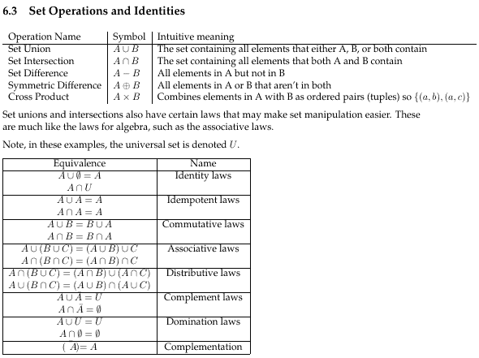
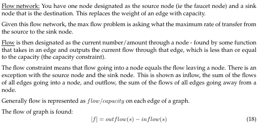

# 看看我的笔记

> 原文：<https://dev.to/evantypanski/a-look-at-my-notes-1kg7>

做笔记是一个激烈争论的话题，许多人说手写笔记比数字笔记要好。这似乎是因为转录的实际过程往往比重读笔记更重要。我不觉得这有什么奇怪的——我几乎不重读我的笔记，只是因为它似乎对我没有好处。相信很多人(但不是全部)都有同感。

写作的实际过程远比打字慢。我以自己为例——我在一个随机打字速度的网站上用[这一段](https://10fastfingers.com/text/30765-Simple-Paragraph)对自己进行了测试，并完全确保不会尝试超过一次。我手写段落的时候，用了 2 分 20 秒。输入带有相当数量的修改(据网站称有 21 处)花了 55 秒，每分钟 79 个单词，比正常速度慢。外卖？我的打字速度是写作速度的两倍多。

那甚至不能解释我写的一塌糊涂。我写得像一个五岁的孩子——我的底线到处都是，我需要看页面。我握铅笔太用力了，所以很疼。另一方面，打字总是整洁舒适的。自从切换到 Dvorak 键盘布局([见我的另一篇博文](https://www.evantypanski.com/posts/on-alternative-keyboard-layouts))后，我发现我打字比用 QWERTY 舒服多了。基本上，我写作会非常累，但打字不会。

我们可以继续讨论打字有多好，因为你可以用更整洁的格式传递更多的信息。但是，写作有什么好处呢？我之前说过，我写笔记不是为了重读它们。我记笔记是为了在学习的第一时间记住信息。研究表明，写笔记只是让你记住更多的信息。对于大多数人来说，我可能会同意这个发现。主要原因似乎不是笔记本电脑的产品，而是个人如何使用笔记本电脑的产品。

## 我如何记笔记

历史很短，我在 2016 年秋季学习 LaTeX，以便在离散数学课上更高效地做笔记和家庭作业。这是我大学第一年的开始。在我学习 LaTeX 之前，我使用我的笔记本电脑做笔记，但一般是在简单的微软产品中。这对于方程和漂亮来说是非常麻烦的。我下载了 Windows 版的 MikTex，在第一个月里，我几乎不知道如何做任何事情。到第一年年底，我的大部分笔记都是用 LaTeX 打印的，总体来说还不错。

这是我第一年学的一些离散数学的例子。这些笔记也经常被重写以使其更加清晰(这是我学习的一部分):

[T2】](https://res.cloudinary.com/practicaldev/image/fetch/s--t4oq9mfY--/c_limit%2Cf_auto%2Cfl_progressive%2Cq_auto%2Cw_880/https://www.evantypanski.com/assets/img/posts/a-look-at-my-notes/discrete.png)

我绝对不会声称这些是完美的笔记，但它确实提供了一个很好的参考，并迫使我写下每条法律是什么。我很可能是在我们学过的课后这样做的，但这对于我的笔记来说很常见:拥有每一条信息。

我最近的笔记根据课程的不同而不同。例如，在算法中，图片通常非常有用，但我不打算画一个流程图并扫描到我的笔记中。因此，我只是描述它。然而，关键是，我要确保我学会了内容，然后写出我对讲座的翻译。这和手写笔记时你必须做的事情类似，但我是在打字时自愿做的。以下是结果的一个示例:

[T2】](https://res.cloudinary.com/practicaldev/image/fetch/s--EW43sLZY--/c_limit%2Cf_auto%2Cfl_progressive%2Cq_auto%2Cw_880/https://www.evantypanski.com/assets/img/posts/a-look-at-my-notes/algo.png)

这些笔记显然不如我的离散数学笔记有条理——我认为这是成熟的标志。我明白了，我不能把所有的事情都写下来。我可以做一个有定义的表格，还有一个巨大的专业笔记本，本质上也可以是一本教科书。但是，我不会回头看这些笔记那么多，所以我为什么要呢？我可能会确保我现在的直觉与我第一次学习这些概念时的直觉一致，但除此之外，这些笔记很可能只是在我最初写下它们时才有用武之地。我不需要让它变得很棒很漂亮——我需要让它容易做我需要做的事情。

当我在 Linux 环境下从使用 MikTex 切换到使用 Vim 时，主要的好处增加了。主要原因是，如果我需要改变什么，Vim 可以帮助我更有效地写笔记。这就产生了一个问题，因为除了用`pdflatex algo.tex`编辑笔记之外，我不知道如何高效地创建 PDF。当我发现 [Vim Latex Live Preview](https://github.com/xuhdev/vim-latex-live-preview) 时，这个问题得到了解决，这是一个 Vim 插件，它可以在你输入时重新编译 PDF 文档(至少在一段时间不活动后)。它不使用大量的计算能力，感觉非常自然。这也是我记笔记从漂亮变成高效的原因。将它与平铺窗口管理器结合起来，这种设置非常适合于确保您的笔记服务于它们的目的，正确编译，并且看起来像您想要的样子。

我不会过多地谈论我是如何组织课程和讲座日期的，主要是因为这并不重要。在大多数情况下，它与教科书有着松散的联系。但是，我要说的是，用 LaTeX 做笔记让我更有可能回头看我的笔记，因为我觉得从笔记中抓取公式比从讲座幻灯片中抓取更舒服。这让我两全其美:只要我在课堂上不分心，并努力用自己的话写笔记，我发现这对我很有用。这可能不是对每个人都有效，但对我绝对有效。