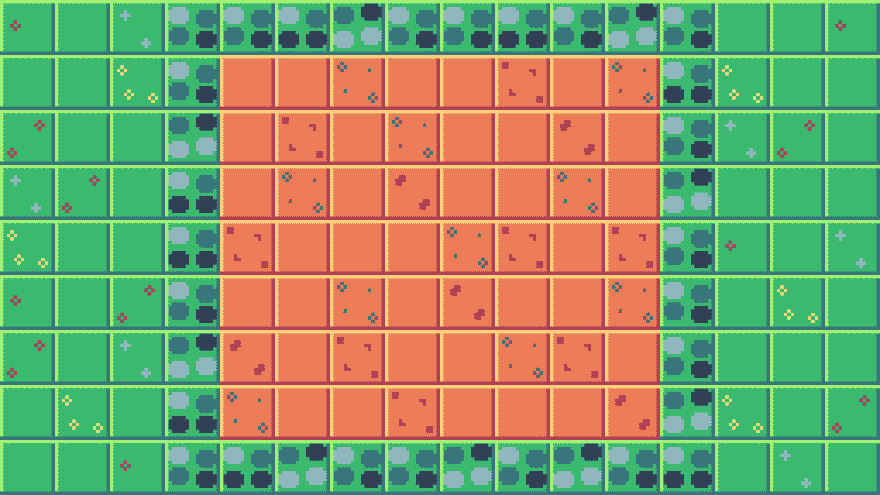

# 游戏关 2018 (1)

> 原文：<https://dev.to/bigaston/a-new-start-4noi>

这是我在这里的第一篇文章...喂？我的名字是 Bigaston，我是一个年轻的初学者游戏开发。目前我在法国学习计算机科学，但是...不是今天的主题！

今天，我想和你们谈谈我开始的一个新项目:2018 年的[游戏](https://itch.io/jam/game-off-2018)

主题是**杂交**所以我要做一个农业游戏，在这个游戏中你必须种植一些花并杂交它们来赚取越来越多的钱！

我做的第一件事是创建一些瓷砖和一个基本的地图！

[T2】](https://res.cloudinary.com/practicaldev/image/fetch/s--YC2a0lB3--/c_limit%2Cf_auto%2Cfl_progressive%2Cq_auto%2Cw_880/https://thepracticaldev.s3.amazonaws.com/i/5goev048sn8jrlwl0cpg.png)

我想我要用这个地方来分享我的进步！

谢谢，祝您愉快！