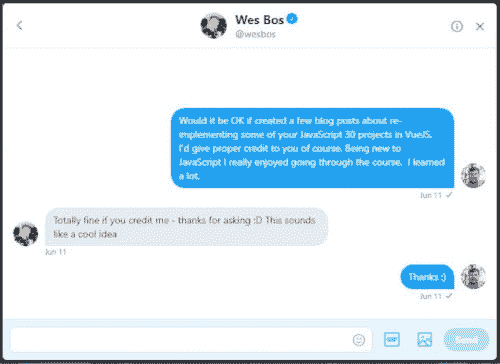

# JavaScript30 上的新 Vue 入门

> 原文：<https://dev.to/davefollett/a-new-vue-on-javascript30---getting-started-4o61>

几个月前，我看了韦斯·博斯([@韦斯·博斯](https://twitter.com/wesbos))制作的 [JavaScript30](https://JavaScript30.com) 视频教程系列，以此来提高我的 [JavaScript](https://en.wikipedia.org/wiki/JavaScript) 技能。虽然我没有跟上他每天一个的建议，但我每周做两个，我真的很喜欢它，并学到了很多。JavaScript30 吸引我的部分原因是它完全是用普通的 JS 编写的——没有框架，没有库，也没有编译器。但是当我进入其中时，我在想，如果使用了 [Vue](https://vuejs.org) 会是什么样子？在这个系列中，我将探索这两种方法之间的差异。

别担心，我已经和这个作者本人说清楚了。

[T2】](https://res.cloudinary.com/practicaldev/image/fetch/s--tVj2ppdD--/c_limit%2Cf_auto%2Cfl_progressive%2Cq_auto%2Cw_880/https://davefollett.io/2018/08/01/a-new-vue-on-javascript30-getting-started/wes-bos-ok.jpg)

好了，让我们开始一些设置，我们可以使用所有项目的基础。我非常喜欢 Wes 的项目的一点是，每个项目都只是一个 HTML 文件。由于 Vue 是一个进步的框架，我们可以用几行代码来匹配这个概念。

## 包括 Vue

```
<head>
  <meta charset="UTF-8">
  GETTING STARTED
  <!-- Use Vue from a CDN -->
  <script src="https://unpkg.com/vue"></script>
</head> 
```

Enter fullscreen mode Exit fullscreen mode

正如在 [Vue 文档](https://vuejs.org/v2/guide/installation.html#CDN)中提到的，我使用 [UNPKG CDN](https://unpkg.com) 包含 Vue。这是一个包含 Vue 的非常简单的方法，但是不需要建立一个 Vue 项目。

## 根 DOM 元素

```
<div id="app">
  {{ message }}
</div> 
```

Enter fullscreen mode Exit fullscreen mode

这个`<div id="app">`元素是我配置为 Vue 实例要管理的根 DOM 元素。所有项目的 HTML 都将在这里添加一些嵌入的 Vue 指令。

## Vue 实例

```
 var app = new Vue({
    el: '#app',
    data: {
      message: "Hello World!"
    },
    computed: {
    },
    methods: {
    },
    mounted: function () {
    },
    watch: {
    }
  }) 
```

Enter fullscreen mode Exit fullscreen mode

Wes 系列中的大部分 JavaScript 将在 Vue 实例中结束。我已经加入了我将使用的一些常见的 Vue 功能，但我将把解释留给 Vue 文档:

*   埃尔-[https://vuejs.org/v2/api/#el](https://vuejs.org/v2/api/#el)
*   数据-[https://vuejs.org/v2/api/#data](https://vuejs.org/v2/api/#data)
*   方法-[https://vuejs.org/v2/api/#methods](https://vuejs.org/v2/api/#methods)
*   挂载-[https://vuejs.org/v2/api/#mounted](https://vuejs.org/v2/api/#mounted)
*   手表-[https://vuejs.org/v2/api/#watch](https://vuejs.org/v2/api/#watch)

## 把所有的东西放在一起

```
<!DOCTYPE html>
<html lang="en">
<head>
  <meta charset="UTF-8">
  GETTING STARTED
  <!-- Use Vue from a CDN -->
  <script src="https://unpkg.com/vue"></script>
</head>
<body>

<!-- Vue Root DOM Element -->
<div id="app">
  {{ message }}
</div>

<!-- Vue Instance Section -->
<script>
  var app = new Vue({
    el: '#app',
    data: {
      message: "Hello World!"
    },
    computed: {
    },
    methods: {
    },
    mounted: function () {
    },
    watch: {
    }
  })
</script>

<!-- CSS Section -->
<style>  
</style>

</body>
</html> 
```

Enter fullscreen mode Exit fullscreen mode

不到四十行，我们对其余的项目有一个很好的起点。一次看到全部，凸显 Vue 的美。就像最初的 JavaScript30 项目一样，你可以在浏览器中打开你电脑上的 HTML 文件，不需要网络服务器。

我希望你喜欢这篇文章，如果有任何问题、评论或*更正*请随时给我发消息。本系列中的所有代码都可以在官方 [JavaScript30 GitHub 资源库](https://github.com/wesbos/JavaScript30)的 [my fork](https://github.com/davefollett/JavaScript30) 中找到，该资源库位于:

*   [https://github.com/davefollett/JavaScript30](https://github.com/davefollett/JavaScript30)

## 接下来

在[中，JavaScript30](https://dev.to/t/anewvueonjs30) 系列的下一个新 Vue 是:

[](/davefollett) [## JavaScript30 - 01 上的新 Vue JavaScript 鼓套件

### 戴夫·福莱特 8 月 3 日 186 分钟阅读

#anewvueonjs30 #vue #javascript30 #javascript](/davefollett/a-new-vue-on-javascript30---01-javascript-drum-kit-1k7f)

## 再次感谢

我想再次感谢韦斯·博斯创造并分享了这样一个有趣而又鼓舞人心的课程。除了 [JavaScript30](https://JavaScript30.com) 之外，韦斯·博斯的网站上还有更多内容，他还主持了我最喜欢的播客之一，叫做[句法](https://syntax.fm)，来自[升级教程](https://www.leveluptutorials.com)的斯科特·托林斯基([@斯托林斯基](https://twitter.com/stolinski))。