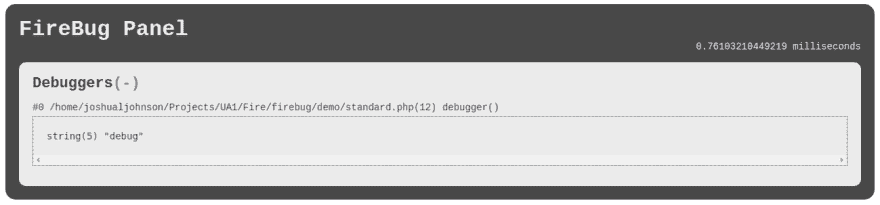

# 一种调试 PHP 的新方法

> 原文：<https://dev.to/joshualjohnson/a-new-way-of-debugger-php--4coa>

[T2】](https://res.cloudinary.com/practicaldev/image/fetch/s--D1psuOef--/c_limit%2Cf_auto%2Cfl_progressive%2Cq_auto%2Cw_880/https://thepracticaldev.s3.amazonaws.com/i/uxku82y7w5l90ahtp4zv.png)

嘿伙计们！我想分享一小段来自我们实验室的最新代码。火虫 PHP...

[https://github.com/ua1-labs/firebug](https://github.com/ua1-labs/firebug)

基本上，它是一个调试面板，可以轻松集成到您的 PHP 应用程序中。您还可以非常容易地创建自己的调试面板来跟踪调试过程中对您来说重要的事情。还有！它集成了 var_dump/debug_trace。基本上结合了这两种方法的力量，并将其输出集成到一个“调试器”面板中。