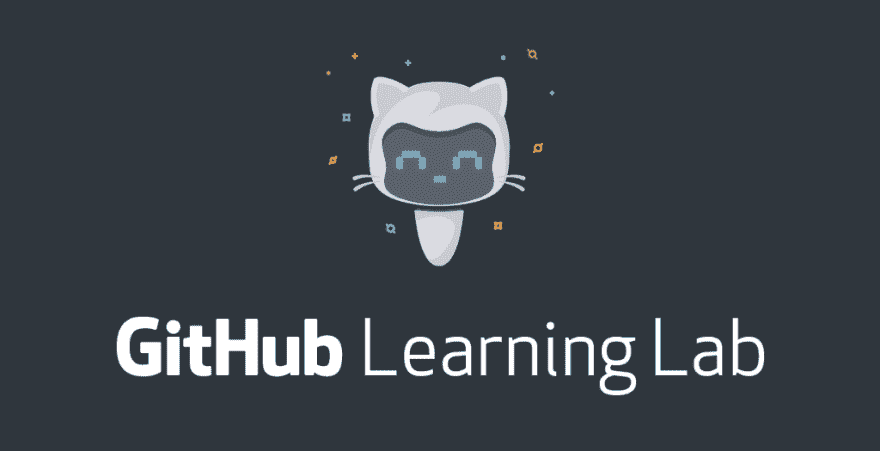

# Github 学习实验室一瞥

> 原文：<https://dev.to/kolokodess/a-peek-into-githubs-learning-lab-31e>

<figcaption>lab.github.com</figcaption>

Github 的团队最近推出了一个交互式指南，帮助开发人员掌握使用 Git 的艺术，并更加熟悉 Github 的工作。他们的目标是**“*帮助新开发人员保留更多信息，并在他们开始软件之旅时快速起步”。*T3】**

该平台与其他探索“Git 和 Github”的教程或网络广播的主要区别在于，它允许 ***用户交互***；一个机器人带你通过一系列有趣的实践实验室，并在途中给出反馈，而无需离开平台

### 它是这样工作的:

以下内容在实验室中被视为独立的课程:

1.  **GitHub 简介**:这里介绍了全球开发者最常见的协作工作流。
2.  使用 Markdown 进行交流:用户可以学习如何在 GitHub 上使用 Markdown 的简单语法编写文档。
3.  GitHub 页面(GitHub Pages):教用户如何直接从你的 GitHub 库托管网站或博客。
4.  **将项目迁移到 GitHub** :获取将代码和贡献者迁移到 GitHub 的技巧。
5.  **管理合并冲突**:用户开始学习为什么会发生合并冲突以及如何修复它们。

 

<figcaption>先睹为快！Gif 鸣谢:Github 学习实验室</figcaption>

### **入门**:

如果你完全不熟悉 Github，或者想提高你的技能，这是一个很好的机会，访问学习实验室 [**这里**](http://lab.github.com)

*   开始时，用户采取几个帐户授权步骤，在您的个人帐户中授予 Github learning lab install 访问您的所有存储库的权限(即在开始新课程时自动创建一个存储库)。您可以选择授权访问所有存储库，或授予其访问单个存储库的权限。
*   当选择一门新课程时，还需要用户允许在注册这门课程时自动创建的存储库中安装 Github learning lab。创建的存储库是您使用学习实验室解决问题和请求的地方。
*   在选定的存储库上安装后，将自动订阅邮件，从而开始课程附带的一系列任务。

想要尝试 Github 学习实验室还是已经尝试过了？让我知道你对它的想法！

* * *