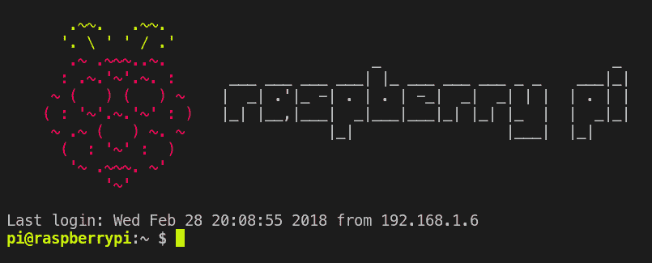
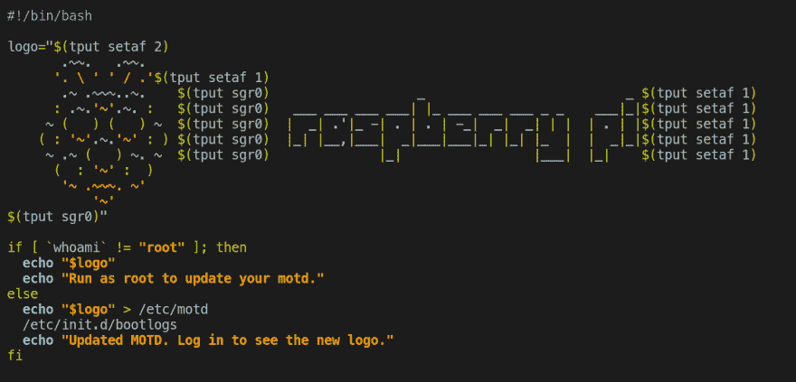

# 个人 MOTD

> 原文：<https://dev.to/lucasalt/a-personal-motd-14h8>

[T2】](https://res.cloudinary.com/practicaldev/image/fetch/s--lL35PwdK--/c_limit%2Cf_auto%2Cfl_progressive%2Cq_auto%2Cw_880/https://i.imgur.com/x3VM2ye.png)

今天，我们将修改将 SSH 连接到服务器时出现的 MOTD。一般来说，它会给你一些关于你的机器的一般信息。您可以显示服务器的正常运行时间、RAM 消耗，...

就我个人而言，我做了一些简单的事情。它只显示我一个标志和文字。
定制 MOTD 有许多不同的方法。就我个人而言，我选择了这样一种方法，我们编写一个基本的脚本来执行，这样它就可以单独编辑`/etc/motd`文件。

## 写剧本

如上所述，我写了一个小脚本(koff，koff，...是互联网为我写的)我保存在一个文件`raspi-motd.sh`里。如果你和我一样想要 MOTD，你可以在这里找到代码:[https://gist.github.com/piksel/3023588](https://gist.github.com/piksel/3023588)

[T2】](https://res.cloudinary.com/practicaldev/image/fetch/s--c8w5pwXm--/c_limit%2Cf_auto%2Cfl_progressive%2Cq_auto%2Cw_880/https://i.imgur.com/hLgD8ip.png)

我稍微修改了脚本，如下文评论中所解释的。你只要换 20 线`echo "$logo" > /etc/motd.tail to echo "$logo" > /etc/motd`。

然后我保存文件并执行它。作为一个 Linux 初学者，我在运行这个文件时遇到了一点麻烦。最后，我有两个解决方案。
要么:
允许脚本运行，
用`bash /path/to/script.sh`命令运行它

我首先选择了第一个选项(hehey 我说我什么都不懂)然后我觉得无论如何是时候尝试第二个了。(剧透！第二个更快)

第一种方案:
`chmod +x raspi-motd.sh`赋予脚本执行权限
`raspi-motd.sh`脚本被执行
第二种方案
`bash raspi-motd.sh`简单地执行脚本

[T2】](https://res.cloudinary.com/practicaldev/image/fetch/s--VMUuxW4a--/c_limit%2Cf_auto%2Cfl_progressive%2Cq_auto%2Cw_880/https://i.imgur.com/zuysiFR.png)

不幸的是，我有一个小错误，因为它没有在`/etc/init.d/`中找到`bootlogs`文件，但不用担心它仍然工作。最后，你需要做的就是重新连接，自定义 MOTD 就会出现。

* * *

## 来源:

[L4p1n 的博客](https://l4p1n.met-hardware.fr/tutoriel/2017/09/04/motd-personnalise-sur-son-serveur.html)
[源代码](https://gist.github.com/piksel/3023588)
[如何运行。sh 文件](https://www.cyberciti.biz/faq/run-execute-sh-shell-script/)

## 图片:

独立地