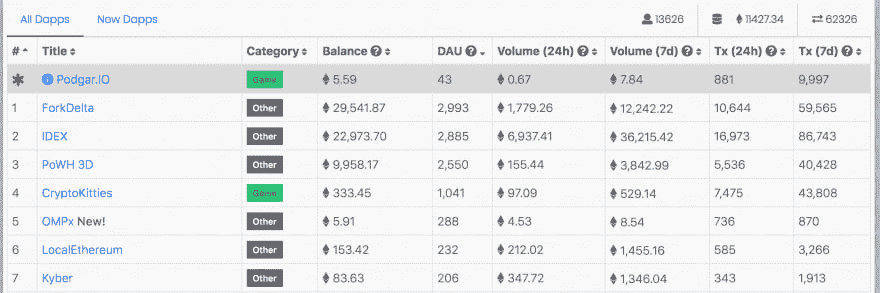
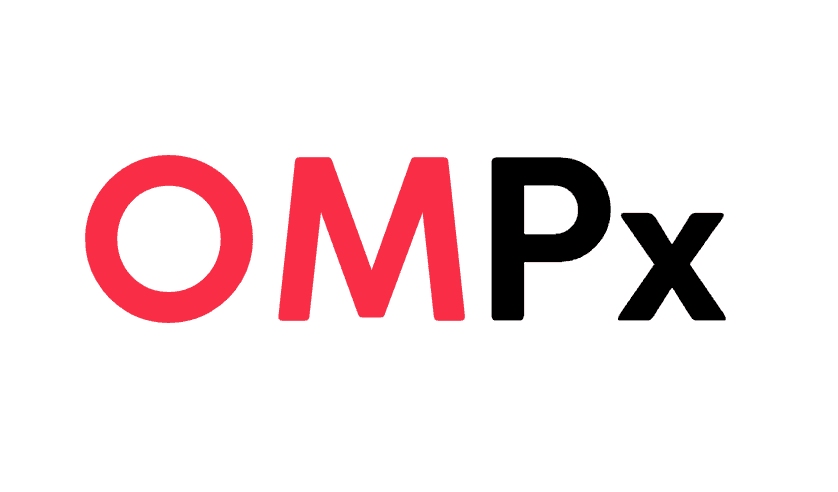
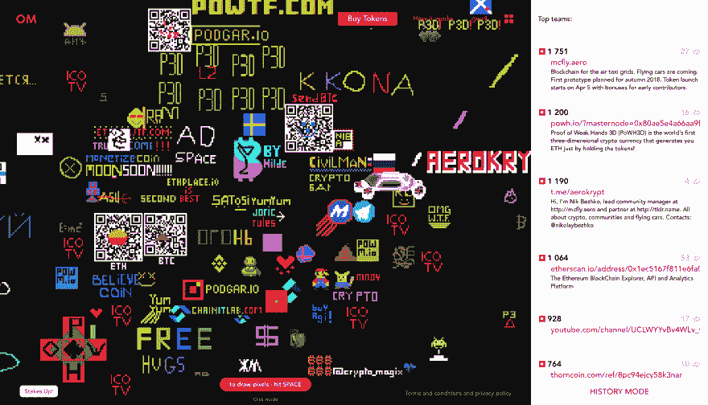

# 一个属于所有人的地方

> 原文：<https://dev.to/gen4sp/a-place-owned-by-everyone--4i6m>

我们刚刚推出了新的加密应用/游戏——100 万像素。在售出 CryproKitties 和超过 200 万个代币之后，已经在 DappRadar 上排名第五。

[T2】](https://res.cloudinary.com/practicaldev/image/fetch/s--8fpWgQpY--/c_limit%2Cf_auto%2Cfl_progressive%2Cq_auto%2Cw_880/https://thepracticaldev.s3.amazonaws.com/i/lt4uymxe4dhi34a9kao5.png)

OMPx 是一款新的在线多人创意游戏，以一百万(1000x1000)像素的在线画布为中心，供玩家根据自己的想象进行编辑，该游戏宣布免费分发游乐场代币，以激励早期玩家。
[T3】](https://res.cloudinary.com/practicaldev/image/fetch/s--KWGkK0OO--/c_limit%2Cf_auto%2Cfl_progressive%2Cq_auto%2Cw_880/https://thepracticaldev.s3.amazonaws.com/i/2u40x48jf6itxfp1tau6.png)

OMPx 代表一百万像素。最近在区块链以太坊上发布的新游戏代表了一个 1000x1000 像素的数字画布，注册玩家可以通过改变 24 位(1600 万色)调色板中单个像素的颜色来编辑它。OMPx game，或者更具体地说，一个去中心化的应用程序(d app)由以太坊区块链上的智能合约提供支持，并根据智能合约中嵌入的游戏规则在没有任何人为干预的情况下运行。

OMPx 智能合约，作为以太加密硬币(ETH)的交换，释放 dapp 的令牌(ERC20 OMPx 令牌)，供玩家用来绘制画布的像素，一个令牌对应一个像素。通过这种方式，玩家获得的代币越多，她可以绘制的像素就越多，创建小徽标和更大的图片，写标语，在重新绘制的像素中嵌入网站的 URL 等。

OMPx dapp 的另一个特性是 OMPx 智能合约代码中提供的 OMPx 令牌值的可能增长。直接增加代币价值的主要因素是玩家数量:玩家加入越多，根据智能契约，代币变得越贵。还有其他因素，这些因素的组合可能导致代币的价值上升或下降。其中包括:OMPx 智能合约释放的总令牌供应量，用于绘制像素的令牌数量，以及玩家返回 OMPx 智能合约以换取 ETH 的令牌数量。

[T2】](https://res.cloudinary.com/practicaldev/image/fetch/s--ACa2j76m--/c_limit%2Cf_auto%2Cfl_progressive%2Cq_auto%2Cw_880/https://thepracticaldev.s3.amazonaws.com/i/vdqlbza58sjj1dj4y15t.png)

OMPx 作为一个 fenomen，提出了一个有趣的问题，即一个社会可以用一个共享的多用途工具做什么，该工具可以同时释放一个人自己的创造潜力，用于营销和广告，以及用于赌游戏令牌的 ETH 值。

要参加 dapp，你要在游戏官网 [https://ompx.io](https://ompx.io) 注册。想要在免费提供的 OMPx 令牌上试试运气，用户应该访问 Reddit 上 dapp 的[主题](https://www.reddit.com/r/OMPx/comments/8bjvie/one_million_pixels)

如果能听到一些反馈就太好了。
尽情享受吧！