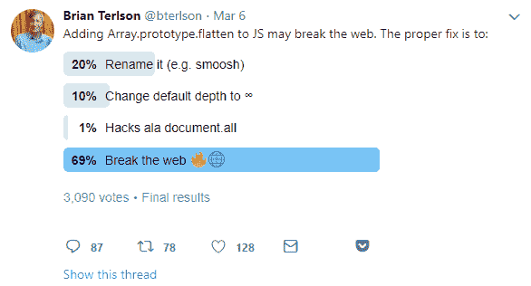

# 扁平化提案问题的实用解决方案#smooshgate #JavaScript

> 原文：<https://dev.to/joelnet/a-pragmatic-solution-to-flatten-proposal-problem-smooshgate-javascript--jal>

# 问题

一个新的 TC39 提议与旧的库 [mootools](https://mootools.net) 相冲突。

该提议将把`flatten`添加到 ECMAScript 中，但将与 mootools 不兼容，mootools 已经在`Array.prototype`中添加了一个`flatten`。添加`Array.prototype.flatten`将会破坏任何仍在使用 mootools 的现有网站。

这显然不是 mootools 第一次与 TC39 提案不兼容。

> 迈克尔·菲卡拉@ js pedantMooTools 再次对不允许我们实现新的原生 Array.prototype 方法负责。这一次展平受到影响。谁想玩 Array.prototype.smoosh？[github.com/tc39/proposal-…](https://t.co/TOogRicwjd)2018 年 03 月 07 日上午 01:19[](https://twitter.com/intent/retweet?tweet_id=971193585822396416)[](https://twitter.com/intent/like?tweet_id=971193585822396416)

TC39 的任务很艰巨，不仅要批准新的语言提案，还要确保这些提案是向后兼容的，不会破坏网络。

# 不可解

[另一提案](https://github.com/tc39/proposal-flatMap/pull/56)建议将`flatten`更名为`smoosh`。我不确定这是不是一个开玩笑的建议，但它已经引发了一场大辩论，现在被称为#smooshgate。

[T2】](https://twitter.com/bterlson/status/971210573818904576)

这将是一个*解决方案*，因为`flatten`比`smoosh`更好。为一个 8 年多的老库重新命名这个方法看起来很疯狂。

火上浇油的是，似乎还有另一个提案通过在今天的生产现场使用`smoosh`的不兼容版本来阻止`smoosh`的使用，从而迫使 TC39 不破坏与`smoosh`的兼容性。

**向后兼容性很重要**。我绝对不想浏览已经运行多年的旧网站，仅仅因为 JavaScript 增加了新特性就更新它们。所以，**痛打老图书馆不是好办法**。

不过，研究每一个为网络创建的古代图书馆以确保兼容性也会减慢进度，而且想出愚蠢的名字似乎也很愚蠢。

# 一解

我建议我们从[以太坊](https://ethereum.org)学习一些经验，以及他们是如何在[坚固性](https://solidity.readthedocs.io)中解决这个问题的。

通过在代码文件的顶部添加一个`pragma`标签，Solidity 允许你选择你想要运行哪个版本的以太坊虚拟机(EVM)。

```
// run this code with EVM 0.4.0 pragma solidity ^0.4.0;

contract MyContract {
} 
```

Enter fullscreen mode Exit fullscreen mode

我很清楚，这个简单的解决方案也是 ECMAScript 的最佳长期解决方案。这项提议将允许在新功能出现时，传统网站保持完整。它还将允许 TC39 比语言发展得更快，并使用最好的建议，而不用担心破坏传统网络。

样本代码:

```
'pragma ecmascript ^2018.0.0';

var arr1 = [1, 2, [3, 4]];
arr1.flatten();
// [1, 2, 3, 4] 
```

Enter fullscreen mode Exit fullscreen mode

我们已经用`use strict`做了类似的事情。这将是`use strict`的下一次进化。

你对这整个`flatten`、`smoosh`的溃败有什么看法？我很想在下面的评论中听到你的想法。

干杯！