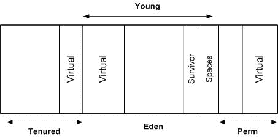

# JVM 内存管理和故障排除入门- 1

> 原文：<https://dev.to/rrampage/a-primer-on-jvm-memory-management-and-troubleshooting---1-12b6>

本系列是 Oracle 的 [JVM 故障排除课程](https://apexapps.oracle.com/pls/apex/f?p=44785:149:105166169953256::NO:RP,149:P149_EVENT_ID:5552)的总结，该课程概述了 JVM 内存管理、Hotspot VM 的垃圾收集选项、各种内存错误以及如何排除这些错误。

在这篇文章(第 1 部分)中，我们将看看 JVM 如何管理内存及其不同的垃圾收集器。

你可以在这里找到第 2 部分:

 [## JVM 初级教程第 2 部分——调试内存问题

### 偈纳克罗摩克里希南 5 月 16 日 185 分钟阅读

#java #devops #kotlin #programming](/rrampage/jvm-primer-part-2---debugging-performance-issues-1od)

### JVM 内存管理概述

JVM 提供自动内存管理，将程序员从手动管理内存中解放出来。新对象被分配到堆内存中。一个**根集**由指向外部存储器、静态变量、线程、 [JNI](https://en.wikipedia.org/wiki/Java_Native_Interface) 引用和内部 JVM 结构的指针组成。从根集可直接到达的对象必须保存在堆中。从任何可访问对象可访问的对象也必须在堆中。这组对象是程序可以使用的唯一对象。不可到达的对象(垃圾)被称为**垃圾收集(GC)** 的过程移除。可到达的对象被压缩，即移动到堆中的连续空间。这一点很重要，否则，堆将变得支离破碎。

### 热点中的分代 GC 和内存空间

当 JVM 启动时，它向操作系统请求一些内存。这种记忆被分成不同的空间。

JDK 8 之前 JVM 中的内存空间

*   单独的池保存不同年龄范围的对象
*   JVM 的 GC 是分代的，基于这样的假设:
    *   大多数物体在年轻时死亡
    *   从旧对象到新对象的引用很少
*   有 2 代对象:
    *   年轻的:小而经常收集的(小收集)。幸存于阈值数量的 GC 的对象移动到老一代。
    *   旧:大，不经常收集(主要收集=完全 GC)
*   在 JDK 8 之前，还有一个**永久代**，用于存储类表示和元数据、内部字符串和类静态。在 JDK 8 和更高版本中，这被元空间所取代。
*   **元空间**在本机内存中分配。它通过 JVM 选项**元空间大小**来管理初始大小，通过**元空间大小**来管理最大值。
    *   如果**UseCompressedClassPointers**使能，内存中有两个区域用于存储类及其元数据- **元空间**和**压缩类空间**。64 位类指针用 32 位偏移量表示以节省空间。类元数据由存储在压缩类空间中的 32 位偏移量引用。默认情况下，压缩的类空间是 1 GB。
*   代码缓存用于存储由 JIT(实时优化器)生成的编译代码，从本机内存中分配，由代码缓存清理器管理

### 热点 JVM 中的垃圾收集器

对于不同代的对象，JVM 有不同的垃圾收集方法。其中一些描述如下:

*   年轻一代系列
    *   串行停止世界(STW)，复制收集器，单线程
    *   帕纽- STW，复制收集器，多个 GC 线程
    *   并行清除- STW、复制收集器、多个 GC 线程
*   老一代收藏
    *   串行旧 STW，标记-扫描-紧凑型收集器，单线程
    *   CMS -大部分并发，低暂停
    *   并行旧压缩收集器，多个 GC 线程
*   G1:为大堆设计，提供可预测的短暂暂停。
    *   几代人都有不同的内存布局
    *   所有世代都使用相同的收集器

### GC 选项为 JDK

这些是传递给 JVM 的选项标志，用于指定使用哪个 GC:

*   UseSerialGC : Serial + SerialOld
*   UseParNewGC : ParNew + SerialOld。在 JDK 9，使用 CMS 的老一代
*   useconcmasweepgc:par new+CMS+serial old
    *   CMS 大部分时间用于收集老一代。发生并发模式故障时使用的 SerialOld。
    *   CMS 与应用程序线程并行执行大部分工作。
        *   没有堆压缩会导致碎片。有浮动垃圾，需要更大的堆大小。
        *   作为链表维护的空闲空间。与碰撞指针分配相比，分配成本很高。
        *   新收集的额外开销
    *   在 JDK 9 中已弃用
*   UseParallelGC:并行清除+并行旧。
    *   最大化吞吐量。
    *   JDK 9 之前的默认 GC
*   两代人都使用 G1GC - G1
    *   面向大内存多核机器的服务器风格 GC
    *   在尝试高吞吐量时，低 GC 暂停的概率很高
    *   压缩收集器。无碎片的低暂停
    *   更好的 GC 人体工程学。并行线程和一些任务与应用程序线程是并发的
    *   从 JDK 7u4 开始提供，在 JDK 9 默认提供

关于调优垃圾收集器的更多详细信息，请阅读官方的 [GC 调优指南](https://docs.oracle.com/javase/9/gctuning/toc.htm)

#### 未成年 GC 或多年轻一代被收集:

1.  当年轻一代中的伊甸园空间满了，可到达的对象被标记并移动到生存空间
2.  FromSurvivor 空间中可到达的对象被移动到生存空间
3.  FromSurvivor 空间中已跨越阈值的对象被提升到旧代
4.  伊甸园变成空的，并准备好新的分配
5.  来往于幸存者空间被交换

#### 关于标记-扫描-压缩收集器的注释(旧系列):

*   标记阶段:标记所有活动对象
*   清扫阶段:清扫堆以识别垃圾
*   滑动阶段:GC 通过将活动对象滑动到堆的开头来执行滑动压缩