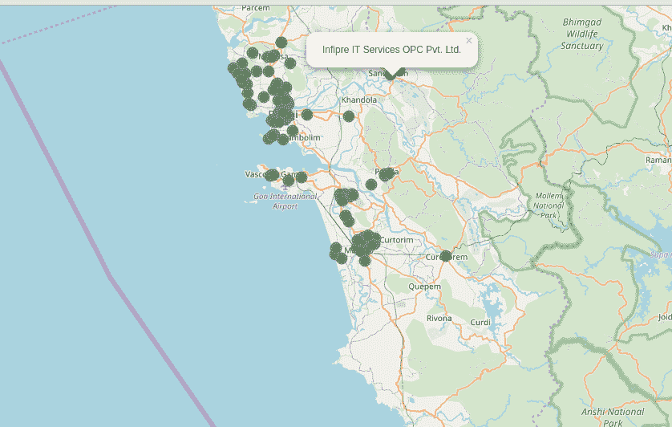

# 显示印度果阿 IT 公司分布的 python 脚本。

> 原文：<https://dev.to/ns23/a-python-script-that-shows-the-distribution-of-it-companies-in-goa-india-2jjj>

[T2】](https://res.cloudinary.com/practicaldev/image/fetch/s--KnkAjOC4--/c_limit%2Cf_auto%2Cfl_progressive%2Cq_auto%2Cw_880/https://thepracticaldev.s3.amazonaws.com/i/gpumppfwyv8fuwp05btv.png)

最近我在用 python 的 *BeautifulSoup* 库学习网络抓取。在学习了网络抓取的基本概念后，我想用它来写一些真实世界的程序。

在浏览互联网的时候，我看到了 startupgoa.org 的网站，上面有印度果阿的创业公司列表。

所以我决定写一个 python 脚本

*   取消果阿的公司名单。
*   使用地理编码器(我使用谷歌地理编码器 API)获得这些位置(纬度和经度)。
*   使用 python 包*叶子*在地图上绘制这些点

经过大量的谷歌搜索&在 StackOverflow 上寻找答案，下面是最终结果。

[演示:https://ns23 . github . io/startupGoaMap/](https://ns23.github.io/startupGoaMap/)

[Github 回购](https://github.com/ns23/startupGoaMap)

请提供反馈&如果我能改进这个脚本，请在评论中告诉我。