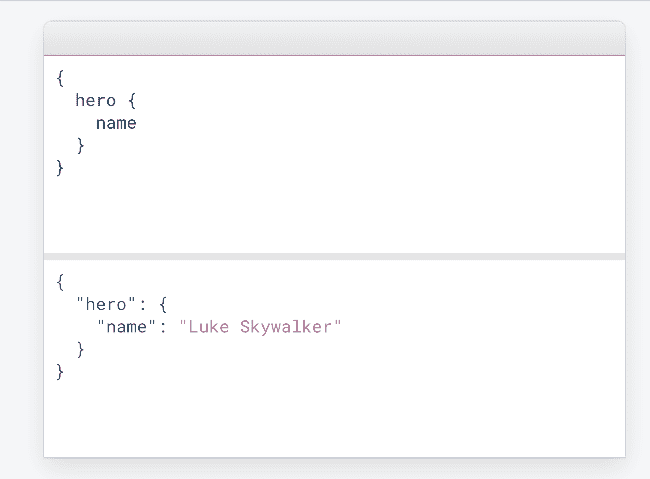

# 快速浏览 GraphQL，第 1 部分:构建 GraphQL API

> 原文：<https://dev.to/obahareth/a-quick-dive-into-graphql-part-1-building-a-graphql-api-2cnp>

## 什么是 [GraphQL](https://graphql.org/) ？

> "你的 API 的查询语言."

可以把它想象成能够向 API 端点发送查询来获取您想要的东西，而不是像传统的 REST 那样每个资源有许多端点。我个人认为这是一种

看看 GraphQL 网站上的这个例子，了解一下它是如何工作的。

[ ](https://res.cloudinary.com/practicaldev/image/fetch/s--jLpGDPFX--/c_limit%2Cf_auto%2Cfl_progressive%2Cq_66%2Cw_880/https://thepracticaldev.s3.amazonaws.com/i/6udeov2333yh7dkyem3c.gif) *请求(GraphQL 查询)在顶部，响应在底部*

作为一个 API 提供者，GraphQL 允许您定义一个模式以及如何获取其中的资源。

作为 API 消费者，您所要做的就是构建查询来获取您所需要的内容。

## 谁在用？

GraphQL 刚刚有了自己的基础，你可以从他们的网站上看到一个完整的列表，显示谁在使用它。以下是一些使用过 GraphQL 的公司的著名文章，它们解释了使用 graph QL 的原因和体验:

*   [graph QL:PayPal 结账的成功故事](https://medium.com/paypal-engineering/graphql-a-success-story-for-paypal-checkout-3482f724fb53)。

*   [github graph QL API](https://githubengineering.com/the-github-graphql-api/)。

## 用例

> "要求你所需要的，确切地得到它."

有时你只想知道一个人的名字，有时你想知道这个人的名字和出生日期。

> "在一个请求中获得许多资源."

其他时候，你可能想了解这个人，他们的家乡，以及他们的朋友和家乡。对于其他解决方案，您通常要么必须为每种情况创建不同的路径，要么自己编写请求特定参数的方法。

我认为这两个特性对于前端 web 开发非常有用(特别是对于 React、Vue、Angular 等框架。)和手机应用。

我将在以后的文章中介绍的另一个更高级的特性是缝合，它允许您将多个模式(来自不同的 API)组合成一个模式；这意味着您可以通过一个请求从不同的 API 获取资源。

## 使用 GraphQL API

有一个 GraphQL“IDE”可以用来探索 GraphQL APIs，称为 graph QL。他们有一个[演示平台，这里有](https://graphql.github.io/swapi-graphql/?query=%7B%0A%20%20%23%20The%20first%202%20films%2C%20after%20a%20given%20cursor%20value%0A%20%20allFilms(first%3A%202%2C%20after%3A%20%22YXJyYXljb25uZWN0aW9uOjA%3D%22)%20%7B%0A%20%20%20%20%0A%20%20%20%20%23%20An%20edge%20is%20an%20entry%20in%20a%20%22list%22%0A%20%20%20%20edges%20%7B%0A%20%20%20%20%20%20%0A%20%20%20%20%20%20%23%20Get%20a%20cursor%20value%20for%20each%20%22edge%22%0A%20%20%20%20%20%20%23%20Used%20for%20pagination%2C%20in%20combination%20with%20filters%20like%0A%20%20%20%20%20%20%23%20before%20and%20after.%0A%20%20%20%20%20%20cursor%0A%0A%20%20%20%20%20%20%23%20Each%20edge%20has%20a%20node%2C%20where%20the%20node%20usually%20has%0A%20%20%20%20%20%20%23%20the%20data%20we%27re%20interested%20in%0A%20%20%20%20%20%20node%20%7B%0A%20%20%20%20%20%20%20%20%23%20Film%20title%2C%20releae%20date%2C%20and%20director%0A%20%20%20%20%20%20%20%20title%0A%20%20%20%20%20%20%20%20releaseDate%0A%20%20%20%20%20%20%20%20director%0A%20%20%20%20%20%20%20%20%0A%20%20%20%20%20%20%20%20%23%20The%20first%202%20species%20that%20appeared%20in%20this%20film%0A%20%20%20%20%20%20%20%20speciesConnection(first%3A%202)%20%7B%0A%20%20%20%20%20%20%20%20%20%20edges%20%7B%0A%20%20%20%20%20%20%20%20%20%20%20%20node%20%7B%0A%20%20%20%20%20%20%20%20%20%20%20%20%20%20%23%20The%20name%20of%20the%20species%0A%20%20%20%20%20%20%20%20%20%20%20%20%20%20name%0A%20%20%20%20%20%20%20%20%20%20%20%20%7D%0A%20%20%20%20%20%20%20%20%20%20%7D%0A%20%20%20%20%20%20%20%20%7D%0A%20%20%20%20%20%20%7D%20%20%20%20%20%20%0A%20%20%20%20%7D%0A%20%20%7D%0A%7D)星球大战电影的信息，我用它来构建下一个例子。GraphiQL 真正酷的地方在于，你可以像在任何 IDE 中一样一直按 CTRL + Space，然后你就会得到智能自动完成。如果您当前位于与电影相关的区块内，您将看到可以查询的电影字段。这确实有助于快速轻松地探索和尝试 GraphQL APIs。下面是一个示例查询，展示了 GraphQL 的一些强大功能。

```
{  # The first 2 films, after a given cursor value  allFilms(first:  2,  after:  "YXJyYXljb25uZWN0aW9uOjA=")  {  # An edge is an entry in a "list"  edges  {  # Get a cursor value for each "edge"  # Used for pagination, in combination with filters like  # before and after.  cursor  # Each edge has a node, where the node has  # the data we're interested in  node  {  # Film title, release date, and director  title  releaseDate  director  # The first 2 species that appeared in this film  speciesConnection(first:  2)  {  edges  {  node  {  # The name of the species  name  }  }  }  }  }  }  } 
```

该查询获取前两部电影(在特定电影的光标值之后)及其标题、上映日期和导演。它还获得了这部电影中出现的前两个物种的名称。我们只是用一个请求获取了多个资源。

下面是结果的样子

```
{  "data":  {  "allFilms":  {  "edges":  [  {  "cursor":  "YXJyYXljb25uZWN0aW9uOjE=",  "node":  {  "title":  "The Empire Strikes Back",  "releaseDate":  "1980-05-17",  "director":  "Irvin Kershner",  "speciesConnection":  {  "edges":  [  {  "node":  {  "name":  "Human"  }  },  {  "node":  {  "name":  "Droid"  }  }  ]  }  }  },  {  "cursor":  "YXJyYXljb25uZWN0aW9uOjI=",  "node":  {  "title":  "Return of the Jedi",  "releaseDate":  "1983-05-25",  "director":  "Richard Marquand",  "speciesConnection":  {  "edges":  [  {  "node":  {  "name":  "Human"  }  },  {  "node":  {  "name":  "Droid"  }  }  ]  }  }  }  ]  }  }  } 
```

## 服务和工具

**[盖茨比](https://www.gatsbyjs.org/)**

[Gatsby](https://www.gatsbyjs.org/) 是一个流行度迅速上升的新框架(并且有很好的文档记录)，它是静态 PWA ( [Progressive WebApp](https://developers.google.com/web/progressive-web-apps/) )生成器，让你使用 [React](https://reactjs.org/) 建立网站，并使用 GraphQL 获取数据。即使您部署的是“静态”文件，您也可以构建电子商务解决方案和 CMS，并做许多您可能认为静态网站做不到的事情。

Gatsby 通过 GraphQL 抽象事物。你想从你的磁盘中获取一个文件吗？你想[从特雷罗](https://www.gatsbyjs.org/packages/gatsby-source-trello/?=trello)那里获取卡片、板子或列表吗？您可以通过发送 GraphQL 查询来完成所有这些工作；通常通过已经为您构建了 GraphQL API 的现有插件。它甚至附带了上面提到的 GraphiQL IDE，你可以在编写哪怕一行代码之前尝试立即获取实时数据。

我个人和盖茨比有过非常迅速而丰富的发展经历；尤其是在与社区互动的时候，但我确实纠结于一件事:本地化。本地化可能意味着不同的东西，取决于你问谁。可能只是翻译字符串、每个地区的不同路线，或者更多。在我的例子中，我想以不同的方式翻译字符串和样式内容(对于阿拉伯语，从右到左)，虽然我总能找到一种“盖茨比方式”来做事，但这是我不得不经常摆弄的领域，但经过一些尝试和错误后，我最终找到了一些工作良好的东西。

**哈苏拉**

[Hasura](https://hasura.io) 瞬间“自动地”从你的 PostgreSQL 数据库中构建出一个 GraphQL API(你可以快速选择通过 API 暴露的内容以及谁可以访问它)；这当然是一个非常合乎逻辑的发展，因为 SQL 和 GraphQL 都使用模式。Hasura 甚至不仅仅是为你做了一个 GraphQl API，它还提供了对数据库变化的订阅、实时查询、数据库变化发生时的触发器等等。

**阿波罗**

Apollo 可能是处理或采用 GraphQL 最友好的方式之一。在过去，他们曾经提供一个客户端(React、JS、iOS 和 Android)、引擎(用于跟踪和错误跟踪)和一个服务器，帮助您逐步采用 GraphQL(甚至是帮助您将 REST API 转换为 GraphQL 的工具)。他们的产品有很棒的 DX，他们有针对大多数编辑器的开发工具和插件，所有这些都是开源的。真的感觉他们从头到尾都在报道 GraphQL 的体验。

他们最近推出了阿波罗平台，该平台将他们的开源工具与云服务相结合

## 我怎么用？

我还没有广泛使用 GraphQL，我只在我的一个项目中使用过它，这是一个列出中东和北非地区科技会议和聚会的网站[(正在进行中的工作),它是使用 Gatsby 构建的。](https://awesome-mena-conferences-and-meetups.netlify.com/)

我也喜欢探索我在使用[失眠症](https://insomnia.rest)时遇到的 GraphQL APIs，因为它与 GraphQL 有相似的特性。

## 从哪里入手？

*   GraphQL 官方[介绍](https://graphql.org/learn/)

*   [客户图书馆](https://graphql.org/code/#graphql-clients)。

*   这是一个很棒的列表，应该可以帮助你找到你想要的任何东西。

## 期末备注

GraphQL 和 REST 之间的比较总是存在的，所以我将在这里简单地补充一下我的观点。我认为它们是你工具箱中不同的工具。一如既往地为您的需求和用例选择正确的工具，最重要的是选择您和您的团队熟悉和熟悉的，并且能够保持高效的工具。

请继续关注即将到来的第 2 部分，“构建 GraphQL API”。