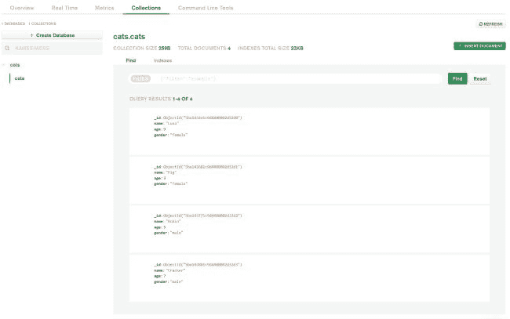
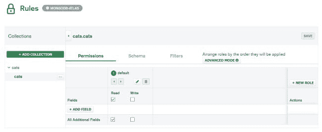
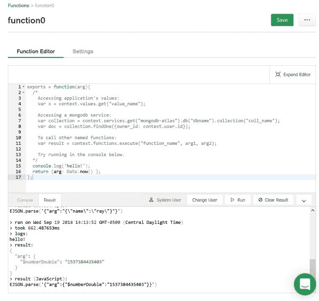

# 快速浏览一下史迪奇

> 原文：<https://dev.to/raymondcamden/a-quick-look-at-stitch-bjj>

作为一名开发人员，跟上所有可用的酷平台和技术可能会非常困难。硬币的另一面是，有时你会发现非常酷的东西，坦率地说，你不介意迟到一会儿。例如，几天前我被 MongoDB 介绍给了[针法](https://www.mongodb.com/cloud/stitch)。这是一个相当大的产品，所以我不打算超过每个细节，但它有一些非常酷的功能，我想分享。

概括地说，Stitch 涵盖三个主要功能:

*   “Stitch QueryAnywhere”，这是一种从各种开发平台访问 MongoDB 的简单方法。这种工作方式给我留下了深刻的印象，稍后您将看到一个演示。鉴于我过去的许多工作都是“提供对后端数据库的访问”，任何使这变得更简单的事情都是真正的好事。
*   “缝合功能”，作为服务功能的无服务器功能。在某些方面，这是一个基本的 FaaS 选项，但他们在这里提供了一些整洁的集成，使它脱颖而出。
*   “缝合触发器”，这基本上是一种编写函数的方法，这些函数发生在数据库的某些事件上。

除此之外，你可能还没注意到他们推出了一个基于云的 MongoDB 服务，名为 [Atlas](https://www.mongodb.com/cloud/atlas/lp/general/try) 。我也尝试了一下，效果很好，让我不再担心在本地运行 MongoDB。它有一个很好的免费电话，所以这是一个加号。对于下面我要分享的演示代码，我用 Atlas 快速创建了一个猫的 MongoDB 集合，因为猫:

[T2】](https://res.cloudinary.com/practicaldev/image/fetch/s--o10yNOPt--/c_limit%2Cf_auto%2Cfl_progressive%2Cq_auto%2Cw_880/https://static.raymondcamden.cimg/2018/09/stitch1.jpg)

界面就像你期望的那样工作，但是我喜欢他们有一个“克隆文档”的特性，因为它使得创建样本数据更加容易。

让我们先来看看 QueryAnywhere。这是一组 SDK(JavaScript，React Native，Android，iOS，Node)，通过一个简单的库提供对 CRUD(读，写，更新，删除，当然也过滤)数据的访问。还有一个处理匿名用户的完整认证系统。基本上，他们可以很容易地设置你的规则(任何人都可以阅读，这种类型的用户可以添加，等等)，这样你的客户端代码是安全的。以下是我为 Stitch 应用程序所做的配置示例，允许匿名用户(默认)读取我的重要卡特彼勒数据:

[T2】](https://res.cloudinary.com/practicaldev/image/fetch/s--ECTPSux2--/c_limit%2Cf_auto%2Cfl_progressive%2Cq_auto%2Cw_880/https://static.raymondcamden.cimg/2018/09/stitch2.jpg)

一旦你有了你的数据，并且有了设置权限，他们的门户网站提供了 JavaScript、Android 和 iOS (Swift)的样本代码，所以你可以快速地复制和粘贴内容。下面是我写的一个简单的 Vue 应用:

```
const client = stitch.Stitch.initializeDefaultAppClient('app1-togyt');

const db = client.getServiceClient(stitch.RemoteMongoClient.factory, 'mongodb-atlas').db('cats');

const app = new Vue({
  el:'#app',
  data() {
    return {
      cats:[]
    }
  },
  created() {
    client.auth.loginWithCredential(new stitch.AnonymousCredential()).then(user => 
      db.collection('cats').find({}, { limit: 100}).asArray()
    ).then(docs => {
      //console.log("Found docs", docs);
      this.cats = docs;
    }).catch(err => {
      console.error(err)
    });

  }
}) 
```

Enter fullscreen mode Exit fullscreen mode

前两行设置了我的初始连接，并指定我希望与`cats`一起工作。在我的`created`钩子中，我匿名登录，找到所有的猫，然后简单地将它们复制到我的 Vue 数据中。前端只是列出了这一点，如果你想看看它的实际效果，请查看下面的 CodePen:

[https://codepen.io/cfjedimaster/embed/gdQvXG?height=600&default-tab=result&embed-version=2](https://codepen.io/cfjedimaster/embed/gdQvXG?height=600&default-tab=result&embed-version=2)

注意，我不得不包含一个额外的脚本标签来加载他们的库。

在无服务器功能方面，这里真正给我留下深刻印象的是为了便于与 MongoDB 集成而做的工作。我想这并不奇怪，但是考虑到使用一个无服务器的函数来方便地访问数据库是多么好的一件事，这绝对值得赞赏。举个例子(我是从他们的示例代码中偷的):

```
var collection = context.services.get("mongodb-atlas").db("dbname").collection("coll_name");
var doc = collection.findOne({owner_id: context.user.id}); 
```

Enter fullscreen mode Exit fullscreen mode

它们也使得访问其他无服务器功能变得容易(偷窃也一样):

```
var result = context.functions.execute("function_name", arg1, arg2); 
```

Enter fullscreen mode Exit fullscreen mode

他们有一个不错的在线编辑器，支持运行测试。(希望这个不会太小！)

[T2】](https://res.cloudinary.com/practicaldev/image/fetch/s--H6U1-fr2--/c_limit%2Cf_auto%2Cfl_progressive%2Cq_auto%2Cw_880/https://static.raymondcamden.cimg/2018/09/stitch3.jpg)

我在这里发现的唯一奇怪尴尬的事情是通过 HTTP 公开一个函数。为此，您需要添加一个 HTTP 服务，但对我来说，这并不是一个显而易见的方法。我为我的猫们发明了这个快速服务:

```
exports = function(payload) {

  var collection = context.services.get("mongodb-atlas").db("cats").collection("cats");
  return collection.find({}).toArray();

}; 
```

Enter fullscreen mode Exit fullscreen mode

而如果你好奇的话——你可以在这里看到结果:[https://web hooks . MongoDB-stitch . com/API/client/v 2.0/app/app 1-tog yt/service/httptest/incoming _ web hook/web hook 0？arg=ray & x=1](https://webhooks.mongodb-stitch.com/api/client/v2.0/app/app1-togyt/service/httptest/incoming_webhook/webhook0?arg=ray&x=1) 。(剧透——是猫。)

总而言之，Stitch 给我留下了深刻的印象，我打算更多地使用它。我很想听听使用它的读者的意见，所以如果你尝试过，请在下面给我留言。