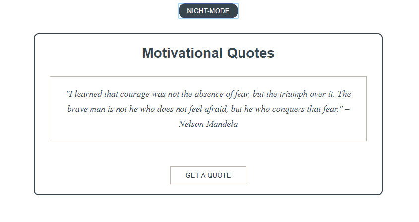
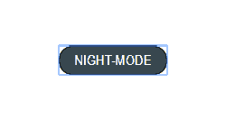

# 一个随机报价生成器，具有夜/日功能教程

> 原文：<https://dev.to/munamohamed94/a-random-quote-generator-with-a-nightday-feature-tutorial-1547>

[T2】](https://res.cloudinary.com/practicaldev/image/fetch/s--_OFszF0l--/c_limit%2Cf_auto%2Cfl_progressive%2Cq_auto%2Cw_880/https://thepracticaldev.s3.amazonaws.com/i/egzu3fkdhh6i9uehtu5l.png)

因此，您刚刚完成了另一个随机报价生成器的构建，但您不知道接下来该怎么做。或者这是你的第一次。这就是本教程的用武之地！有了一个简单的功能，你的随机报价生成器不再是“又一个随机报价生成器”——它是一个扭曲。

我们开始吧！

## [T1**HTML**](#html)

```
<html lang="en">
<head>
  <meta charset="UTF-8">
  <meta name="viewport" content="width=device-width, initial-scale=1.0">
  <meta http-equiv="X-UA-Compatible" content="ie=edge">
  Document
</head>
<body>
  <button id="night-mode-js" class="btn night-mode" data-text-swap="day-mode" onclick="toggleBtn()">
  Night-mode
  </button>

  <div class="quote-container">
    <h2 id="heading">Motivational Quotes</h2>
    <p id="quote-js" class="quote">Do not wait; the time will never be ‘just right.’ Start where you stand, and work with whatever tools you may have at your command, and better tools will be found as you go along. — George Herbert</p>
    <button id="quote-btn">Get a quote</button>
  </div>
</body>
</html> 
```

Enter fullscreen mode Exit fullscreen mode

记住了构成 Windows 登录页面的组件，我们现在可以开始编写 HTML 代码了。

我们的 HTML 结构非常简单。按照我们的草图，我们将有一个按钮标签在页面顶部居中，这将是我们的**夜/日切换按钮**。我们将给这个按钮一个 night-mode-js 的 id 和一个 btn 和 night-mode 的类。给按钮一个 night-mode-js 的 id 将有助于我们了解我们对报价生成器的哪些组件应用了 javascript。我们将使用 btn 类来应用 CSS 样式，night-mode 类将是我们将切换以将夜间或白天模式应用于报价生成器的类。

下面是我们的报价生成器。我们将从主 div 容器开始，它将充当报价生成器所有组件的容器(去掉上面的夜间/白天模式按钮)，我们将为它指定一个类名 **quote-container** 。嵌套在报价容器 div 内的将是标题、报价显示和我们的按钮，该按钮将允许我们生成随机报价。标题将在 h2 标签中，我们将给出标题的 id。标题下方是**报价显示**。为了显示我们的报价，我们将使用

标签，我们将给出 quote-js 的 id 和 quote-display 的类。报价容器 div 中的最后一个组件是我们的另一个按钮， **quote-btn** ，它允许我们生成随机报价。

这是我们目前掌握的情况:

[https://codepen.io/Munamohamed94/embed/NMpNaq?height=600&default-tab=result&embed-version=2](https://codepen.io/Munamohamed94/embed/NMpNaq?height=600&default-tab=result&embed-version=2)

## **【SCS】**

```
.btn {
  width: 120px;
  height: 30px;
  display: block;
  margin: 0 auto;
  border-radius: 30px;
  font-family: helvetica;
  text-align: center;
  text-transform: uppercase;
  background-color: white;
  border: 1px solid black;
  cursor: pointer;
}
.quote-container {
  max-width: 700px;
  min-width: 350px;
  margin: 30px auto;
  text-align: center;
  border: 2px solid #37474F;
  border-radius: 10px;     
  transition: all 0.5s ease-in;
  color: #37474F;
  font-family: helvetica;
#heading {
    font-size: 28px;
  }
  .quote-display {
    line-height: 30px;
    margin: 30px;
    padding: 20px;
    border: 1px solid #BDBDBD;        
    font-style: italic;
    font-size: 18px;
  }
  #quote-btn {
    margin: 20px;  
    text-transform: uppercase;
    background-color: white;
    border: 1px solid #9E9E9E;
    padding: 10px 30px;
    cursor: pointer;
    transition: background-color 0.3s ease-in;
    &:hover {
      background-color: #37474F;
      color: white;
    }
  }  
}
.night-mode {
  background-color: #37474F;
  color: white;   
} 
```

Enter fullscreen mode Exit fullscreen mode

来做点造型吧！

#### **夜/日切换按钮**

我们将从设计我们的第一个按钮开始(例如，我们的夜间/白天模式切换按钮)。我们将赋予它 120 像素的宽度和 30 像素的高度。

由于大多数浏览器将按钮显示为内嵌块元素(这意味着浏览器允许其他元素位于按钮的两侧)，我们将对此进行更改，使其显示为块。

要水平居中按钮，我们给它 0 自动边距。为了稍微弯曲按钮的角，我们将赋予 border-radius 属性一个 30 像素的值。

我们将把 font-family 值改为 helvetica。为了使文本在按钮内居中，我们将赋予 text-align 属性一个值 center，为了将字母改为大写，我们将赋予 text-transform 属性一个大写的值。

我们还会给按钮一个白色的背景色，以及一个 1 像素的黑色边框。为了表明这是一个可以单击的按钮，我们将更改 cursor 属性，赋予它一个指针值。在应用了所有的样式后，我们的按钮看起来会像这样:

[T2】](https://res.cloudinary.com/practicaldev/image/fetch/s--tl-IqCr0--/c_limit%2Cf_auto%2Cfl_progressive%2Cq_auto%2Cw_880/https://thepracticaldev.s3.amazonaws.com/i/6owa00ktfyt91k0iwoy4.png)

#### **报价-容器**

样式的下一个组件是报价容器 div。

我们将报价容器 div 的最大宽度设为 700 像素，最小宽度设为 350 像素。这将允许报价生成器的容器通过收缩到 350 像素的宽度和扩展到 700 像素的最大宽度来响应。

为了在夜间/白天模式按钮和报价容器之间留出一些空间，并使报价容器水平居中，我们将赋予 margin 属性一个值“30 px auto”。

我们将通过应用文本居中对齐来使文本在报价容器中居中。为了给我们的报价容器添加一点曲率，我们将应用 10 像素的边界半径。为了在报价容器和/或其子元素发生变化时应用一个小的转换效果，我们将使用 transition 属性。过渡将持续 0.3 秒，我们将把过渡计时功能设置为缓入

为了让 quote-container 中的文本看起来不那么刺眼，我们将文本的颜色从默认颜色(黑色)更改为更柔和的灰色(确切地说是#37474F)。最后，为了统一，我们将报价容器的字体系列设为 helvetica。这不仅适用于 quote-container div，还适用于它的所有子元素。

#### **标题**

因为我们应用于 quote-container 的大多数 CSS 属性也应用于标题，所以我们将应用于标题的唯一属性是 28 像素的字体大小。

#### **报价-显示**

对于将显示报价的 p 标记，我们将应用 30 像素的行高来在报价的每行之间创建一些间距。我们还将应用 30 像素的边距，在主容器、报价容器和将显示我们报价的 p 标记之间创建一些空间。此外，我们将在 p 标记中的文本(即我们的报价显示)和它的容器(p 标记本身)之间添加一些填充。我们将添加一个 1 像素的细黑色边框，通过给 font-style 属性一个斜体值来使字体变为斜体，最后，将字体大小改为 18 像素。

#### **报价-btn**

让我们从给 quote 按钮 20 像素的边距开始。接下来，我们将给报价按钮一个白色背景和一个 1 像素的细边框，颜色为#9E9E9E。我们将在按钮的顶部和底部应用 10 像素的小填充，在按钮的左侧和右侧应用 30 像素的填充。最后，我们将使用 transition 属性将持续 0.3 秒的淡入过渡应用到背景色，每当我们悬停在按钮上时，背景色将应用该过渡。最后要做的是应用悬停效果，以便在光标悬停在按钮上时改变背景色和文本颜色。我们使用:hover 选择器来实现这一点。

在设计结束时，我们的报价生成器将是这样的:

[https://codepen.io/Munamohamed94/embed/YLZqrR?height=600&default-tab=result&embed-version=2](https://codepen.io/Munamohamed94/embed/YLZqrR?height=600&default-tab=result&embed-version=2)

## [T1**jQuery**](#jquery)

```
var quote = document.getElementById("quote-js");
var quoteBtn = document.getElementById("quote-btn");

// Nightmode/Daymode feauture
$(document).ready(function() {
  $("#night-mode-js").click(function() {
    $(".quote-container, .quote, .btn").toggleClass("night-mode");
       if($('#night-mode-js').hasClass('night-mode')){
       $('#night-mode-js').html('Night-mode');
     } else {
       $('#night-mode-js').html('Day-mode');
     }
  });
});

//Random  quote  machine  var  quotes = [
  '"The  past  cannot  be  changed. The  future  is  yet  in  your  power." -  Unknown',
  '"Either  I  will  find  a  way, or  I  will  make  one." -  Philip  Sydney',
  '"Failure  will  never  overtake  me  if  my  determination  to  succeed  is  strong  enough." -  Og  Mandino',
  '"Don’t  watch  the  clock; do  what  it  does. Keep  going." — Sam  Levenson',
  '"Aim  for  the  moon. If  you  miss, you  may  hit  a  star." — W. Clement  Stone.',
  '"It  always  seems  impossible  until  its  done." -  Amelia  Earhart',
  '"Look  up  at  the  stars  and  not  down  at  your  feet. Try  to  make  sense  of  what  you  see, and  wonder  about  what  makes  the  universe  exist. Be  curious." -  Stephen  Hawking',
  '"Believe  in  yourself! Have  faith  in  your  abilities! Without  a  humble  but  reasonable  confidence  in  your  own  powers  you  cannot  be  successful  or  happy." -  Norman  Vincent  Peale', '"You  Learn  More  From  Failure  Than  From  Success. Don’t  Let  It  Stop  You. Failure  Builds  Character." – Unknown', '"If  You  Are  Working  On  Something  That  You  Really  Care  About, You  Don’t  Have  To  Be  Pushed. The  Vision  Pulls  You." – Steve  Jobs','"We  May  Encounter  Many  Defeats  But  We  Must  Not  Be  Defeated." – Maya  Angelou', '"One  Of  The  Lessons  That  I  Grew  Up  With  Was  To  Always  Stay  True  To  Yourself  And  Never  Let  What  Somebody  Else  Says  Distract  You  From  Your  Goals." – Michelle  Obama', '"Today’s  Accomplishments  Were  Yesterday’s  Impossibilities." – Robert  H. Schuller', '"The  Only  Way  To  Do  Great  Work  Is  To  Love  What  You  Do. If  You  Haven’t  Found  It  Yet, Keep  Looking. Don’t  Settle." – Steve  Jobs', '"Twenty  years  from  now  you  will  be  more  disappointed  by  the  things  that  you  didn’t  do  than  by  the  ones  you  did  do, so  throw  off  the  bowlines, sail  away  from  safe  harbor, catch  the  trade  winds  in  your  sails. Explore, Dream, Discover." -  Mark  Twain', '"Nothing  is  impossible, the  word  itself  says "I’m  possible!" -  Audrey  Hepburn', '"Our  greatest  weakness  lies  in  giving  up. The  most  certain  way  to  succeed  is  always  to  try  just  one  more  time." -  Thomas  A. Edison', '"I  learned  that  courage  was  not  the  absence  of  fear, but  the  triumph  over  it. The  brave  man  is  not  he  who  does  not  feel  afraid, but  he  who  conquers  that  fear." – Nelson  Mandela', '"If  you  don’t  like  something, change  it. If  you  can’t  change  it, change  your  attitude." – Maya  Angelou', '"Success  means  doing  the  best  we  can  with  what  we  have. Success  is  the  doing, not  the  getting; in  the  trying, not  the  triumph. Success  is  a  personal  standard, reaching  for  the  highest  that  is  in  us, becoming  all  that  we  can  be." – Zig  Ziglar'
]; quoteBtn.onclick = function  randomQuote() { var  rand = quotes[Math.floor(Math.random() * quotes.length)]; quote.innerHTML = rand;
}; 
```

Enter fullscreen mode Exit fullscreen mode

末日即将来临！

所以在本教程中，jQuery 将是我们首选的 JavaScript 库。JQuery 是一个非常棒的库，易于学习、使用和阅读，是初学者开始学习的最佳 JavaScript 库。您可以使用其他 JavaScript 库和框架，甚至是普通的 JavaScript 来获得相同的结果，但是为了本教程的目的，我们将使用 jQuery。

好了，先不说解释，让我们从使用 id quote-js 声明 quote-display 开始，并将它存储在一个名为 quote 的变量中。我们还将使用它的 id quote-BTN 声明 quote 按钮，并将其存储在一个名为 quoteBtn 的变量中。

#### **夜间/白天模式功能**

我们将从夜间/白天模式功能开始。首先，我们将从 jQuery 的 ready 函数开始。ready()让浏览器知道页面加载后要运行什么。

```
$(document).ready(function(){
   //Enter code here
}); 
```

Enter fullscreen mode Exit fullscreen mode

所以让我们回顾一下我们希望发生什么。我们希望夜间/白天切换按钮切换它的背景颜色，文本颜色和按钮内的文本之间的'夜间模式'到'白天模式'时，它被点击。我们还希望 quote-container、quote-display 和 quote-btn 的背景色和文本色在白天模式颜色和夜晚模式颜色之间切换。

最简单的方法是在样式表中添加一个名为 night-mode 的类，并在应用 night-mode 类时赋予它我们希望报价生成器的组件所具有的特性。我在样式表的末尾包含了这个类，赋予它#37474F 的背景颜色和白色的文本颜色。

```
$(document).ready(function() {
 $(“#night-mode-js”).click(function() {
    //Enter code here
 });
}); 
```

Enter fullscreen mode Exit fullscreen mode

在我们的 ready()事件中，我们将输入一个 click()事件，该事件将应用于夜间/白天切换按钮。我们将使用我们给出的 id，专门用于我们的 JavaScript 代码。

```
$(document).ready(function() {
  $("#night-mode-js").click(function() {
    $(".quote-container, .quote, .btn").toggleClass("night-mode");
  });
}); 
```

Enter fullscreen mode Exit fullscreen mode

在我们的 click()事件中是我们的 toggleClass()事件。我们将键入我们希望 toggleClass()方法应用于哪些组件，以及我们希望在哪个类之间切换，这将应用于我们之前指定的组件。

toggleClass()所做的是在向指定的组件添加或移除类之间切换。因此，当我们单击“夜间/白天切换”按钮时，click()事件中的函数将运行，该函数将执行 toggleClass()事件。如果列出的组件已经有了 night-mode 类，当单击 night/day 切换按钮时，toggleClass()事件将删除它。如果它们没有 night-mode 类，那么 toggleClass()事件会将该类添加到方法中指定的每个组件中。

```
$(document).ready(function() {
  $("#night-mode-js").click(function() {
    $(".quote-container, .quote, .btn").toggleClass("night-mode");
       if($('#night-mode-js').hasClass('night-mode')){
       $('#night-mode-js').html('Night-mode');
     } else {
       $('#night-mode-js').html('Day-mode');
     }    
  });
}); 
```

Enter fullscreen mode Exit fullscreen mode

当点击夜/日切换按钮时，我们需要做的最后一件事是让按钮内的文本在“夜-模式”和“日-模式”之间切换。我们使用 if 语句和 hasClass()事件来实现这一点。单击时，如果夜/日切换按钮有 night-mode 类，我们希望按钮内的文本是“night-mode”。如果夜间/白天切换按钮没有夜间模式类(记得我们使用 toggleClass()事件在前面列出的元素中添加或删除夜间模式类之间切换)，那么我们希望按钮中的文本是“白天模式”。

这就是夜间/白天模式功能！让我们继续本教程的最后一步—报价生成器本身。

#### **报价-生成器**

我们将首先声明我们的报价数组，它将存储我们的报价数组，这些报价将在我们的报价生成器中随机显示，并给它一个变量名 quotes。在本教程中，我们将使用励志名言。

你可以使用任何你喜欢的引用类别；书籍引用，电影引用，电视节目引用。或者，如果你不喜欢引用，那么你可以选择一个话题的随机事实。你甚至可以用笑话！你可以完全控制这里，所以尽情发挥吧！

```
var quotes = [
  '"The past cannot be changed. The future is yet in your power." - Unknown',
  '"Either I will find a way, or I will make one." - Philip Sydney',
  '"Failure will never overtake me if my determination to succeed is strong enough." - Og Mandino',
  '"Don’t watch the clock; do what it does. Keep going." — Sam Levenson',
  '"Aim for the moon. If you miss, you may hit a star." — W. Clement Stone.',
  '"It always seems impossible until its done." - Amelia Earhart',
  '"Look up at the stars and not down at your feet. Try to make sense of what you see, and wonder about what makes the universe exist. Be curious." - Stephen Hawking',
  '"Believe in yourself! Have faith in your abilities! Without a humble but reasonable confidence in your own powers you cannot be successful or happy." - Norman Vincent Peale', '"You Learn More From Failure Than From Success. Don’t Let It Stop You. Failure Builds Character." – Unknown', '"If You Are Working On Something That You Really Care About, You Don’t Have To Be Pushed. The Vision Pulls You." – Steve Jobs','"We May Encounter Many Defeats But We Must Not Be Defeated." – Maya Angelou', '"One Of The Lessons That I Grew Up With Was To Always Stay True To Yourself And Never Let What Somebody Else Says Distract You From Your Goals." – Michelle Obama', '"Today’s Accomplishments Were Yesterday’s Impossibilities." – Robert H. Schuller', '"The Only Way To Do Great Work Is To Love What You Do. If You Haven’t Found It Yet, Keep Looking. Don’t Settle." – Steve Jobs', '"Twenty years from now you will be more disappointed by the things that you didn’t do than by the ones you did do, so throw off the bowlines, sail away from safe harbor, catch the trade winds in your sails. Explore, Dream, Discover." - Mark Twain', '"Nothing is impossible, the word itself says "I’m possible!" - Audrey Hepburn', '"Our greatest weakness lies in giving up. The most certain way to succeed is always to try just one more time." - Thomas A. Edison', '"I learned that courage was not the absence of fear, but the triumph over it. The brave man is not he who does not feel afraid, but he who conquers that fear." – Nelson Mandela', '"If you don’t like something, change it. If you can’t change it, change your attitude." – Maya Angelou', '"Success means doing the best we can with what we have. Success is the doing, not the getting; in the trying, not the triumph. Success is a personal standard, reaching for the highest that is in us, becoming all that we can be." – Zig Ziglar'
]; 
```

Enter fullscreen mode Exit fullscreen mode

因此，一旦我们有了引号数组，接下来我们需要定义的是我们将如何使用它们。

让我们在这里重述一下——所以我们希望每次点击报价按钮时显示一个随机报价。我们可以通过将 JavaScript 的 onclick()事件应用到前面 JavaScript 代码中声明的 quote 按钮来实现这一点。

```
quoteBtn.onclick = function randomQuote() {
  var rand = quotes[Math.floor(Math.random() * quotes.length)];
  quote.innerHTML = rand;
}; 
```

Enter fullscreen mode Exit fullscreen mode

我们将 *quoteBtn.onclick* 设置为一个名为 randomQuote()的函数，该函数将执行生成随机报价的代码。

在我们的 randomQuote()函数中，我们将创建一个名为 rand(rand 的缩写)的变量，并将其设置为与上面的等式相等。

该方程将采用 quotes 变量，它存储了我们的报价数组，并将其乘以一个随机数。为了生成一个随机数，我们将使用 Math.random()方法(它输出一个介于 0 和 1 之间的随机数),并通过使用 quotes.length 将其乘以 quotes 变量中的引号数。

最后要做的事情是将 rand 变量设置为报价显示的 innerHTML，我们在前面已经声明了这个变量，它的变量名为 *quote* 。

这是我们工作的最终成果:

[https://codepen.io/Munamohamed94/embed/bMqpoN?height=600&default-tab=result&embed-version=2](https://codepen.io/Munamohamed94/embed/bMqpoN?height=600&default-tab=result&embed-version=2)

我们完事了。我希望你喜欢这个教程，甚至可能学到一两件事？

使用本教程获得创意！推动你自己，看看你可以用你在这里学到的东西作为基础增加什么。尝试不同的形状、颜色和字体。向报价生成器添加其他功能！夜/昼特征仅仅是开始。以下是一些帮助您入门的功能:

*   添加允许您翻译文本的语言功能
*   为每个随机引用更改文本颜色或背景颜色
*   添加在社交媒体上分享报价的功能
*   添加更改字体大小的功能，以提高可访问性
*   添加不同类别的报价供用户选择

同样，这些只是让你开始的一些想法。我相信你会有更好的！

#### **为了方便访问，我将本教程中的笔收集起来，放在 Codepen 上的一个集合中。你可以在这里查看[。](https://codepen.io/collection/XdvVmN/)**

#### **我很想看看你的创意，所以请在[推特上@我](https://twitter.com/MunaMohamed94)！**

#### **希望你喜欢这个教程！如果你做了，❤️，💬并分享！下次见！** ✌️