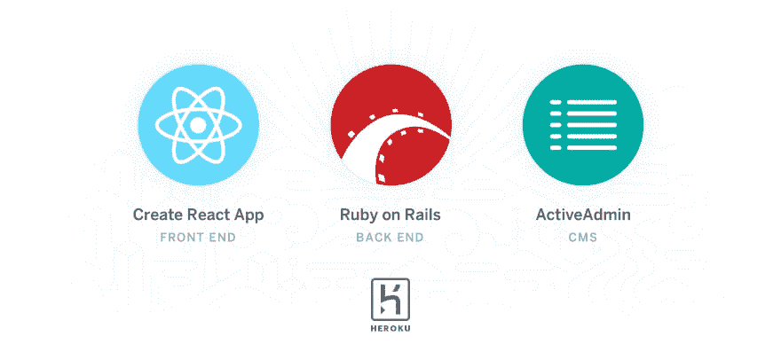
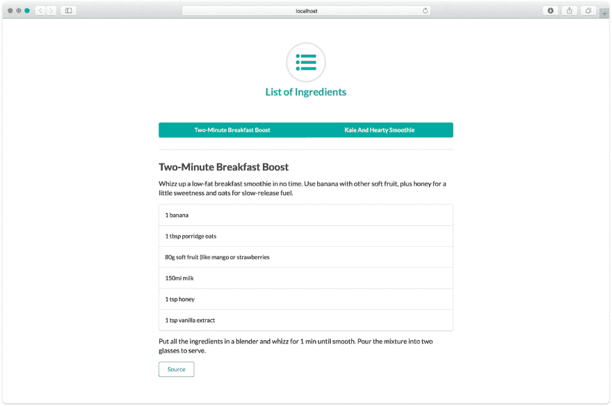
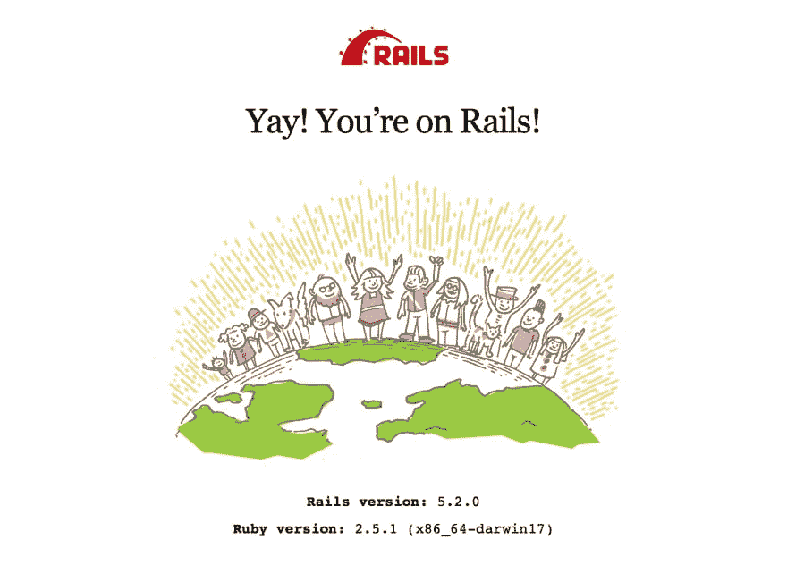
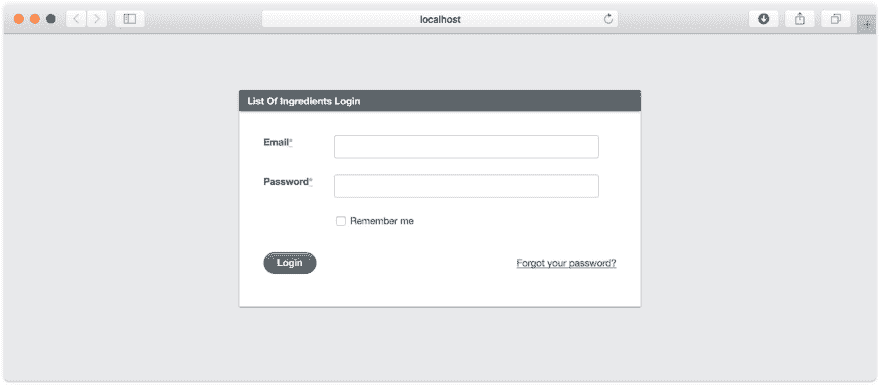
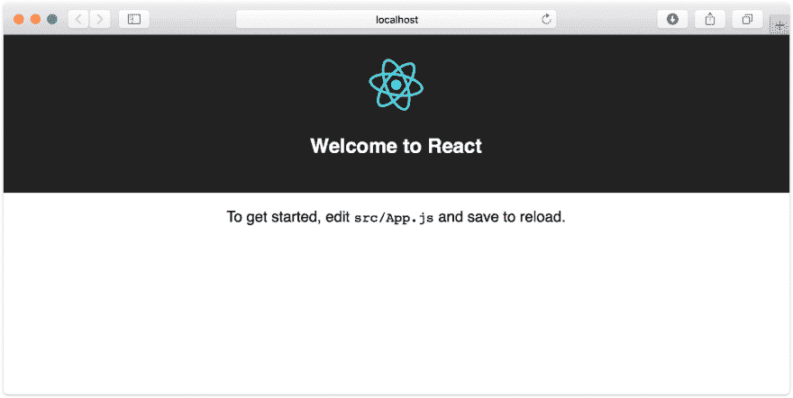
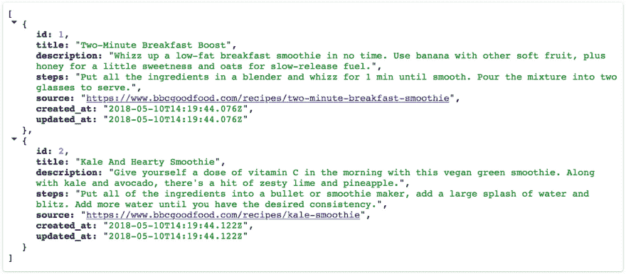
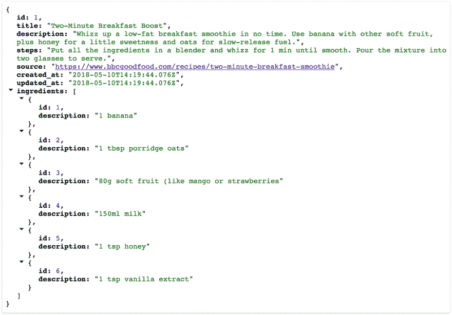
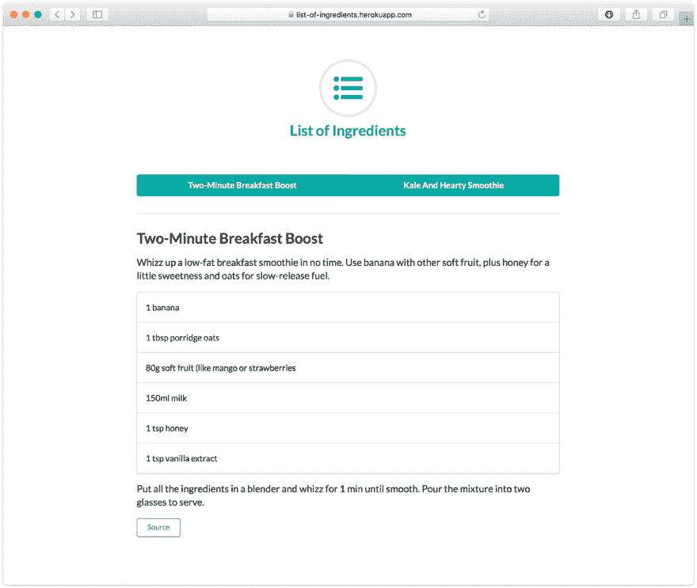
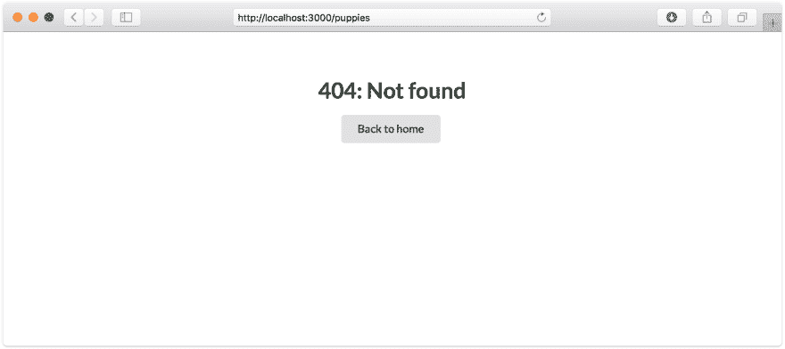

# 一个坚如磐石的现代 Web 堆栈 Heroku 上的 Rails 5 API+active admin+Create React App

> 原文：<https://dev.to/heroku/a-rock-solid-modern-web-stackrails-5-api--activeadmin--create-react-app-on-heroku-jfm>

如何将坚如磐石的 CMS 和 API 与绝对最好的前端工具相结合，作为单个项目构建并无缝托管在 Heroku 上。

Rails 是一个不可思议的框架，但是现代 web 开发已经转移到了前端，这意味着有时候你不需要所有的资产管道和模板系统。在 Rails 5 中，你现在可以创建一个纯 API 的 Rails 应用程序，这意味着你可以按照你喜欢的方式构建你的前端——例如，使用 Create React App。[它不再是 100%奥马卡斯](http://david.heinemeierhansson.com/2012/rails-is-omakase.html)。

[T2】](https://res.cloudinary.com/practicaldev/image/fetch/s--A2_yQ4-K--/c_limit%2Cf_auto%2Cfl_progressive%2Cq_auto%2Cw_880/https://heroku-blog-files.s3.amazonaws.com/posts/1526402185-A%2520Rock%2520Solid%2520Stack.jpg)

对于不需要类似 CMS 的功能的项目，Rails 和它马上就能很好地工作。Create React App 甚至支持开发中的[代理 API 请求](https://github.com/facebookincubator/create-react-app/blob/master/packages/react-scripts/template/README.md#proxying-api-requests-in-development)，所以你可以在本地运行两个服务器，而不必用`if NODE_ENV === ‘development’`丢弃你的应用。

尽管如此，我还是和 [ActiveAdmin](https://github.com/activeadmin/activeadmin) 合作过一些项目，作为你和数据库之间的接口，它的易用性是无与伦比的。有许多定制选项，如果你需要一个 CMS，客户使用起来很容易。问题是移除 Rails 的非 API 部分会破坏它。不理想。但一切都没有失去——只需几个步骤，您就可以运行一个 Rails 5 应用程序，仅支持 API，在前端为您的 Create React 应用程序客户端提供服务，并完全访问 ActiveAdmin。

我们将建造它，然后我们将[把它部署到 Heroku](https://list-of-ingredients.herokuapp.com/) ，然后我们将用你选择的美味健康的饮料来庆祝。因为我们将赢得它。鉴于这个主题，我们将开发一个应用程序，向我们展示冰沙的配方。主题很合适！

那么，我们要用什么？

*   **[创建 React App](https://github.com/facebookincubator/create-react-app)**
    一个高度优化的 Webpack config 的所有功能，无需麻烦。

*   **[Rails 在 API-only 模式下](http://edgeguides.rubyonrails.org/api_app.html)**
    只保留最好的部分，让 React 来处理 UI。

*   **[ActiveAdmin](https://github.com/activeadmin/activeadmin)**
    一个即时 CMS 后端。

*   **在 [Heroku](https://heroku.com/)**
    上无缝部署同源(因此没有 CORS 复杂性)的构建步骤来管理节点和 Ruby。

*   **单页 app 支持 [React 路由器](https://github.com/ReactTraining/react-router)**
    这样你就可以在前端进行闪电般的快速渲染。

它看起来会像这样:

<figure>[](https://res.cloudinary.com/practicaldev/image/fetch/s--82JrAygg--/c_limit%2Cf_auto%2Cfl_progressive%2Cq_auto%2Cw_880/https://heroku-blog-files.s3.amazonaws.com/posts/1526300250-site-initial.jpg) 

<figcaption>我们的 app，[配料表](https://list-of-ingredients.herokuapp.com/)，真的如罐头上说的那样。</figcaption>

</figure>

如果你想跳到已完成的回购，[你可以在这里](https://github.com/heroku/list-of-ingredients)这样做，如果你想看实际操作，[你可以在这里](https://list-of-ingredients.herokuapp.com/)这样做。

我们开始吧，好吗？

* * *

## 第一步:设置 Rails 5

### 与美味的低碳水化合物 API-only 模式

* * *

关于如何在本地开发环境中设置 Ruby 和 Rails，有很多很棒的教程。https://gorails.com/setup/将设计出你的操作系统，并指导你安装 Rails 5.2.0。

如果你已经有了 Rails 5，太棒了。最好的检查方法是在你的终端中运行`rails -v`。如果你看到`Rails 5.2.0`，我们准备好了。

所以，首先，用`--api`标志:
启动一个新的 Rails 应用程序

```
mkdir list-of-ingredients
cd list-of-ingredients
rails new . --api 
```

Enter fullscreen mode Exit fullscreen mode

在提交之前，将`/public`添加到`.gitignore`，因为这将在构建时由我们的前端填充。您的`.gitignore`文件应该是这样的:

```
# See https://help.github.com/articles/ignoring-files for more about ignoring files.
#
# If you find yourself ignoring temporary files generated by your text editor
# or operating system, you probably want to add a global ignore instead:
# git config --global core.excludesfile '~/.gitignore_global'

# Ignore bundler config.
/.bundle

# Ignore the default SQLite database.
/db/*.sqlite3
/db/*.sqlite3-journal

# Ignore all logfiles and tempfiles.
/log/*
/tmp/*
!/log/.keep
!/tmp/.keep

# Ignore uploaded files in development
/storage/*

.byebug_history

# Ignore master key for decrypting credentials and more.
/config/master.key

# Ignore public, as it is built on deploy
# Place files for /public in /client/public
/public 
```

Enter fullscreen mode Exit fullscreen mode

没错。我们已经开始制作美味的思慕雪了。也许利用这段时间祝贺你自己，因为你做得很好。

一旦安装过程完成，您就可以启动 Rails:

```
bin/rails s -p 3001 
```

Enter fullscreen mode Exit fullscreen mode

它会做一些事情，最终告诉你它正在监听`http://localhost:3001`。如果您访问它，您应该会看到类似这样的内容:

<figure>[](https://res.cloudinary.com/practicaldev/image/fetch/s--JMxAEzba--/c_limit%2Cf_auto%2Cfl_progressive%2Cq_auto%2Cw_880/https://heroku-blog-files.s3.amazonaws.com/posts/1526300434-rails.jpg) 

<figcaption>耶铁轨！</figcaption>

</figure>

看——插图中甚至还有一只小猫。太棒了。让我们退出 Rails，为第 2 步做准备。

* * *

## 第二步:让 ActiveAdmin 开始工作

### 对 Rails 做了一些小的调整

* * *

([感谢罗曼·罗特启发了这一点。](https://rrott.com/blog/ror/rails-5-api-with-activeadmin-integration.html))

那么，为什么我们需要做任何改变来让 Rails 运行起来呢？这是因为当我们制作一个 Rails API 应用程序时，Rails 并不期望提供 HTML 页面，而且因为我们添加了 [ActiveAdmin](https://github.com/activeadmin/activeadmin) ，我们实际上需要它来提供 HTML 页面。

在安装 ActiveAdmin 之前，您需要切换几个 Rails 类，并添加一些它所依赖的中间件。

首先，你需要把你的`app/controllers/application_controller.rb`从使用`API`换成使用`Base`，一定要加上`protect_from_forgery with: :exception`。

所以你的`application_controller.rb`应该是这样的:

```
class ApplicationController < ActionController::API
end 
```

Enter fullscreen mode Exit fullscreen mode

更像这样:

```
class ApplicationController < ActionController::Base
    protect_from_forgery with: :exception
end 
```

Enter fullscreen mode Exit fullscreen mode

正如 [Carlos Ramirez 提到的](http://www.carlosramireziii.com/how-to-add-active-admin-to-a-rails-5-api-application.html)，这个要求是由于 ActiveAdmin 的设计决定，这意味着我们从`ApplicationController`继承的任何控制器都不会利用精简的 API 版本。

不过，这里有一个工作。给你的`app/controllers` :
添加一个新的`api_controller.rb`文件

```
class ApiController < ActionController::API
end 
```

Enter fullscreen mode Exit fullscreen mode

现在你可以让任何新的控制器从`ApiController`继承，而不是从`ApplicationController`继承。例如，如果你正在制作一个`ExampleController`，它可能看起来像这样:

```
class ExampleController < ApiController
end 
```

Enter fullscreen mode Exit fullscreen mode

从那时起，我们需要确保中间件拥有 ActiveAdmin 正常工作所需的东西。API 模式去掉了 cookies 和 flash，但是我们可以 100%把它们放回去。在你的`config/application.rb`中添加这些到`Application`类:

```
# Middleware for ActiveAdmin
config.middleware.use Rack::MethodOverride
config.middleware.use ActionDispatch::Flash
config.middleware.use ActionDispatch::Cookies
config.middleware.use ActionDispatch::Session::CookieStore 
```

Enter fullscreen mode Exit fullscreen mode

您还需要通过取消注释将`sprockets/railtie`添加回去:

```
require "sprockets/railtie" 
```

Enter fullscreen mode Exit fullscreen mode

您的`config/application.rb`应该是这样的:

```
require_relative 'boot'

require "rails"
# Pick the frameworks you want:
require "active_model/railtie"
require "active_job/railtie"
require "active_record/railtie"
require "active_storage/engine"
require "action_controller/railtie"
require "action_mailer/railtie"
require "action_view/railtie"
require "action_cable/engine"
require "sprockets/railtie"
require "rails/test_unit/railtie"

# Require the gems listed in Gemfile, including any gems
# you've limited to :test, :development, or :production.
Bundler.require(*Rails.groups)

module ListOfIngredients
  class Application < Rails::Application
    # Initialize configuration defaults for originally generated Rails version.
    config.load_defaults 5.2

    # Settings in config/environments/* take precedence over those specified here.
    # Application configuration can go into files in config/initializers
    # -- all .rb files in that directory are automatically loaded after loading
    # the framework and any gems in your application.

    # Only loads a smaller set of middleware suitable for API only apps.
    # Middleware like session, flash, cookies can be added back manually.
    # Skip views, helpers and assets when generating a new resource.
    config.api_only = true

    # Middleware for ActiveAdmin
    config.middleware.use Rack::MethodOverride
    config.middleware.use ActionDispatch::Flash
    config.middleware.use ActionDispatch::Cookies
    config.middleware.use ActionDispatch::Session::CookieStore
  end
end 
```

Enter fullscreen mode Exit fullscreen mode

接下来，你的`Gemfile`。您需要在:
中添加 ActiveAdmin gems

```
# ActiveAdmin
gem 'devise'
gem 'activeadmin' 
```

Enter fullscreen mode Exit fullscreen mode

您还应该将`gem 'sqlite3'`移动到`:development, :test`组中，并将`gem 'pg'`添加到新的`:production`组中。这是因为 Heroku 不支持 sqlite 的本地磁盘存储(参见十二因素应用中的[因素六](https://12factor.net/processes))，所以你需要确保你在生产中使用 Postgres。

```
group :development, :test do
  # Use sqlite3 as the database for Active Record
  gem 'sqlite3'
  # Call 'byebug' anywhere in the code to stop execution and get a debugger console
  gem 'byebug', platforms: [:mri, :mingw, :x64_mingw]
end

group :production do
  # Use postgres as the database for production
  gem 'pg'
end 
```

Enter fullscreen mode Exit fullscreen mode

您的 Gemfile 现在应该看起来像这样:

```
source 'https://rubygems.org'
git_source(:github) { |repo| "https://github.com/#{repo}.git" }

ruby '2.5.1'

# Bundle edge Rails instead: gem 'rails', github: 'rails/rails'
gem 'rails', '~> 5.2.0'
# Use Puma as the app server
gem 'puma', '~> 3.11'
# Build JSON APIs with ease. Read more: https://github.com/rails/jbuilder
# gem 'jbuilder', '~> 2.5'
# Use Redis adapter to run Action Cable in production
# gem 'redis', '~> 4.0'
# Use ActiveModel has_secure_password
# gem 'bcrypt', '~> 3.1.7'

# Use ActiveStorage variant
# gem 'mini_magick', '~> 4.8'

# Use Capistrano for deployment
# gem 'capistrano-rails', group: :development

# Reduces boot times through caching; required in config/boot.rb
gem 'bootsnap', '>= 1.1.0', require: false

# Use Rack CORS for handling Cross-Origin Resource Sharing (CORS), making cross-origin AJAX possible
# gem 'rack-cors'

group :development, :test do
  # Use sqlite3 as the database for Active Record
  gem 'sqlite3'
  # Call 'byebug' anywhere in the code to stop execution and get a debugger console
  gem 'byebug', platforms: [:mri, :mingw, :x64_mingw]
end

group :development do
  gem 'listen', '>= 3.0.5', '< 3.2'
  # Spring speeds up development by keeping your application running in the background. Read more: https://github.com/rails/spring
  gem 'spring'
  gem 'spring-watcher-listen', '~> 2.0.0'
end

group :production do
  # Use postgres as the database for production
  gem 'pg'
end

# ActiveAdmin
gem 'devise'
gem 'activeadmin'

# Windows does not include zoneinfo files, so bundle the tzinfo-data gem
gem 'tzinfo-data', platforms: [:mingw, :mswin, :x64_mingw, :jruby] 
```

Enter fullscreen mode Exit fullscreen mode

好吧好吧。有些人可能正在磨尖他们的干草叉，因为如果你正在开发一个真正的应用程序，你应该 100%在本地运行 Postgres，以确保你的本地环境与你的生产环境相匹配。但是为了使本教程不那么冗长，我们将一起改变规则。

捆绑安装所有东西，然后将 ActiveAdmin 安装到您的 Rails 应用程序中:

```
bundle
bin/rails g active_admin:install 
```

Enter fullscreen mode Exit fullscreen mode

您应该会看到如下内容:

```
Running via Spring preloader in process 57692
      invoke devise
    generate devise:install
      create config/initializers/devise.rb
      create config/locales/devise.en.yml
  ===============================================================================

Some setup you must do manually if you haven't yet:

  1\. Ensure you have defined default url options in your environments files. Here
     is an example of default_url_options appropriate for a development environment
     in config/environments/development.rb:

       config.action_mailer.default_url_options = { host: 'localhost', port: 3000 }

     In production, :host should be set to the actual host of your application.

  2\. Ensure you have defined root_url to *something* in your config/routes.rb.
     For example:

       root to: "home#index"

  3\. Ensure you have flash messages in app/views/layouts/application.html.erb.
     For example:

       <p class="notice"><%= notice %></p>
       <p class="alert"><%= alert %></p>

  4\. You can copy Devise views (for customization) to your app by running:

       rails g devise:views

===============================================================================
      invoke active_record
      create db/migrate/20180501170855_devise_create_admin_users.rb
      create app/models/admin_user.rb
      invoke test_unit
      create test/models/admin_user_test.rb
      create test/fixtures/admin_users.yml
      insert app/models/admin_user.rb
       route devise_for :admin_users
        gsub app/models/admin_user.rb
        gsub config/routes.rb
      append db/seeds.rb
      create config/initializers/active_admin.rb
      create app/admin
      create app/admin/dashboard.rb
      create app/admin/admin_users.rb
      insert config/routes.rb
    generate active_admin:assets
Running via Spring preloader in process 57711
      create app/assets/javascripts/active_admin.js
      create app/assets/stylesheets/active_admin.scss
      create db/migrate/20180501170858_create_active_admin_comments.rb 
```

Enter fullscreen mode Exit fullscreen mode

最后，迁移并播种数据库:

```
bin/rake db:migrate db:seed 
```

Enter fullscreen mode Exit fullscreen mode

您可以再次启动 Rails:

```
bin/rails s -p 3001 
```

Enter fullscreen mode Exit fullscreen mode

这次撞上了`http://localhost:3001/admin`。您应该会看到类似这样的内容:

[T2】](https://res.cloudinary.com/practicaldev/image/fetch/s--aamU8u7b--/c_limit%2Cf_auto%2Cfl_progressive%2Cq_auto%2Cw_880/https://heroku-blog-files.s3.amazonaws.com/posts/1526300515-admin.jpg)

你应该花一点时间感觉很棒，因为那是很多次。

您可以使用用户名`admin@example.com`和密码`password`登录 ActiveAdmin。保安！不过，您可以在 rad ActiveAdmin 环境中非常容易地更改它，所以不用担心。

* * *

## 第三步:添加 Create React App 为客户端

### 耶！超快速的 Webpack 资产处理！

* * *

([大声喊出来，让所有人对这一点做出反应。](https://www.fullstackreact.com/articles/how-to-get-create-react-app-to-work-with-your-rails-api/))

所以。我们需要一个前端。如果您还没有创建 React 应用程序，请使用:
进行全局安装

```
npx create-react-app client 
```

Enter fullscreen mode Exit fullscreen mode

`npx`自带 npm 5.2+及更高版本。如果您使用的是旧版本，您可以运行:

```
npm install -g create-react-app
create-react-app client 
```

Enter fullscreen mode Exit fullscreen mode

这需要一点时间。如果你感到口渴，你可能有时间喝杯茶。

一旦完成，跳转到`client/index.js`并删除这两行:

```
import registerServiceWorker from './registerServiceWorker';
registerServiceWorker(); 
```

Enter fullscreen mode Exit fullscreen mode

这是因为，在某些情况下，Create React App 对服务工作者的使用与 Rails 的路由冲突，并可能导致您无法访问 ActiveAdmin。

一旦你完成了，你的`client/index.js`应该看起来像这样:

```
import React from 'react';
import ReactDOM from 'react-dom';
import './index.css';
import App from './App';

ReactDOM.render(<App />, document.getElementById('root')); 
```

Enter fullscreen mode Exit fullscreen mode

你现在可以启动它了:

```
yarn --cwd client start 
```

Enter fullscreen mode Exit fullscreen mode

它将自动访问 [http://localhost:3000/](http://localhost:3000/) ，您将有一个简单的 Create React 应用程序运行。那很好。另外，如果你以前没有见过`yarn --cwd client`，它会告诉 yarn 运行`client`目录中的命令。这也节省了我们进出目录的 T2。赢了！

[T2】](https://res.cloudinary.com/practicaldev/image/fetch/s--h05dW8n0--/c_limit%2Cf_auto%2Cfl_progressive%2Cq_auto%2Cw_880/https://heroku-blog-files.s3.amazonaws.com/posts/1526300555-cra.jpg)

正如我前面提到的，使用 Create React App 和 API 的一个好处是，您可以通过正确的端口自动代理 API 调用，而无需在开发和生产之间进行任何交换。为此，跳转到您的`client/package.json`并添加一个代理属性，就像这样:

```
"proxy":  "http://localhost:3001" 
```

Enter fullscreen mode Exit fullscreen mode

您的`client/package.json`文件将如下所示:

```
{  "name":  "client",  "version":  "0.1.0",  "private":  true,  "proxy":  "http://localhost:3001",  "dependencies":  {  "react":  "^16.3.2",  "react-dom":  "^16.3.2",  "react-scripts":  "1.1.4"  },  "scripts":  {  "start":  "react-scripts start",  "build":  "react-scripts build",  "test":  "react-scripts test --env=jsdom",  "eject":  "react-scripts eject"  }  } 
```

Enter fullscreen mode Exit fullscreen mode

(你可能想知道为什么我们要代理端口`3001`。一旦一切就绪，我们的脚本将在端口`3001`上运行 API，这就是我们一直以这种方式运行 Rails 的原因。不过，鹰眼，干得不错。问正确的问题！)

Create React 应用程序中包含了`fetch`(以及一系列新奇的新语言特性和聚合填充[你应该 100%检查一下](https://github.com/facebookincubator/create-react-app/blob/master/packages/react-scripts/template/README.md#supported-language-features-and-polyfills)),因此我们的前端已经准备好调用 API。但是现在这是毫无意义的——我们需要一些数据来获取。让我们开始这个奶昔派对吧。

我们将需要两个关系，制作这些饮料的`Drinks`和`Ingredients`。你还需要一个搅拌器，但是说实话，如果你手边没有，一杯加了冰块的苹果汁还是很美味的。保证。

现在通常我会说避免 Rails 中的脚手架，因为你最终会得到一大堆你必须删除的样板代码。出于练习的目的，我们将使用它，然后以我们必须删除的大量样板代码结束。照我说的做，不要照我做的做。

在之前，我应该提一下。ActiveAdmin 使用`inherited_resources`减少了 Rails 控制器的样板文件，但它的一个缺点是，当你在应用中移植*任何东西*时，Rails 就会使用它。那破玩意儿:

<figure>

```
$ bin/rails g scaffold Drink title:string description:string steps:string source:string
Running via Spring preloader in process 38277
Expected string default value for '--serializer'; got true (boolean)
      invoke active_record
      create db/migrate/20170302183027_create_drinks.rb
      create app/models/drink.rb
      invoke test_unit
      create test/models/drink_test.rb
      create test/fixtures/drinks.yml
      invoke resource_route
       route resources :drinks
      invoke serializer
      create app/serializers/drink_serializer.rb
      invoke inherited_resources_controller
Could not find "api_controller.rb" in any of your source paths. Your current source paths are:
/usr/local/var/rbenv/versions/2.4.0/lib/ruby/gems/2.4.0/bundler/gems/inherited_resources-615b0d5c37a4/lib/generators/rails/templates 
```

Enter fullscreen mode Exit fullscreen mode

<figcaption>"Could not find" is never a good start to the last line of output.</figcaption>

</figure>

幸运的是，这是一个可以解决的问题。您只需要告诉 Rails 使用常规的搭建过程。你知道，从美好的过去。

只要提醒 Rails 在你的`config/application.rb`中使用哪个`scaffold_controller`，我们就可以上路了:

```
config.app_generators.scaffold_controller = :scaffold_controller 
```

Enter fullscreen mode Exit fullscreen mode

你的`config/application.rb`看起来应该是这样的，一切都应该是正确的

```
require_relative 'boot'

require "rails"
# Pick the frameworks you want:
require "active_model/railtie"
require "active_job/railtie"
require "active_record/railtie"
require "active_storage/engine"
require "action_controller/railtie"
require "action_mailer/railtie"
require "action_view/railtie"
require "action_cable/engine"
require "sprockets/railtie"
require "rails/test_unit/railtie"

# Require the gems listed in Gemfile, including any gems
# you've limited to :test, :development, or :production.
Bundler.require(*Rails.groups)

module ListOfIngredients
  class Application < Rails::Application
    # Initialize configuration defaults for originally generated Rails version.
    config.load_defaults 5.2

    # Settings in config/environments/* take precedence over those specified here.
    # Application configuration can go into files in config/initializers
    # -- all .rb files in that directory are automatically loaded after loading
    # the framework and any gems in your application.

    # Only loads a smaller set of middleware suitable for API only apps.
    # Middleware like session, flash, cookies can be added back manually.
    # Skip views, helpers and assets when generating a new resource.
    config.api_only = true
    config.app_generators.scaffold_controller = :scaffold_controller

    # Middleware for ActiveAdmin
    config.middleware.use Rack::MethodOverride
    config.middleware.use ActionDispatch::Flash
    config.middleware.use ActionDispatch::Cookies
    config.middleware.use ActionDispatch::Session::CookieStore
  end
end 
```

Enter fullscreen mode Exit fullscreen mode

这似乎是一个很好的时机，我花了几个小时试图通过在 StackOverflow 中键入它的每个变体来理解这个特定的错误。

回到搭建——让我们从`Drink`模型开始:

```
bin/rails g scaffold Drink title:string description:string steps:string source:string 
```

Enter fullscreen mode Exit fullscreen mode

然后，`Ingredient`型号:

```
bin/rails g scaffold Ingredient drink:references description:string 
```

Enter fullscreen mode Exit fullscreen mode

注意，`Ingredient`引用了`Drink`。这将`Ingredient`模型告知`belong_to`T4，这是整个`has_many`相对数据库关联的一部分。

看，我的关系数据库 101 comp-sci 课程是完全值得的。

不幸的是，这不会告诉你的`Drink`模型到`Ingredient`模型的`has_many`，所以你还需要自己把它添加到`app/models/drink.rb`:

```
class Drink < ApplicationRecord
  has_many :ingredients
end 
```

Enter fullscreen mode Exit fullscreen mode

然后我们可以迁移并告诉 ActiveAdmin 我们的新朋友:

```
bin/rake db:migrate
bin/rails generate active_admin:resource Drink
bin/rails generate active_admin:resource Ingredient 
```

Enter fullscreen mode Exit fullscreen mode

加油团队！

现在，Rails 是一个有安全意识的野兽，所以你需要添加一些东西到 ActiveAdmin 已经生成的两个文件，`app/admin/drink.rb`和`app/admin/ingredient.rb`。具体来说，您需要允许 ActiveAdmin 编辑数据库中的内容，仔细想想，这是非常合理的。

首先，`app/admin/drink.rb` :

```
ActiveAdmin.register Drink do
  permit_params :title, :description, :steps, :source

# See permitted parameters documentation:
# https://github.com/activeadmin/activeadmin/blob/master/docs/2-resource-customization.md#setting-up-strong-parameters
#
# permit_params :list, :of, :attributes, :on, :model
#
# or
#
# permit_params do
# permitted = [:permitted, :attributes]
# permitted << :other if params[:action] == 'create' && current_user.admin?
# permitted
# end

end 
```

Enter fullscreen mode Exit fullscreen mode

然后`app/admin/ingredient.rb` :

```
ActiveAdmin.register Ingredient do
  permit_params :description, :drink_id

# See permitted parameters documentation:
# https://github.com/activeadmin/activeadmin/blob/master/docs/2-resource-customization.md#setting-up-strong-parameters
#
# permit_params :list, :of, :attributes, :on, :model
#
# or
#
# permit_params do
# permitted = [:permitted, :attributes]
# permitted << :other if params[:action] == 'create' && current_user.admin?
# permitted
# end

end 
```

Enter fullscreen mode Exit fullscreen mode

没有`permit_params`，你永远无法编辑你的美味饮品食谱。在我看来不是。

在我们的路线中，我们需要连接饮料资源。我喜欢将我的 API 调用限定在`/api`的范围内，所以我们就这么做吧。

```
scope '/api' do
  resources :drinks
end 
```

Enter fullscreen mode Exit fullscreen mode

你也可以删除这两个声明:

```
resources :ingredients
resources :drinks 
```

Enter fullscreen mode Exit fullscreen mode

您的文件应该是这样的:

```
Rails.application.routes.draw do
  devise_for :admin_users, ActiveAdmin::Devise.config
  ActiveAdmin.routes(self)

  scope '/api' do
    resources :drinks
  end
end 
```

Enter fullscreen mode Exit fullscreen mode

接下来，启动服务器:

```
bin/rails s -p 3001 
```

Enter fullscreen mode Exit fullscreen mode

你应该可以访问`http://localhost:3001/api/drinks`去看……*鼓声...*T3】

```
[] 
```

Enter fullscreen mode Exit fullscreen mode

没什么。

所以，我们应该加点饮料。我们可以通过填充`db/seeds.rb`来实现，这是一个允许您向数据库添加数据的文件。您可能会注意到这里已经有一行:

```
AdminUser.create!(email: 'admin@example.com', password: 'password', password_confirmation: 'password') if Rails.env.development? 
```

Enter fullscreen mode Exit fullscreen mode

为了确保我们可以在生产中登录到 CMS，让我们删除 ActiveAdmin 添加的`if Rails.env.development?`条件:

<figure>

```
AdminUser.create!(email: 'admin@example.com', password: 'password', password_confirmation: 'password') 
```

Enter fullscreen mode Exit fullscreen mode

<figcaption>Just a friendly reminder to be a good internet citizen and update your password in production as soon as you seed it.</figcaption>

</figure>

为了节省时间，这样你就不用自己找食谱了，我准备了两份美味的冰沙和一个糟糕的双关语。

添加以下食谱:

```
breakfast_smoothie = Drink.create(
  title: "Two-Minute Breakfast Boost",
  description: "Whizz up a low-fat breakfast smoothie in no time. Use banana with other soft fruit, plus honey for a little sweetness and oats for slow-release fuel.",
  steps: "Put all the ingredients in a blender and whizz for 1 min until smooth. Pour the mixture into two glasses to serve.",
  source: "https://www.bbcgoodfood.com/recipes/two-minute-breakfast-smoothie"
)
breakfast_smoothie.ingredients.create(description: "1 banana")
breakfast_smoothie.ingredients.create(description: "1 tbsp porridge oats")
breakfast_smoothie.ingredients.create(description: "80g soft fruit (like mango or strawberries)")
breakfast_smoothie.ingredients.create(description: "150ml milk")
breakfast_smoothie.ingredients.create(description: "1 tsp honey")
breakfast_smoothie.ingredients.create(description: "1 tsp vanilla extract")

kale_smoothie = Drink.create(
  title: "Kale And Hearty Smoothie",
  description: "Give yourself a dose of vitamin C in the morning with this vegan green smoothie. Along with kale and avocado, there's a hit of zesty lime and pineapple.",
  steps: "Put all of the ingredients into a bullet or smoothie maker, add a large splash of water and blitz. Add more water until you have the desired consistency.",
  source: "https://www.bbcgoodfood.com/recipes/kale-smoothie",
)
kale_smoothie.ingredients.create(description: "2 handfuls kale")
kale_smoothie.ingredients.create(description: "½ avocado")
kale_smoothie.ingredients.create(description: "½ lime, juice only")
kale_smoothie.ingredients.create(description: "large handful frozen pineapple chunks")
kale_smoothie.ingredients.create(description: "medium-sized chunk ginger")
kale_smoothie.ingredients.create(description: "1 tbsp cashew nuts")
kale_smoothie.ingredients.create(description: "1 banana, optional") 
```

Enter fullscreen mode Exit fullscreen mode

您的`db/seeds.rb`文件现在应该看起来像这样:

```
# This file should contain all the record creation needed to seed the database with its default values.
# The data can then be loaded with the rails db:seed command (or created alongside the database with db:setup).
#
# Examples:
#
# movies = Movie.create([{ name: 'Star Wars' }, { name: 'Lord of the Rings' }])
# Character.create(name: 'Luke', movie: movies.first)
AdminUser.create!(email: 'admin@example.com', password: 'password', password_confirmation: 'password')

breakfast_smoothie = Drink.create(
  title: "Two-Minute Breakfast Boost",
  description: "Whizz up a low-fat breakfast smoothie in no time. Use banana with other soft fruit, plus honey for a little sweetness and oats for slow-release fuel.",
  steps: "Put all the ingredients in a blender and whizz for 1 min until smooth. Pour the mixture into two glasses to serve.",
  source: "https://www.bbcgoodfood.com/recipes/two-minute-breakfast-smoothie"
)
breakfast_smoothie.ingredients.create(description: "1 banana")
breakfast_smoothie.ingredients.create(description: "1 tbsp porridge oats")
breakfast_smoothie.ingredients.create(description: "80g soft fruit (like mango or strawberries")
breakfast_smoothie.ingredients.create(description: "150ml milk")
breakfast_smoothie.ingredients.create(description: "1 tsp honey")
breakfast_smoothie.ingredients.create(description: "1 tsp vanilla extract")

kale_smoothie = Drink.create(
  title: "Kale And Hearty Smoothie",
  description: "Give yourself a dose of vitamin C in the morning with this vegan green smoothie. Along with kale and avocado, there's a hit of zesty lime and pineapple.",
  steps: "Put all of the ingredients into a bullet or smoothie maker, add a large splash of water and blitz. Add more water until you have the desired consistency.",
  source: "https://www.bbcgoodfood.com/recipes/kale-smoothie",
)
kale_smoothie.ingredients.create(description: "2 handfuls kale")
kale_smoothie.ingredients.create(description: "½ avocado")
kale_smoothie.ingredients.create(description: "½ lime, juice only")
kale_smoothie.ingredients.create(description: "large handful frozen pineapple chunks")
kale_smoothie.ingredients.create(description: "medium-sized chunk ginger")
kale_smoothie.ingredients.create(description: "1 tbsp cashew nuts")
kale_smoothie.ingredients.create(description: "1 banana, optional") 
```

Enter fullscreen mode Exit fullscreen mode

现在只需要用`bin/rake db:reset`给数据库播种。

```
bin/rake db:reset 
```

Enter fullscreen mode Exit fullscreen mode

值得注意的是，这将在本地重新创建您的数据库—包括将您的管理员密码重置回`password`。如果您的服务器正在运行，您也需要重新启动它:

现在，当您刷新时，您应该会看到:

<figure>[](https://res.cloudinary.com/practicaldev/image/fetch/s--Qu-dz3X3--/c_limit%2Cf_auto%2Cfl_progressive%2Cq_auto%2Cw_880/https://heroku-blog-files.s3.amazonaws.com/posts/1526300601-rss-initial.jpg) 

<figcaption>文字冰沙！</figcaption>

</figure>

所以，我们在数据库方面做得很好。让我们稍微按摩一下我们的脚手架控制器。首先，我们把`DrinksController`砍掉。我们可以确保`def index`只返回每种饮料的`id`和`title`，我们可以确保`def show`包括饮料每种成分的`id`和`description`。考虑到发送回来的数据很少，您可以从`index`获取所有数据，但是为了展示这在现实世界中是如何工作的，让我们这样做。

你需要确保你的控制器也是从`ApiController`继承的。跳到你的`drinks_controller.rb`里，用下面的替换它:

```
class DrinksController < ApiController
  # GET /drinks
  def index
    @drinks = Drink.select("id, title").all
    render json: @drinks.to_json
  end

  # GET /drinks/:id
  def show
    @drink = Drink.find(params[:id])
    render json: @drink.to_json(:include => { :ingredients => { :only => [:id, :description] }})
  end
end 
```

Enter fullscreen mode Exit fullscreen mode

让我们去掉 99%的`ingredients_controller.rb`，因为它不会做很多事情:

<figure>

```
class IngredientsController < ApiController
end 
```

Enter fullscreen mode Exit fullscreen mode

<figcaption>So minimal!</figcaption>

</figure>

现在我们有一些有趣的数据要提供给客户。对我们有好处！这是一大块的设置，你做得很好。或许休息一下庆祝一下？你应得的。

回来后，让我们在应用程序的根目录下创建一个`Procfile`来运行整个设置。如果你以前没有用过它们，[你可以在这里](https://devcenter.heroku.com/articles/procfile)读到它们。

我们称之为`Procfile.dev`，因为当我们*需要在本地运行一个节点服务器时，我们将在 Heroku 部署一个预构建的包，我们不需要在那里运行一个节点服务器。在本地拥有一个节点服务器和 Rails 服务器极大地加快了开发时间，这非常好，但是对于生产来说太大了。你的`Procfile.dev`应该是这样的:* 

```
web: PORT=3000 yarn --cwd client start
api: PORT=3001 bundle exec rails s 
```

Enter fullscreen mode Exit fullscreen mode

Procfiles 由`heroku` CLI 管理，如果你还没有安装，[你可以从这里](https://devcenter.heroku.com/articles/heroku-cli)获得。

一旦完成排序，只需运行:

```
heroku local -f Procfile.dev 
```

Enter fullscreen mode Exit fullscreen mode

但是，嘿，谁想每次都打字呢？为什么不做一个耙子任务来帮你做呢？只需将`start.rake`添加到你的`/lib/tasks`文件夹:

```
namespace :start do
  task :development do
    exec 'heroku local -f Procfile.dev'
  end
end

desc 'Start development server'
task :start => 'start:development' 
```

Enter fullscreen mode Exit fullscreen mode

从那里开始，你需要做的就是运行你的开发环境:

<figure>

```
bin/rake start 
```

Enter fullscreen mode Exit fullscreen mode

<figcaption>One command to fire up two servers? Magic!</figcaption>

</figure>

那一步太多了。让我们来分析一下这里发生了什么。

`heroku`将在端口`3000`上启动前端`/client`，在端口`3001.`上启动 API，然后在浏览器中打开客户端`http://localhost:3000`。您可以在`http://localhost:3001/admin`通过 API 访问 ActiveAdmin，就像您一直在做的那样。

这意味着我们现在可以整理 React 应用程序了。

最简单的事情就是检查它的工作情况。编辑您的`client/app.js` :

```
import React, { Component } from 'react';
import logo from './logo.svg';
import './App.css';

class App extends Component {
  componentDidMount() {
    window.fetch('/api/drinks')
      .then(response => response.json())
      .then(json => console.log(json))
      .catch(error => console.log(error));
  }
  render() {
    return (
      <div className="App">
        <div className="App-header">
          
          <h2>Welcome to React</h2>
        </div>
        <p className="App-intro">
          To get started, edit <code>src/App.js</code> and save to reload.
        </p>
      </div>
    );
  }
}

export default App; 
```

Enter fullscreen mode Exit fullscreen mode

在您的浏览器控制台中，您应该会看到 API 调用记录。

```
[{id: 1, title: "Two-Minute Breakfast Boost"}, {id: 2, title: "Kale And Hearty Smoothie"}] 
```

Enter fullscreen mode Exit fullscreen mode

我们可以 100%使用这些 id 来获取 Rails 中每一杯思慕雪的实际细节。当然，我们可以只从服务器发送所有东西，因为它只是两杯饮料，但我认为这更接近于你真正构建东西的方式。

现在，如果你想跳过设置前端应用程序，你可以从 repo 中抓取`client`文件夹[。否则，安装以下依赖项:](http://github.com/superhighfives/list-of-ingredients) 

```
yarn --cwd client add semantic-ui-react semantic-ui-css 
```

Enter fullscreen mode Exit fullscreen mode

并将它们添加到您的`/client`应用程序中。首先，将 css 添加到`client/src/index.js` :

```
import React from 'react'
import ReactDOM from 'react-dom'
import App from './App'
import 'semantic-ui-css/semantic.css'
import './index.css'

ReactDOM.render(<App />, document.getElementById('root')) 
```

Enter fullscreen mode Exit fullscreen mode

并为您的`client/src/app.js` :
添加所有花哨的功能

```
import React, { Component } from 'react'
import { Container, Header, Segment, Button, Icon, Dimmer, Loader, Divider } from 'semantic-ui-react'

class App extends Component {
  constructor () {
    super()
    this.state = {}
    this.getDrinks = this.getDrinks.bind(this)
    this.getDrink = this.getDrink.bind(this)
  }

  componentDidMount () {
    this.getDrinks()
  }

  fetch (endpoint) {
    return window.fetch(endpoint)
      .then(response => response.json())
      .catch(error => console.log(error))
  }

  getDrinks () {
    this.fetch('/api/drinks')
      .then(drinks => {
        if (drinks.length) {
          this.setState({drinks: drinks})
          this.getDrink(drinks[0].id)
        } else {
          this.setState({drinks: []})
        }
      })
  }

  getDrink (id) {
    this.fetch(`/api/drinks/${id}`)
      .then(drink => this.setState({drink: drink}))
  }

  render () {
    let {drinks, drink} = this.state
    return drinks
      ? <Container text>
        <Header as='h2' icon textAlign='center' color='teal'>
          <Icon name='unordered list' circular />
          <Header.Content>
            List of Ingredients
          </Header.Content>
        </Header>
        <Divider hidden section />
        {drinks && drinks.length
          ? <Button.Group color='teal' fluid widths={drinks.length}>
            {Object.keys(drinks).map((key) => {
              return <Button active={drink && drink.id === drinks[key].id} fluid key={key} onClick={() => this.getDrink(drinks[key].id)}>
                {drinks[key].title}
              </Button>
            })}
          </Button.Group>
          : <Container textAlign='center'>No drinks found.</Container>
        }
        <Divider section />
        {drink &&
          <Container>
            <Header as='h2'>{drink.title}</Header>
            {drink.description && <p>{drink.description}</p>}
            {drink.ingredients &&
              <Segment.Group>
                {drink.ingredients.map((ingredient, i) => <Segment key={i}>{ingredient.description}</Segment>)}
              </Segment.Group>
            }
            {drink.steps && <p>{drink.steps}</p>}
            {drink.source && <Button basic size='tiny' color='teal' href={drink.source}>Source</Button>}
          </Container>
        }
      </Container>
      : <Container text>
        <Dimmer active inverted>
          <Loader content='Loading' />
        </Dimmer>
      </Container>
  }
}

export default App 
```

Enter fullscreen mode Exit fullscreen mode

我应该澄清一下，这是我喜欢称之为“概念代码的证明”，而不是“良好重构的代码”。但是，鉴于我们已经看过了，值得回顾的主要部分是`getDrink` :

```
getDrink (id) {
  this.fetch(`/api/drinks/${id}`)
    .then(drink => this.setState({drink: drink}))
} 
```

Enter fullscreen mode Exit fullscreen mode

这使我们能够根据 id 获取特定的饮料。你可以通过访问[http://localhost:3001/API/drinks/1:](http://localhost:3001/api/drinks/1:)在浏览器中进行测试

[T2】](https://res.cloudinary.com/practicaldev/image/fetch/s--gaFy4C1W--/c_limit%2Cf_auto%2Cfl_progressive%2Cq_auto%2Cw_880/https://heroku-blog-files.s3.amazonaws.com/posts/1526300633-rss-all.jpg)

在这里，您还可以向您的`client/src/index.css` :
添加一些简单的样式

```
body {
  margin: 0;
  padding: 0;
  font-family: sans-serif;
}

#root {
  padding: 4rem 0;
} 
```

Enter fullscreen mode Exit fullscreen mode

你现在应该有一个漂亮的前端，它使用了[语义 UI](http://react.semantic-ui.com/) ，看起来像这样:

<figure>[](https://res.cloudinary.com/practicaldev/image/fetch/s--5zGftylL--/c_limit%2Cf_auto%2Cfl_progressive%2Cq_auto%2Cw_880/https://heroku-blog-files.s3.amazonaws.com/posts/1526300660-site-initial.jpg) 

<figcaption>羽衣甘蓝爽朗！明白了吗？</figcaption>

</figure>

* * *

## 第四步:做好生产准备

### 带有为 Webpack 捆绑包服务的导轨

* * *

那么，我们如何让我们的 Rails 应用服务于生产中的 Webpack 包呢？

这就是 Heroku 的`heroku-postbuild`的魔力所在。Heroku 将构建应用程序，然后将文件复制到由 Rails 提供服务的`/public`目录中。我们最终运行一个单一的 Rails 服务器来管理我们的前端和后端。这是双赢！有几个步骤可以做到这一点。

首先，我们在 app 的根目录下做一个`package.json`文件，这个文件告诉 Heroku 如何编译 Create React App。在 Heroku 构建了[应用程序或 slug](https://devcenter.heroku.com/articles/how-heroku-works) 之后，`heroku-postbuild`命令将开始运行。

您可能还注意到，`build`命令使用了`yarn --cwd client`，它告诉 yarn 在`client`目录中运行这些命令。

```
{  "name":  "list-of-ingredients",  "license":  "MIT",  "engines":  {  "node":  "8.9.4",  "yarn":  "1.6.0"  },  "scripts":  {  "build":  "yarn --cwd client install && yarn --cwd client build",  "deploy":  "cp -a client/build/. public/",  "heroku-postbuild":  "yarn build && yarn deploy"  }  } 
```

Enter fullscreen mode Exit fullscreen mode

从好的方面来说，这一步超级短，这也无妨，因为我的手开始酸了。

* * *

## 第五步:部署到 Heroku

### 庆祝吧，因为这是你应得的

* * *

终点线快到了！很快，阳光触及的一切都将是你的，包括新鲜、健康的饮料。

让我们做一个`Procfile`，在根，进行制作。它将告诉 Heroku 如何运行 Rails 应用程序。添加以下内容:

```
web: bundle exec rails s
release: bin/rake db:migrate 
```

Enter fullscreen mode Exit fullscreen mode

请注意`release`命令——这是 Heroku 在部署新版本的应用程序之前运行的，我们将使用它来确保我们的数据库被迁移。你可以在这里阅读更多关于[发布阶段](https://devcenter.heroku.com/articles/release-phase)的内容。

我们还需要一个位于`config`中的`secrets.yml`文件。这是 Devise 所要求的，它为 ActiveAdmin 处理身份验证。您需要创建一个`config/secrets.yml`文件，它应该是这样的:

```
development:
  secret_key_base: 

test:
  secret_key_base: 

production:
  secret_key_base: <%= ENV["SECRET_KEY_BASE"] %> 
```

Enter fullscreen mode Exit fullscreen mode

我们需要添加两个键，一个用于开发，一个用于测试。幸运的是，Rails 可以提供帮助。刚刚运行:

```
bin/rake secret | pbcopy 
```

Enter fullscreen mode Exit fullscreen mode

这将生成一个密钥，并将其添加到您的剪贴板。贴在`development`下面`secret_key_base`之后就行了。对`test`重复同样的操作，你应该会得到一个类似于
的`config/secrets.yml`

```
development:
  secret_key_base: A_LONG_STRING_OF_LETTERS_AND_NUMBERS

test:
  secret_key_base: A_DIFFERENT_LONG_STRING_OF_LETTERS_AND_NUMBERS

production:
  secret_key_base: <%= ENV["SECRET_KEY_BASE"] %> 
```

Enter fullscreen mode Exit fullscreen mode

然后让我们创建一个新的 Heroku 应用程序来完成这个任务:

```
heroku apps:create 
```

Enter fullscreen mode Exit fullscreen mode

如果你现在提交并推送到 Heroku，这对 Heroku 来说就像一个双 Rails / Node 应用，这很好。问题是，您的节点代码需要首先执行，这样它就可以由 Rails 提供服务。这就是[Heroku build pack](https://devcenter.heroku.com/articles/buildpacks)的用武之地——它们将你部署的代码转换成在 Heroku 上运行。我们可以通过终端告诉 Heroku 以特定的顺序使用两个构建包(或构建过程)。首先是`nodejs`，管理前端构建，然后是`ruby`，运行 Rails:

```
heroku buildpacks:add heroku/nodejs --index 1
heroku buildpacks:add heroku/ruby --index 2 
```

Enter fullscreen mode Exit fullscreen mode

有了这些，我们就可以部署和构建基于饮料的应用:

```
git add .
git commit -vam "Initial commit"
git push heroku master 
```

Enter fullscreen mode Exit fullscreen mode

Heroku 会按照建造包的顺序，建造`client`，然后启动 Rails。

最后一件事——你需要在 Heroku 上播种你的数据库，否则 ActiveAdmin 将会不高兴(并且你将不能登录)。我们不需要担心迁移，因为这将通过我们`Procfile`中的发布脚本在幕后发生。让我们播种，这样我们就可以登录并更改`/admin`密码:

```
heroku run rake db:seed 
```

Enter fullscreen mode Exit fullscreen mode

最后:

```
heroku open 
```

Enter fullscreen mode Exit fullscreen mode

现在你知道了:

<figure>[](https://res.cloudinary.com/practicaldev/image/fetch/s--rbuEjX36--/c_limit%2Cf_auto%2Cfl_progressive%2Cq_auto%2Cw_880/https://heroku-blog-files.s3.amazonaws.com/posts/1526300703-site-final.jpg) 

<figcaption>结账</figcaption>

</figure>

当你访问你的应用程序时，你会在客户端看到你的 Create React 应用程序，显示一些美味的思慕雪食谱。你也可以点击`/admin`(例如，[https://list-of-ingredients.herokuapp.com/admin](https://list-of-ingredients.herokuapp.com/admin))并使用 ActiveAdmin 为你选择的可怕的用户名和密码访问你的数据库。同样，我建议尽快在生产中改变这些。我做了，以防有人想把我的演示食谱改得不那么美味。

* * *

## 奖励回合:单页应用

### 用您的单页应用程序处理路线

* * *

现在，您可能想要添加不同的页面，在您的 Create React 应用程序中处理，使用类似于 [React Router](https://github.com/ReactTraining/react-router) 的东西。这也需要在 Rails 应用程序中添加一些东西。我们开始吧！

首先，我们将告诉 Rails 将它没有捕捉到的任何 HTML 请求传递给我们的 Create React 应用程序。

在你的`app/controllers/application_controller.rb`中，添加一个`fallback_index_html`方法:

```
def fallback_index_html
  render :file => 'public/index.html'
end 
```

Enter fullscreen mode Exit fullscreen mode

它应该是这样的:

```
class ApplicationController < ActionController::Base
  protect_from_forgery with: :exception

  def fallback_index_html
    render :file => 'public/index.html'
  end
end 
```

Enter fullscreen mode Exit fullscreen mode

而在你的`config/routes.rb` :
下方

```
get '*path', to: "application#fallback_index_html", constraints: ->(request) do
  !request.xhr? && request.format.html?
end 
```

Enter fullscreen mode Exit fullscreen mode

所以看起来是这样的:

```
Rails.application.routes.draw do
  devise_for :admin_users, ActiveAdmin::Devise.config
  ActiveAdmin.routes(self)

  scope '/api' do
    resources :drinks
  end

  get '*path', to: "application#fallback_index_html", constraints: ->(request) do
    !request.xhr? && request.format.html?
  end
end 
```

Enter fullscreen mode Exit fullscreen mode

这样，Rails 会将任何不匹配的内容传递给你的`client/index.html`，以便 React 路由器可以接管。赢了！

从这里，我们可以实现 React 路由器并捕获一些 404。首先，让我们安装 React 路由器:

```
yarn --cwd client add react-router-dom 
```

Enter fullscreen mode Exit fullscreen mode

我们需要将我们的`client/src/App.js`移动到它自己的组件中，这样我们就可以使用`App`类来处理路线和导航。将`App.js`重命名为`Home.js`，并将类名更新为`Home`。你的`client/src/Home.js`应该是这样的:

```
import React, { Component } from 'react'
import { Container, Header, Segment, Button, Icon, Dimmer, Loader, Divider } from 'semantic-ui-react'

class Home extends Component {
  constructor () {
    super()
    this.state = {}
    this.getDrinks = this.getDrinks.bind(this)
    this.getDrink = this.getDrink.bind(this)
  }

  componentDidMount () {
    this.getDrinks()
  }

  fetch (endpoint) {
    return window.fetch(endpoint)
      .then(response => response.json())
      .catch(error => console.log(error))
  }

  getDrinks () {
    this.fetch('/api/drinks')
      .then(drinks => {
        if (drinks.length) {
          this.setState({drinks: drinks})
          this.getDrink(drinks[0].id)
        } else {
          this.setState({drinks: []})
        }
      })
  }

  getDrink (id) {
    this.fetch(`/api/drinks/${id}`)
      .then(drink => this.setState({drink: drink}))
  }

  render () {
    let {drinks, drink} = this.state
    return drinks
      ? <Container text>
        <Header as='h2' icon textAlign='center' color='teal'>
          <Icon name='unordered list' circular />
          <Header.Content>
            List of Ingredients
          </Header.Content>
        </Header>
        <Divider hidden section />
        {drinks && drinks.length
          ? <Button.Group color='teal' fluid widths={drinks.length}>
            {Object.keys(drinks).map((key) => {
              return <Button active={drink && drink.id === drinks[key].id} fluid key={key} onClick={() => this.getDrink(drinks[key].id)}>
                {drinks[key].title}
              </Button>
            })}
          </Button.Group>
          : <Container textAlign='center'>No drinks found.</Container>
        }
        <Divider section />
        {drink &&
          <Container>
            <Header as='h2'>{drink.title}</Header>
            {drink.description && <p>{drink.description}</p>}
            {drink.ingredients &&
              <Segment.Group>
                {drink.ingredients.map((ingredient, i) => <Segment key={i}>{ingredient.description}</Segment>)}
              </Segment.Group>
            }
            {drink.steps && <p>{drink.steps}</p>}
            {drink.source && <Button basic size='tiny' color='teal' href={drink.source}>Source</Button>}
          </Container>
        }
      </Container>
      : <Container text>
        <Dimmer active inverted>
          <Loader content='Loading' />
        </Dimmer>
      </Container>
  }
}

export default Home 
```

Enter fullscreen mode Exit fullscreen mode

并且让我们制作一个组件来显示我们的 404，`client/src/NotFound.js`。

```
import React, { Component } from 'react'
import { Container, Button } from 'semantic-ui-react'
import { Link } from 'react-router-dom'

class NotFound extends Component {
  render () {
    return <Container text textAlign='center'>
      <h1>404: Not found</h1>
      <Button as={Link} to='/'>Back to home</Button>
    </Container>
  }
}

export default NotFound 
```

Enter fullscreen mode Exit fullscreen mode

制作一个新的`client/src/App.js`，并添加一些路由:

```
import React, { Component } from 'react'
import { BrowserRouter as Router, Route, Switch } from 'react-router-dom'
import Home from './Home'
import NotFound from './NotFound'

class App extends Component {
  render () {
    return <Router>
      <Switch>
        <Route path='/' exact component={Home} />
        <Route component={NotFound} />
      </Switch>
    </Router>
  }
}

export default App 
```

Enter fullscreen mode Exit fullscreen mode

现在你可以直接运行跳转回你的根目录，运行`bin/rake start`，并访问任何不是根目录的 URL 来获得你的 404。

<figure>[](https://res.cloudinary.com/practicaldev/image/fetch/s--5JZ00Q-d--/c_limit%2Cf_auto%2Cfl_progressive%2Cq_auto%2Cw_880/https://heroku-blog-files.s3.amazonaws.com/posts/1526306039-404.jpg) 

<figcaption>最差 404—没有小狗</figcaption>

</figure>

从那里，您可以添加任意多的路由，如果 Rails 没有首先捕获它们，它们将由您的客户端提供服务。干得好！

要在你的实时应用程序上测试这一点，请提交你的更改并推送:

```
git add .
git commit -vam "Added react router"
git push heroku master
heroku open 
```

Enter fullscreen mode Exit fullscreen mode

并访问任何随机页面，如`/puppies`。您应该看到您的 404，由 Create React 应用程序提供服务。干得好！

* * *

这并不是最激动人心的演示(尽管可能很美味)，但希望它能让您上手并运行。制作美味 Rails API/active admin/Create React App 风味饮料的所有成分都在这里，没有限制。

同样，你也可以在这里看到一个现成的回购，包括一个用于即时部署的 Heroku 按钮:[http://github.com/heroku/list-of-ingredients](http://github.com/superhighfives/list-of-ingredients)

谢谢你花时间来看看，我真心希望你用一杯奶昔来庆祝。

向[罗曼·罗特](https://rrott.com/blog/ror/rails-5-api-with-activeadmin-integration.html)、[卡洛斯·拉米雷斯三世](http://www.carlosramireziii.com)和[全栈反应](https://www.fullstackreact.com/articles/how-to-get-create-react-app-to-work-with-your-rails-api/)大声呼喊，以获得将这些放在一起的灵感。非常感谢[格伦](http://twitter.com/glenmaddern)和[史云光](https://twitter.com/quitexander)花时间提出建议并校对第一次拍摄，感谢[克里斯](https://twitter.com/crc)和我一起完成这次拍摄。

如果您有任何问题或评论[，请通过 Twitter](https://twitter.com/superhighfives) 问好。或者，欣赏一张狗狗说“干得好”的 GIF！

[T2】](https://i.giphy.com/media/H3ElMwEfyhJU4/giphy.gif)